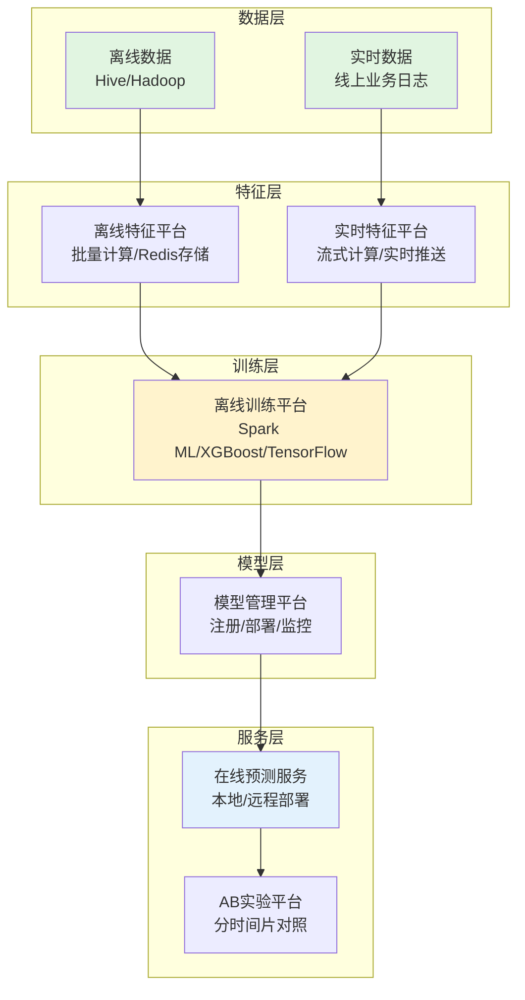

# 美团配送一站式机器学习平台建设实践

## 📌 一句话总结

美团配送团队从零到一建设**图灵平台**，通过统一的机器学习基础设施（特征平台、模型管理、AB实验等），让算法工程师从繁琐的工程开发中解放出来，专注算法策略迭代，支撑日均3000万单的配送业务。

---

## 🤔 为什么值得关注

| 传统做法（烟囱模式） | 图灵平台方案 |
|---------------------|--------------|
| 各业务线重复造轮子 | 统一基础设施，避免重复建设 |
| 特征口径混乱，难以协同 | 标准化特征体系，口径统一 |
| 算法迭代效率低下 | 可视化训练 + 一键部署，效率提升 |
| 工程化开发占用大量精力 | 算法工程师专注策略优化 |
| 模型部署各自为政 | 统一的模型管理和在线预测服务 |

**核心价值**：让算法团队从"工程师"回归"算法研究员"，把精力用在刀刃上。

---

## 🧩 核心概念解析

### 1️⃣ 机器学习平台演进路线


**MVP阶段**：
- 各业务线独自建设工具集
- 快速支持业务，抢占市场
- 问题：重复造轮子、特征口径混乱

**平台化阶段**：
- 组建算法工程小组
- 建设统一的一站式平台
- 标准化数据体系，提升研发效率

### 2️⃣ 图灵平台整体架构



---

## 🔧 核心模块详解

### 1. 离线训练平台

**目标**：可视化 + 低门槛 + 灵活性

**核心能力**：
| 能力 | 说明 |
|------|------|
| 可视化DAG | 拖拉拽组件组合训练流程 |
| 多框架支持 | Spark ML、XGBoost、TensorFlow |
| 自动调参 | 支持超参数自动搜索 |
| 自定义Loss | 满足个性化业务需求 |

**关键技术 - MLDL**：
```
MLDL (Machine Learning Definition Language)
├── 作用：打通离线训练和在线预测
├── 内容：模型的所有预处理模块信息
├── 流程：
│   1. 离线训练时产出MLDL文件
│   2. 模型发布时连带MLDL一起部署
│   3. 在线预测时先执行MLDL预处理，再执行模型
│
└── 价值：保证线下线上处理一致性
```

**为什么重要？**
> 很多机器学习系统的坑在于**线上线下特征处理不一致**，导致线下训练效果很好，线上效果很差。MLDL解决了这个问题。

### 2. 模型管理平台

**目标**：统一的模型注册、发现、部署、切换、降级

**两种部署模式**：
| 模式 | 适用场景 | 特点 |
|------|----------|------|
| **本地部署** | 小模型、低延迟要求 | 模型推送到业务节点，Java Lib嵌入调用 |
| **远程部署** | 大模型、高并发 | 专用计算集群，RPC调用 |

**超大规模模型处理**：
```
问题：单节点内存无法装载大模型

解决方案：分区模型 + 模型路由
├── 按城市/区域分区训练
├── 每个区域一个小模型
├── 分散部署到多个节点
└── 提供模型路由功能，精准定位分区模型
```

### 3. 离线特征平台

**挑战**：如何从Hive表高效地提供线上特征查询？

**方案演进**：

| 方案 | 问题 | 结论 |
|------|------|------|
| 直接读DB | 太重，无法满足并发 | ❌ |
| Redis单KV | 特征多时Mget次数多，延迟高 | ❌ |
| **特征组** | 同维度特征聚合成一个KV | ✅ |

**特征组概念**：
```
传统方式：
商家特征 = {feat1: v1, feat2: v2, ... feat100: v100}
→ 100个Key，需要100次查询或多次Mget

特征组方式：
商家特征组 = {
    group_id: "merchant_basic",
    features: {feat1: v1, feat2: v2, ... feat100: v100}
}
→ 1个Key，1次查询获取100个特征

效果：Key数量从N减少到N/100，查询延迟从100ms降到5ms
```

### 4. 实时特征平台

**场景**：即时配送的位置、负载、路网情况瞬息万变

**需求**：
- 实时收集线上数据
- 实时计算特征
- 实时更新到线上

**技术栈**：流式计算（如Flink/Spark Streaming）

### 5. AB实验平台

**传统AB实验**：基于用户ID/设备ID分流，假设请求独立同分布

**配送场景的特殊性**：
```
传统场景（搜索/推荐）：
├── 用户A看方案1，用户B看方案2
├── 用户之间互不影响
└── 独立同分布假设成立

配送场景：
├── 用户、商户、骑手三方相互影响
├── 区域A用策略1，区域B用策略2
├── 骑手跨区域，商户跨平台
└── 策略会互相干扰，无法独立评估
```

**解决方案 - 分时间片AB对照**：
```
时间片轮转：
├── 按天/小时/分钟分片
├── 区域A：时间片1用策略1，时间片2用策略2
├── 区域B：时间片1用策略2，时间片2用策略1
├── 多个时间片交替切换
└── 最大限度减少线下因素影响
```

---

## ⚠️ 当前挑战

| 挑战 | 说明 | 解决思路 |
|------|------|----------|
| **深度学习支持** | 需要支持更多深度学习组件 | 完善可视化深度学习训练 |
| **在线预测平台化** | 算法、工程、平台需要进一步解耦 | 动态加载算法包，SDK轻量化 |
| **超大规模特征** | 百亿级特征，流式更新 | 接入自研MLX平台 |
| **实时性要求** | 配送场景瞬息万变 | 流式特征计算，低延迟推送 |

---

## 🚀 未来发展方向

1. **加强深度学习建设**
   - 深度学习组件可视化组合
   - 支持更多深度学习模型
   - 支持直接写Python自定义模型

2. **在线预测平台化**
   - 简化SDK，剥离主体计算逻辑
   - 动态加载算法包
   - 实现算法、工程、平台三方解耦

---

## 💡 我的思考

### 1. 平台建设的核心价值
不是技术有多先进，而是**降低算法工程师的使用门槛**，让他们从工程琐事中解放出来。

### 2. 从烟囱到平台的关键转变
- **短期**：灵活优先，快速试错
- **长期**：标准化优先，效率至上
- **时机**：业务量指数级增长时，必须平台化

### 3. 美团方案的可借鉴之处
| 亮点 | 可借鉴性 |
|------|----------|
| 特征组减少KV查询 | ⭐⭐⭐ 通用方案 |
| MLDL保证线上线下一致性 | ⭐⭐⭐ 解决行业痛点 |
| 分时间片AB实验 | ⭐⭐⭐ 场景化创新 |
| 分区模型+路由 | ⭐⭐ 适用于大模型场景 |

### 4. 小公司如何借鉴
不需要建设完整的一站式平台，可以：
- 使用开源方案（Kubeflow、MLflow等）
- 重点关注：特征一致性、模型版本管理、AB实验
- 逐步演进，不要一上来就搞大平台

---

## 🔗 相关资源

**原文链接**：https://mp.weixin.qq.com/s/ZDRD0vAxkSqe4UeXi9avKQ

**作者**：郑艳伟（美团配送技术团队资深技术专家）

**发布时间**：2020年2月

**相关文章**：
- 《配送交付时间轻量级预估实践》
- 《机器学习在美团配送系统的实践》
- 《深度学习在美团配送ETA预估中的探索与实践》

---

## 📚 学习建议

**如果你正在建设机器学习平台：**
1. 先解决**特征一致性**问题（线上线下使用同一套代码）
2. 建立**模型版本管理**机制
3. 设计适合业务特点的**AB实验方案**
4. 优先解决**效率**问题，再考虑**先进性**

**如果你想了解机器学习工程化：**
- 这篇文章是很好的入门，展示了完整的MLOps流程
- 对比你当前的工作，思考哪些环节可以优化
- 重点关注：特征工程、模型部署、实验评估三大环节
