# Transformer 从入门到入土笔记

> **原文**: [想帮你快速入门视觉Transformer，一不小心写了3W字](https://mp.weixin.qq.com/s/7MjBJlczIxElTDrMh7yriQ)  
> **整理时间**: 2026-02-14  
> **难度**: 进阶 ⭐⭐⭐

---

## 📌 一句话总结

本文从**零开始**详细讲解了Transformer的原理和代码实现，并深入分析了其在计算机视觉领域的两大应用：**Vision Transformer（图像分类）**和**DETR（目标检测）**。

---

## 🎯 为什么要学Transformer？

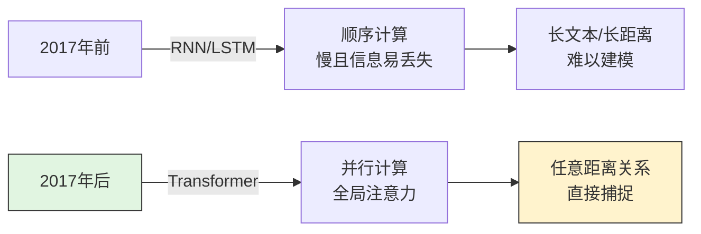

**核心优势：**
- ✅ **并行计算** - 不像RNN必须一个一个算
- ✅ **长距离依赖** - 句子开头和结尾的关系可以直接建模
- ✅ **性能卓越** - 成为NLP和CV领域的标准架构

---

## 📚 第一部分：Transformer基础

### 1.1 从Seq2Seq到Transformer的演进

#### 早期Seq2Seq（RNN时代）

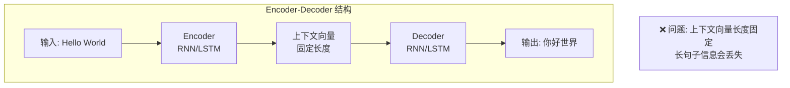

**存在的问题：**
1. 无论输入多长，都压缩成一个固定向量 → **信息瓶颈**
2. 只能顺序计算，无法并行 → **训练慢**
3. 长距离依赖困难 → **梯度消失**

#### 加入Attention的Seq2Seq

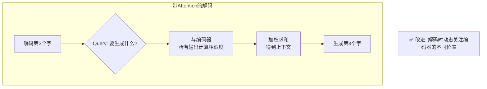

#### Transformer（Attention is All You Need）

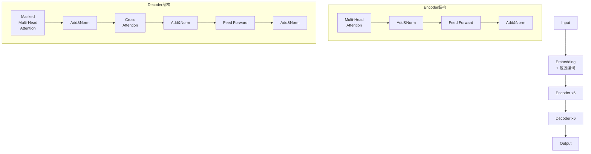

**核心创新：**
- 完全抛弃RNN/CNN，**只用Attention**
- 编码器-解码器结构，各6层
- 多头注意力机制
- 位置编码

---

### 1.2 Self-Attention 详解（核心！）

#### 什么是Self-Attention？

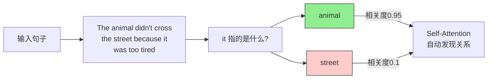

#### 计算流程（三步走）

```mermaid
graph TB
    subgraph "Step 1: 生成Q、K、V"
        A[输入X<br/>shape: (seq_len, d_model)] --> B[乘以W_Q<br/>得到Q]
        A --> C[乘以W_K<br/>得到K]
        A --> D[乘以W_V<br/>得到V]
        
        B --> E[Q: Query<br/>我要查什么]
        C --> F[K: Key<br/>我是谁]
        D --> G[V: Value<br/>我有什么信息]
    end
    
    subgraph "Step 2: 计算注意力分数"
        E --> H[Q × K^T<br/>点积计算相似度]
        H --> I[除以√d_k<br/>防止梯度爆炸]
        I --> J[Softmax<br/>转为概率分布]
    end
    
    subgraph "Step 3: 加权求和"
        J --> K[乘以V<br/>注意力×值]
        K --> L[输出Z<br/>包含上下文信息]
    end
```

**公式表示：**
```
Attention(Q, K, V) = softmax(QK^T / √d_k) × V
```

**矩阵形式：**
```
输入X: (seq_len, d_model)
W_Q, W_K, W_V: (d_model, d_k)

Q = X × W_Q  →  (seq_len, d_k)
K = X × W_K  →  (seq_len, d_k)  
V = X × W_V  →  (seq_len, d_v)

Attention = softmax(Q × K^T / √d_k) × V
           →  (seq_len, seq_len) × (seq_len, d_v)
           →  (seq_len, d_v)
```

---

### 1.3 Multi-Head Attention（多头注意力）

#### 为什么要多头？

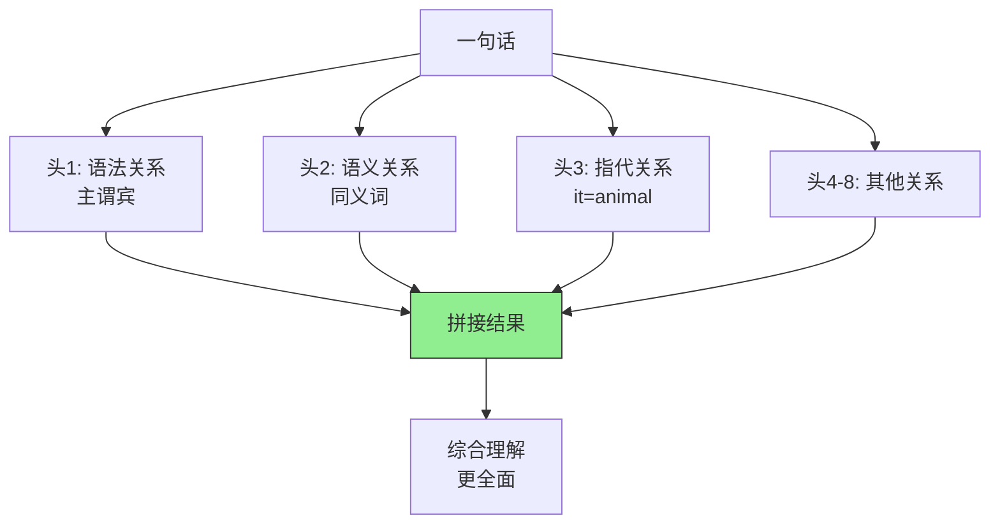

#### 多头计算过程

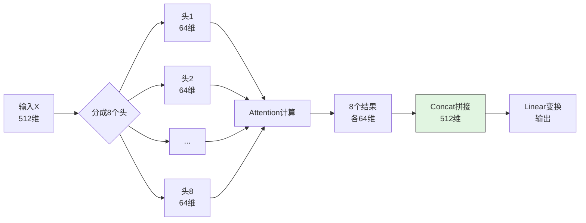

**代码实现：**
```python
# 伪代码示意
class MultiHeadAttention:
    def __init__(self, d_model=512, n_heads=8):
        self.d_k = d_model // n_heads  # 64
        self.n_heads = n_heads
        
        # 8个头的W_Q, W_K, W_V
        self.W_Q = nn.Linear(d_model, d_model)
        self.W_K = nn.Linear(d_model, d_model)  
        self.W_V = nn.Linear(d_model, d_model)
        
    def forward(self, x):
        # x: (batch, seq_len, 512)
        
        # 1. 生成QKV
        Q = self.W_Q(x)  # (batch, seq_len, 512)
        K = self.W_K(x)
        V = self.W_V(x)
        
        # 2. 分成8个头
        Q = Q.view(batch, seq_len, 8, 64).transpose(1, 2)
        # Q: (batch, 8, seq_len, 64)
        
        # 3. 每个头单独计算Attention
        scores = Q @ K.transpose(-2, -1) / sqrt(64)
        attn = softmax(scores, dim=-1)
        out = attn @ V  # (batch, 8, seq_len, 64)
        
        # 4. 拼接8个头
        out = out.transpose(1, 2).contiguous()
        out = out.view(batch, seq_len, 512)
        
        return out
```

---

### 1.4 位置编码（Positional Encoding）

#### 为什么需要位置编码？

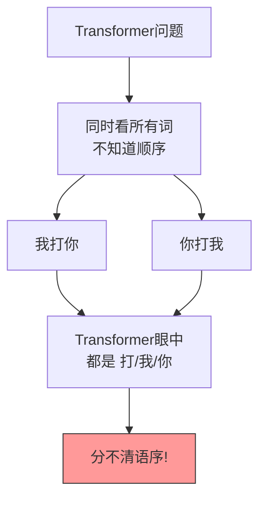

#### 位置编码的解决方案

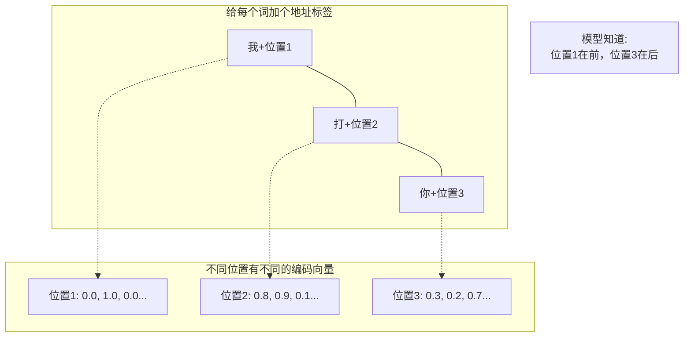

#### 正弦位置编码公式

```python
# 论文中的正弦编码
PE(pos, 2i)   = sin(pos / 10000^(2i/d_model))
PE(pos, 2i+1) = cos(pos / 10000^(2i/d_model))

# pos: 词的位置(0, 1, 2, ...)
# i:   维度索引(0, 1, 2, ..., d_model-1)
```

**可视化理解：**

```
位置编码矩阵 (pos × dim):

       dim0   dim1   dim2   dim3   ...  dim511
pos0   sin    cos    sin    cos   ...   cos
pos1   sin    cos    sin    cos   ...   cos  
pos2   sin    cos    sin    cos   ...   cos
...    ...    ...    ...    ...   ...   ...
pos99  sin    cos    sin    cos   ...   cos

每一行代表一个位置的编码
每一列是一个正弦/余弦波，频率不同
```

**优点：**
- 可以扩展到训练时没见过的长度
- 相对位置可以通过线性变换得到
- 有周期性规律

---

### 1.5 Transformer完整架构

#### 编码器（Encoder）

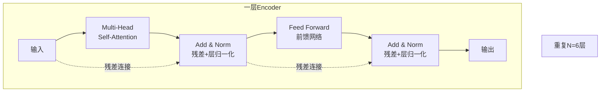

**各组件说明：**

| 组件 | 作用 |
|------|------|
| **Multi-Head Self-Attention** | 计算词与词之间的关系 |
| **Add & Norm** | 残差连接防止梯度消失，层归一化稳定训练 |
| **Feed Forward** | 两个全连接层，增加非线性表达能力 |

#### 解码器（Decoder）

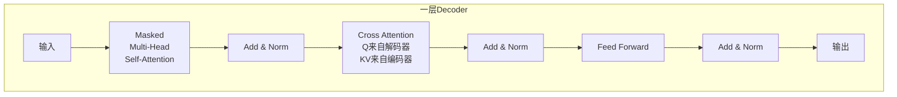

**解码器特有组件：**

| 组件 | 作用 |
|------|------|
| **Masked Self-Attention** | 防止看到未来的词（只能attend到前面的词） |
| **Cross Attention** | 解码器查询(Query)关注编码器的输出(Key, Value) |

#### Masked Self-Attention 详解

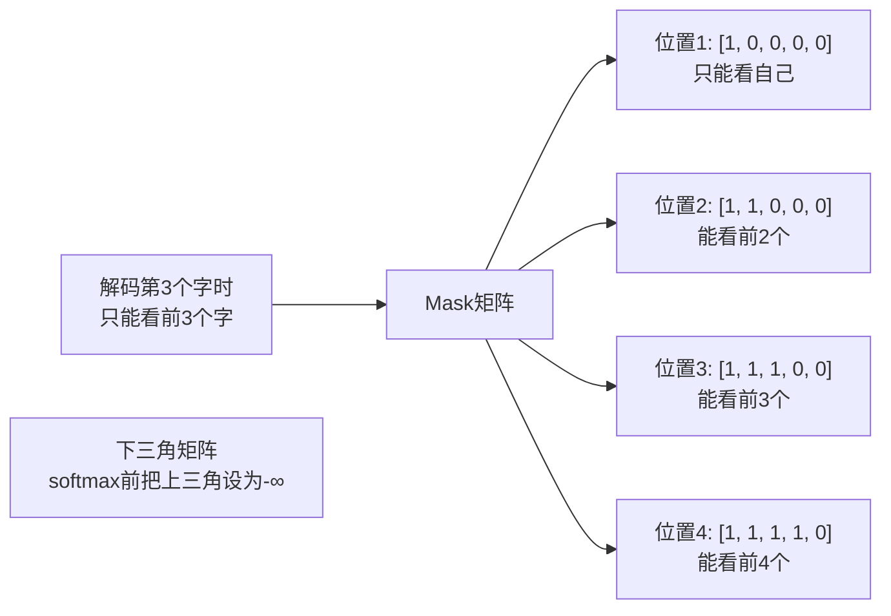

---

## 📚 第二部分：视觉Transformer

### 2.1 Vision Transformer (ViT)

#### 核心思想

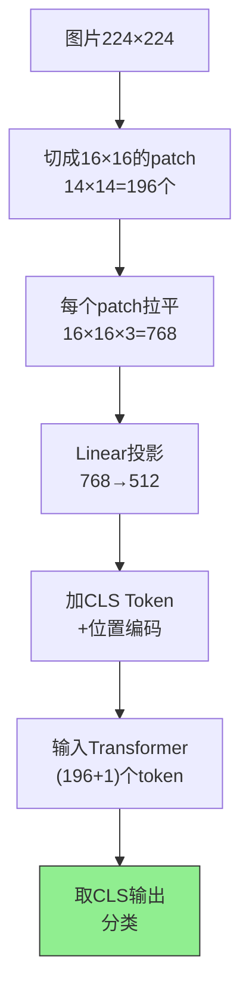

**关键步骤：**

#### Step 1: 图片分块（Patch Embedding）

```python
# 输入: (batch, 3, 224, 224)
# patch_size = 16

# 切分成 14×14 = 196 个 patch
x = rearrange(img, 'b c (h p1) (w p2) -> b (h w) (p1 p2 c)', 
              p1=16, p2=16)
# 输出: (batch, 196, 768)
# 196 = 14×14
# 768 = 16×16×3 (每个patch的像素数)

# 降维到模型维度
x = nn.Linear(768, 512)(x)
# 输出: (batch, 196, 512)
```

#### Step 2: 添加CLS Token

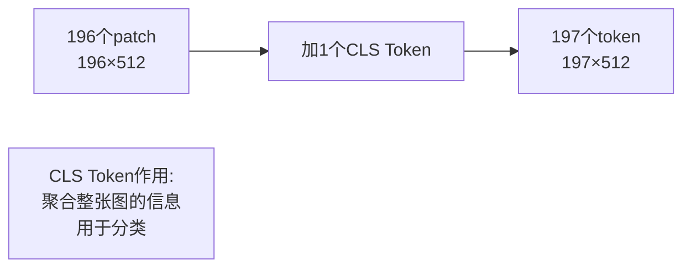

```python
# 可学习的CLS Token
self.cls_token = nn.Parameter(torch.randn(1, 1, 512))

# 复制到batch维度
cls_tokens = repeat(self.cls_token, '() n d -> b n d', b=batch_size)

# 拼接到最前面
x = torch.cat([cls_tokens, x], dim=1)
# 输出: (batch, 197, 512)
```

#### Step 3: 位置编码

```python
# 可学习的位置编码
self.pos_embedding = nn.Parameter(torch.randn(1, 197, 512))

# 加上位置信息
x = x + self.pos_embedding
```

#### Step 4: Transformer编码器

```python
# 和标准Transformer一样
for _ in range(12):  # 12层
    x = MultiHeadAttention(x)
    x = FeedForward(x)
    
# 输出: (batch, 197, 512)
```

#### Step 5: 分类头

```python
# 只取CLS Token的输出
cls_output = x[:, 0]  # (batch, 512)

# 分类
output = nn.Linear(512, num_classes)(cls_output)
# 输出: (batch, num_classes)
```

---

### 2.2 DETR（目标检测）

#### 核心思想

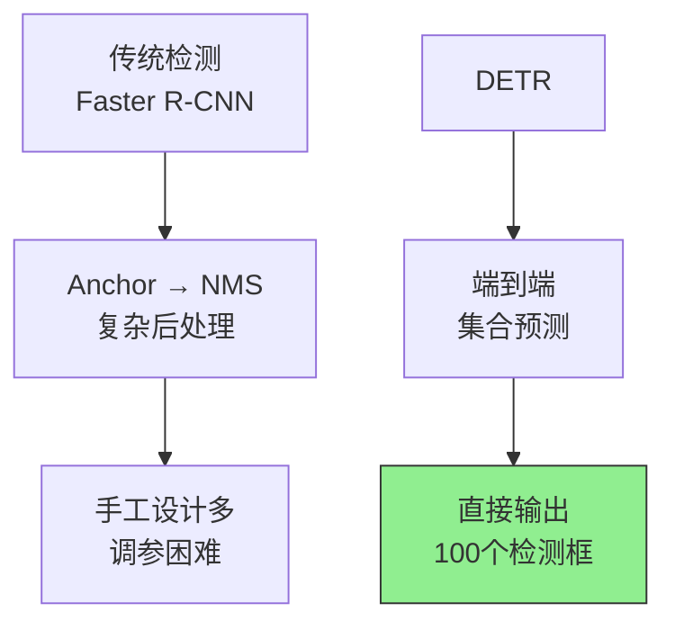

**DETR的创新：**
- 抛弃Anchor和NMS
- 将检测视为**集合预测问题**
- 固定输出100个检测结果（不够就用"无物体"填充）

#### 整体架构

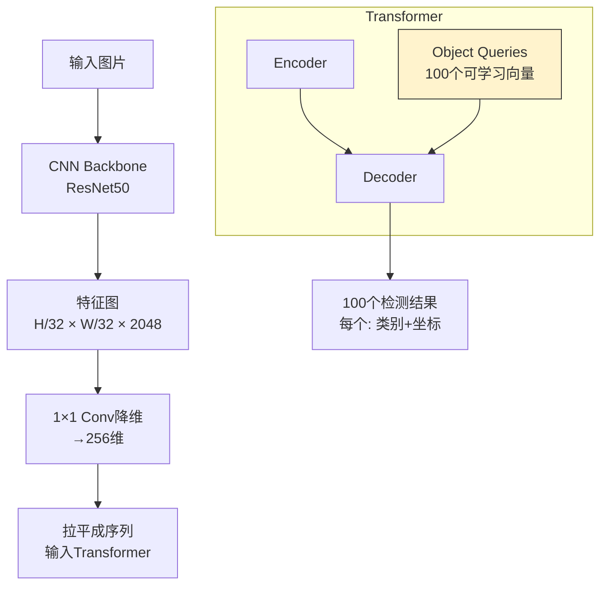

#### 关键组件

##### 1. Object Queries（对象查询）

```mermaid
graph TB
    A[100个Object Queries] --> B[Query1: 找最大的物体]
    A --> C[Query2: 找左上角的物体]
    A --> D[Query3: 找红色的物体]
    A --> E[...]
    
    B --> F[解码器计算]
    C --> F
    D --> F
    E --> F
    
    F --> G[输出100个<br/>(类别, bbox)]
```

**实现：**
```python
# 100个可学习的查询向量
self.query_embed = nn.Embedding(100, 256)
```

##### 2. 双边匹配（Bipartite Matching）

**问题：** 输出的100个检测结果是无序的，如何和Ground Truth匹配？

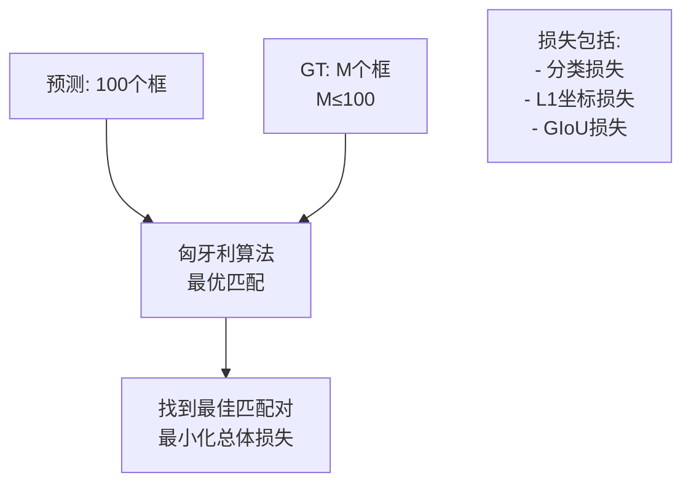

**代码示意：**
```python
from scipy.optimize import linear_sum_assignment

# 计算100个预测和M个GT之间的匹配代价
cost = cost_class + cost_bbox + cost_giou  # (100, M)

# 匈牙利算法求解最优匹配
indices = linear_sum_assignment(cost)
# 返回匹配的索引对
```

##### 3. Loss计算

```python
def detr_loss(outputs, targets):
    # outputs: (batch, 100, 92) 分类
    #          (batch, 100, 4)  坐标
    
    # 1. 匈牙利匹配
    indices = hungarian_matching(outputs, targets)
    
    # 2. 分类损失（交叉熵）
    loss_cls = F.cross_entropy(pred_classes, target_classes)
    
    # 3. 边界框损失（L1 + GIoU）
    loss_bbox = F.l1_loss(pred_boxes, target_boxes)
    loss_giou = 1 - generalized_box_iou(pred_boxes, target_boxes)
    
    return loss_cls + loss_bbox + loss_giou
```

---

## 🔍 关键代码解析

### 3.1 Scaled Dot-Product Attention

```python
class ScaledDotProductAttention(nn.Module):
    def forward(self, q, k, v, mask=None):
        # q, k, v: (batch, heads, seq_len, d_k)
        
        # 1. 计算相似度
        scores = torch.matmul(q, k.transpose(-2, -1)) / sqrt(d_k)
        # (batch, heads, seq_len, seq_len)
        
        # 2. Mask（解码器用）
        if mask is not None:
            scores = scores.masked_fill(mask == 0, -1e9)
        
        # 3. Softmax
        attn = F.softmax(scores, dim=-1)
        
        # 4. 加权求和
        output = torch.matmul(attn, v)
        # (batch, heads, seq_len, d_k)
        
        return output, attn
```

### 3.2 ViT完整代码结构

```python
class ViT(nn.Module):
    def __init__(self, image_size=224, patch_size=16, num_classes=1000, 
                 dim=512, depth=12, heads=8):
        super().__init__()
        
        # 1. Patch Embedding
        self.patch_size = patch_size
        num_patches = (image_size // patch_size) ** 2
        patch_dim = 3 * patch_size ** 2
        self.patch_to_embedding = nn.Linear(patch_dim, dim)
        
        # 2. CLS Token
        self.cls_token = nn.Parameter(torch.randn(1, 1, dim))
        
        # 3. 位置编码
        self.pos_embedding = nn.Parameter(torch.randn(1, num_patches + 1, dim))
        
        # 4. Transformer
        self.transformer = Transformer(dim, depth, heads)
        
        # 5. 分类头
        self.mlp_head = nn.Sequential(
            nn.LayerNorm(dim),
            nn.Linear(dim, num_classes)
        )
    
    def forward(self, img):
        b = img.shape[0]
        
        # 切patch
        x = rearrange(img, 'b c (h p1) (w p2) -> b (h w) (p1 p2 c)', 
                      p1=self.patch_size, p2=self.patch_size)
        
        # Embedding
        x = self.patch_to_embedding(x)
        
        # 加CLS
        cls_tokens = repeat(self.cls_token, '() n d -> b n d', b=b)
        x = torch.cat([cls_tokens, x], dim=1)
        
        # 加位置编码
        x += self.pos_embedding
        
        # Transformer
        x = self.transformer(x)
        
        # 分类
        return self.mlp_head(x[:, 0])
```

---

## 📊 性能对比

### Transformer vs CNN

| 指标 | CNN (ResNet) | Transformer (ViT) |
|------|-------------|-------------------|
| **数据效率** | 高（ImageNet即可） | 低（需要JFT-300M） |
| **计算量** | 小 | 大（约30倍） |
| **全局感知** | ❌ 需堆叠层数 | ✅ 一层即可 |
| **可解释性** | 中等 | 高（Attention可视化） |
| **扩展性** | 有限 | 强（Scale效果好） |

### 训练数据影响

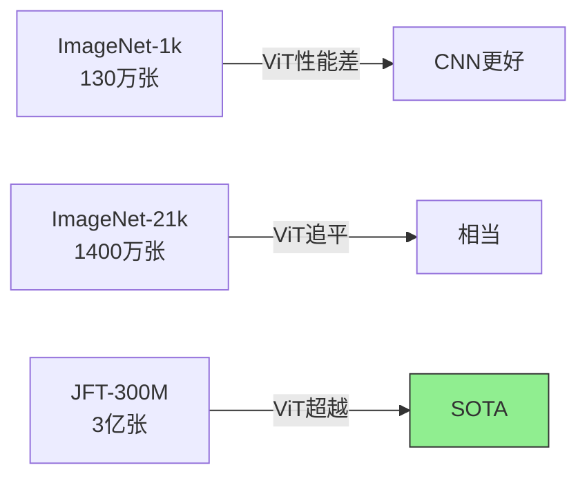

**结论：** Transformer是**数据饥渴型**模型，数据量越大优势越明显。

---

## 🚀 发展趋势

```mermaid
timeline
    title Transformer发展历程
    2017 : Transformer诞生
         : Attention is All You Need
    2020 : ViT发布
         : 视觉Transformer元年
    2021 : DeiT/Swin发布
         : 数据效率优化
    2022 : CLIP/DALL-E
         : 多模态爆发
    2023 : GPT-4V/SAM
         : 大模型时代
    2024 : 几乎统治CV所有任务
```

---

## 💡 学习建议

### 入门路线

1. **理解Self-Attention**（最重要！）
   - 手动画一遍计算流程
   - 理解Q、K、V的含义

2. **阅读PyTorch官方实现**
   - `nn.MultiheadAttention`
   - `nn.Transformer`

3. **动手实现**
   - 先实现一个简单的Transformer
   - 再实现ViT
   - 最后用预训练模型微调

4. **阅读经典论文**
   - Attention is All You Need
   - ViT
   - DETR

### 推荐资源

| 类型 | 资源 | 链接 |
|------|------|------|
| **论文** | Attention is All You Need | arxiv.org/abs/1706.03762 |
| **论文** | ViT | arxiv.org/abs/2010.11929 |
| **论文** | DETR | arxiv.org/abs/2005.12872 |
| **代码** | ViT PyTorch | github.com/lucidrains/vit-pytorch |
| **代码** | DETR | github.com/facebookresearch/detr |
| **教程** | The Illustrated Transformer | jalammar.github.io/illustrated-transformer |

---

## 🎯 总结

### Transformer核心要点

```mermaid
graph TB
    A[Transformer核心] --> B[Self-Attention<br/>计算词与词关系]
    A --> C[Multi-Head<br/>多角度理解]
    A --> D[Positional Encoding<br/>位置信息]
    A --> E[Residual+Norm<br/>训练稳定]
    
    B --> F[任意距离建模]
    C --> G[多语义捕捉]
    D --> H[序列顺序]
    E --> I[深层训练]
```

### 视觉领域应用

| 任务 | 方法 | 关键创新 |
|------|------|----------|
| **分类** | ViT | Patch + CLS Token |
| **检测** | DETR | Object Query + 双边匹配 |
| **分割** | Segmenter | 解码器上采样 |
| **多模态** | CLIP | 图文对齐 |

---

## 📚 相关资源

- **原文**: [想帮你快速入门视觉Transformer，一不小心写了3W字](https://mp.weixin.qq.com/s/7MjBJlczIxElTDrMh7yriQ)
- **作者**: 深度眸
- **来源**: AI科技评论

---

*整理完成！如有疑问欢迎继续探讨 👋*
