# Visual Transformer 大白话笔记

> **原文**: [A Survey on Visual Transformer及引文理解](https://mp.weixin.qq.com/s/SGROkMleCiV6iPI7kNlXOA)  
> **整理时间**: 2026-02-14  
> **难度**: 零基础友好 ⭐

---

## 📌 一句话总结

**Transformer**（最初用于处理文字的AI模型）被应用到**图像和视频**领域，用"全局视角"替代了传统的"局部扫描"方法，正在成为视觉AI的新标准。

---

## 🎯 为什么要学这个？

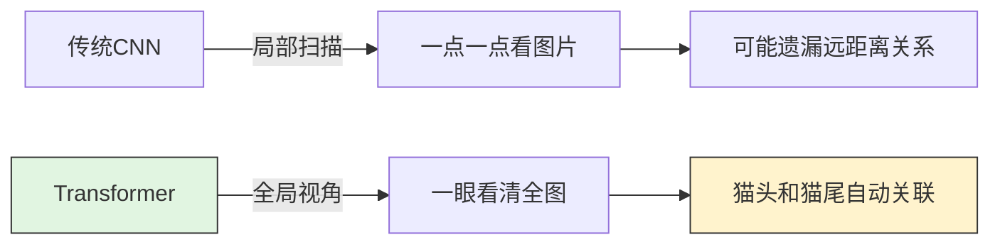

| 对比项 | CNN（传统） | Transformer（新方法） |
|--------|------------|---------------------|
| **看图片方式** | 像"近视眼"，3×3小窗口滑动 | 像"全局视角"，一眼看全图 |
| **捕捉关系** | 只能看附近像素 | 远距离像素也能直接关联 |
| **计算方式** | 顺序计算，较慢 | 并行计算，更快 |
| **需要数据** | 较少（有先验知识） | 较多（从零学习） |
| **计算量** | 较小 | 较大（30倍左右） |

---

## 🧩 核心概念详解

### 1. Self-Attention（自注意力）- 就是"联想能力"

#### 生活化理解

想象你在看这句话：**"张三把苹果给了李四"**

读到"苹果"时，你的大脑会自动联想：
- 前面是"张三"（谁给的）
- 后面是"给了李四"（给谁的）
- 所以这里的"苹果"是**水果**，不是手机！

**Self-Attention 就是让 AI 拥有这种联想能力。**

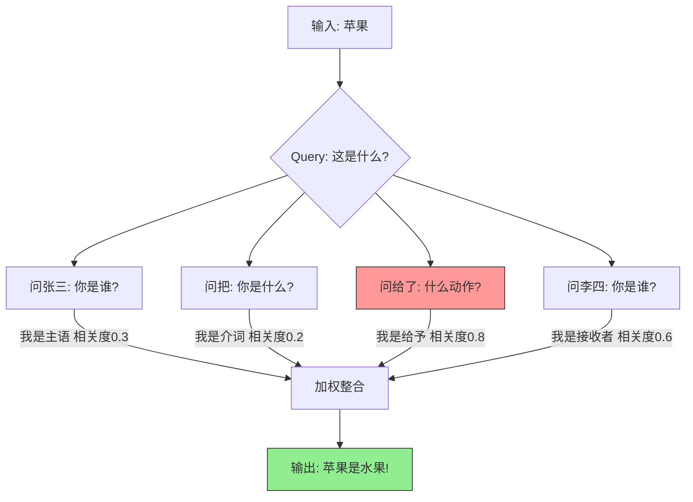

#### 在图片里怎么算？

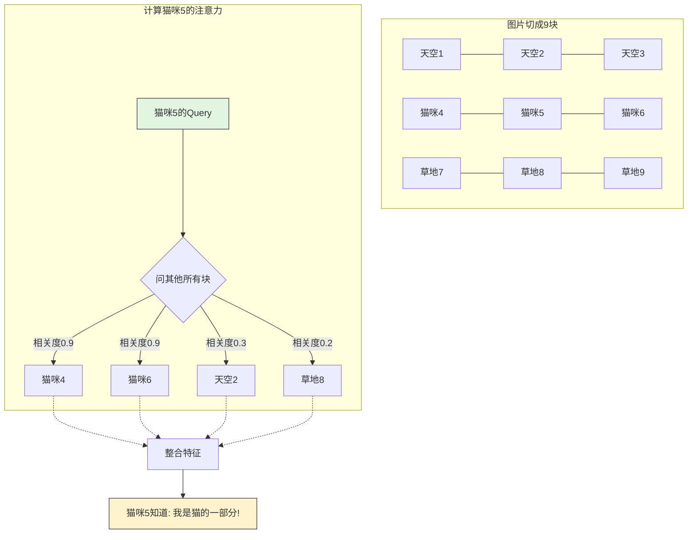

**计算过程（简化版）：**

```
每个词/像素 都有三个身份：
┌─────────────────────────────────────┐
│  Query (Q) : 我有什么问题？         │
│  Key   (K) : 我是谁？               │
│  Value (V) : 我有什么信息？          │
└─────────────────────────────────────┘

计算步骤：
1. Q × K^T = 相关度分数  （谁和谁有关系？）
2. 归一化 (Softmax)      （变成概率）
3. × V = 加权求和         （整合信息）
```

---

### 2. 位置编码 - 给每个像素一个"地址"

#### 问题：Transformer 天生不知道顺序！

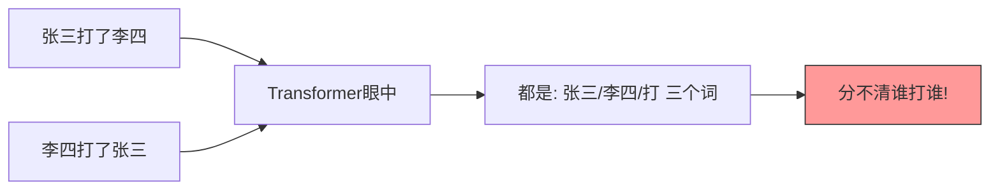

#### 解决方案：加座位号

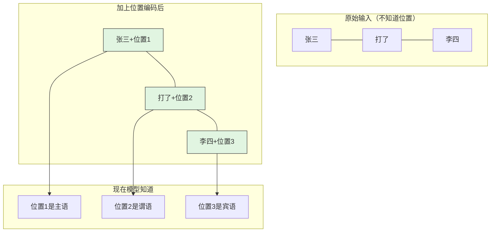

**图片的位置编码：**

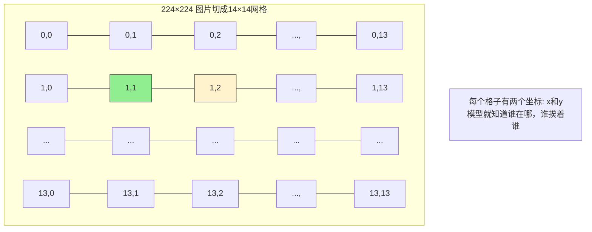

---

### 3. Multi-Head Attention（多头注意力）

#### 类比：多人多角度讨论

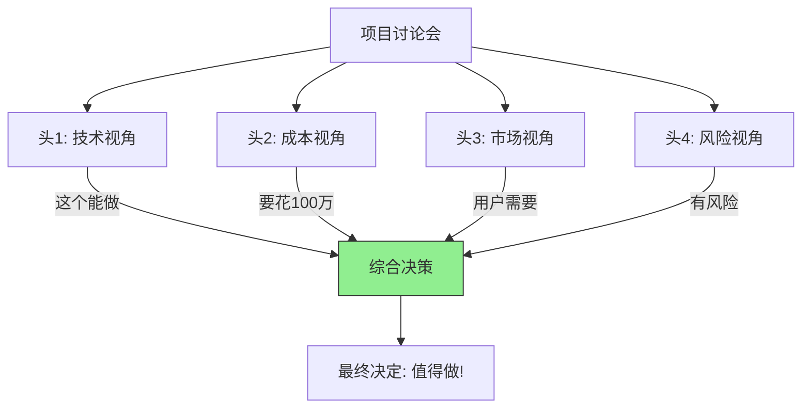

#### 在 Transformer 里

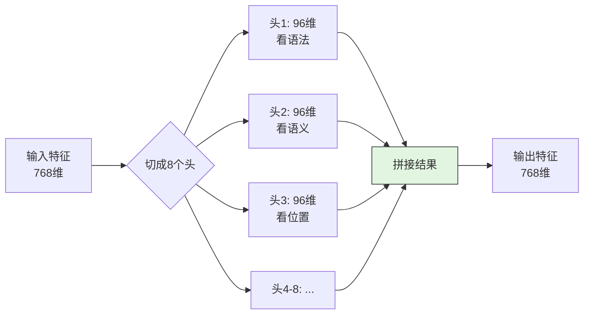

**为什么需要多头？**

```
单头只能发现一种关系：
- 只看到"猫"和"坐"有关系（动作）

多头能发现多种关系：
- 头1: 猫-坐（动作关系）
- 头2: 猫-动物（类别关系）
- 头3: 坐-沙发（位置关系）
- 头4: 猫-胡须（特征关系）
- ...

综合起来：一只猫坐在沙发上，它有胡须 ✓
```

---

## 🖼️ ViT 完整流程图解

### Vision Transformer 是怎么处理一张图片的？

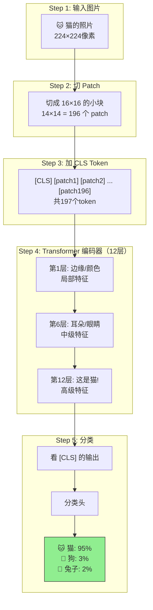

### 每一层内部在做什么？

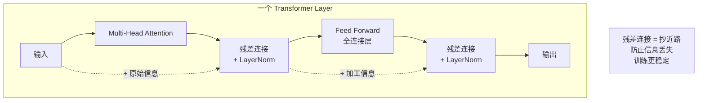

---

## 🔍 CNN vs Transformer 深度对比

### 看图片的方式对比

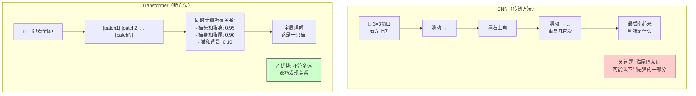

### 优缺点对比表

| 特性 | CNN | Transformer |
|------|-----|-------------|
| **归纳偏置** | 有（局部性、平移不变性）| 无（从零学习）|
| **全局感知** | ❌ 需要堆叠很多层 | ✅ 一层就能看全图 |
| **长距离关系** | ❌ 难捕捉 | ✅ 直接计算 |
| **计算效率** | ✅ O(n) | ❌ O(n²) |
| **数据需求** | ✅ 较少 | ❌ 大量 |
| **可解释性** | ⚠️ 一般 | ❌ 较差（黑盒）|

---

## 📊 三种主要方法对比

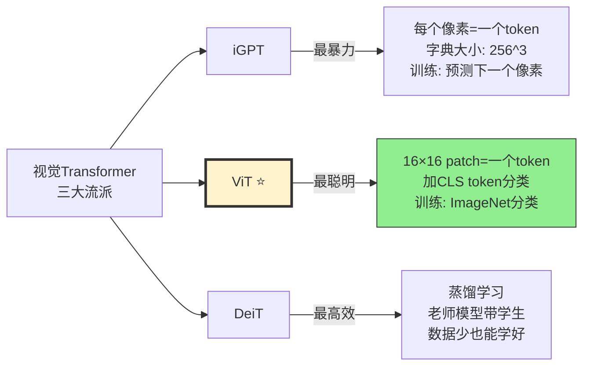

| 方法 | Token方式 | 训练目标 | 数据需求 | 现状 |
|------|-----------|----------|----------|------|
| **iGPT** | 每个像素 | 预测下一个像素 | 极大 | 研究用 |
| **ViT** | 16×16 patch | 图像分类 | 大 | ⭐ 主流 |
| **DeiT** | 16×16 patch | 分类+蒸馏 | 中等 | 实用 |

---

## 🎯 目标检测：DETR 是怎么工作的？

### 传统方法 vs DETR

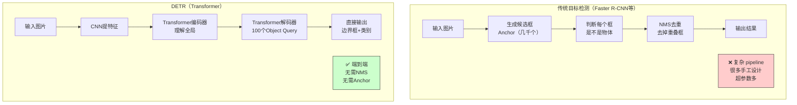

### Object Query 是什么？

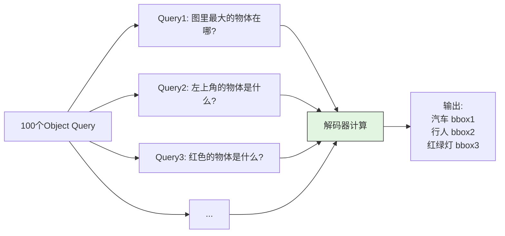

**DETR 的局限性：**
- 训练收敛慢（需要500个epoch）
- 小物体检测效果不好
- 现在已被 Deformable DETR 等改进版本超越

---

## ⚠️ 当前面临的挑战

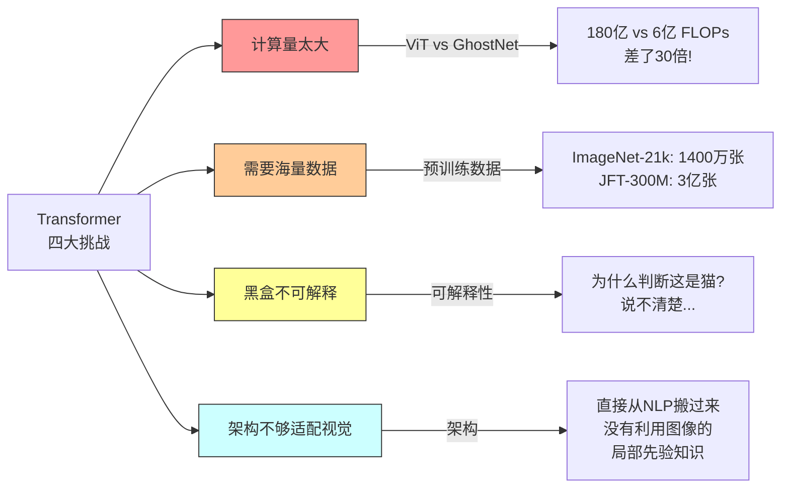

---

## 🚀 未来发展方向

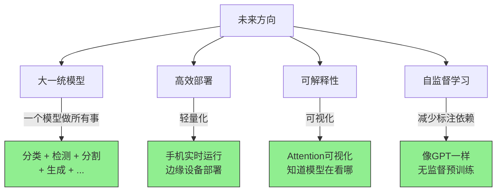

---

## 📈 发展历程

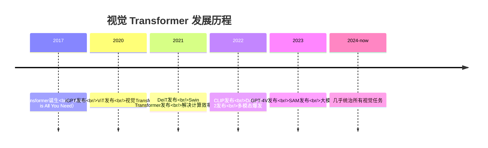

---

## 💡 我的思考

> **2020-2021年**写这篇文章时，Transformer 刚开始进入视觉领域，还有很多质疑声音。
>
> **现在（2024-2026年）**来看：
> - ✅ ViT 已经成为视觉 backbone 的标准选择
> - ✅ 多模态大模型（GPT-4V、Claude、Gemini）都基于视觉 Transformer
> - ✅ 计算效率问题通过 Swin、PVT 等架构大幅改善
> - ✅ 自监督预训练（MAE、BEiT）减少了对标注数据的依赖
>
> **结论**：Transformer 确实正在取代 CNN，成为计算机视觉的新范式。

---

## 📚 相关资源

| 资源 | 链接 | 说明 |
|------|------|------|
| **原文** | [微信文章](https://mp.weixin.qq.com/s/SGROkMleCiV6iPI7kNlXOA) | 综述性文章 |
| **ViT 论文** | [An Image is Worth 16x16 Words](https://arxiv.org/abs/2010.11929) | 开山之作 |
| **DeiT 论文** | [Training data-efficient image transformers](https://arxiv.org/abs/2012.12877) | 蒸馏学习 |
| **Swin 论文** | [Swin Transformer](https://arxiv.org/abs/2103.14030) | 层次化架构 |
| **DETR 论文** | [End-to-End Object Detection](https://arxiv.org/abs/2005.12872) | 目标检测 |

---

## 🎓 学习建议

1. **先理解 Self-Attention**（核心中的核心）
2. **动手实现一个小 ViT**（推荐用 PyTorch）
3. **阅读 ViT 源码**（Hugging Face Transformers 库）
4. **尝试微调预训练模型**（在自己的数据集上）

---

*整理完成，如有错误欢迎指正！*
