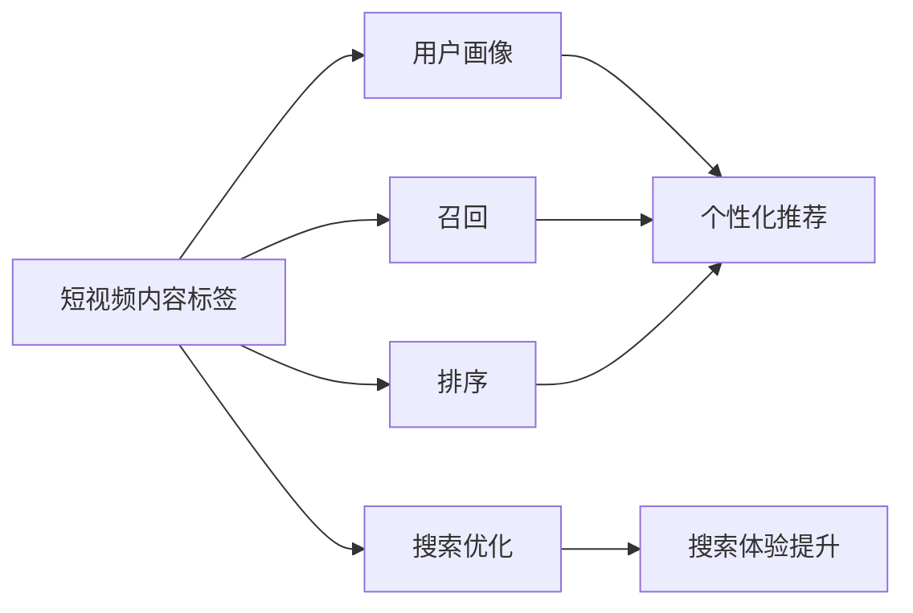

# 爱奇艺短视频内容标签技术解析

## 📌 一句话总结

爱奇艺通过**多模态融合技术**（文本+封面图+视频帧），从短视频中提取内容标签，解决40%以上"抽象标签"不在标题中出现的问题，支撑推荐系统的用户画像、召回、排序等环节。

---

## 🤔 为什么值得关注

### 短视频标签的重要性



### 核心挑战对比

| 挑战 | 具体表现 | 解决方案 |
|------|----------|----------|
| **多模态信息融合** | 文本、图像、视频信息如何统一表征 | 多阶段渐进式融合 |
| **开放集合问题** | 标签不是预定义的，无法穷举 | 生成式+抽取式结合 |
| **抽象标签** | 40%以上标签不在标题中出现（如"励志"、"正能量"） | 引入封面图和视频帧信息 |
| **标注一致性低** | 人工标注一致率仅22.1% | 算法辅助+质量控制 |

---

## 🧩 核心概念解析

### 1️⃣ 内容标签 vs 类型标签

```
类型标签（封闭集合）：
├── 预定义的分类体系
├── 如：娱乐/影视/游戏/美食
└── 层次化：娱乐 → 明星 → 内地明星

内容标签（开放集合）：
├── 根据内容动态生成
├── 关键词或短语
└── 如：王者荣耀、赵丽颖、恋爱技巧、励志
```

**本文聚焦：内容标签的自动提取**

### 2️⃣ 抽象标签难题

**什么是抽象标签？**
```
标题："母亲染病雪上加霜，女儿自强渴望工作"
├── 文本中有的词：母亲、女儿、工作
├── 合适的标签：励志、正能量 ← 这叫"抽象标签"
└── 问题：这些词不在标题中！

统计：40%以上的标签是抽象标签
```

**为什么难？**
- 纯文本模型只能抽取标题中出现的词
- 需要理解视频的深层语义
- 必须借助封面图和视频内容

---

## 🔧 技术演进四阶段

### 阶段一：文本模型

**初期方案：候选生成 + 排序**

```
候选标签来源：
├── CRF模型提取
├── 人工定义联想规则：
│   ├── 同义词：kof → 拳皇
│   ├── 实体联想：康熙来了 → 蔡康永/小s
│   └── 上位概念：alphago → 围棋
└── 高频准类型标签：街头采访/观看反应/励志

排序模型：基于注意力机制的语义相似度
├── 问题1：抽象标签效果差
└── 问题2：标题太短，注意力模型过于简单
```

**改进方案：生成式 + 抽取式结合**

```
架构升级：
├── 先用Transformer生成式模型生成标签
├── 如果生成结果为空，再用抽取式结果兜底
└── 改进点：
    ├── Self-Attention取代传统Attention
    ├── 增加候选标签上下文特征
    └── 增加频道等元信息特征
```

**Transformer的优势：**
- 强大的特征提取能力
- 并行化训练速度快
- 在文本生成任务上达到SOTA

### 阶段二：融合封面图模型

**为什么要加封面图？**

```
反例1：
标题："分享视频"（无意义）
→ 文本模型生成空标签
→ 但封面图可能有明确内容

反例2：
标题："天地山青，道法无常，李白斗酒诗百篇"
→ 文本模型生成：唐诗、李白
→ 实际内容：王者荣耀游戏（看封面图才能知道）
```

**技术方案：**

1. **图像特征提取**
```
模型选择：Xception（在数据上效果最好）

流程：
├── 选取高频抽象标签作为分类目标
├── 封面图作为训练数据
├── ImageNet预训练参数初始化
├── 在标签分类任务上Fine-Tune
└── 提取中间层向量作为图像表征
```

2. **图像特征融合（三种位置）**
```
融合位置：
├── Encoder输入端：和文本concatenate
├── Encoder输出端：作为额外信息
└── Decoder初始输入：影响生成过程

每种位置经过独立的Feed-Forward网络
→ 映射到各自的空间后再融合
```

### 阶段三：融合BERT向量模型

**为什么要引入BERT？**

```
问题案例：
标题："容易被男生吃定的8种类型的女生"
├── 模型结果：女生
└── 更合适的标签：恋爱技巧

原因：
├── 训练数据偏向影视剧/娱乐领域
└── 对通用领域（如情感/生活）理解不足
```

**BERT的作用：**
```
BERT特点：
├── 在海量通用文本上预训练
├── 深度双向语言表征
├── 强大的语义归纳能力

融合方式：
├── 提取BERT sentence embedding
├── second-to-last层average pooling
├── 非线性映射后加入：
│   ├── Encoder输入
│   ├── Encoder输出
│   └── Decoder初始输入
```

**效果：** 增强对通用领域文本的理解能力

### 阶段四：融合视频帧模型

**为什么还要加视频帧？**

```
反例1：
标题："此'八卦'非彼'八卦'，看完视频后觉得，脑子是个好东西！"
├── 文本+封面图结果：八卦
└── 实际内容：陈翔六点半（喜剧节目）

反例2：
标题："民警晒从警前后对比照，6年前是林志颖，6年后成郭德纲"
├── 文本+封面图结果：林志颖、郭德纲
└── 实际内容：民警（职业相关内容）
```

**技术方案：**

1. **视频帧特征提取**
```
流程：
├── 抽取关键帧（信息最丰富的帧）
├── Xception提取每帧特征
└── 形成视频帧向量矩阵
```

2. **多层级特征融合**
```
Early Fusion（早期融合）：
├── 文本特征 + BERT特征 + 封面图特征 + 视频帧特征
└── concatenate后经self-attention处理

Deep Fusion（深度融合）：
├── 文本特征和视频特征
├── 交叉Query/Key/Value
└── cross-attention机制

Decoder融合：
├── Enhanced Multi-Head Self-Attention
├── 融合early fusion和deep fusion编码特征
└── 同时引入视频帧特征
```

**融合架构图：**
```
                    ┌─────────────┐
    文本特征 ──────→│             │
    BERT特征 ──────→│   Encoder   │──────┐
    封面图特征 ────→│  Early Fusion│      │
    视频帧特征 ────→│             │      │
                    └─────────────┘      │
                           │             │
                           ↓             │
                    ┌─────────────┐      │
                    │  Deep Fusion│      │
                    │ Cross-Attn  │──────┼──→ Decoder
                    └─────────────┘      │    Enhanced
                           │             │    Multi-Head
                    视频帧特征 ──────────┘    Attention
```

---

## 🎯 应用场景

### 1. 短视频生产

| 应用 | 说明 |
|------|------|
| **替代人工标注** | 60%以上标签精度达90%+，可替代人工 |
| **指导生产** | 分析标签消费情况，优先生产高质量内容 |
| **效率提升** | 自动标注节省人力成本 |

### 2. 个性化推荐

```
应用点：
├── 用户兴趣标签来源：内容标签是最重要来源
├── 内容理解召回：基于标签的召回可解释性强
└── 排序特征：用户兴趣标签和视频标签的相似性
```

### 3. 视频搜索

```
优化点：
├── 语义相关性：抽象标签和Query相似度计算
├── Query扩展：构建Query到内容标签的映射
├── Query理解：
│   ├── 长Query去词
│   ├── Query中心词识别
│   └── Term紧密度计算
```

---

## 📊 效果数据

| 指标 | 数值 | 说明 |
|------|------|------|
| 人工标注一致率 | 22.1% | 两个人标注同一批数据的一致率 |
| 抽象标签比例 | 40%+ | 不在标题中出现的标签 |
| 高精度标签比例 | 60%+ | 精度达90%以上的标签 |
| 可替代人工标注 | 60%+ | 这部分已可替代人工 |

---

## 🚀 未来优化方向

1. **融合先验知识**
   - 实体、实体关系等知识图谱信息
   - 提升模型泛化能力

2. **融合更多模态**
   - OCR信息（视频中的文字）
   - 视频人物识别
   - 音频信息（语音、背景音乐）

3. **提升标注质量**
   - 算法辅助标注
   - 质量控制机制

---

## 💡 我的思考

### 1. 多模态融合的关键洞察

**渐进式融合策略：**
```
不是一步到位，而是逐步增加模态：
文本 → 文本+封面图 → 文本+封面图+BERT → 文本+封面图+BERT+视频帧

每一步解决特定问题：
├── 文本：基础语义
├── 封面图：补充文本缺失
├── BERT：增强通用理解
└── 视频帧：捕捉深层内容
```

### 2. 生成式 vs 抽取式

| 方式 | 优点 | 缺点 | 适用场景 |
|------|------|------|----------|
| **抽取式** | 准确、可解释 | 无法生成抽象标签 | 标题中有明确关键词 |
| **生成式** | 可生成抽象标签 | 可能产生幻觉 | 需要语义理解 |
| **结合式** | 兼顾两者 | 系统复杂 | 生产环境 |

### 3. 工业界实践要点

```
不只是模型精度：
├── 标注质量控制（22.1%一致率是大问题）
├── 多模态特征工程（如何融合比用什么模型更重要）
├── 渐进式迭代（不要追求一步到位）
└── 业务指标导向（最终看推荐效果，不只是标签准确率）
```

### 4. 可借鉴的技术点

| 技术                  | 可借鉴性  | 适用场景     |
| ------------------- | ----- | -------- |
| 生成式+抽取式结合           | ⭐⭐⭐⭐⭐ | 开放集合标签提取 |
| 多位置特征融合             | ⭐⭐⭐⭐  | 多模态模型设计  |
| BERT增强通用语义          | ⭐⭐⭐⭐  | 领域数据有偏时  |
| Cross-Attention深度融合 | ⭐⭐⭐   | 复杂多模态交互  |

---

## 🔗 相关资源

**原文链接**：https://mp.weixin.qq.com/s/sL-jsWUH8TwwHSbnwx_fUA

**作者**：爱奇艺NLP团队

**发布时间**：2019年（推测）

**相关文章**：
- 《爱奇艺短视频分类技术解析》
- 《个性化海报在爱奇艺视频推荐场景中的实践》

**参考文献**：
1. Attention-based bidirectional LSTM for relation classification (ACL 2016)
2. Hierarchical attention networks for document classification (NAACL 2016)
3. Siamese networks for similar question retrieval (ACL 2016)
4. Incorporating Global Visual Features into Attention-Based NMT (EMNLP 2017)
5. ViLBERT: Pretraining Task-Agnostic Visiolinguistic Representations (NeurIPS 2019)
6. Doubly attentive transformer machine translation (arXiv 2018)

---

## 📚 学习建议

**如果你在做内容理解/标签提取：**
1. 先评估你的数据：有多少抽象标签？标注质量如何？
2. 从单模态开始，逐步增加模态
3. 生成式和抽取式结合是实用方案
4. 关注特征融合位置，多尝试几种方案

**如果你想了解多模态学习：**
- 这篇文章是很好的工业界案例
- 对比ViLBERT等学术方案，理解工业界的trade-off
- 重点关注：数据质量、特征工程、渐进式迭代
