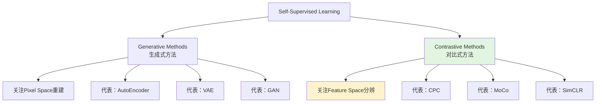

# Self-Supervised Learning 入门介绍

## 📌 一句话总结

自监督学习（SSL）是**无需人工标注**就能从数据中学习通用特征表达的方法，通过自己构建监督信号（如预测被遮挡的图像部分或未来帧），分为**生成式**和**对比式**两大类，在视觉、NLP等领域取得了接近监督学习的效果。

---

## 🤔 为什么值得关注

### 监督学习的困境

```
问题：标注成本极高
├── 数据容易获取（视频、图片、文本海量存在）
├── 但标注需要人工，成本昂贵
└── 每张图片只提供很少的信息（如1024分类只有10 bits信息）

例子：
├── ImageNet：1400万张图片，人工标注多年
├── 医疗影像：需要专业医生标注
└── 视频理解：每秒30帧，标注工作量巨大
```

### 自监督学习的优势

| 维度 | 监督学习 | 自监督学习 |
|------|----------|-----------|
| **标注需求** | 需要大量人工标注 | 无需人工标注 |
| **预测目标** | 固定类别/bbox | 可预测任何部分 |
| **信息密度** | 每个样本信息少 | 每个样本信息多 |
| **应用场景** | 预定义任务 | 通用特征表达 |
| **下游任务** | 需要重新训练 | 可微调或直接应用 |

---

## 🧩 核心概念解析

### 1️⃣ 什么是 Self-Supervised Learning？

**定义**：通过自己监督自己，从数据本身构造监督信号

**比喻**：
```
想象你在学习一门外语：

监督学习：
├── 老师给你单词表，告诉你每个词的意思
└── 你背诵记忆

自监督学习：
├── 老师给你文章，遮住几个单词
├── 让你根据上下文猜被遮住的词
└── 通过大量猜测，你学会了语言规律

这就是 BERT 的 MLM（Masked Language Model）思想！
```

**图像领域的例子**：
```
输入：一张猫的图片

构造任务：
├── 把图片中间遮住一块
├── 让模型预测被遮住的部分
└── 模型必须理解"这是一只猫"才能猜对

另一个例子：
├── 把图片旋转90度
├── 让模型预测旋转角度
└── 模型必须理解图像内容才能判断
```

### 2️⃣ 两大类方法



---

## 🔧 Generative Methods（生成式方法）

### 核心思想

```
目标：重建原始输入
├── 编码器：将输入压缩成低维表示（latent code）
├── 解码器：从低维表示重建原始输入
└── 损失：Pixel-level 重建误差
```

### 代表模型

| 模型 | 原理 | 特点 |
|------|------|------|
| **AutoEncoder** | 编码→解码重建 | 最简单，直接重建 |
| **VAE** | 变分自编码器 | 学习概率分布，可生成新样本 |
| **GAN** | 对抗训练 | 判别器判断真假，生成器欺骗判别器 |

### 通俗解释

```
比喻：临摹大师

生成式方法就像：
├── 给你一张名画
├── 让你先记住它的特征（编码）
├── 然后凭记忆画出来（解码）
└── 画得越像说明理解越好

问题：
├── 逐像素重建计算开销大
├── 要求过高（必须画得一模一样）
└── 实际我们可能只需要"理解"而不是"复制"
```

**人民币例子**（文章中提到的）：
```
给你一张人民币：
├── 你能轻易分辨真假 → 说明有很好的特征表达
├── 但让你画一张一模一样的人民币 → 肯定画不出来

结论：
├── 能重建 → 说明特征好（充分条件）
├── 但不能重建 → 不代表特征不好（非必要条件）
└── 特征表达和重建能力不是一回事！
```

### 局限性

```
1. 计算开销大
   └── 需要逐像素计算损失
   
2. 优化困难
   └── 要求过于严格（必须一模一样）
   └── GAN方式又引入了判别器，增加复杂度
   
3. 可能学到表面特征
   └── 只关注像素重建，不理解高层语义
```

---

## 🔧 Contrastive Methods（对比式方法）

### 核心思想

```
目标：在特征空间区分不同样本
├── 不追求像素级重建
├── 只需要学会"分辨"不同输入
└── 同类样本靠近，不同类样本远离

关键：构造正负样本对
├── 正样本：语义相同（如一张图的不同crop）
└── 负样本：语义不同（如不同的图）
```

### 人民币例子的解释

```
对比式方法就像：
├── 给你看很多人民币
├── 不要求你画出来
├── 只需要你能分辨"这是人民币"vs"这不是人民币"
└── 分辨能力说明你已经提取了很好的特征

特点：
├── 在 feature space 构建距离度量
├── 通过特征不变性得到多种预测结果
├── 使用 Siamese Network（孪生网络）
└── 不需要 pixel-level 重建
```

### 为什么对比式更好？

| 对比维度 | Generative | Contrastive |
|----------|-----------|-------------|
| **优化目标** | 像素重建（严格） | 特征分辨（宽松） |
| **计算成本** | 高（逐像素） | 低（特征空间） |
| **优化难度** | 困难 | 容易 |
| **语义学习** | 可能学表面特征 | 更关注语义 |
| **效果** | 一般 | 接近监督学习 |

---

## 🔬 重要论文详解

### 1️⃣ CPC (Contrastive Predictive Coding)

**论文**：Representation Learning with Contrastive Predictive Coding

**核心思想**：
```
问题：直接建模 p(x|c) 会损失信息

解决：最大化互信息 I(x; c)
├── x：目标（如未来的帧）
├── c：上下文（如过去的帧）
└── 目标：找到专属于 c 的 x，而非随机采样的 x
```

**公式理解**：
```
密度比建模：
                                    p(x|c)
                    f(x, c) ∝    -----------
                                    p(x)

解释：
├── p(x|c)：在上下文c下出现x的概率
├── p(x)：x在整体数据中的概率
└── 比值越大，说明x和c越相关

损失函数（InfoNCE）：
                exp(f(x, c))
L = -log ---------------------------
         exp(f(x, c)) + Σ exp(f(x_j, c))
         
解释：
├── 分子：正样本的分数
├── 分母：正样本 + 所有负样本的分数和
└── 优化目标：让正样本分数远高于负样本
```

**正负样本构造**：
| 数据类型 | 正样本 | 负样本 |
|----------|--------|--------|
| **语音/文本** | 时间步长k后的片段 | 从序列随机采样 |
| **图像** | 前几个patch预测的下一个patch | 其他图像的patch |

### 2️⃣ Deep InfoMax

**核心思想**：
```
正样本：
├── 第i张图片的 global feature
└── 同一张图片 feature map 上的 local feature

负样本：
└── 另一张完全不同的图片

目标：
├── 让 global 和 local 的特征匹配（正样本距离近）
├── 让不同图片的特征远离（负样本距离远）
```

**图示**：
```
图片A（正样本对）：
┌─────────────────┐
│ Global Feature  │ ← 整体特征
│   (512-dim)     │
└────────┬────────┘
         │
    匹配/靠近
         │
┌────────▼────────┐
│  Local Feature  │ ← 局部特征
│   (64x64 patch) │
└─────────────────┘

图片B（负样本）：
┌─────────────────┐
│ Global Feature  │ ← 应该远离图片A的特征
│   (512-dim)     │
└─────────────────┘
```

### 3️⃣ CMC (Contrastive MultiView Coding)

**创新点**：多模态正样本

```
传统方法：
├── 一个 anchor 对应一个正样本
└── 如：图片的不同 crop

CMC方法：
├── 一个 anchor 对应多个正样本
└── 如：同一张图片的 RGB图 + 深度图 + 红外图

优势：
├── 充分利用多模态信息
├── 更多正样本，学习更鲁棒的特征
└── 可以融合不同视角的信息
```

### 4️⃣ MoCo (Momentum Contrast)

**论文**：Momentum Contrast for Unsupervised Visual Representation Learning

**作者**：Kaiming He (何恺明)

**解决的核心问题**：
```
对比学习的瓶颈：负样本数量
├── mini-batch 里的负样本太少
├── memory bank 存储所有负样本但效果不佳
├── 每次重新提取特征又太慢

MoCo的解决方案：
├── 使用队列存储负样本
├── 使用动量编码器（momentum encoder）
├── 动态更新队列，丢掉老的特征
```

**架构图**：
```
Query编码器（可训练）：
├── 当前batch的图片经过encoder
├── 提取 query 特征
└── 反向传播更新参数

Key编码器（动量更新）：
├── 参数 = m * 旧参数 + (1-m) * Query参数
├── 不直接反向传播
└── 产生稳定的 key 特征

队列：
├── 存储最近N个batch的key特征
├── 先进先出（FIFO）
└── 作为负样本库
```

**关键技术点**：
| 技术 | 作用 |
|------|------|
| **Queue** | 存储大量负样本，解决内存限制 |
| **Momentum Encoder** | 产生稳定一致的特征 |
| **Shuffled BN** | 避免BN信息泄露 |

### 5️⃣ SimCLR

**论文**：A Simple Framework for Contrastive Learning of Visual Representations

**作者**：Hinton团队

**特点**：
```
简单框架：
├── 无需 memory bank
├── 但需要超大 batch size（几千）
├── 需要 32-128 cores TPU（成本极高）

创新点：
├── 系统性地研究了数据增强的影响
├── 探究了 projection head 的作用
├── 发现简单的框架也能work
```

**对比 MoCo 和 SimCLR**：
| 维度 | MoCo | SimCLR |
|------|------|--------|
| **负样本来源** | 队列存储历史样本 | 当前batch内其他样本 |
| **Batch Size** | 正常（256-512） | 超大（几千） |
| **硬件需求** | 8-16 GPU | 32-128 TPU |
| **工程复杂度** | 中等（需要队列和动量编码器） | 简单 |
| **可复现性** | 较好 | 硬件门槛高 |

**实验结论**：
```
数据增强很重要：
├── Color distortion（颜色失真）最关键
├── Crop + resize 必要
└── Gaussian blur 有帮助

Projection Head：
├── 在对比学习时用非线性投影头
├── 但在下游任务时去掉投影头
└── 这种"不对称"设计能提升效果
```

---

## 📊 效果对比

### 各方法性能对比（ImageNet线性分类）

```
方法                        Top-1准确率    训练时间
─────────────────────────────────────────────────
Supervised                  76.5%          1x
Random Init                 <10%           -
CPC                         48.7%          -
Deep InfoMax                49.4%          -
CMC                         53.1%          -
MoCo v1                     60.6%          4x
SimCLR                      76.5%          4x
─────────────────────────────────────────────────
```

**关键发现**：
- SimCLR 达到了监督学习的效果
- 但需要 4倍训练时间和超大 batch
- 自监督的潜力已经显现

---

## 💡 我的思考

### 1. 为什么对比式方法效果更好？

```
生成式：必须重建每一个细节（太严格）
对比式：只需要学会分辨（更灵活）

就像学习：
├── 生成式：必须把课本背下来
├── 对比式：只需要理解能做题就行
└── 后者更符合"理解"的本质
```

### 2. 自监督学习的实际价值

| 场景 | 价值 |
|------|------|
| **预训练** | 训练通用encoder，下游任务微调 |
| **数据稀缺领域** | 医疗、工业等标注困难的场景 |
| **跨域迁移** | 用大量无标签数据预训练，少量有标签数据微调 |
| **多任务学习** | 通用特征可共享给多个任务 |

### 3. 工业界落地建议

```
如果你要应用自监督学习：

1. 数据充足时：
   ├── 直接用监督学习更简单
   └── 自监督作为补充

2. 标注成本高时：
   ├── 先用自监督预训练
   └── 再用少量标注数据微调
   
3. 跨域场景：
   ├── 源域：大量无标签数据 + 自监督预训练
   └── 目标域：少量有标签数据 + 微调

4. 推荐框架：
   ├── 简单场景：SimCLR（如果你有TPU）
   ├── 资源受限：MoCo（更实用）
   └── 多模态：CMC
```

### 4. 未来方向

```
Yann LeCun 的观点：
├── 自监督学习是 AI 的未来
├── 监督学习只是"蛋糕上的糖霜"
└── 自监督才是"蛋糕本身"

需要解决的问题：
├── 如何设计更好的 pretext task（前置任务）
├── 如何结合因果推理
├── 如何让模型学习世界模型
└── 如何用于强化学习（减少尝试次数）
```

---

## 🔗 相关资源

**原文链接**：https://zhuanlan.zhihu.com/p/108625273

**作者**：Sherlock

**发布时间**：2020年2月

**推荐延伸阅读**：
1. 《A Simple Framework for Contrastive Learning of Visual Representations》(SimCLR)
2. 《Momentum Contrast for Unsupervised Visual Representation Learning》(MoCo)
3. 《Representation Learning with Contrastive Predictive Coding》(CPC)
4. 《Contrastive Multiview Coding》(CMC)

**优秀博客**：
- Contrastive Self-Supervised Learning (ankeshanand.com)
- Towards Data Science - Generating Images with Autoencoders

---

## 📚 学习建议

**如果你是初学者**：
1. 先理解生成式和对比式的区别
2. 重点看 MoCo 和 SimCLR（最实用）
3. 动手复现一个简单版本

**如果你要应用在实际项目**：
1. 评估你的数据量和标注成本
2. 选择适合的框架（MoCo更实用）
3. 设计合适的 pretext task
4. 关注下游任务的提升效果

**如果你想深入研究**：
1. 理解互信息最大化的数学原理
2. 研究不同 pretext task 的设计
3. 关注最新的方法（如BYOL、SwAV等后续工作）
