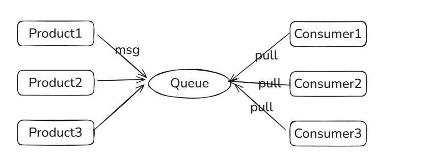
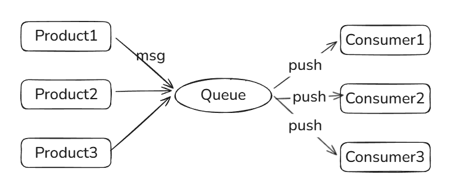
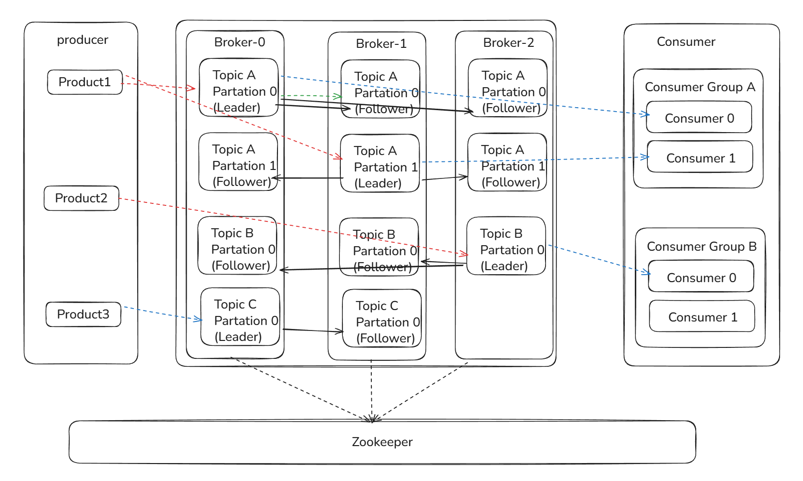
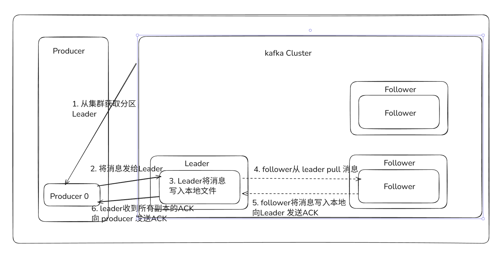
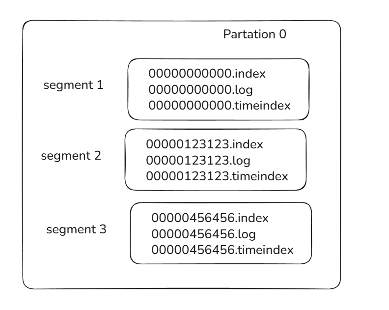
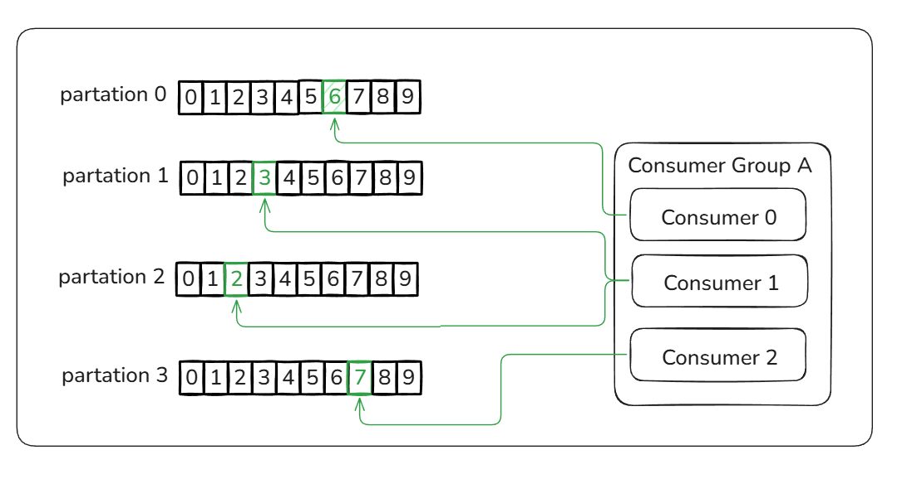
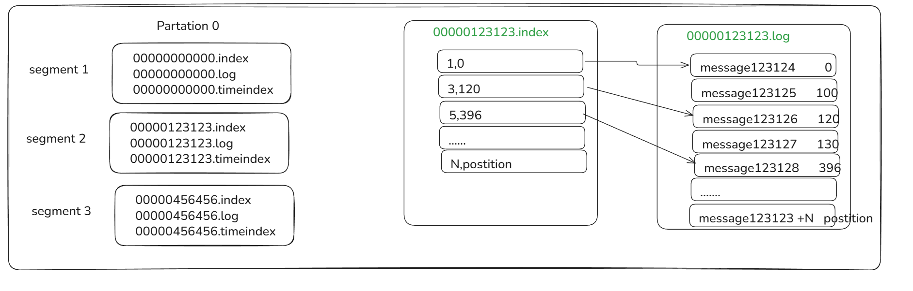

kafka工作原理

消息队列应用场景：异步处理、应用解耦、流量消峰

# 消息队列通讯模式

## 点对点通讯

通常是基于拉取或者轮询的消息传送模型，这个模型的特点是发送到队列的消息被一个且只有一个消费者进行处理。

生产者将消息放入消息队列后，由消费者主动的去拉取消息进行消费。

优点：消费者拉取消息的频率可以由自己控制。
缺点：消息队列是否有消息需要消费，在消费者端无法感知，所以在消费者端需要额外的线程去监控。

## 发布订阅模式

是基于消息推送的消息传送模型，该模型可以有多种不同的订阅者。生产者将消息放入消息队列后，队列会将消息推送给订阅过该类消息的消费者。

优点：由于是消费者被动接收推送，所以无需感知消息队列是否有待消费的消息
缺点：消息队列无法感知消费者消费速度，不同性能的订阅者处理能力不同。

# kafka

Kafka是一种高吞吐量的分布式发布订阅消息系统，它可以处理消费者规模的网站中的所有动作流数据，具有高性能、持久化、多副本备份、横向扩展能力。

基本概念
Producer：Producer即生产者，消息的产生者，是消息的入口
Broker：Broker是kafka实例，每个服务器上有一个或多个kafka的实例。
Topic：消息的主题，可以理解为消息的分类，kafka的数据就保存在topic。在每个broker上都可以创建多个topic。
Partition：Topic的分区，每个topic可以有多个分区，分区的作用是做负载，提高kafka的吞吐量。同一个topic在不同的分区的数据是不重复的，partition的表现形式就是一个一个的文件夹！
Replication:每一个分区都有多个副本，副本的作用是做备胎。副本的数量不能大于Broker的数量，follower和leader绝对是在不同的机器，同一机器对同一个分区也只可能存放一个副本。读写请求都是由leader进行处理的。follower仅仅是冗余备份。如果follower提供服务，那么会出现类似数据库事务中的幻读，脏读
Message：每一条发送的消息主体。
Consumer：消费者，即消息的消费方，是消息的出口。
Consumer Group：我们可以将多个消费组组成一个消费者组，在kafka的设计中同一个分区的数据只能被消费者组中的某一个消费者消费。同一个消费者组的消费者可以消费同一个topic的不同分区的数据，这也是为了提高kafka的吞吐量
Zookeeper：kafka集群依赖zookeeper来保存集群的的元信息，来保证系统的可用性。 （新版本的移除掉了zookeeper，内部实现）

## kafka的工作流程：

### 发送数据

由上图可以看到producer发送数据的整个流程。producer在写入数据时会找到leader操作。producer采用push模式将数据发布到broker，每条消息追加到分区中，顺序写入磁盘，所以保证同一分区内的数据是有序的！

消息写入leader后，follower是主动的去leader进行同步的！

producer又怎么知道该将数据发往哪个partition呢？kafka中有几个原则：

- partition在写入的时候可以指定需要写入的partition，如果有指定，则写入对应的partition。
- 如果没有指定partition，但是设置了数据的key，则会根据key的值hash出一个partition。
- 如果既没指定partition，又没有设置key，则会轮询选出一个partition。

kafka如何保证数据不丢失？

kafka是通过ACK应答机制保证数据不丢失。在生产者向队列写入数据的时候可以设置参数来确定是否确认kafka接收到数据，这个参数可设置的值为0、1、all。

- 0代表producer往集群发送数据不需要等到集群的返回，不确保消息发送成功。安全性最低但是效率最高。
- 1代表producer往集群发送数据只要leader应答就可以发送下一条，只确保leader发送成功。
- all代表producer往集群发送数据需要所有的follower都完成从leader的同步才会发送下一条，确保leader发送成功和所有的副本都完成备份。安全性最高，但是效率最低。

### 保存数据

Kafka初始会单独开辟一块磁盘空间，顺序写入数据（效率比随机写入高）。

Partition 结构：在服务器上的表现形式就是一个一个的文件夹，每个partition的文件夹下面会有多组segment文件，每组segment文件又包含.index文件、.log文件、.timeindex文件三个文件。log文件就实际是存储message的地方，而index和timeindex文件为索引文件，用于检索消息。

如上图，这个partition有三组segment文件，每个log文件的大小是一样的，但是存储的message数量是不一定相等的（每条的message大小不一致）。文件的命名是以该segment最小offset来命名的，如000.index存储offset为0~123123的消息，kafka就是利用分段+索引的方式来解决查找效率的问题。

Message结构：主要包含消息体、消息大小、offset、压缩类型……等等！
- offset：offset是一个占8byte的有序id号，它可以唯一确定每条消息在parition内的位置！
- 消息大小：消息大小占用4byte，用于描述消息的大小。
- 消息体：消息体存放的是实际的消息数据（被压缩过），占用的空间根据具体的消息而不一样。

#### 存储策略：
无论消息是否被消费，kafka都会保存所有的消息。那对于旧数据有什么删除策略呢？
1、 基于时间，默认配置是168小时（7天）。
2、 基于大小，默认配置是1073741824。
需要注意的是，kafka读取特定消息的时间复杂度是O(1)，所以这里删除过期的文件并不会提高kafka的性能！

### 消费数据

与生产消息相同的是，消费者在拉取消息的时候也是找leader去拉取。

多个消费者可以组成一个消费者组（consumer group），每个消费者组都有一个组id！同一个消费组者的消费者可以消费同一topic下不同分区的数据，但是不会组内多个消费者消费同一分区的数据！！！如下图：

图示是消费者组内的消费者小于partition数量的情况，所以会出现某个消费者消费多个partition数据的情况，消费的速度也就不及只处理一个partition的消费者的处理速度！
如果消费者大于partition数量的情况，那么多出来的消费者不消费任何partition的数据。
**因此建议消费者组的consumer的数量与partition的数量一致**！

如何进行查找数据：
在保存数据时我们谈到了利用segment+offset配合查找数据。详细过程如下：

如上图，我们查找一个offset为123127的message过程：

1. 先找到offset的123127message所在的segment文件（利用二分法查找），这里找到的就是在第二个segment文件。

2. 打开找到的segment中的.index文件（也就是123123.index文件，该文件起始偏移量为123123+1，我们要查找的offset为123127的message在该index内的偏移量为123123+4=123127，所以这里要查找的相对offset为5）。由于该文件采用的是稀疏索引的方式存储着相对offset及对应message物理偏移量的关系，所以直接找相对offset为5的索引找不到，这里同样利用二分法查找相对offset小于或者等于指定的相对offset的索引条目中最大的那个相对offset，所以找到的是相对offset为3的这个索引。

3. 根据找到的相对offset为3的索引确定message存储的物理偏移位置为120。打开数据文件，从位置为120的那个地方开始顺序扫描直到找到offset为123127的那条Message。

这套机制是建立在offset为有序的基础上，利用**segment+有序offset+稀疏索引+二分查找+顺序查找**等多种手段来高效的查找数据！

那每个消费者又是怎么记录自己消费的位置呢？在早期的版本中，消费者将消费到的offset维护zookeeper中，consumer每间隔一段时间上报一次，这里容易导致重复消费，且性能不好！在新的版本中消费者消费到的offset已经直接维护在kafk集群的__consumer_offsets这个topic中！