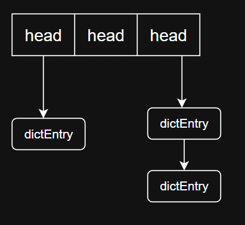
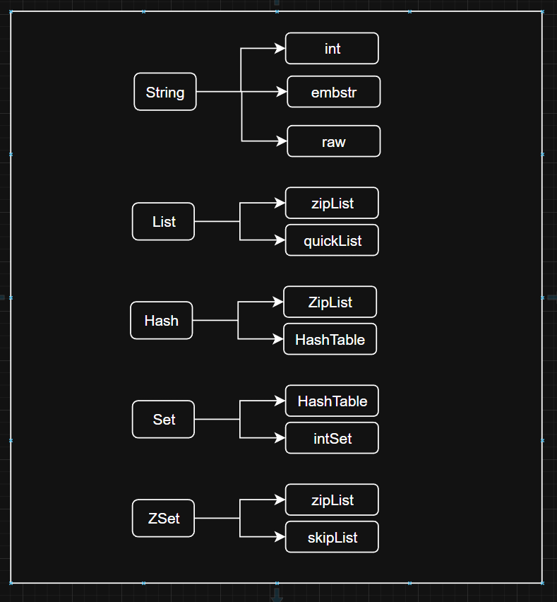
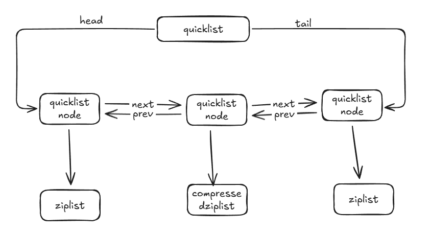

# 概念
Redis（Remote Dictionary Server） 远程字典服务，使用ANSI C语言编写、支持网络、可基于内存持久化的日志型、Key-Value数据库，并且提供多语言的API

# redis 五大基本类型
Redis是一个开源的，内存存储的数据结构服务器，可用作数据库，高速缓存和消息队列代理。他支持字符串，哈希表，列表，集合，有序集合，位图，HyperLogLogs等数据类型.内置复制、lua脚本，LRU回收、事务以及不同级别磁盘持久化功能，同时通过Redis Sentinel提供搞可用，Redis Cluster提供自动分区。

##  1.String 字符串
1. 是redis中最基础的类型
2. String 最大能存储 512MB,这个String类型可以是简单的支付串、复杂的xml/json、二进制图像或者音频的字符串，以及可以是数字的字符串

**使用场景**
1. 缓存：使用redis做缓存，配合其他数据库作为存储层，利用redis高并发的特点，可以大大加快系统的读写速度、以及降低后端的数据库压力
2. 计数器：许多系统会使用Redis作为系统的实时计数器，快速实现计数和查询功能，最终结果可以定时刷新到数据库中
3. 统计多单位的数量：统计多单位的数量
4. 共享用户session

## 2.List 列表
1. list类型是用来存储多个有序的字符串
2. 支持(2^32)-1个元素
3. 可以从两端进行push和pop操作，支持读取指定范围的元素集
4. 列表是有序的，可以重复的

**使用场景**
1. 消息队列：实现生产者消费者模型，可以使用左进右出的方式实现
2. 文章列表或者数据分页展示应用


## 3.Set 集合
1. set类型用来存储多个无序的、不重复的元素
2. set是使用哈希表实现的，支持集合的增删改查，并且支持多个集合的交并差

**使用场景**
1. 标签
2. 公共好友功能
3. 统计网站的独立IP

**数据结构**
set底层使用intset和hashtable两种数据机构存储


## 4.sorted set 有序集合
也是集合的，数据不能重复，但是可以给每个元素设置一个分数

**使用场景**
1. 排行榜功能
2. 用来做带权重的队列，让任务有优先级执行

## 5.hash 哈希表
hash是一个键值对（key-value）的集合

**使用场景**
1. 存储关系数据库中的表的记录，key为主键，值为记录
2. 存储用户相关新，优化用户信息的获取，不需要重复从数据库中读取，提高系统性能

# 五大基本类型的底层数据存储结构
redis内部整体的存储结构是一个大的hashmap，内部是数组实现的hash，key冲突通过挂链表去实现，每个dictEntry为一个key/value对象，value为定义的redisObject



dictEntry是存储key->value的地方，dictEntry结构体

```c
/*
 * 字典
 */
typedef struct dictEntry {
    // 键
    void *key;
    // 值
    union {
        // 指向具体redisObject
        void *val;
        // 
        uint64_t u64;
        int64_t s64;
    } v;
    // 指向下个哈希表节点，形成链表
    struct dictEntry *next;
} dictEntry;
```
1. redisObject
结构如下
```c
/*
 * Redis 对象
 */
typedef struct redisObject {
    // 类型 4bits
    unsigned type:4;
    // 编码方式 4bits
    unsigned encoding:4;
    // LRU 时间（相对于 server.lruclock） 24bits
    unsigned lru:22;
    // 引用计数 Redis里面的数据可以通过引用计数进行共享 32bits
    int refcount;
    // 指向对象的值 64-bit
    void *ptr;
} robj;
```
*ptr指向具体的数据结构的地址；type表示该对象的类型，即String,List,Hash,Set,Zset中的一个，但为了提高存储效率与程序执行效率，每种对象的底层数据结构实现都可能不止一种，encoding 表示对象底层所使用的编码。

redis对象底层的八种数据结构
- REDIS_ENCODING_INT（long 类型的整数）
- REDIS_ENCODING_EMBSTR embstr （编码的简单动态字符串）
- REDIS_ENCODING_RAW （简单动态字符串）
- REDIS_ENCODING_HT （字典）
- REDIS_ENCODING_LINKEDLIST （双端链表）
- REDIS_ENCODING_ZIPLIST （压缩列表）
- REDIS_ENCODING_INTSET （整数集合）
- REDIS_ENCODING_SKIPLIST （跳跃表和字典）



2. String 数据结构

- 当值为整数并且大小小于long的范围使用整数存储
- 当字符串长度不超过44字节时候，使用embstr 编码
只分配一次内存空间，redisObject和sds是连续的内存，查询效率会快很多，因为redisObject和sds是连续存储，所以当字符串增加的时候，他的长度会增加，这个时候需要重新分配内存，导致redisObject和sds需要重新分配，会影响性能，所以redis使用embstr实现一次分配后，只允许读，如果修改数据，就会转成raw编码，不使用embstr编码
- 大于44字节使用raw编码

SDS
embstr和raw都为sds编码，sds结构体源码
```
/* 针对不同长度整形做了相应的数据结构
 * Note: sdshdr5 is never used, we just access the flags byte directly.
 * However is here to document the layout of type 5 SDS strings. 
 */
struct __attribute__ ((__packed__)) sdshdr5 {
    unsigned char flags; /* 3 lsb of type, and 5 msb of string length */
    char buf[];
};

struct __attribute__ ((__packed__)) sdshdr8 {
    uint8_t len; /* used */
    uint8_t alloc; /* excluding the header and null terminator */
    unsigned char flags; /* 3 lsb of type, 5 unused bits */
    char buf[];
};

struct __attribute__ ((__packed__)) sdshdr16 {
    uint16_t len; /* used */
    uint16_t alloc; /* excluding the header and null terminator */
    unsigned char flags; /* 3 lsb of type, 5 unused bits */
    char buf[];
};

struct __attribute__ ((__packed__)) sdshdr32 {
    uint32_t len; /* used */
    uint32_t alloc; /* excluding the header and null terminator */
    unsigned char flags; /* 3 lsb of type, 5 unused bits */
    char buf[];
};

struct __attribute__ ((__packed__)) sdshdr64 {
    uint64_t len; /* used */
    uint64_t alloc; /* excluding the header and null terminator */
    unsigned char flags; /* 3 lsb of type, 5 unused bits */
    char buf[];
};
```
这个里面为什么要封装sds结构体不适用c语言的字符串，有以下原因
1. 低复杂度获取字符串长度，sds可以直接获取，c语言的字符串需要遍历整个字符串
2. 避免缓冲区溢出；进行两个字符串拼接c语言可使用strcat函数，但如果没有足够的内存空间。就会造成缓冲区溢出；而用sds在进行合并时会先用len检查内存空间是否满足需求，如果不满足，进行空间扩展，不会造成缓冲区溢出；
3. 减少修改字符串的内存重新分配次数：c语言字符串不记录字符串长度，如果要修改字符串要重新分配内存，如果不进行重新分配会造成内存缓冲区泄露；

redis sds实现了空间预分配和惰性空间释放两种策略

空间预分配：
- 如果sds修改后，sds长度（len的值）将于1mb，那么会分配与len相同大小的未使用空间，此时len与free值相同。例如，修改之后字符串长度为100字节，那么会给分配100字节的未使用空间。最终sds空间实际为 100 + 100 + 1(保存空字符'\0')；
- 如果大于等于1mb，每次给分配1mb未使用空间

惰性空间释放：
- 对字符串进行缩短操作时，程序不立即使用内存重新分配来回收缩短后多余的字节，而是使用 free 属性将这些字节的数量记录下来，等待后续使用（sds也提供api，我们可以手动触发字符串缩短）；
- 二进制安全：因为C字符串以空字符作为字符串结束的标识，而对于一些二进制文件（如图片等），内容可能包括空字符串，因此C字符串无法正确存取；而所有 sds 的API 都是以处理二进制的方式来处理 buf 里面的元素，并且 sds 不是以空字符串来判断是否结束，而是以 len 属性表示的长度来判断字符串是否结束；
- 遵从每个字符串都是以空字符串结尾的惯例，这样可以重用 C 语言库<string.h> 中的一部分函数

小于44字节用embstr编码原因

首先看下redisObject和sds定义的结构体源码
```

typedef struct redisObject {
    // 类型 4bits
    unsigned type:4;
    // 编码方式 4bits
    unsigned encoding:4;
    // LRU 时间（相对于 server.lruclock） 24bits
    unsigned lru:22;
    // 引用计数 Redis里面的数据可以通过引用计数进行共享 32bits
    int refcount;
    // 指向对象的值 64-bit
    void *ptr;
} robj;
```

```
struct __attribute__ ((__packed__)) sdshdr8 {
uint8_t len; /* used */
uint8_t alloc; /* excluding the header and null terminator */
unsigned char flags; /* 3 lsb of type, 5 unused bits */
char buf[];
};
```

redisObject占用空间
```
4 + 4 + 24 + 32 + 64 = 128bits = 16字节
```

sdshdr8占用空间
```
1（uint8_t） + 1（uint8_t）+ 1 （unsigned char）+ 1（buf[]中结尾的'\0'字符）= 4字节
```

初始最小分配为64字节，所以只分配一次空间的embstr最大为 64 - 16- 4 = 44字节

# 3. List存储结构

Redis3.2之前的底层实现方式：压缩列表ziplist 或者 双向循环链表linkedlist

当list存储的数据量比较少且同时满足下面两个条件时，list就使用ziplist存储数据：
- list中保存的每个元素的长度小于 64 字节；
- list中保存的元素个数小于 512 个；

Redis3.2及之后的底层实现方式：quicklist
quicklist是一个双向链表，而且是一个基于ziplist的双向链表，quicklist的每个节点都是一个ziplist，结合了双向链表和ziplist的优点。

## ziplist

ziplist是一种压缩链表，它的好处是更能节省内存空间，因为它所存储的内容都是在连续的内存区域当中的。当列表对象元素不大，每个元素也不大的时候，就采用ziplist存储。但当数据量过大时就ziplist就不是那么好用了。因为为了保证他存储内容在内存中的连续性，插入的复杂度是O(N)，即每次插入都会重新进行realloc。如下图所示，redisObject对象结构中ptr所指向的就是一个ziplist。整个ziplist只需要malloc一次，它们在内存中是一块连续的区域。

ziplist结构

| zlbytes | zltail | zllen | entry1 | …… |entryN |zleng |
|---------|-----|---------|---------|-----|---------|---------|

作用如下
zlbytes:用于记录整个压缩列表占用的内存字节数
zltail：记录要列表尾节点距离压缩列表的起始地址有多少字节
zllen：记录了压缩列表包含的节点数量
entryX：要说列表包含的各个节点
zlend：用于标记压缩列表的末端

为什么数据量大时不用ziplist？

ziplist是一段连续的内存，插入的时间复杂化度为O(n)，而且每当插入新的元素需要realloc做内存扩展；而且如果超出ziplist内存大小，还会做重新分配的内存空间，并将内容复制到新的地址。如果数量大的话，重新分配内存和拷贝内存会消耗大量时间。所以不适合大型字符串，也不适合存储量多的元素。

## 快速列表（quickList）

快速列表是ziplist和linkedlist的混合体，是将linkedlist按段切分，每一段用ziplist来紧凑存储，多个ziplist之间使用双向指针链接。

为什么不直接使用linkedlist？

linkedlist的附加空间相对太高，prev和next指针就要占去16个字节，而且每一个结点都是单独分配，会加剧内存的碎片化，影响内存管理效率。

quicklist结构体源码

```
typedef struct quicklist {
    // 指向quicklist的头部
    quicklistNode *head;
    // 指向quicklist的尾部
    quicklistNode *tail;
    unsigned long count;
    unsigned int len;
    // ziplist大小限定，由list-max-ziplist-size给定
    int fill : 16;
    // 节点压缩深度设置，由list-compress-depth给定
    unsigned int compress : 16;
} quicklist;

typedef struct quicklistNode {
    // 指向上一个ziplist节点
    struct quicklistNode *prev;
    // 指向下一个ziplist节点
    struct quicklistNode *next;
    // 数据指针，如果没有被压缩，就指向ziplist结构，反之指向quicklistLZF结构
    unsigned char *zl;
    // 表示指向ziplist结构的总长度(内存占用长度)
    unsigned int sz;
    // ziplist数量
    unsigned int count : 16;     /* count of items in ziplist */
    unsigned int encoding : 2;   /* RAW==1 or LZF==2 */
    // 预留字段，存放数据的方式，1--NONE，2--ziplist
    unsigned int container : 2;  /* NONE==1 or ZIPLIST==2 */
    // 解压标记，当查看一个被压缩的数据时，需要暂时解压，标记此参数为1，之后再重新进行压缩
    unsigned int recompress : 1; /* was this node previous compressed? */
    unsigned int attempted_compress : 1; /* node can't compress; too small */
    // 扩展字段
    unsigned int extra : 10; /* more bits to steal for future usage */
} quicklistNode;

typedef struct quicklistLZF {
    // LZF压缩后占用的字节数
    unsigned int sz; /* LZF size in bytes*/
    // 柔性数组，存放压缩后的ziplist字节数组
    char compressed[];
} quicklistLZF;
```



ziplist的长度

quicklist内部默认单个ziplist长度为8k字节，超出了这个字节数，就会新起一个ziplist。关于长度可以使用list-max-ziplist-size决定。

压缩深度

quicklist下是用多个ziplist组成的，同时为了进一步节约空间，Redis还会对ziplist进行压缩存储，使用LZF算法压缩，可以选择压缩深度。quicklist默认的压缩深度是0，也就是不压缩。压缩的实际深度由配置参数list-compress-depth决定。为了支持快速push/pop操作，quicklist 的首尾两个 ziplist 不压缩，此时深度就是 1。如果深度为 2，就表示 quicklist 的首尾第一个 ziplist 以及首尾第二个 ziplist 都不压缩。

# 4. Hash 哈希

当Hash中数据项比较少的情况下，Hash底层才用压缩列表ziplist进行存储数据，随着数据的增加，底层的ziplist就可能会转成dict，具体配置如下
```
hash-max-ziplist-entries 512
hash-max-ziplist-value 64
```

dict结构体源码
```
typedef struct dict {
    dictType *type;
    void *privdata;
    dictht ht[2];
    long rehashidx; /* rehashing not in progress if rehashidx == -1 */
    int iterators; /* number of iterators currently running */
} dict;

typedef struct dictht {
    //指针数组，这个hash的桶
    dictEntry **table;
    //元素个数
    unsigned long size;
    unsigned long sizemask;
    unsigned long used;
} dictht;

dictEntry大家应该熟悉，在上面有讲，使用来真正存储key->value的地方
typedef struct dictEntry {
    // 键
    void *key;
    // 值
    union {
        // 指向具体redisObject
        void *val;
        // 
        uint64_t u64;
        int64_t s64;
    } v;
    // 指向下个哈希表节点，形成链表
    struct dictEntry *next;
} dictEntry;
```

每个dict中都有两个hashtable

虽然dict结构有两个hashtable，但是通常情况下只有一个hashtable是有值的。但是在dict扩容缩容的时候，需要分配新的hashtable，然后进行渐近式搬迁，这时候两个hashtable存储的旧的hashtable和新的hashtable。搬迁结束后，旧hashtable删除，新的取而代之。


https://mp.weixin.qq.com/s/7ct-mvSIaT3o4-tsMaKRWA