# 1. 背景

如何更好的了解用户真实需求，为用户提供差异化的服务，实现用户的精细化运营，提高用户留存和后续转化，这都是DMP要来解决的问题。

DMP通过收集用户各种数据，结合算法的能力给用户打上不同的兴趣标签，基于用户兴趣可以实现个性化的推荐、搜索、内容导购等服务，直击用户真实诉求；同时可以基于标签来组合人群做广告和Push消息精准投放。

贝壳于2018年5月份开始搭建自己的DMP平台，下面将从贝壳DMP平台的整体架构设计、搭建中遇到的挑战、以及取得的效果等方面展开介绍。

# 2. 挑战

如何做用户归一，唯一标示一个用户

海量用户行为数据如何保证数据及时产出

如何实现秒级的人群预估和分钟级的复杂人群计算

# 3. 实现

## 3.1 整体架构

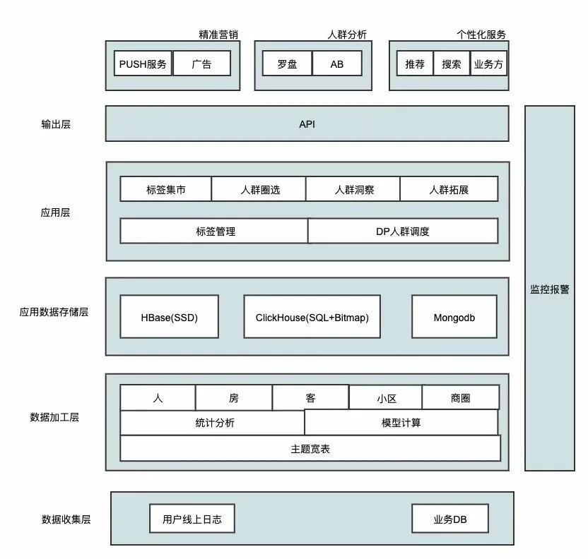

## 3.2 数据收集层

该部分主要是收集用户线上、线下各种用户行为数据，其中比较复杂的是线上行为数据的收集。如果没有公司统一的埋点系统，DMP将无从做起。

在2018年初，公司推行了统一的埋点规范，推出了罗盘这一公司级的埋点规范管理和数据分析平台，为数据收集打下非常好的数据基础。[罗盘-贝壳流量分析平台](罗盘-贝壳流量分析平台.md)。

## 3.3 数据加工处理层

在数据层首先需要建立主题宽表，将所有数据打平后方便后续数据处理。

在构建主题宽表中首先要解决的就是用户碎片化数据如何归一，比如一个用户可能会登录多个手机，或者同时访问链家和贝壳的APP，既有线上浏览行为又有线下带看数据，如何精准的识别同一个用户，打通线上线下数据是做好画像的关键。

PC和M站只有在登录下才能精准的识别用户，而对于APP用户，可以利用手机的IMEI或者IDFA、APP自己生成的系列号、以及登录的UCID来精准的识别一个用户。

比如用户同时登录了两个APP，可以根据IMEI或者IDFA来识别出。但是IMEI在Android高版本中需要用户授权，IDFA用户可以关闭，都有可能获取不到，这种情况下可以使用APP自己生成的序列号来识别用户。具体的实现逻辑如下图所示：

在识别用户后，会将用户线上和线下的各种行为数据打通，并基于这些数据做各种特征数据的抽取，最终产出三种类型的标签数据：

- 通过简单的数据统计分析产出了基础标签和行为标签，比如性别、年龄、常住城市、访问次数、关注次数、带看次数等事实标签
- 通过用户线上线下的不同行为次数、行为权重、与时间衰减的乘积，来计算用户在房子各个维度上的得分。由此可以得到用户在房子上的各种偏好标签，比如喜欢回龙观、400W的两居室
- 通过分类算法产出业务线偏好、用户生命周期、流失预估、商机预估、委托预估等标签；通过聚类算法产出工作地、居住地等标签

画像目前使用的是用户线上180天的数据来计算各种标签，每天参与计算的数据在百亿级别，同时还要保证数据在10点产出。在如何保证数据按时产出方面，我们做了很多优化：

- 数据列裁剪，只获取画像感兴趣的字段
- 数据预聚合，用户每天的行为数据有上亿条，但是经过适当的预聚合可以将数据量减少到原来的五分之一到十分之一，同时不影响后续的各种统计分析
- 增量计算，每天将昨天的数据去掉最早一天的数据，再融合最新一天的数据
- 使用group by和count替换耗时的count distinct操作
- 算法模型线上化，挖据算法离线计算标签的成本非常高，经常会到下午才产出数据，将模型线上化后，离线只用训练模型，通过在线API服务来加载模型和用户各种特征数据实时给出挖据的结果

# 3.4 实时画像

贝壳每天有10%以上的新用户，而且用户的需求随着时间也会有一定的变化，如何根据用户行为快速体现出用户需求的变化，及时给用户提供差异性的服务，这是我们做实时画像的初衷。

下面是实时画像的架构设计：

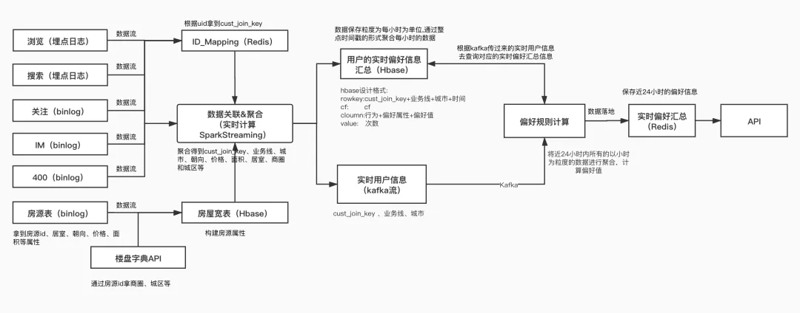

通过spark streaming实时消费用户线上行为数据，并将行为数据存储在HBase中；

HBase采用宽表的设计思想，将一个用户的各种行为和偏好数据存储在列中；

通过HBase的increment操作来原子性的更新行为次数，同时大量使用HBase的批量操作来加速每个批次的处理速度；

目前可以在秒级计算出用户实时偏好数据，并将偏好数据存储到Redis对外提供API服务。

## 3.5 应用数据存储层
仓库中的数据无法直接面向应用使用，需要一个应用层的存储系统来为应用层服务。基于不同的应用，DMP使用了ClickHouse、Mongodb以及HBase作为数据存储。具体的数据流如下：

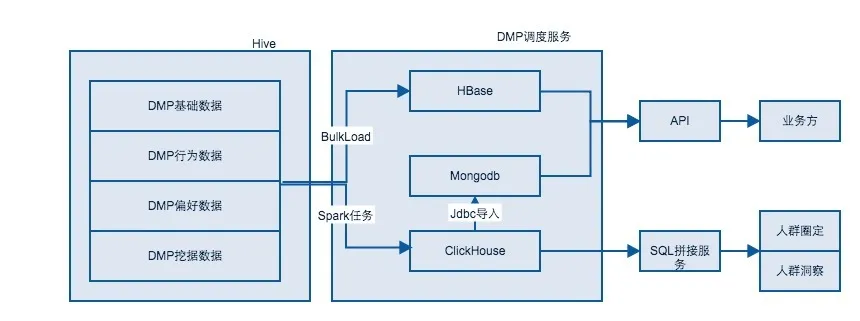

### 1）Spark任务
通过Spark任务每天将Hive中的数据导入到ClickHouse，同时利用ClickHouse的位图存储和位图运算，将复杂的SQL运算转换成位图里面的与或非，来实现任意拖拽标签、秒级人群预估和分钟级人群计算。关于通过CK位图来实现圈包后面会有专门的文章来介绍。

### 2）对于Push消息类的服务
需要通过接口获取人群中的数据用于消息发送。由于ClickHouse定位还是OLAP，不适合大量地在线调用，所以需要将人群的数据导入到Mongodb中来提供在线服务调用。

为优化分页查询带来的性能问题，在导入Mongodb时为每个版本的每条数据生成一个自增的ID，同时对这个ID建立索引，在查询时根据页数计算出每一页数据的ID范围，然后再根据索引来查询数据，能保证千万级的分页查询平均响应时间在100ms以内。

### 3）对于在线的个性化服务
需要实时地调用画像服务来支持推荐、搜索、首页个性化排版等需求。这种场景需要一个支持海量数据存储、高并发、短延迟的存储服务。

在这种场景下，我们将Hive中的画像数据通过BulkLoad导入到HBase，对核心的画像数据在HBase做了资源隔离和SSD存储，同时将最近的画像数据导入Redis做热缓存。这样就保证了画像接口服务在每天4亿的调用量下，平均响应时间只有5ms左右。

整个数据存储层，我们会有一个专门的DP项目组来负责整个数据的流转以及人群数据的计算。

## 3.6 应用层

### 1）人群圈定

根据标签来圈定目标用户，可以实现不同标签间的与或非，以及人群之间的交并差运算，来实现秒级的人群预估和分钟级的人群包数据生成。

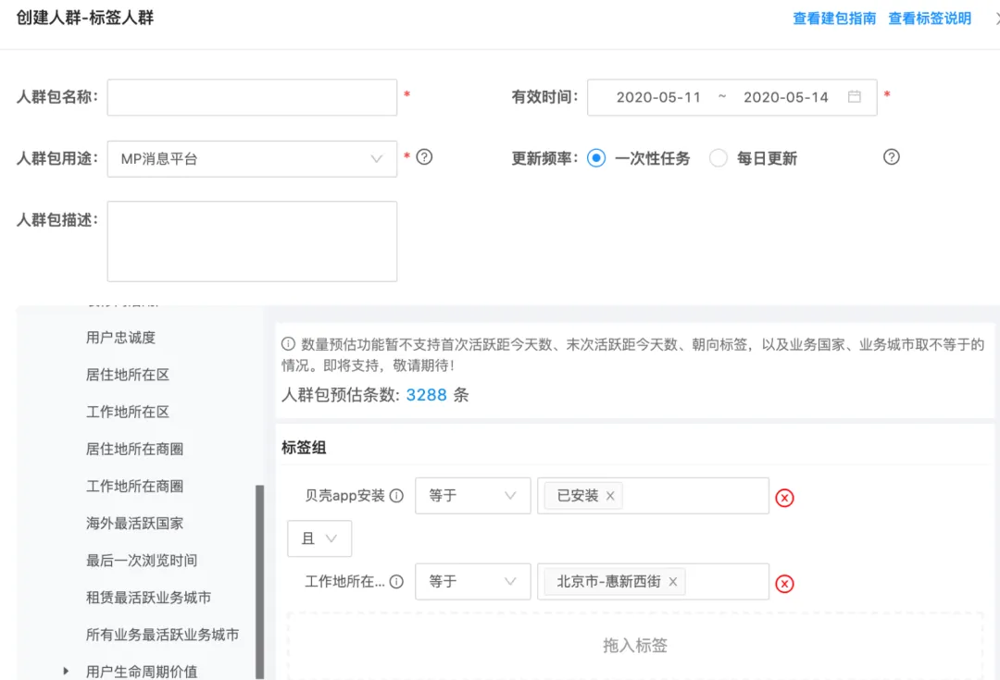

### 2）人群洞察

分析目标用户特点，快速了解目标用户，该部分查询直接通过SQL跟ClickHouse实时交互。

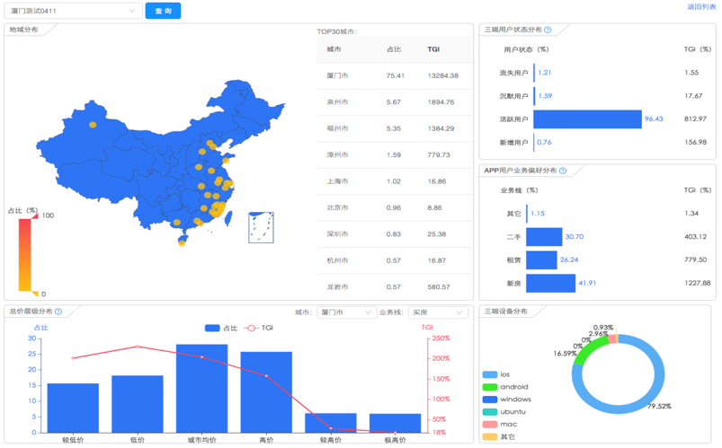

### 3）标签管理

快速上下线标签，管理标签层级结构。

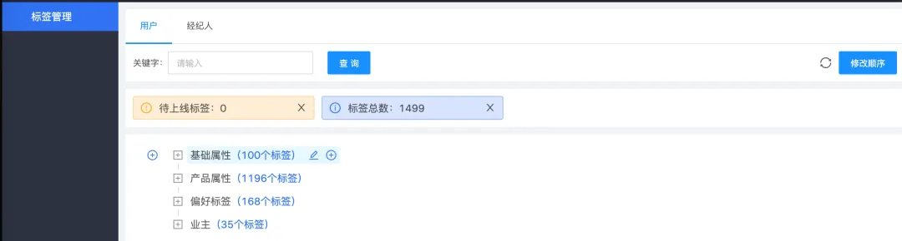

### 4）标签集市

主要解决快速了解标签体系和查找标签的问题。

### 5）人群扩展

采用强大lookalike算法通过少量种子人群扩展海量目标用户。

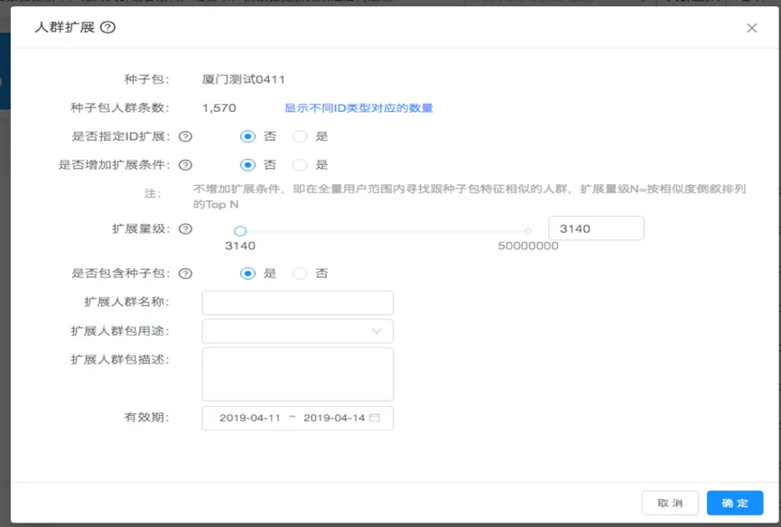

### 6）消息Push

支持APP外显Push和公众号消息Push，可以发送手工Push也可以发送基于画像的精准导购Push，同时支持到商机的效果追踪。

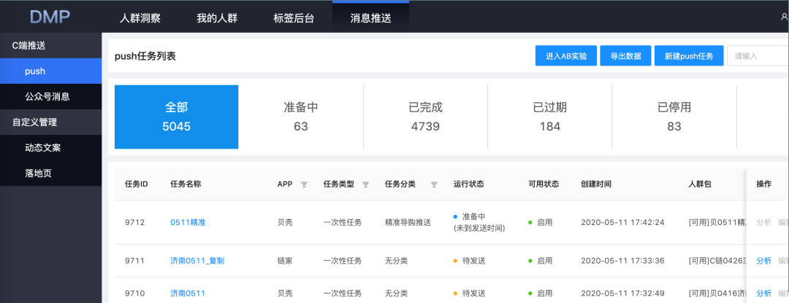

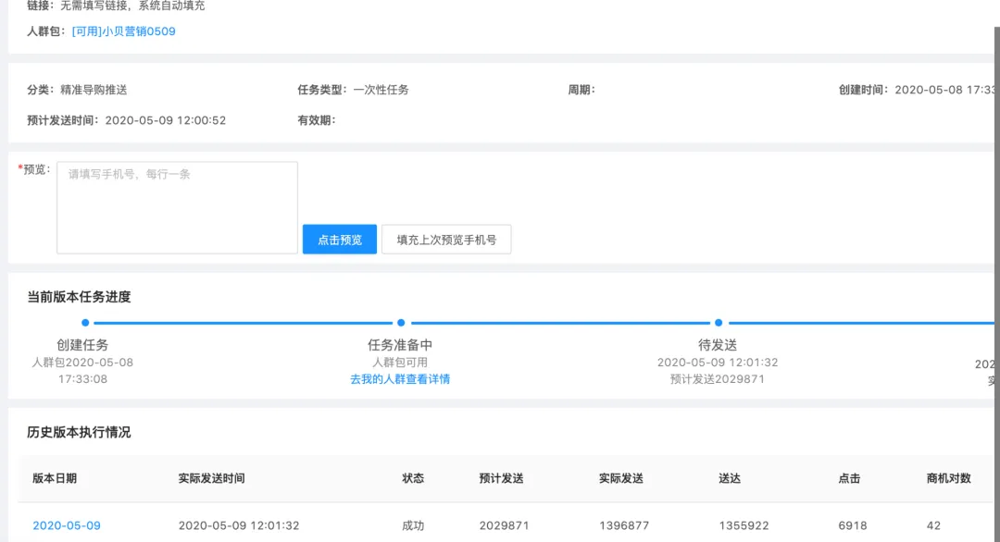

# 4. 效果
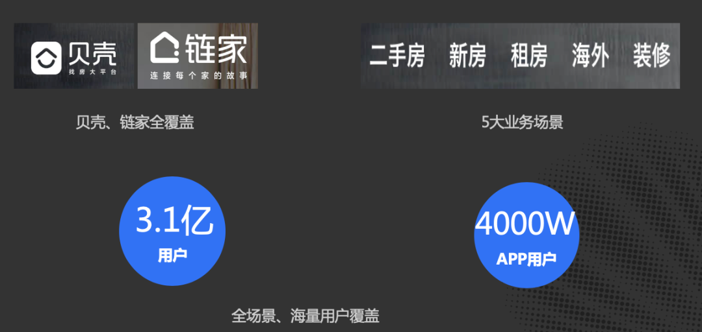
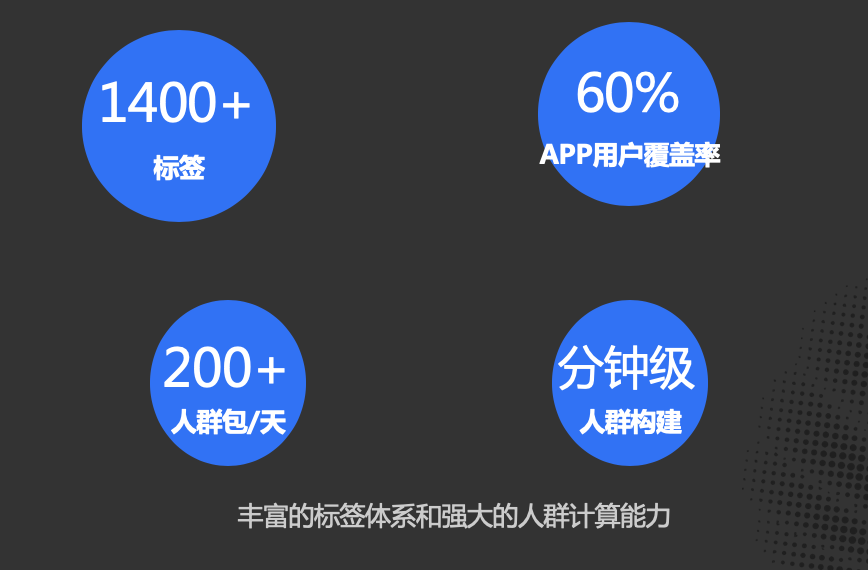

# 5. 总结

通过两年的发展和迭代，目前贝壳DMP的平台能力已经基本搭建完成。从站外的DSP广告、消息Push，到站内的推荐、搜索、首页个性化排版、内容导购、商机前的潜客引导、商机后的小贝助手和小贝手环、委托后的客源解读、带看后的装修高潜用户挖掘等各个场景下都得到了很好的应用，有效地帮助业务来实现了个性化服务和精细化运营。

# 6. 展望

## 1）画像深度和覆盖率的提升
目前画像还是以事实类的标签为主，后面会基于对数据的理解以及业务方的需求，通过模型来产出更多挖掘和预测类的标签；同时通过挖据的手段推断出没有关键行为的用户偏好。
## 2）效果的持续提升和优化
跟业务方更加紧密的结合，在用户生命周期的各个阶段来持续提升和优化效果。
## 3）平台化的持续建设