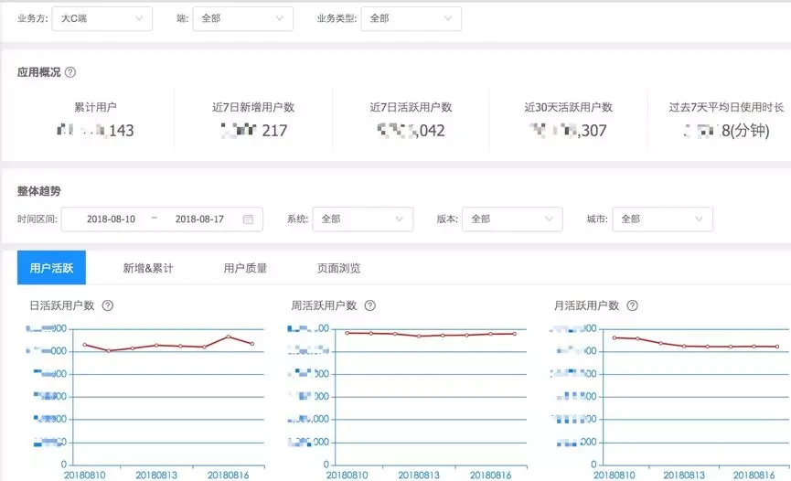
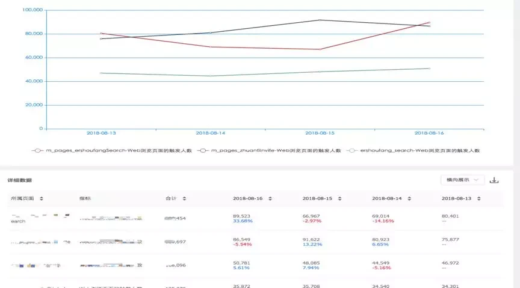
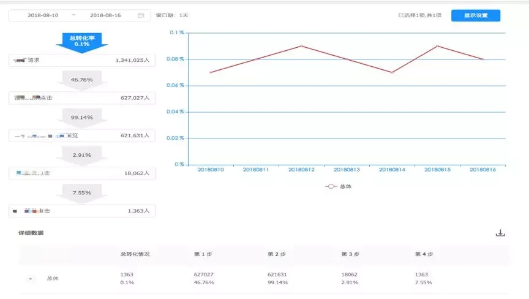
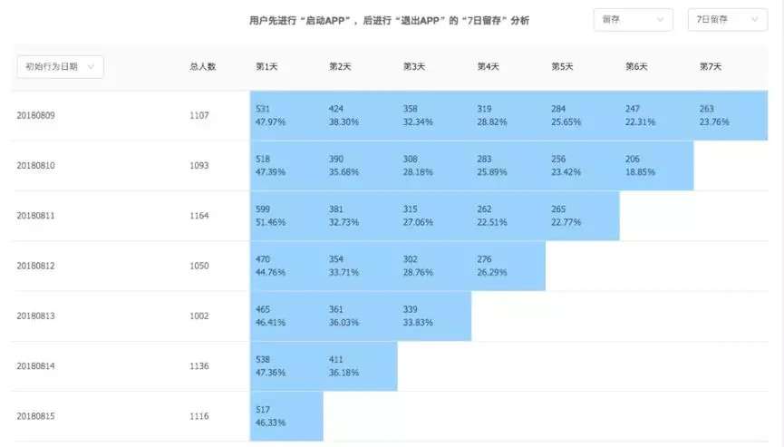
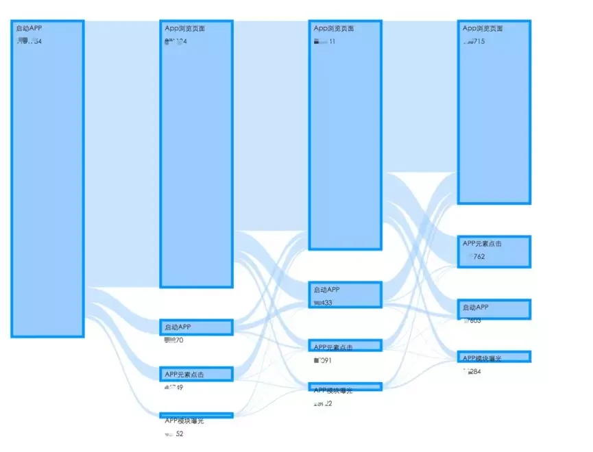

# 1.背景

随着贝壳的不断发展，特别是今年年初专门成立了增长线，数据化思维和精细化运营的诉求越来越强烈。各个业务方急需了解自己系统的流量情况，从数据出发优化自己的产品，从而留住用户提高转化；而作为公司高层需要知道集团的整体流量情况，特别是比较核心的月活、商机转化、用户留存和渠道推广等情况，及时作出战略部署和调整，保证公司保持高效稳定的增长。在这样的大背景下我们搭建了一套流量分析平台-罗盘，为集团和各个业务方提供统一、权威的流量数据出口。

# 2.面临的问题

1.日志埋点格式不统一，历史存在多套埋点标准，有些业务方还有自己的日志埋点规范，如何统一标准，兼容历史数据是我们面临的第一个问题；

2.统计口径不一致，每个业务都有自己的统计口径，数据互相不认可，而从集团层面很难拿到整体的流量数据；

3.每天TB级别上报数据，各种复杂的数据分析场景，在很多场景下需要保存明细数据才能分析，如何存储明细数据和分析数据是系统架构设计的一大挑战。

# 3.总体设计方案

从纵向看分为数据需求、数据接入、数据处理、数据存储和数据分析五个过程，从横向能看到数据在每个环节中具体的流转过程，下面从纵向的角度展开介绍一下每个过程。

# 4. 数据需求
数据需求是整个环节的第一步，首先需要有一套全公司标准的埋点规范，并通过公司高层的推动下在各个业务方落地，而规范的落地需要有系统的支撑，埋点管理模块承担了所有埋点信息的申请、埋点文档的生成，辅助业务实现标准化的埋点。

# 5. 数据接入
主要负责快速接收业务方根据埋点需求上报的日志数据，其中Dig服务接收APP、PC、M站发送数据，通过lua程序将数据落地到kafka，对于APP端为了性能和节省流量会批量打包上传日志文件，Dig还会负责日志文件的解压。

# 6. 数据处理

1.首先通过 spark 任务消费 Dig 落地的 kafka 数据，做格式的清洗、历史日志格式的转换、字段的解析，并根据分析需求衍生出更多的维度，比如手机型号、品牌等，还会做日志数据格式的校验，对于不合法的数据进行统计后落地到 DB 中提供查看错误信息；

2.spark 清洗后的 kafka 数据会通过 Hangout 组建实时落地到 ClickHouse 提供实时数据分析的能力，Hangout 是类似 Logstash 的日志收集组件，目前支持秒级的数据实时写入；

3.spark 清洗的数据也会落地到 HDFS，用于离线仓库处理，罗盘目前能解决大部分公共的分析需求，但是对于部分个性化的需求还是需要通过 hive sql 来解决，同时对于渠道相关的数据目前还无法做到实时处理，目前是通过离线跟渠道数据关联后每天导入到 ClickHouse，并会覆盖昨天的实时数据，这也是大数据比较经典实时+离线的 Lambda 架构。

# 7. 数据存储

在做罗盘架构设计选型时最核心的就是如何选择一个适合自己的 OLAP 引擎，我们对比了 Spark、Kylin、Druid、Kudu+Impala、ClickHouse 等分析引擎的优劣最终选择了 ClickHouse，主要基于以下几个方面：

1.对业务的支撑能力，ClickHouse 具备非常强大的分析函数以及自定义函数的支持，可以很好支持罗盘各种场景下的分析功能；  
2.支持 SQL 查询，业务实现比较简单；  
3.超强的查询性能和数据压缩能力，在真实数据测试时 10 亿的数据量下简单查询在毫秒级，分组加聚合统计查询在秒级，在大批量的实时写入下并不会影响查询性能；  
4.在部分互联网公司已经有线上的应用案例，比如新浪微博、瓜子二手车等。  

# 8. 数据分析

基于 ClickHouse 我们最终实现了 5 大分析能力:
## 1.数据概览

## 2.事件分析
可以在任意维度加指标组合来分析业务的 PV、UV 等数据，该部分底层实现主要是一些复杂的聚合 SQL，具体效果如图所示：

## 3.漏斗分析
分析指定步骤在指定时间周期内每个步骤下用户转化情况，其中每个步骤还可以设置不同的筛选条件，并且支持按照维度分组对比查看数据；该部分分析比较复杂，我们基于 ClickHouse 自己实现了一个带时间滑动窗口子序列查找算法的自定义函数，通过 Patch 源码编译到 ClickHouse 引擎中，具体实现效果如图所示：

## 4.留存分析
可以看到不同维度下用户每天的流失情况，具体效果如图所示：

## 5.路径分析
可以看到用户在产品中完整访问路径，帮助用户找到产品关键路径，具体的实现主要通过 ClickHouse 中的 groupArray 函数将用户每个 session 下所有行为聚合成数组，然后根据行为发生的时间对行为做排序和过滤得到每个用户在 session 下的完整访问路径，具体效果如图所示：

## 6.埋点检测
为了方便业务方查看自己上报的日志数据，我们还提供了埋点实时检测的功能，通过实时消费 kafka 的数据让用户可以看到实时上报的数据格式，以及历史上报数据的情况，包括接收的数据量、错误数据量以及错误的详细信息，这个是埋点需求验收的关键环节，需要有 PM 或者 QA 的介入做埋点验收，保证上线后的数据质量。
# 总结
目前罗盘接入了 10+的业务线，还有更多的业务线正在接入中，每天 6 亿+实时数据写入，各种场景下秒级的查询能力。
# 展望
随着公司业务的发展和更多业务方的数据接入，如何实现业务方快速数据接入、在更大数据量下数据存储和数据查询的优化需要我们不断的努力；在产品功能上深化各个场景下的分析能力，支持用户行为明细和用户分群等高级分析能力；在实现功能的同时将 ClickHouse 封装成一个公共的基础技术服务，能让其它业务系统方便的接入数据和使用数据，解决业务系统在海量数据存储和复杂查询上的痛点。
