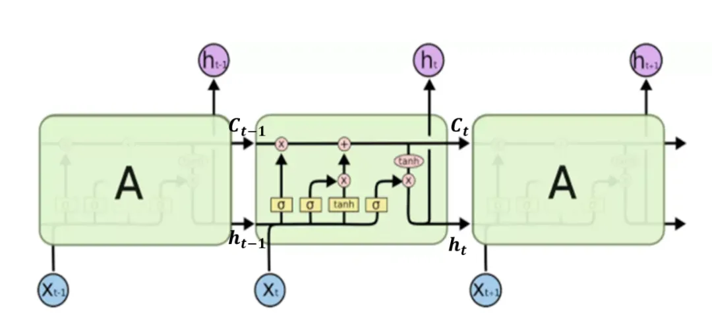
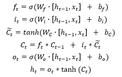
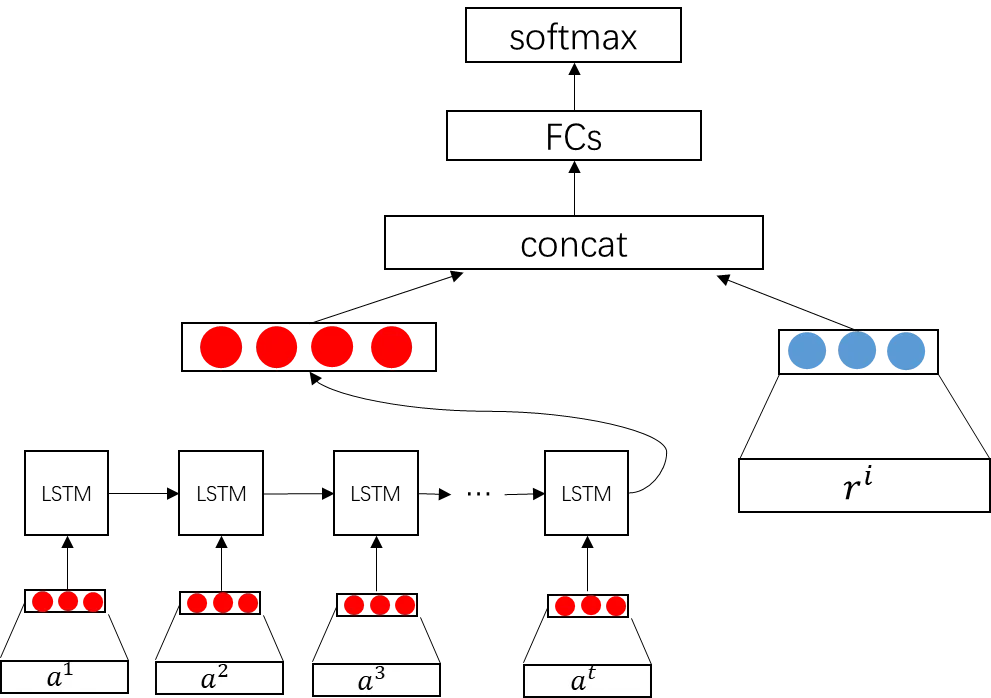
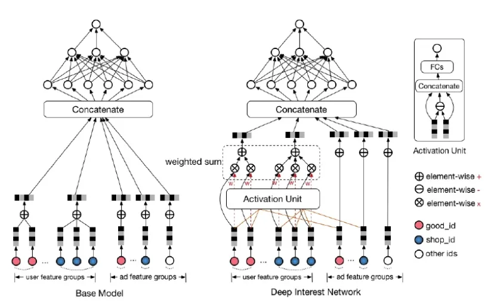
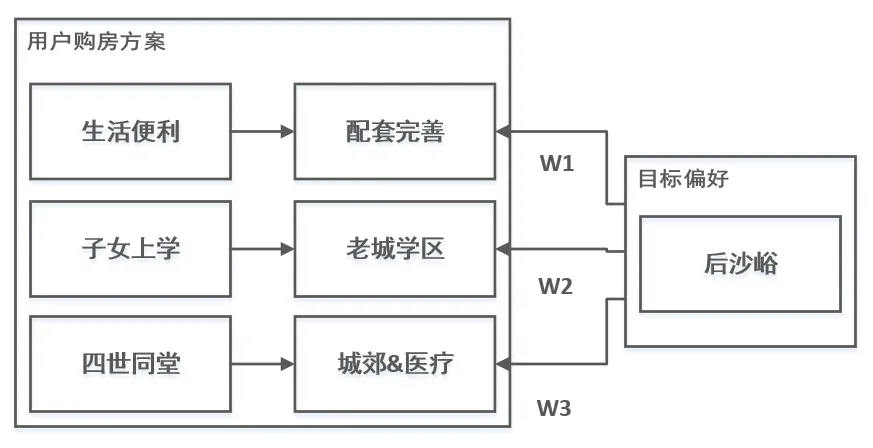
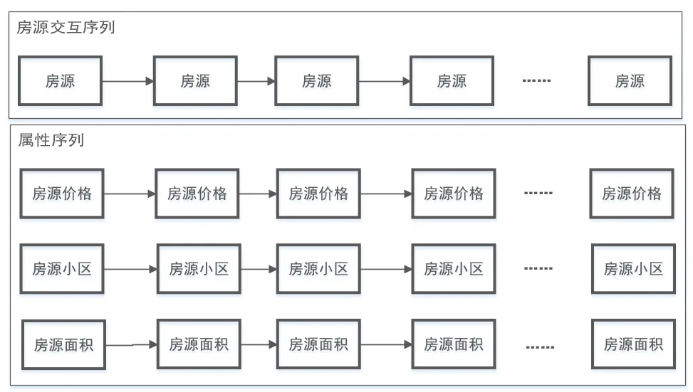
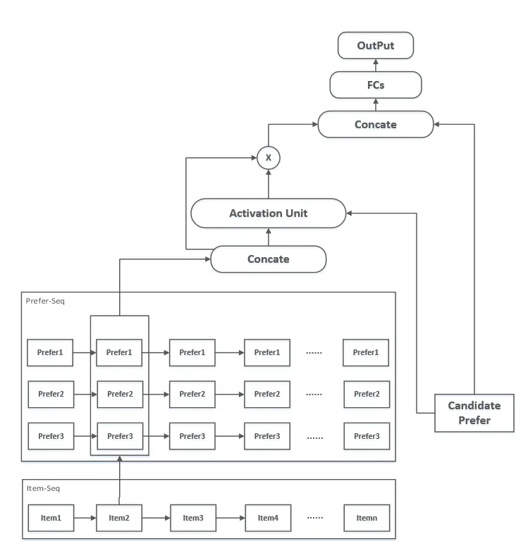

# 贝壳用户偏好挖掘的思考与实践

> **原文**: https://mp.weixin.qq.com/s/6aqc4oyost7wNOy4ftL_hw  
> **作者**: 刘雷@贝壳找房  
BZ|> **发布时间**: 2020-09-17
> **整理时间**: 2026-02-27  
> **分类**: AI-ML  
> **标签**: 用户偏好、推荐系统、深度学习、DIN

---

## 一句话总结

贝壳找房通过统计方法、模型方法、Seq4Rec二分类、深度兴趣网络（DIN）四个版本的迭代，成功解决了用户偏好挖掘中的准确表达、可理解性、高维稀疏和多峰偏好四大挑战。

---

## 核心要点

- **统计方法**：行为加权 + 时间衰减，适合低维偏好，可解释但难优化
- **模型方法**：XGBoost/DNN/LSTM，适合低维偏好，可优化但不可解释
- **Seq4Rec二分类**：将高维稀疏问题转化为二分类，解决维度爆炸和行为稀疏问题
- **DIN深度兴趣网络**：借鉴阿里DIN，根据目标Item动态调整用户序列权重，解决多峰偏好问题
- **核心挑战**：准确表达（多峰偏好）、可理解（下游是人）、高维稀疏（地理位置）

---

## 详细内容

### 一、背景

**什么是用户偏好挖掘？**

用户偏好是对用户内在需求的具体刻画。通过分析用户过去的行为和数据，推测用户未来的需求倾向。

**应用场景：**
- 搜索排序
- 个性化推荐
- Push推送
- 精准营销
- 精细化运营

**三个核心挑战：**

1. **准确表达** — 偏好怎么度量？用户可能同时喜欢多个东西（多峰偏好），怎么准确反映？
2. **可理解** — 贝壳下游不仅有算法，还有运营和经纪人这些"人"需要看得懂输出结果
3. **高维偏好** — 比如地理位置这种属性，维度很高，怎么处理？

---

### 二、常见挖掘思路

#### 2.1 统计方法

核心思想：用户行为越多、距现在越近，说明偏好越强。

```
偏好得分 = Σ(行为权重 × 行为次数 × 衰减系数) → 归一化
```

**行为权重确定方法：**
- 后验转化率倒数
- Bagging + LR 模型（有监督）
- 贝叶斯方法

**时间衰减方式：**
- 指数衰减：λ^t，越远下降越快
- 阶跃衰减：按天/周分区，同区间权重相同

**缺点：**
- 权重和衰减方式依赖人工选择，主观性强
- 难以优化

#### 2.2 模型方法

**低维偏好（枚举值少）：**
- XGBoost / DNN / LSTM / GRU
- 有监督多分类

**高维偏好（枚举值多，如位置）：**
- Embedding + Pair-wise训练
- 视为Top-N推荐问题

**缺点：**
- 向量化表征不可解释
- 人类难以理解偏好含义

---

### 三、贝壳的实践

#### 3.1 多分类方案

**问题定义：**
> 用户对某属性Item付出成本越大，说明偏好越强

用历史行为预测未来发生"重行为"的属性维度。

**特征工程：**

| 特征类型 | 内容 |
|---------|------|
| 交互特征 | 浏览次数、频率、转化率 |
| 生命周期特征 | 行为带衰减加权、最终行为one-hot |

VW|**引入时序模型（LSTM）：**





按时间划分周期 → 每个周期行为 → 预测下一周期偏好

- 模型感知过去偏好的变化
- 城市特征Embedding后与LSTM输出拼接

---

#### 3.2 二分类方案（Seq4Rec）

**解决的问题：**
- 多分类导致特征维度爆炸
- 用户行为稀疏
- 类别过多效果差

**核心思路：**
简化为"用户对召回Item是否有偏好" → 二分类

**特征构造：**
1. 用户交互序列：Item编码 + 行为类型编码
2. 召回集：历史访问过的Item
3. 特征拼接：召回Item + 用户Sequence

MT|**Item Embedding预训练：**
XS|用skip-gram模型，按session内浏览时间顺序构建序列，生成Item的embedding。
QZ|
ZY|
用skip-gram模型，按session内浏览时间顺序构建序列，生成Item的embedding。

---

#### 3.3 优化：深度兴趣网络（DIN）

**解决的核心问题：**
- 定长向量压缩可能造成信息损失
- 行为序列是否等权重？
- 历史序列与目标属性的关系如何表达？

**核心思想：**
不再等重表达用户偏好，而是**根据目标Item动态调整**序列权重。

JJ|**Activation Unit：**
PS|- 计算用户Seq中每个Item与目标Item的相关性
NV|- 输入：Seq embedding + 目标embedding + element-wise minus
HK|- 用FCs计算注意力权重，加权求和输出
TJ|
NZ|








- 计算用户Seq中每个Item与目标Item的相关性
- 输入：Seq embedding + 目标embedding + element-wise minus
- 用FCs计算注意力权重，加权求和输出

---

### 四、迭代历程

| 版本 | 方法 | 特点 |
|-----|------|------|
| V1 | XGBoost / DNN | 基础多分类 |
| V2 | + LSTM时序 | 引入时间序列 |
| V3 | Seq4Rec二分类 | 解决高维稀疏 |
| V4 | DIN + Attention | 多峰偏好、目标感知 |

---

## 重点解析

1. **重行为的定义**：用户对某属性Item付出成本越大，说明偏好越强。这是整个偏好挖掘的核心假设。

2. **多峰偏好的处理**：用户可能同时喜欢多个东西（如既喜欢市中心小户型，也喜欢远郊大户型），DIN通过Activation Unit动态调整权重来解决这个问题。

3. **可解释性的重要性**：贝壳下游有运营和经纪人，纯向量表征无法满足业务需求，因此需要可解释的偏好输出。

4. **从多分类到二分类的转化**：面对高维稀疏问题时，将问题简化是一种有效思路，Seq4Rec就是这个思路的典型实践。

---

## 个人思考

贝壳的实践展示了偏好挖掘从简单统计到复杂模型的演进路径。核心洞见：

1. **问题定义比模型选择更重要**：明确"重行为"的定义、偏好是one-hot还是multi-hot，直接影响后续方案

2. **可解释性是工业落地的前提**：贝壳下游有运营和经纪人，纯向量表征无法满足业务需求

3. **从多分类到二分类的转化很巧妙**：面对高维稀疏问题时，将问题简化是一种有效思路

4. **DIN的核心思想值得借鉴**：不是等重对待所有历史行为，而是根据当前目标动态调整权重

---

## 相关文章

- Deep Interest Network for Click-Through Rate Prediction (DIN)
- Real-time Personalization using Embeddings for Search Ranking at Airbnb

---

## 延伸阅读

1. Beyond User Embedding Matrix: Learning to Hash for Modeling Large-Scale Users in Recommendation
2. Deep Interest Network for Click-Through Rate Prediction
3. Real-time Personalization using Embeddings for Search Ranking at Airbnb

---

---

## 最新研究进展 (2025-2026)

### 1. 大模型(LLM)驱动推荐系统

| 方向 | 说明 |
|-----|------|
| **LLM作为推荐器** | 直接用LLM做推荐（RecGPT、InstructRec） |
| **LLM+协同过滤** | 将LLM语义理解与CF结合 |
| **LLM理解用户偏好** | 用LLM理解用户查询、生成推荐理由 |
| **Rec-R1** | 用强化学习连接LLM与推荐系统 |

### 2. 生成式推荐 (Generative Recommendation)

- **范式转变**：从"判别式"→"生成式"
- 直接生成推荐结果、推荐理由、用户画像
- 2025年有专门Workshop (GenAIRecP 2026 @ WSDM)

### 3. 多模态与长短期偏好

- **层次化长短期偏好建模** (2026.1)
- 层级建模：长期稳定偏好 + 短期动态兴趣
- 结合Transformer捕捉序列模式

### 4. 实时适应与切换机制

- **Switching-based框架** (2026.2, Nature Scientific Reports)
- 根据用户画像动态切换模型
- 解决冷启动、数据稀疏问题

### 5. Agent化推荐系统

- 推荐系统从"工具"→"智能助手/Agent"
- 支持多轮对话、主动询问、推理决策

### 演进对比

| 贝壳方案(2020) | 2026新进展 |
|---------------|-----------|
| 统计/模型方法 | LLM端到端生成 |
| 手工特征工程 | 预训练+微调 |
| 多分类→二分类 | 多模态融合 |
| DIN动态权重 | Agent推理链 |
| 可解释性需求 | 推荐理由生成 |

**核心趋势**：从"特征匹配"向"语义理解+生成式"转变，LLM正在重塑推荐系统范式。

---

*本文档由 Article Saver Skill 自动生成*  
*生成时间: 2026-02-27*
