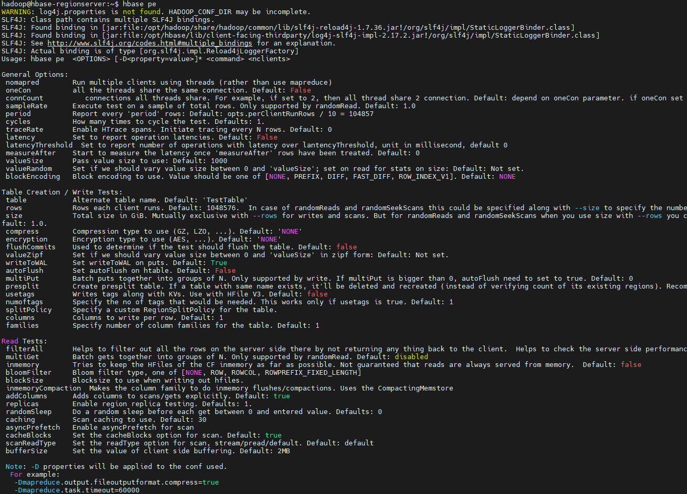

我们在使用HBase的时候，必须要能够清楚HBase服务端的性能，这对HBase的合理使用以及性能调优都非常重要，所以一般在使用HBase之前，建议做一些必要的基准性能测试，其中，读写P99/P999延时就是一项衡量HBase性能的关键指标。
本文首先介绍下HBase自带的性能测试工具——PerformanceEvaluation的使用，然后通过它压测下HBase读写路径P999延时情况。

# 一、HBase PE 参数介绍
PerformanceEvaluation，这里简称PE，全名为org.apache.hadoop.hbase.PerformanceEvaluation，是HBase自带的性能测试工具，目前主要支持HBase随机/顺序读写延时的性能测试。执行 bin/hbase pe 可直接使用：
```shell
hbase pe
```


重要参数：
- nomapred：表示采用MapReduce多线程测试还是本地多线程测试，一般采用本地多线程的方式，在命令中加上--nomapred即可；
- oneCon：是否所有线程使用一个Connection连接，默认false，表示每个线程都会创建一个HBase Connection，这样不合理，建议设置为true，命令中加--oneCon=true即可；
- valueSize：写入HBase的value的size，单位Byte，默认值为1000。需要根据实际的业务字段值的大小设置valueSize，比如--valueSize=100；
- table：测试表的名称，如果不设置则默认为TestTable；
- rows：单个线程测试的行数，默认值为1048576，实际测试时可自行制定，比如--rows=100000。注意这是单线程的行数，实际行数要乘以线程数，比如10个线程写入时就会往HBase中写100000*10=100w条记录；
- size：单个线程测试的大小，单位为GB，默认值为1，这个参数与rows是互斥的，不能同时设置；
- compress：设置表的压缩算法，默认None，表示不压缩，可以根据实际情况设置比如--compress=SNAPPY。这个设置也可以用来测试不同压缩算法对读写性能的影响；
- presplit：表的预分区数量即region个数，一般要参考regionserver数量，设置一个合理值以避免数据热点和影响测试结果，比如--presplit=10；
- autoFlush：写入操作的autoFlush属性，默认false，这里是BufferedMutator写入方式，禁用autoFlush表示会批量写入，一般建议设置为true以获得单条写的性能测试，即--autoFlush=true；
- caching：Scan读操作的caching属性，默认值为30，一般可以根据实际使用设置，比如--caching=100；


command 是PE支持的读写测试类型，包括randomRead，randomWrite，SequentialRead，SequentialWrite等，具体如上。nclients 就是开启的线程数量。


# 二、HBase 读写压测 P999
集群环境
本地 windows 24 core + 64G 内存，安装环境 wsl + docker 
搭建 https://github.com/gugxl/my-bigdata-stack

## 压测案例

这里分别测试了randomWrite、sequentialWrite，randomRead及sequentialRead的延时情况，给出当前环境下的P99及P999 latency指标供参考。

在各个测试case中，使用PE的本地多线程模式即--nomapred，测试表包含16个region，采用Snappy压缩，并且value大小为100Byte，我们相应的开了16个线程进行测试，写入测试时均关闭了autoFlush。PE运行完成后会分别打出每个线程的延迟状况，这里贴出了其中一个线程的测试结果，具体如下：

1、randomWrite

每个线程向rw_test_1表中随机写入100w条记录：
```shell
hbase pe --nomapred --oneCon=true --table=rw_test_1 --rows=1000000 --valueSize=100 --compress=LZ4 --presplit=16 --autoFlush=true randomWrite 16
```
2、sequentialWrite

每个线程向rw_test_2表中顺序写入1G数据：
```shell
hbase pe --nomapred --oneCon=true --table=rw_test_2 --size=1 --valueSize=100 --compress=SNAPPY --presplit=16 --autoFlush=true sequentialWrite 16
```

3、randomRead

以rw_test_2表为例，随机读取数据：
```shell
hbase pe --nomapred --oneCon=true --table=rw_test_2 --size=1 --valueSize=100 randomRead 16
```

4、sequentialRead

```shell
hbase pe --nomapred --oneCon=true --table=rw_test_2 --size=1 --valueSize=100 sequentialRead 16
```