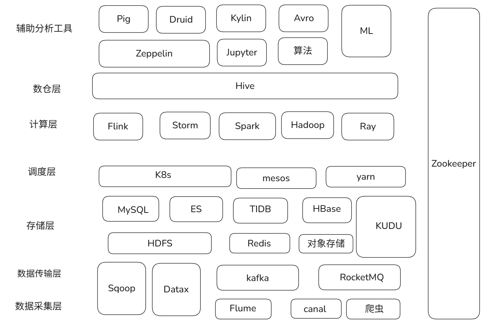
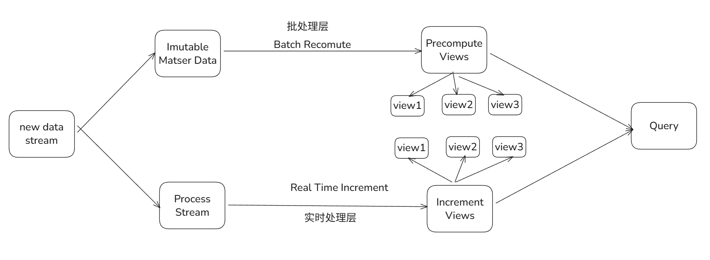
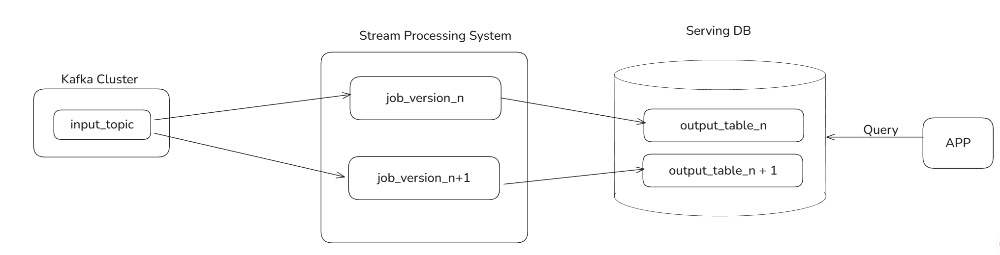
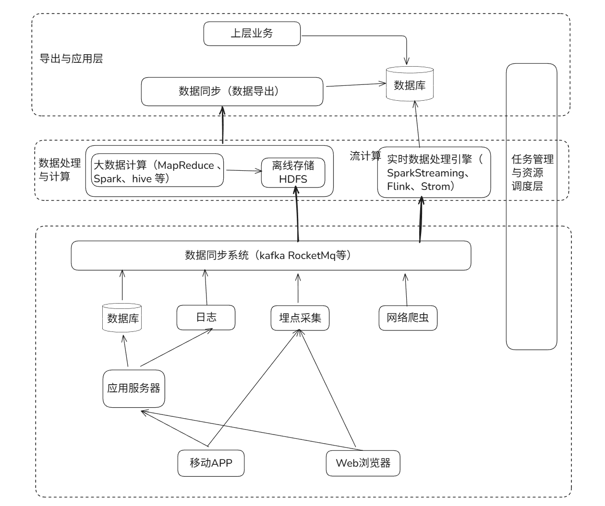
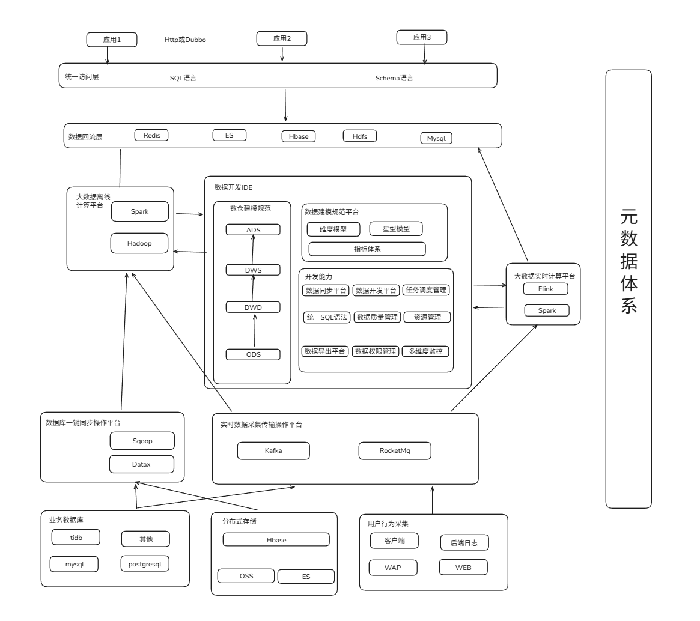
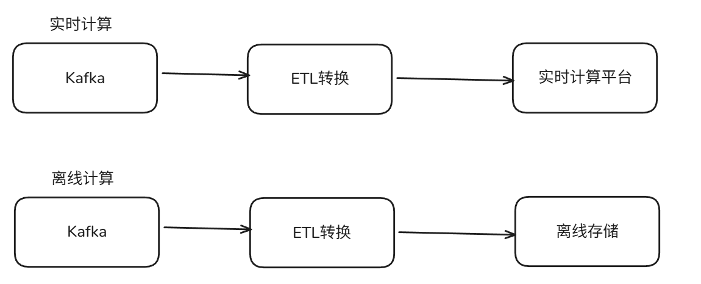
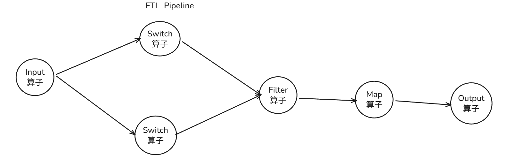
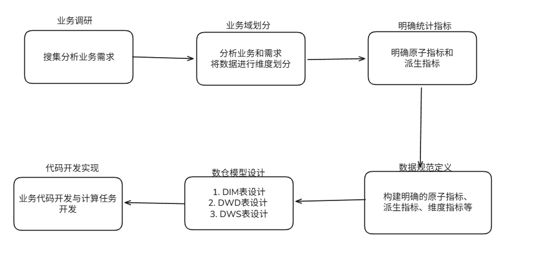

# 大数据平台架构

一、 大数据技术栈

大数据整体流程涉及很多模块，基本上可以划分数据采集、数据传输、实时计算、离线计算、大数据储存等相关模块。但是里面的技术也在不断的迭代中，常用的技术来进行举例。

# 二、lambda架构和kappa架构

目前基本上所有的大数据架构都是基于lambda和kappa架构，不同公司在这两个架构模式上设计出符合该公司的数据体系架构。lambda 架构使开发人员能够构建大规模分布式数据处理系统。它具有很好的灵活性和可扩展性，也对硬件故障和人为失误有很好的容错性，关于lambda架构可以在网上搜到很多相关文章。而kappa架构解决了lambda架构存在的两套数据加工体系，从而带来的各种成本问题，这也是目前流批一体化研究方向，很多企业已经开始使用这种更为先进的架构。

## Lambda架构

## Kappa架构

# 三、kappa架构和lambda架构下的大数据架构

目前各大公司基本上都是使用kappa架构或者lambda架构模式，这两种模式下大数据整体架构在早期发展阶段可能是下面这样的：

# 四、数据端到端痛点

虽然上述架构看起来将多种大数据组件串联起来实行了一体化管理，但是接触过数据开发的人会感受比较强烈，这样的裸露架构业务数据开发需要关注很多基础工具的使用，实际数据开发中存在很多痛点与难点，具体表现在下面一些方面。

1. 缺乏一套数据开发IDE来管理整个数据开发环节，长远的流程无法管理起来。 
2. 没有产生标准数据建模体系，导致不同数据工程师对指标理解不同计算口径有误。 
3. 大数据组件开发要求高，普通业务去直接使用Hbase、ES等技术组件会产生各种问题。 
4. 基本上每个公司大数据团队都会很复杂，涉及到很多环节，遇到问题难以定位难以找到对应负责人。 
5. 难以打破数据孤岛，跨团队跨部门数据难以共享，互相不清楚对方有什么数据。 
6. 需要维护两套计算模型批计算和流计算，难以上手开发，需要提供一套流批统一的SQL。 
7. 缺乏公司层面的元数据体系规划，同一条数据实时和离线难以复用计算，每次开发任务都要各种梳理。

基本上大多数公司在数据平台治理上和提供开放能力上都存在上述问题和痛点。在复杂的数据架构下，对于数据适用方来说，每一个环节的不清晰或者一个功能的不友好，都会让复杂链路变更更加复杂起来。想要解决这些痛点，就需要精心打磨每一个环节，将上面技术组件无缝衔接起来，让业务从端到端使用数据就像写SQL查询数据库一样简单。

# 五、优秀的大数据整体架构设计

提供多种平台以及工具来助力数据平台：多种数据源的数据采集平台、一键数据同步平台、数据质量和建模平台、元数据体系、数据统一访问平台、实时和离线计算平台、资源调度平台、一站式开发IDE。

# 六、元数据-大数据体系基石

元数据是打通数据源、数据仓库、数据应用，记录了数据从产生到消费的完整链路。元数据包含静态的表、列、分区信息(也就是MetaStore)。动态的任务、表依赖映射关系；数据仓库的模型定义、数据生命周期；以及ETL任务调度信息、输入输出等元数据是数据管理、数据内容、数据应用的基础。例如可以利用元数据构建任务、表、列、用户之间的数据图谱；构建任务DAG依赖关系，编排任务执行序列；构建任务画像，进行任务质量治理；提供个人或BU的资产管理、计算资源消耗概览等。

可以认为整个大数据数据流动都是依靠元数据来管理的，没有一套完整的元数据设计，就会出现上面的数据难以追踪、权限难以把控、资源难以管理、数据难以共享等等问题。

很多公司都是依靠hive来管理元数据，但是个人认为在发展一定阶段还是需要自己去建设元数据平台来匹配相关的架构。

# 七、流批一体化计算

如果维护两套计算引擎例如离线计算Spark和实时计算Flink，那么会对使用者造成极大困扰，既需要学习流计算知识也需要批计算领域知识。如果实时用Flink离线用Spark或者Hadoop，可以开发一套自定义的DSL描述语言去匹配不同计算引擎语法，上层使用者无需关注底层具体的执行细节，只需要掌握一门DSL语言，就可以完成Spark和Hadoop以及Flink等等计算引擎的接入。

# 八、实时与离线ETL平台

ETL 即 Extract-Transform-Load，用来描述将数据从来源端经过抽取（extract）、转换（transform）、加载（load）至目的端的过程。ETL 一词较常用在数据仓库，但其对象并不限于数据仓库。一般而言ETL平台在数据清洗、数据格式转换、数据补全、数据质量管理等方面有很重要作用。作为重要的数据清洗中间层，一般而言ETL最起码要具备下面几个功能:

1. 支持多种数据源，例如消息系统、文件系统等
2. 支持多种算子，过滤、分割、转换、输出、查询数据源补全等算子能力
3. 支持动态变更逻辑，例如上述算子通过动态jar方式提交可以做到不停服发布变更。

# 九、智能统一查询平台

大多数数据查询都是由需求驱动，一个需求开发一个或者几个接口，编写接口文档，开放给业务方调用，这种模式在大数据体系下存在很多问题：

1. 这种架构简单，但接口粒度很粗，灵活性不高，扩展性差，复用率低.随着业务需求的增加，接口的数量大幅增加，维护成本高企。
2. 同时，开发效率不高，这对于海量的数据体系显然会造成大量重复开发，难以做到数据和逻辑复用，严重降低业务适用方体验。
3. 如果没有统一的查询平台直接将Hbase等库暴露给业务，后续的数据权限运维管理也会比较难，接入大数据组件对于业务适用方同样很痛苦，稍有不慎就会出现各种问题。

通过一套智能查询解决上述大数据查询痛点问题

# 十、数仓建模规范体系

随着业务复杂度和数据规模上升，混乱的数据调用和拷贝，重复建设带来的资源浪费，数据指标定义不同而带来的歧义、数据使用门槛越来越高。实际业务埋点和数仓使用为例，同一个商品名称有些表字段是good_id,有些叫spu_id，还有很多其他命名，对于想利用这些数据人会造成极大困扰。因此没有一套完整的大数据建模体系，会给数据治理带来极大困难，具体表现在下面几个方面：

1. 数据标准不一致，即使是同样的命名，但定义口径却不一致。例如，仅uv这样一个指标，就有十几种定义。带来的问题是：都是uv，我要用哪个？都是uv，为什么数据却不一样？
2. 造成巨大研发成本，每个工程师都需要从头到尾了解研发流程的每个细节，对同样的“坑”每个人都会重新踩一遍，对研发人员的时间和精力成本造成浪费。这也是目标笔者遇到的困扰，想去实际开发提取数据太难。
3. 没有统一的规范标准管理，造成了重复计算等资源浪费。而数据表的层次、粒度不清晰，也使得重复存储严重。

因此大数据开发和数仓表设计必须要坚持设计原则，数据平台可以开发平台来约束不合理的设计，例如阿里巴巴的OneData体。一般而言，数据开发要经过按照下面的指导方针进行：

# 十一、一键集成平台

很简单的就能将各种各式数据一键采集到数据平台，通过数据传输平台将数据无缝衔接到ETL平台。ETL通过和元数据平台打通，规范Schema定义，然后将数据转换、分流流入到实时与离线计算平台，后续任何针对该数据离线和实时处理，只需要申请元数据表权限就可以开发任务完成计算。数据采集支持多种各式数据来源，例如binlog、日志采集、前端埋点、kafka消息队列等

# 十二、数据开发IDE-高效的端到端工具

高效的数据开发一站式解决工具，通过IDE可以完成实时计算与离线计算任务开发，将上述平台全部打通提供一站式解决方案。数据开发IDE提供数据集成、数据开发、数据管理、数据质量和数据服务等全方位的产品服务，一站式开发管理的界面，通过数据IDE完成对数据进行传输、转换和集成等操作。从不同的数据存储引入数据，并进行转化和开发，最后将处理好的数据同步至其他数据系统。通过高效率的大数据开发IDE，基本上让大数据工程师可以屏蔽掉各种痛点，将上述多种平台能力结合起来，让大数据开发可以向写SQL一样简单。

例如阿里云的dataworks

# 其他

完整的数据体系研发还包括告警与监控中心、资源调度中心、资源计算隔离、数据质量检测、一站式数据加工体系。