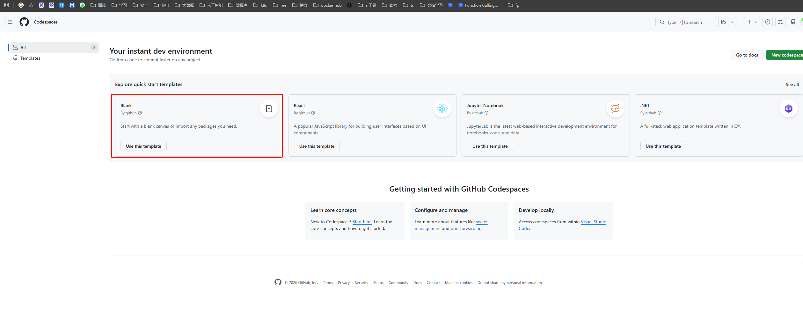
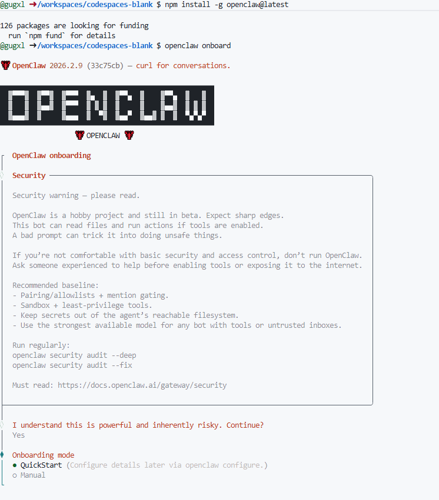

一、免费的服务器
感谢伟大的github为我们提供免费的资源！

访问：https://github.com/codespaces

点击上面箭头按钮，就会打开一个编辑器：

在线版vscode

关键就在于，他还是有【终端】的，说明是可以运行脚本的。

node -v 

查看版本

执行openclaw安装 

npm install -g openclaw@latest

输入

openclaw onboard

进入openclaw页面

