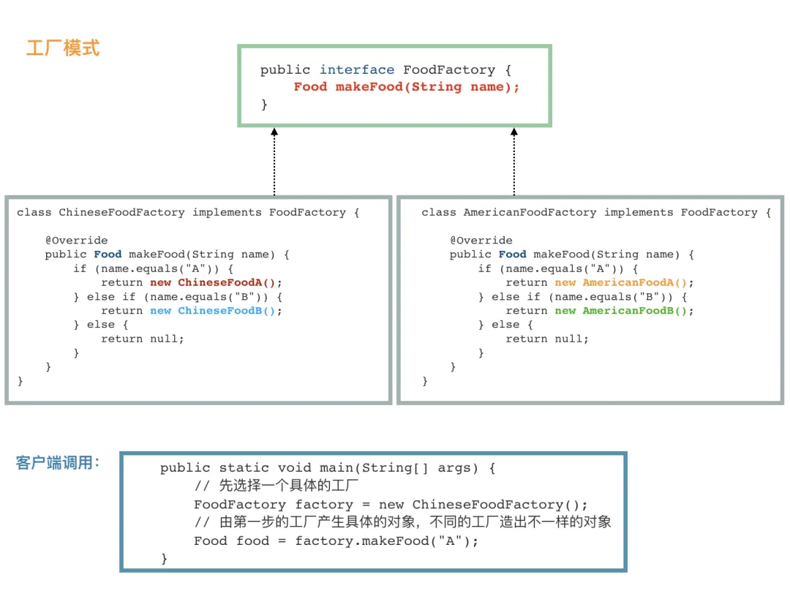

# 基本设计原则
1. 面向接口编程，而不是面向实现。这个很重要，也是优雅的、可扩展的代码的第一步，这就不需要多说了吧。  
2. 职责单一原则。每个类都应该只有一个单一的功能，并且该功能应该由这个类完全封装起来。  
3. 对修改关闭，对扩展开放。对修改关闭是说，我们辛辛苦苦加班写出来的代码，该实现的功能和该修复的 bug 都完成了，别人可不能说改就改；对扩展开放就比较好
理解了，也就是说在我们写好的代码基础上，很容易实现扩展。   
创建型模式比较简单，但是会比较没有意思，结构型和行为型比较有意思。 大部分设计模式都会跟上面的原则有所关联 。


# 01、创建型模式

创建型模式的作用就是创建对象，说到创建一个对象，最熟悉的就是 new 一个对象，然后 set 相关属性。但是，在很多场景下，我们需要给客户端提供更加友好的创建
对象的方式，尤其是那种我们定义了类，但是需要提供给其他开发者用的时候。

# 02、简单工厂模式
和名字一样简单，非常简单，直接上代码吧：

```java
public class FoodFactory {

    public static Food makeFood(String name) {
        if (name.equals("noodle")) {
            Food noodle = new LanZhouNoodle();
            noodle.addSpicy("more");
            return noodle;
        } else if (name.equals("chicken")) {
            Food chicken = new HuangMenChicken();
            chicken.addCondiment("potato");
            return chicken;
        } else {
            return null;
        }
    }
}
```
其中，_LanZhouNoodle_ 和 _HuangMenChicken_ 都继承自 _Food_。

简单地说，简单工厂模式通常就是这样，一个工厂类 XxxFactory，里面有一个静态方法，根据我们不同的参数，返回不同的派生自同一个父类（或实现同一接口）的实例对象。

> 我们强调职责单一原则，一个类只提供一种功能，FoodFactory 的功能就是只要负责生产各种 Food。

# 03、工厂模式

简单工厂模式很简单，如果它能满足我们的需要，我觉得就不要折腾了。之所以需要引入工厂模式，是因为我们往往需要使用两个或两个以上的工厂。
```java
public interface FoodFactory {
    Food makeFood(String name);
}

public class ChineseFoodFactory implements FoodFactory {

    @Override
    public Food makeFood(String name) {
        if (name.equals("A")) {
            return new ChineseFoodA();
        } else if (name.equals("B")) {
            return new ChineseFoodB();
        } else {
            return null;
        }
    }
}

public class AmericanFoodFactory implements FoodFactory {

    @Override
    public Food makeFood(String name) {
        if (name.equals("A")) {
            return new AmericanFoodA();
        } else if (name.equals("B")) {
            return new AmericanFoodB();
        } else {
            return null;
        }
    }
}
```

其中，ChineseFoodA、ChineseFoodB、AmericanFoodA、AmericanFoodB 都派生自 Food。

客户端调用：

```java
public class APP {
    public static void main(String[] args) {
        // 先选择一个具体的工厂
        FoodFactory factory = new ChineseFoodFactory();
        // 由第一步的工厂产生具体的对象，不同的工厂造出不一样的对象
        Food food = factory.makeFood("A");
    }
}
```
虽然都是调用 makeFood("A")  制作 A 类食物，但是，不同的工厂生产出来的完全不一样。

第一步，我们需要选取合适的工厂，然后第二步基本上和简单工厂一样。

核心在于，我们需要在第一步选好我们需要的工厂。比如，我们有 LogFactory 接口，实现类有 FileLogFactory 和 KafkaLogFactory，分别对应将日志写入文件
和写入 Kafka 中，显然，我们客户端第一步就需要决定到底要实例化 FileLogFactory 还是 KafkaLogFactory，这将决定之后的所有的操作。

虽然简单，不过我也把所有的构件都画到一张图上，这样读者看着比较清晰：

