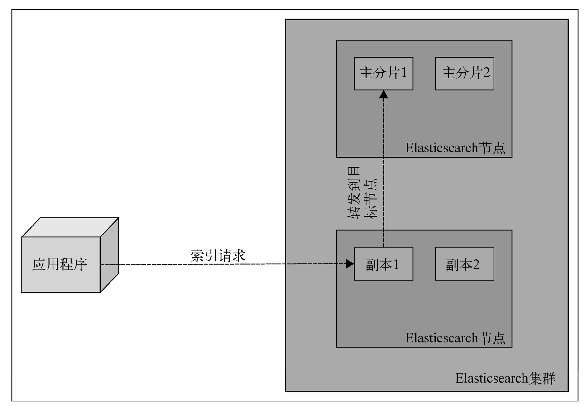
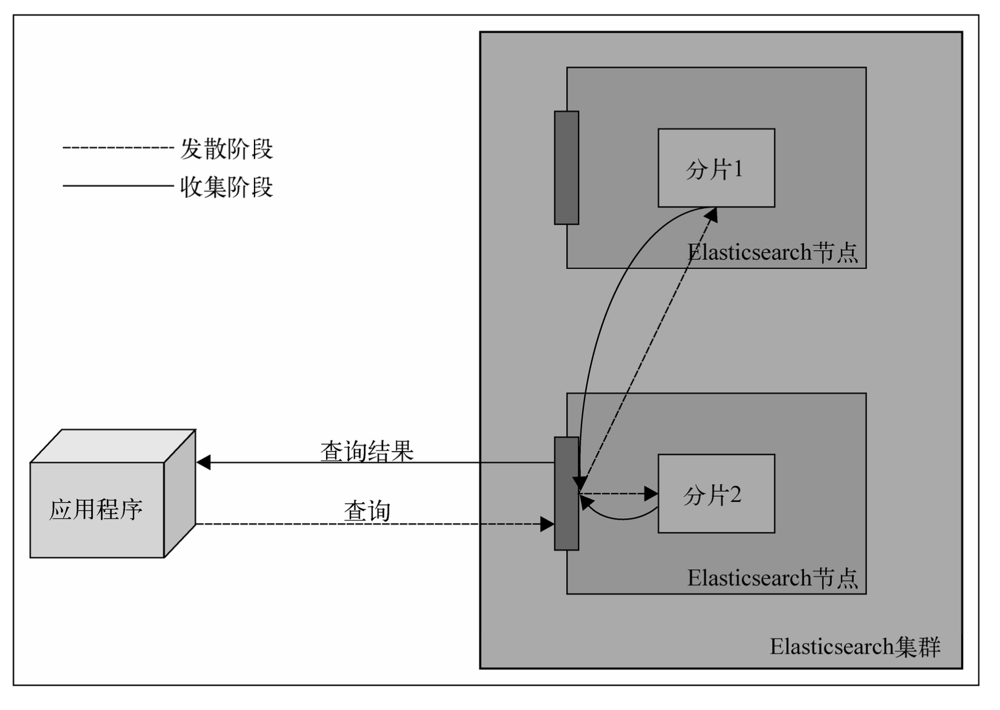

# 第一章 Elasticsearch

## 1.1 全文检索

### 1.1.1 Lucene词汇表和架构
**文档**(document): 索引和搜索时使用的主要数据载体,包含一个或多个存在数据的字段
**字段**(field): 文档的一部分,包含名称和值两部分
**词**(term): 一个搜索单元,表示文件中的一个词
**标记/词元**(token): 表示在字段文本中出现的词,由这个词的文本、开始和结束偏移量以及类型组成.

**倒排索引**

索引额外文件包含了词向量(term vector)、文档值(doc value).

每个索引分为多个"写一次、读多次(write once and read many time)"的段(segment).建立索引时,一个段写入磁盘后就不能再更新.因此被删除的文档信息存储在一个单独的文件中, 单该段自身不能被更新.

然而多个段可以通过**段合并(segment merge)**合并在一起.当强制段合并或者Lucene决定合并时,这些小段就会由Lucene合并成更大的一些段.合并需要I/O. 在合并时,不在需要的信息会被删除(例如,被删除的文档).除此之外,检索大段必检索存在相同数据的多个小段的速度更快.在一般情况下,搜索只需要将查询词与那些编入索引的词相匹配.通过多个小段寻找和合并结果,显然会比让一个大段直接提供结果慢的多.

### 1.1.2 输入数据分析

输入的文档和查询的文本都要转换成可以被搜索的词.这个转换过程称为**分析**.这个过程我们一般需求会要经过语言分析处理,使得car和cars在索引中被视为是一个, 另外以往一些字段只用空格或者小写进行划分.

分析的工作有**分析器**完成,它由零到多个字符过滤器(Char Filters)加上一个分词器(Tokenizer)和零到多个标记过滤器(Token Filters)组成.

原始文本 -> 字符过滤器(Char Filters) -> 分词器(Tokenizer) -> 标记过滤器(Token Filters) -> 标记流(Token Stream)

常见的过滤器
1. **小写过滤器(lowercase filter)**: 将所有输入的词转换为小写.
2. **同义词过滤器(synonyms filter)**: 基于基本的同义词规则,把一个标记换成另外一个同义的标记. 
3. **多语言词干提取过滤器(multiple language stemming filter)**:减小标记(实际上是标记中的文本部分),得到词根或者基本形式,即词干.

过滤器是一个接一个处理的的,所以我们通过使用多个过滤器,可以拓展分析的可能性.

#### 索引和查询
建立索引时,Lucene会使用你选择的分析器来处理你的文档内容.不同的字段可以使用不同的分析器,所以文档的名称字段可以和汇总字段做不通的分析.也可以不分析字段.

查询时,查询将被分析.但是也可以选择不分析.例如前缀和词查询不被分析,匹配查询被分析.可以在被分析和查询和不被分析查询两者中选择非常有用.例如我么查询LightRed这个词,标准分析器分析这个查询后,会去查询light和red,如果我们使用不经分析的查询类型,则会明确的查询LightRed这个词.

在索引和查询分析中,索引应该和查询次匹配.如果不匹配,Lucene不会返回所需的文档.例如在建立索引的时候使用了词干提取和小写,那你应该保证查询中的词也必须是词干和小写、 否则,Lucene将不会返回任何结果..重要的是在索引和查询分析时,对所用的标记过滤器保持相同的顺序,这样分析出来的词也是一样的.

### 1.1.3 评分和查询相关性
评分(scoring),是根据文档和查询的匹配度用计分工时计算的结果.默认情况下Lucene使用TF/IDF(term frequency/inverse document frequency, 词频/逆向文档频率)评分机制.也会有其他评分办法. 评分越高,文档越相关.

## 1.2 ElasticSearch基础

### 1.2.1 数据架构的主要概念

#### 1. 索引
索引(index)是Elasticsearch对逻辑数据的逻辑存储,所以他可以分为更小的部分.可以把索引 看成关系数据库中的表.但是索引中的结果是为了快速有效的全文索引准备的, 它不存储原始值[注意:原书描述是错误的].(默认_source是开启的,存储的是原始值,但是可以关闭)

> 关闭_source影响
> 1. 不能使用_reindex写入新索引 
> 2. 不能使用_update和script update
> 3. 不能使用 _get 或 fields: _source 获取完整文档
> 4. 不能支持高亮（highlight）默认行为
> 5. 无法使用 _source 过滤返回字段
> 6. 不能使用 painless 脚本引用 ctx._source

#### 2. 文档
存储在Elasticsearch中的主要实体叫文档(document) 。类比与关系数据库中的一行记录,在Elasticsearch中,相同的**字段**必须是相同的类型,否则会报错.
> 如果我们不指定字段的类型,那么这个值第一次来的时候会进行推断,作为这个字段的类型,如果后续数据跟当前的不一致的会报错.
> 如果之前没有某个字段,后续插入的时候新出现了字段,默认情况下是会自动推断类型并且不报错的,但是我们关闭了 动态映射关闭（dynamic: false）就会报错
> 一种比较好的习惯是我们主动定义mapping,对于不确定的字段可以使用text或keyword 或者使用dynamic_templates

文档由多个字段组成,每个字段可能多次出现在一个文档中,这样的字段叫**多值字段(multivalued)**.每个字段都有类型,如文本、数值、日期.也可以是复杂类型,

#### 3. 文档类型 已经废弃

#### 4. 映射
主要是描述输入文本的内容格式， 定义了Elasticsearch怎么处理这些字段

### 1.2.2 Elasticsearch 主要概念

1. 节点和集群
Elasticsearch可以作为单个节点运行，也可以运行多个相互协作的服务器上。这些服务器称为集群（cluster），形成集群的每个服务器称为节点（node）

2. 分片
当有大量文档的时候，由于内存的限制、硬盘的能力、处理能力的不足、无法足够快的响应客户端请求。这种情况下，数据可以分为比较小的分片（shard）的部分 （每个分片都是一个独立的 apache Lucene索引）。每个分片可以存放在不同的服务器上，因此数据可以在集群中的节点传播。当查询的数据分布在不同的节点上， Elasticsearch会把查询发送给每个相关的分片，并将结果合并到一起，而应用程序不知道分片的存在。此外多个分片可以加快索引。

3. 副本
为了提高查询的吞吐量或实现高可用，可以使用分片副本。副本（replica）只是一个分片的精确复制，每个分片可以有零个或多个副本。elasticsearch会有很多相同的分片，其中的一个被选择为主分片（primary shard），复制更改索引操作，其余的为副本分片（replica shard）。在主分片丢失时，例如所在的服务器不可用的时候，集群将副本提升为新的主分片。

### 1.2.3 索引的建立和搜索

elasticsearch会帮我们找到对应的索引处理请求

发送一个新文档给集群的时候，你指定一个目标索引并发送他给任意一个节点。这个节点知道目标索引有多少个分片，并且知道那个分片用来存储你的文档。 Elasticsearch使用文档的唯一标识符，来计算文档应该放到哪一个分片中。索引请求发送到一个节点后，该节点会转发文档到持有相关分片的目标节点中。

elasticsearch执行搜索请求


尝试使用文档标识获取文档时，发送查询到一个节点，该节点使用同样的路由算法来决定持有文档的节点和分片，然后转发查询，获取结果，并把结果转发给你。 查询的过程更为复杂。除非使用了路由，查询将直接转发到单个分片，否则，收到查询请求的节点会把查询转发给保存了属于给定索引分片的所有节点，并要求与查询匹配的文档的最少信息（默认情况下时标识符和得分）。这个阶段称为发散阶段（scatter phase）。收到这些信息后，该聚合节点（收到客户端请求的节点） 对结果进行排序，并发送第二个请求来获取结果列表的所需的文档（除标识符和得分以外其他的全部信息）。这个阶段称为收集阶段（gather phase）。这个阶段完成后，把数据返回给客户端。
    
## 1.3 安装并配置集群
不再赘述

目录作用说明

| 目录 | 描述 |
| ---- | ----- |
| bin | 运行elasticsearch实例和插件管理所需要的脚本 |
| config | 配置目录 |
| lib | Elasticsearch 使用的库 |
| data | 数据存储目录 |
| logs | 事件和错误记录的目录 |
| plugins | 存储安装插件的目录 |
| work  | 临时文件路径 |


### 1.4.3 新建文档

使用kibana 请求
```http request
PUT /blog/_doc/1
{
    "title": "New version of Elasticsearch released!",
    "content": "Version 1.0 released today!",
    "tags": [
        "announce",
        "elasticsearch",
        "release"
    ]
}
```
返回结果
```json
{
"_index": "blog",
"_id": "1",
"_version": 2,
"result": "updated",
"_shards": {
"total": 2,
"successful": 1,
"failed": 0
},
"_seq_no": 1,
"_primary_term": 1
}
```
说明: _id 文档唯一标识
_version 文档版本,递增


使用 curl请求

```
curl -XPUT http://localhost:9200/blog/_doc/1 -d '{"title": "New version of Elasticsearch released!", "content": "Version 1.0 released today!", "tags": ["announce",
"elasticsearch", "release"] }'
```

其中 1 是文档标识符,是我们指定的,也可以自动生成,其中PUT请求必须指定标识符,自动生成的使用POST请求,重复请求内容会生成多个文档

eg:自动创建标识符
```http request
POST /blog/_doc
{
    "title": "New version of Elasticsearch released!",
    "content": "Version 1.0 released today!",
    "tags": [
        "announce",
        "elasticsearch",
        "release"
    ]
}
```

返回结果
```json
{
"_index": "blog",
"_id": "SoXdL5gBB4N0GQW8y-Wx",
"_version": 1,
"result": "created",
"_shards": {
"total": 2,
"successful": 1,
"failed": 0
},
"_seq_no": 2,
"_primary_term": 1
}
```

### 1.4.4 检索文档
```http request
GET /blog/_doc/1
```
返回结果
```json
{
  "_index": "blog",
  "_id": "1",
  "_version": 2,
  "_seq_no": 1,
  "_primary_term": 1,
  "found": true,
  "_source": {
    "title": "New version of Elasticsearch released!",
    "content": "Version 1.0 released today!",
    "tags": [
      "announce",
      "elasticsearch",
      "release"
    ]
  }
}
```
会发现有新的字段_source 存储了原始的数据
found : true 表示文档存在

如果查找的文档不存在,结果如下
```json
{
  "_index": "blog",
  "_id": "2",
  "found": false
}
```

### 1.4.5 更新文档
更新索引内部的文档比较复杂.首先Elasticsearch必须先获取文档,从_source属性获取数据,删除旧的文件,更改_sources属性,然后把它作为新的文档来索引.因为信息一旦在Lucene的倒排索引中存储就不能修改.Elasticsearch通过一个带_update参数的脚本来实现.这样就可以做比较简单的修改字段

修改content字
```http request
POST /blog/_update/1
{
"script": "ctx._source.content = \"new content\""
}
```
返回结果
```json
{
  "_index": "blog",
  "_id": "1",
  "_version": 3,
  "result": "updated",
  "_shards": {
    "total": 2,
    "successful": 1,
    "failed": 0
  },
  "_seq_no": 3,
  "_primary_term": 1
}
```

修改的时候不需要发送整个文档,但是当我们使用更新功能的时候需要使用_source字段.

当我们更新文档的时候,可以设置一个值用来处理文档中没有该字段的情况.例如,想增加文档中的counter字段，而该字段不存在，可以使用upsert来提供字段的默认值.
```http request
POST /blog/_update/1
{
  "script": {
    "source": "ctx._source.counter = (ctx._source.counter != null ? ctx._source.counter + 1 : 1)"
  },
  "upsert": {
    "counter": 0
  }
}
```

注意如果不判空的时候会报错,upsert 是处理 文档不存在的时候

### 1.4.6 删除文档
删除文档
```http request
DELETE /blog/_doc/1
```
返回结果
```json
{
  "_index": "blog",
  "_id": "1",
  "_version": 3,
  "result": "deleted",
  "_shards": {
    "total": 2,
    "successful": 1,
    "failed": 0
  },
  "_seq_no": 9,
  "_primary_term": 1
}
```

### 1.4.7 版本控制
"_version" : 1 这个字段的值是版本号,这个版本号是递增的.默认情况下,在Elasticsearch中添加、修改或者删除的时候都会递增版本号.除了能够记录更该的次数, 还能够实现乐观锁(optimistic locking).

例如:
```http request
DELETE /blog/_doc/1?version=1&version_type=external
```
说明: version 参数指定了当前文档的版本号,如果文档的版本号和参数指定的版本号不一致,则返回409错误.
_version_type_ 参数指定了版本号类型,可选值有external,internal,external_gt,external_gte. 默认值是internal[内部]

返回结果
```json
{
"error": {
"root_cause": [
{
"type": "version_conflict_engine_exception",
"reason": "[1]: version conflict, current version [2] is higher or equal to the one provided [1]",
"index_uuid": "zh9XTX6hTLqvrl2ZG-CKow",
"shard": "0",
"index": "blog"
}
],
"type": "version_conflict_engine_exception",
"reason": "[1]: version conflict, current version [2] is higher or equal to the one provided [1]",
"index_uuid": "zh9XTX6hTLqvrl2ZG-CKow",
"shard": "0",
"index": "blog"
},
"status": 409
}
```


其他说明:
如果使用下面的
```http request
DELETE /blog/_doc/1?version=1
```
会报错
```json
{
"error": {
"root_cause": [
{
"type": "action_request_validation_exception",
"reason": "Validation Failed: 1: internal versioning can not be used for optimistic concurrency control. Please use if_seq_no and if_primary_term instead;"
}
],
"type": "action_request_validation_exception",
"reason": "Validation Failed: 1: internal versioning can not be used for optimistic concurrency control. Please use if_seq_no and if_primary_term instead;"
},
"status": 400
}
```
但是在7.x之后的版本使用if_seq_no 和 if_primary_term 实现乐观并发控制

如果需要创建的时候制定版本号
```http request
PUT /blog/_doc/1?version=999&version_type=external
{
"title": "New version of Elasticsearch released!",
"content": "Version 1.0 released today!",
"tags": [
"announce",
"elasticsearch",
"release"
]
}
```
> 即使文档被移除后,短时间内Elasticsearch仍然可以检查版本号,Elasticsearch保留了删除文档的版本信息.默认情况下,这个信息在60s可用.可以通过修改index.gc_deletes配置修改这个值

## 1.5 使用URI请求查询检索

### 1.5.1 示例数据

```http request
POST /books/_doc/1
{
  "category": "es",
  "title": "Elasticsearch Server",
  "published": 2023
}


POST /books/_doc/2
{
  "category": "es",
  "title": "Mastering Elasticsearch",
  "published": 2023
}

POST /books/_doc/3
{
  "category": "solr",
  "title": "Mastering Elasticsearch",
  "published": 2025
}
```

> ES从8.x彻底取消type,可以使用字段进行区分,或者使用不同的索引,可以减少mapping冲突

查询索引的mapping映射
```http request
GET /books/_mapping?pretty
```
返回结果

```json
{
  "books": {
    "mappings": {
      "properties": {
        "category": {
          "type": "text",
          "fields": {
            "keyword": {
              "type": "keyword",
              "ignore_above": 256
            }
          }
        },
        "published": {
          "type": "long"
        },
        "title": {
          "type": "text",
          "fields": {
            "keyword": {
              "type": "keyword",
              "ignore_above": 256
            }
          }
        }
      }
    }
  }
}
```

### 1.5.2 URI 请求
Elasticsearch的所有查询都会发送到_search端点.可以搜索单个或多个索引
```http request
GET /books/_search?pretty
```

也可以对多个索引执行一个查询

```http request
GET /books,blog/_search?pretty
```
也可以使用通配符来进行索引名称匹配
```http request
GET /b*/_search?pretty
```
也可以不指定索引,匹配所有索引
```http request
GET /_search?pretty
```

1. Elasticsearch查询响应
假如在books索引中title字段中包含elasticsearch一词中的所有文档
```http request
GET /books/_search?pretty&q=title:elasticsearch
```

返回结果
```json
{
  "took": 15,
  "timed_out": false,
  "_shards": {
    "total": 1,
    "successful": 1,
    "skipped": 0,
    "failed": 0
  },
  "hits": {
    "total": {
      "value": 3,
      "relation": "eq"
    },
    "max_score": 0.13353139,
    "hits": [
      {
        "_index": "books",
        "_id": "1",
        "_score": 0.13353139,
        "_source": {
          "category": "es",
          "title": "Elasticsearch Server",
          "published": 2023
        }
      },
      {
        "_index": "books",
        "_id": "2",
        "_score": 0.13353139,
        "_source": {
          "category": "es",
          "title": "Mastering Elasticsearch",
          "published": 2023
        }
      },
      {
        "_index": "books",
        "_id": "3",
        "_score": 0.13353139,
        "_source": {
          "category": "solr",
          "title": "Mastering Elasticsearch",
          "published": 2025
        }
      }
    ]
  }
}
```

响应的第一部分展示了请求花费多少时间(took属性,单位是毫秒),有没有超时属性(timed_out属性),执行请求时查询的分片信息,包括查询的分片的数量(_shards对象的total属性)、成功返回结果的分片数量(_shards对象的successful属性)、失败的分片数量(_shards.failed属性)、忽略的分片数量(_shards.skipped属性,执行 跨索引或者跨分片查询时，有多少个 shard 被跳过（未参与搜索）)。

可以使用timeout参数来指定查询的最大执行时间,失败的分片可能是分片出问题或者执行搜索时不可用.

hits里面包含我们使用的结果.查询返回的文档总数(total属性)和计算所得订单最高分(max_score属性),还有包含返回文档的hits数组.每个返回的文档包含索引(_index属性)、标识符(_id属性)、分数(_score属性)以及_source字段.

2. 查询分析
上面的例子中,使用"Elasticsearch"建立索引,然后使用"elasticsearch"来执行查询,虽然大小写不同,但是还能找到相关文档,原因是查询分析.在建立索引时,底层的Lucene库会根据Elasticsearch配置文件分析文档并建立索引数据.默认情况下,Elasticsearch会告诉Lucene对基于字符串的数据和数字都做索引和分析.查询结果也一样,URI的查询会映射到query_string查询,Elasticsearch会分析它.

使用索引分析API(indices analyze API)可以查看分析过程是什么样的,建立索引时发生了什么,在查询阶段又发生了什么.
```http request
GET /books/_analyze
{
  "text": "Elasticsearch Server"
}
```
返回结果
```json
{
  "tokens": [
    {
      "token": "elasticsearch",
      "start_offset": 0,
      "end_offset": 13,
      "type": "<ALPHANUM>",
      "position": 0
    },
    {
      "token": "server",
      "start_offset": 14,
      "end_offset": 20,
      "type": "<ALPHANUM>",
      "position": 1
    }
  ]
}
```

可以看到Elasticsearch把文本划分为两个词,第一个标记值(token value)为elasticsearch,第二个标记值为server.

下面看看查询文本是如何被分析的
```http request
GET /books/_analyze?pretty
{
  "text": "elasticsearch"
}
```
返回结果
```json
{
  "tokens": [
    {
      "token": "elasticsearch",
      "start_offset": 0,
      "end_offset": 13,
      "type": "<ALPHANUM>",
      "position": 0
    }
  ]
}
```
可以看到,这个词和传到查询的原始值是一样的. 分析之后的索引词和分析之后查询词是一样的,因此该文档与查询匹配并作为结果返回.

3. URI查询中的字符参数

查询参数间使用&作为分割符
- 查询 参数q用来指定希望文件匹配的查询条件,eg q=title:elasticsearch
- 默认查询字段 参数df用来指定默认查询字段,默认是_all字段,eg df=title
- 分析器 参数analyzer用来指定查询分析器名称.默认情况下,索引阶段对字段内容做分析的分析器将用来分析我们的查询
- 默认操作符 参数default_operator用来指定查询中的默认操作符可以是OR或AND,用来指定查询的默认布尔运算符.默认是OR,只要有一个条件匹配就返回文档.
- 查询解释 如果将explain参数设置为true,Elasticsearch会返回查询的详细解释信息,如文档是在哪个分片上获取的、计算得分的详细信息.但是不要在正常的查询上设置explain会影响性能

```http request
GET /books/_search?pretty&q=title:elasticsearch&df=title&analyzer=standard&default_operator=AND&explain=true
```
返回结果
```json
{
  "took": 7,
  "timed_out": false,
  "_shards": {
    "total": 1,
    "successful": 1,
    "skipped": 0,
    "failed": 0
  },
  "hits": {
    "total": {
      "value": 3,
      "relation": "eq"
    },
    "max_score": 0.13353139,
    "hits": [
      {
        "_shard": "[books][0]",
        "_node": "_TQP_g3ORGu4qozsEApJbw",
        "_index": "books",
        "_id": "1",
        "_score": 0.13353139,
        "_source": {
          "category": "es",
          "title": "Elasticsearch Server",
          "published": 2023
        },
        "_explanation": {
          "value": 0.13353139,
          "description": "weight(title:elasticsearch in 0) [PerFieldSimilarity], result of:",
          "details": [
            {
              "value": 0.13353139,
              "description": "score(freq=1.0), computed as boost * idf * tf from:",
              "details": [
                {
                  "value": 2.2,
                  "description": "boost",
                  "details": []
                },
                {
                  "value": 0.13353139,
                  "description": "idf, computed as log(1 + (N - n + 0.5) / (n + 0.5)) from:",
                  "details": [
                    {
                      "value": 3,
                      "description": "n, number of documents containing term",
                      "details": []
                    },
                    {
                      "value": 3,
                      "description": "N, total number of documents with field",
                      "details": []
                    }
                  ]
                },
                {
                  "value": 0.45454544,
                  "description": "tf, computed as freq / (freq + k1 * (1 - b + b * dl / avgdl)) from:",
                  "details": [
                    {
                      "value": 1,
                      "description": "freq, occurrences of term within document",
                      "details": []
                    },
                    {
                      "value": 1.2,
                      "description": "k1, term saturation parameter",
                      "details": []
                    },
                    {
                      "value": 0.75,
                      "description": "b, length normalization parameter",
                      "details": []
                    },
                    {
                      "value": 2,
                      "description": "dl, length of field",
                      "details": []
                    },
                    {
                      "value": 2,
                      "description": "avgdl, average length of field",
                      "details": []
                    }
                  ]
                }
              ]
            }
          ]
        }
      },
      {
        "_shard": "[books][0]",
        "_node": "_TQP_g3ORGu4qozsEApJbw",
        "_index": "books",
        "_id": "2",
        "_score": 0.13353139,
        "_source": {
          "category": "es",
          "title": "Mastering Elasticsearch",
          "published": 2023
        },
        "_explanation": {
          "value": 0.13353139,
          "description": "weight(title:elasticsearch in 0) [PerFieldSimilarity], result of:",
          "details": [
            {
              "value": 0.13353139,
              "description": "score(freq=1.0), computed as boost * idf * tf from:",
              "details": [
                {
                  "value": 2.2,
                  "description": "boost",
                  "details": []
                },
                {
                  "value": 0.13353139,
                  "description": "idf, computed as log(1 + (N - n + 0.5) / (n + 0.5)) from:",
                  "details": [
                    {
                      "value": 3,
                      "description": "n, number of documents containing term",
                      "details": []
                    },
                    {
                      "value": 3,
                      "description": "N, total number of documents with field",
                      "details": []
                    }
                  ]
                },
                {
                  "value": 0.45454544,
                  "description": "tf, computed as freq / (freq + k1 * (1 - b + b * dl / avgdl)) from:",
                  "details": [
                    {
                      "value": 1,
                      "description": "freq, occurrences of term within document",
                      "details": []
                    },
                    {
                      "value": 1.2,
                      "description": "k1, term saturation parameter",
                      "details": []
                    },
                    {
                      "value": 0.75,
                      "description": "b, length normalization parameter",
                      "details": []
                    },
                    {
                      "value": 2,
                      "description": "dl, length of field",
                      "details": []
                    },
                    {
                      "value": 2,
                      "description": "avgdl, average length of field",
                      "details": []
                    }
                  ]
                }
              ]
            }
          ]
        }
      },
      {
        "_shard": "[books][0]",
        "_node": "_TQP_g3ORGu4qozsEApJbw",
        "_index": "books",
        "_id": "3",
        "_score": 0.13353139,
        "_source": {
          "category": "solr",
          "title": "Mastering Elasticsearch",
          "published": 2025
        },
        "_explanation": {
          "value": 0.13353139,
          "description": "weight(title:elasticsearch in 0) [PerFieldSimilarity], result of:",
          "details": [
            {
              "value": 0.13353139,
              "description": "score(freq=1.0), computed as boost * idf * tf from:",
              "details": [
                {
                  "value": 2.2,
                  "description": "boost",
                  "details": []
                },
                {
                  "value": 0.13353139,
                  "description": "idf, computed as log(1 + (N - n + 0.5) / (n + 0.5)) from:",
                  "details": [
                    {
                      "value": 3,
                      "description": "n, number of documents containing term",
                      "details": []
                    },
                    {
                      "value": 3,
                      "description": "N, total number of documents with field",
                      "details": []
                    }
                  ]
                },
                {
                  "value": 0.45454544,
                  "description": "tf, computed as freq / (freq + k1 * (1 - b + b * dl / avgdl)) from:",
                  "details": [
                    {
                      "value": 1,
                      "description": "freq, occurrences of term within document",
                      "details": []
                    },
                    {
                      "value": 1.2,
                      "description": "k1, term saturation parameter",
                      "details": []
                    },
                    {
                      "value": 0.75,
                      "description": "b, length normalization parameter",
                      "details": []
                    },
                    {
                      "value": 2,
                      "description": "dl, length of field",
                      "details": []
                    },
                    {
                      "value": 2,
                      "description": "avgdl, average length of field",
                      "details": []
                    }
                  ]
                }
              ]
            }
          ]
        }
      }
    ]
  }
}
```
- 返回字段 默认情况下,返回每个文档中, Elasticsearch将包含索引名称、文档标识符、得分和_source字段. 可以通过添加field参数并指定一个逗号分割的字段名称列表. 这些字段将在存储字段或内部的_source字段中检索.默认参数值是_source.举例: field=title
- 结果排序 通过sort参数,可以自定义排序. 默认是按照得分降序排列.例如: sort=published:desc,如果自定义排序,Elasticsearch将省略计算文档的_score字段. 如果既要排序,又要计算文档的_score字段,可以通过设置track_scores参数为true.
- 搜索超时 默认情况下没有查询超时.按时我们可以通过timeout参数设置查询超时.例如: timeout=5s
- 查询结果窗口 通过from和size参数,可以指定查询结果窗口.例如: from=0,size=10,可以完成分页功能
- 搜索类型 通过search_type参数,可以指定搜索类型.默认是query_then_fetch[查询后获取]. dfs_query_then_fetch.其他的基本弃用了.

| 搜索类型 | 	是否执行 DFS（全局词频统计） | 排序准确性 | 描述                  |
| --- |-------------------|-------|---------------------|
| query_then_fetch | 否                 | 中     | 默认搜索类型,默认高效搜索,先执行查询,再获取结果 |
| dfs_query_then_fetch | 是                 | 高     | 对 score 极度敏感时用（如广告推荐） |

- 小写扩展词 一些查询使用的查询扩展,比如前缀查询(prefix  query),可以使用lowercase_expanded_terms属性来定义扩展词是否应该转换为小写.默认是true.
- 分析通配符和前缀 默认情况下,通配符查询和前缀查询不会被分析.如果要更改,可以吧analyze_wildcard属性设置为true.

### 1.5.3 Lucene查询语法

完整语法地址:https://lucene.apache.org/core/10_2_2/queryparser/org/apache/lucene/queryparser/classic/package-summary.html

传入Lucene的查询被查询解析器分为词(term)和操作符(operator).词可以有两种类型:单词和短语.eg: title:book 短语 title:"elasticsearch book" Lucene查询语法支持操作符. 操作符+告诉Lucene给定部分必须在文档中匹配.操作符-相反,这一部分不能出现在文档中.即没有+也没有-的话是可以匹配、但是非强制性的查询.所以想找titl字段包含book但是description字段不包含cat的文档可以 +title:book -description:cat. 也可以使用括号来组合多个词 title:(crime punishment)还可以使用^操作符接上一个值来助推(boost)一个词,如 title:book^4 

# 2 索引

## 2.1 Elasticsearch索引

### 2.1.1 分片和副本

Elasticsearch索引是由一个或多个分片组成,每个分片包含了文档集的一部分.并且这些分片可以有副本.在创建索引的时候,可以规定应创建的分片和副本的数量. 默认使用的是全局配置文件(elasticsearch.yml)定义的默认值,或者是内部的默认值.

一般情况下,同时具有分片和副本,在建立索引文档时,两者都需要进行修改.因为要使用分片得到精确的副本，Elasticsearch需要将分片的变更通知所有的副本。 如果要读取文件，可以使用分片及其副本。在多节点物理设备中，可以将分片和副本放置不同节点中，从而发挥多节点的处理能力。
- 更多的分片使索引能传送到更多的服务器，意味着可以处理更多的文件，而不会降低性能
- 更多的分片意味着获取特定文档所需要的资源量会减少，部署于更少的分片，存储中单个分片中的文件数量更少。
- 更多的分片意味搜索时会面临更多的问题，因为必须要从更多的分片中合并结果，使得查询的聚合阶段需要更多的资源。
- 更多的副本会增强集群系统的容错性，因为当原始分片不可用时，其副本将替代分片发挥作用。
- 更多的分片意味着查询吞吐量会增加，因为查询可以使用分片或者任意副本。

在创建好索引之后，副本的数量可以进行调整，但是分片的数量创建之后就不能改变。
> 就目前的版本来说，提供了Split API和Shrink API来实现分片数量的成倍增加和减少，最灵活的事Reindex API来重建索引。

### 2.1.2 创建索引
在我们创建文档的时候，如果没有索引会自动创建，但是这种方式是没有制定分片等配置的。我们可以手动创建索引，并直接指定配置以及索引结构。

```` http request
PUT /blog
````
我们也可以关闭索引的自动创建，在elasticsearch.yml中配置下面的命令可以关闭索引自动创建
```yml
action.auto_create_index: false
```
> action.auto_create_index 不仅仅可以设置成true和false，还可以设置 字符串 比如值： -an*,+a,-*   会从左到右进行匹配生效，代表 不允许an开头,允许a开头，不允许全部，越靠左越优先，匹配到，不会继续往右匹配了

指定配置
```http request
PUT /blog/
{
  "settings": {
    "number_of_shards": 1,
    "number_of_replicas": 2
  }
}
```
创建索引成功之后会有一个分片两个副本，总共3个Lucene索引。

删除索引
```http request
DELETE /blog
```

## 2.2 配置映射
### 2.2.1 类型确认机制
Elasticsearch通过定义文档的json来推断文档的结构。如下面的文档
```json
{
  "feild1": 10,
  "feild2": "10"
}
```
feild1字段会被确认成数字（number，或者说是long类型），但是field2会被确认为字符串。

feild1字段会被确认成数字（number，或者说是long类型），但是field2会被确认为字符串。但是有时候会省略数据类型的相关信息，一切都是字符串。那么我们在映射定义文件中把 numeric_detection属性设置为true，就会开启更积极的文本检测。例如
```
PUT /blog/
{
  "mappings": {
    "numeric_detection": true
  }
}
```
但是当我们使用日期的时候，我们可以直接指定可以被识别的日期格式列表，例如
```
PUT /blog/ 
{
  "mappings": {
    "dynamic_date_formats": ["yyyy-MM-dd", "yyyy-MM-dd hh:mm"]
  }
}
```

禁用字段类型猜测
在使用类型推断的时候，如果前面文档中类型是数字，会推断出类型为整数型（integer）或长整型（long），当写入另外一个文档的时候，值是浮点数，这个时候Elasticsearch会删除小数部分并且存储剩余整数。很显然这个不是我们希望看到的。另外一个原因，我们并不一定希望中索引中出现新加的字段，这个时候我们就可以关闭自动添加字段。可以把dynamic属性设置为false。把dynamic属性添加为类型的属性。例如
```
PUT /blog 
{
  "mappings": {
    "dynamic": false,
    "properties": {
      "id": {
        "type": "keyword"
      },
      "content": {
        "type": "text"
      },
      "author": {
        "type": "keyword"
      }
    }
  }
}
```
创建索引之后，如果在properties部分没有定义的字段就会被Elasticsearch忽略。

### 2.2.2 索引结构映射
模式映射（schema mapping）用于定义索引结构。我们可以使用文件内容来定义，在创建索引的时候使用，eg，posts.json文件内容
```json
{
  "mappings": {
    "properties": {
      "id": {
        "type": "keyword" 
      },
      "name": {
        "type": "text"
      },
      "published": {
        "type": "date"
      },
      "contents": { 
        "type": "text"
      }
    }
  }
}
```
1. 类型定义【已经废弃】

2. 字段
完整的单个字段定义如下所示
```json
"contents": { "type":"text", "store":"yes", "index":"analyzed" }
```
如果包含多个使用逗号进行分割。
3. 核心类型
每个字段可以指定为elasticsearch提供的一个特定核心类型。
- string： 字符串，已经修改为 keyword和text
- number：数字
- date：日期
- boolean：布尔
- binary：二进制

4. 分析器
下面几种系统自带的
- standard 标准分析器
- simple 基于非字母字符进行分割，并且转换成小写
- whitespace 基于空格进行分词
- stop 类似simple分析器，还能基于所提供的停用词（stop word）过滤数据
- keyword 不进行分词
- pattern 通过使用正则表达式进行分离文本
- language 在特定的语言环境下工作
- snowball 类似standard分析器，但是提供了词干提取算法（stemming algorithm）

自定义分析器
```json
{
  "settings": {
    "analysis": {
      "analyzer": {
        "en": {
          "tokenizer": "standard",
          "filter": [
            "asciifolding",
            "lowercase",
            "ourEnglishFilter"
          ]
        }
      },
      "filter": {
        "ourEnglishFilter": {
          "type": "kstem"
        }
      }
    }
  }
}
```
定义了一个新的分析器en，每个分析器由一个分词器和多个过滤器组成，上面的定义包含standard分词器和三个过滤器，默认的asciifolding、lowercase和自定义的ourEnglishFilter。自定义过滤器需要指明名称、过滤器类型和任意数量的附加参数。
最后我们的映射文档结构如下
```json

```


# 第三章 搜索

## 3.1 查询Elasticsearch
### 示例数据
本章节默认索引mapping
```http request
PUT /library?pretty=true
{
  "mappings": {
    "properties": {
      "author": {
        "type": "keyword"
      },
      "characters": {
        "type": "text"
      },
      "copies": {
        "type": "long",
        "ignore_malformed": false
      },
      "otitle": {
        "type": "text"
      },
      "tags": {
        "type": "text"
      },
      "title": {
        "type": "text"
      },
      "year": {
        "type": "long",
        "ignore_malformed": false
      },
      "available": {
        "type": "boolean"
      }
    }
  }
}
```
添加数据
```http request
POST /library/_bulk?pretty=true
{ "index": { "_index": "library", "_id": "1" } }
{ "title": "All Quiet on the Western Front", "otitle": "Im Westen nichts Neues", "author": "Erich Maria Remarque", "year": 1929, "characters": ["Paul Bäumer", "Albert Kropp", "Haie Westhus", "Fredrich Müller", "Stanislaus Katczinsky", "Tjaden"], "tags": ["novel"], "copies": 1, "available": true, "section": 3 }
{ "index": { "_index": "library", "_id": "2" } }
{ "title": "Catch-22", "author": "Joseph Heller", "year": 1961, "characters": ["John Yossarian", "Captain Aardvark", "Chaplain Tappman", "Colonel Cathcart", "Doctor Daneeka"], "tags": ["novel"], "copies": 6, "available": false, "section": 1 }
{ "index": { "_index": "library", "_id": "3" } }
{ "title": "The Complete Sherlock Holmes", "author": "Arthur Conan Doyle", "year": 1936, "characters": ["Sherlock Holmes", "Dr. Watson", "G. Lestrade"], "tags": [], "copies": 0, "available": false, "section": 12 }
{ "index": { "_index": "library", "_id": "4" } }
{ "title": "Crime and Punishment", "otitle": "Преступлéние и наказáние", "author": "Fyodor Dostoevsky", "year": 1886, "characters": ["Raskolnikov", "Sofia Semyonovna Marmeladova"], "tags": [], "copies": 0, "available": true, "section": 5 }
```

### 3.1.2 简单查询

```http request
GET /library/_search?q=title:crime&pretty=true
```
也可以转换成下面的查询
```http request
GET /library/_search
{
  "query": {
    "query_string": {
      "query": "title:crime"
    }
  }
}
```
或者下面的格式

```http request
GET /library/_search
{
  "query": {
    "query_string": {
      "query": "crime",
      "fields": ["title"]
    }
  }
}
```

### 3.1.3 分页和结果集大小
可以使用下面的两个参数来控制分页
- from: 指定希望在结果中返回的起始文档.默认值0
- size:指定一次查询中返回最大的文档数,默认值10

eg
```http request
GET /library/_search
{
  "query": {
    "query_string": {
      "query": "title:crime"
    }
  },
  "from": 0,
  "size": 20
}
```

### 3.1.4 返回版本值
Elasticsearrch可以返回文档的版本.需要在最外层设置"version"为true
```http request
GET /library/_search
{
"query": {
"query_string": {
"query": "title:crime"
}
},
"version": true
}
```
返回结果
```json
{
  "took": 1,
  "timed_out": false,
  "_shards": {
    "total": 1,
    "successful": 1,
    "skipped": 0,
    "failed": 0
  },
  "hits": {
    "total": {
      "value": 1,
      "relation": "eq"
    },
    "max_score": 1.3112575,
    "hits": [
      {
        "_index": "library",
        "_id": "4",
        "_version": 1,
        "_score": 1.3112575,
        "_source": {
          "title": "Crime and Punishment",
          "otitle": "Преступлéние и наказáние",
          "author": "Fyodor Dostoevsky",
          "year": 1886,
          "characters": [
            "Raskolnikov",
            "Sofia Semyonovna Marmeladova"
          ],
          "tags": [],
          "copies": 0,
          "available": true,
          "section": 5
        }
      }
    ]
  }
}
```
可以发现hits里面多了_version属性

### 3.1.5 限制得分
我们使用min_score属性来过滤最低分值,例如希望查询得分高于0.75的文档
```http request
GET /library/_search
{
  "min_score": 0.75,
  "query": {
    "query_string": {
      "query": "title:crime"
    }
  }
}
```

### 3.1.6 选择需要返回的字段

在请求体中使用字段数组可以定义返回的字段,但是只能返回在创建索引中标记为存储的字段或者_source里面的字段(默认开启的)
下面查询只返回文档的title和year字段
```http request

GET /library/_search
{
  "fields": ["title","year"],
  "query": {
    "query_string": {
      "query": "title:crime"
    }
  }
}
```
返回结果
```json
{
  "took": 8,
  "timed_out": false,
  "_shards": {
    "total": 1,
    "successful": 1,
    "skipped": 0,
    "failed": 0
  },
  "hits": {
    "total": {
      "value": 1,
      "relation": "eq"
    },
    "max_score": 1.3112575,
    "hits": [
      {
        "_index": "library",
        "_id": "4",
        "_score": 1.3112575,
        "_source": {
          "title": "Crime and Punishment",
          "otitle": "Преступлéние и наказáние",
          "author": "Fyodor Dostoevsky",
          "year": 1886,
          "characters": [
            "Raskolnikov",
            "Sofia Semyonovna Marmeladova"
          ],
          "tags": [],
          "copies": 0,
          "available": true,
          "section": 5
        },
        "fields": {
          "year": [
            1886
          ],
          "title": [
            "Crime and Punishment"
          ]
        }
      }
    ]
  }
}
```

说明
> 如果没有定义 fields属性,那么返回的字段默认为_source里面的字段
> 如果使用_source字段,并且请求一个没有存储的字段,那么会从_source中提取
> 如果想返回所有存储的字段,使用 * 进行模糊匹配

**部分字段**
除了可以选择返回的字段.也可以使用规则控制返回的字段是包含哪些,不包含哪些,使用include和exclude属性来进行设置.
例如
```http request
GET /library/_search
{
  "_source": {
    "includes": [
      "titl*"
    ],
    "excludes": [
      "chara*"
    ]
  },
  "query": {
    "query_string": {
      "query": "title:crime"
    }
  }
}
```

### 3.1.7 使用脚本字段
可以在查询结果中,对字段进行计算转换,在查询属性中添加script_fields字段.
例如:返回一个叫correctYear的值,是使用year字段减1800计算出来的
```http request
GET /library/_search
{
  "script_fields": {
    "correctYear": {
      "script": "doc['year'].value - 1800"
    }
  },
  "query": {
    "query_string": {
      "query": "title:crime"
    }
  }
}
```

**传递参数到脚本字段中**

可以传入外部参数,使用变量名称,并把值传入params中,不是直接写死在等式中.例如
```http request
GET /library/_search
{
  "script_fields": {
    "correctYear": {
      "script": {
        "lang": "painless",
        "source": "doc['year'].value - params.paramYear",
        "params": {
          "paramYear": 1800
        }
      }
    }
  },
  "query": {
    "query_string": {
      "query": "title:crime"
    }
  }
}
```

## 3.2 理解查询过程
在大多数情况下,Elasticsearch需要分散查询到多个节点中,得到结果,合并他们,再获取有关文档并返回结果.实际上还有另外三个定义查询行为的功能:查询重写、 搜索类型和查询执行偏好.

### 3.2.1 查询逻辑
默认情况下,查询过程主要分为两个阶段

查询发送到Elasticsearch中的一个节点,这时候发送的就是**发散阶段**.查询分布到建立索引的所有分片上.如果他建立了5个分片和一个副本,那么查询的时候5个分片都会被查询(不需要同时查询分片和副本,因为包含的数据是相同的).每个查询只返回文档的标识符和得分,发送分散查询的节点将等待所有分片完成他们的任务, 收集结果并适当排序(这种情况下,按得分从低到高).

之后将发送一个新的青青来生成搜索结果.这次请求只发送到哪些持有响应所需要的文档的分片上.这个阶段称之为收集阶段(gather phase).收集完所有文档,建立最终响应,并返回查询结果.这个就是默认的查询逻辑.

### 3.2.2 搜索类型
Elasticsearch允许指定搜索类型来选择查询在内部如何处理. 不同的搜索类型适合不同的查询情况;可以指定search_type请求参数.
- query_then_fetch: 默认搜索类型.第一步执行查询到文档进行排序和分级所需要的信息,这一步在所有分片上执行.然后,只在相关分片上查询文档的实际内容.这个查询类型返回结果的最大数量等于size参数的值.
- dfs_query_and_fetch: 跟query_then_fetch类似但是包含额外一个阶段,在初始查询中执行分布式词频的计算,以得到返回文件中更精确的得分,从而查询结果更准确.

例如
```http request
GET /library/_search?pretty=true&search_type=query_then_fetch
{
 "query": {
   "term": {
     "title": "crime"
   }
 } 
}
```

### 3.2.3 搜索执行偏好
除了可以控制查询是如何执行的,也可以控制在哪些分片上执行查询.默认情况下,Elasticsearch使用分片和副本.假如需要制定查询的目标分片,可以使用下面的值来指定.

| 参数值                | 描述                                                |
|--------------------|---------------------------------------------------|
| _primary           | 在主分片上执行查询,不使用副本.当想使用索引中最近的数据、还没有复制到副本中的信息,可以使用这个值 |
| _primary_first     | 如果主分片可用,在主分片上执行查询,如果主分片不可用,则在其他分片上执行              |
| _local             | 在可能的情况下,只在发送请求的节点上的可用分片上执行搜索                      |
| _only_node:node_id | 只在提供标识的节点上执行搜索                                    |
| _prefer_node:node_id | 只在提供名称的节点上执行搜索                                    |

