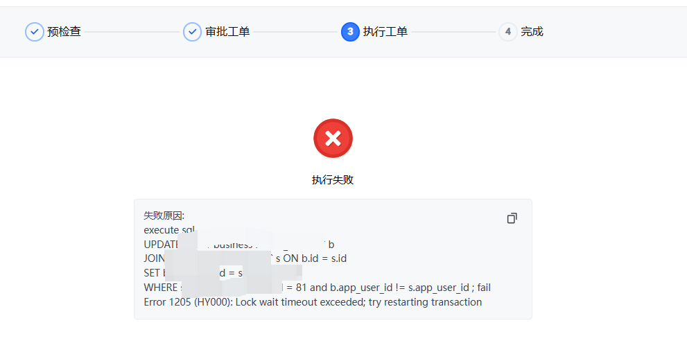
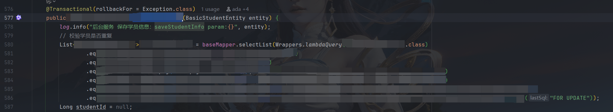

生产环境数据库执行sql出现
```bash
fail Error 1205 (HY000): Lock wait timeout exceeded; try restarting transaction
```



查看监控


一看这时长，一看这SQL，别想了，肯定是上面的问题导致的。

问了下最近发布的小伙伴，说最近发布了`for update`,一想没跑了，赶紧回退吧。回退解决
但是查看这个`for update`又感觉有点奇怪。`for update` 只是单表的，不应该啊？

主要sql

SQL1
```sql
UPDATE `db1`.`table1` s
JOIN `db2`.`table2` u ON s.uk1 = u.uk1 
SET s.app_user_id = u.id
WHERE ...... ;
```

SQL2
```sql
select * from `db1`.`table1`
WHERE ...... for update;
```

一共出现两张表，尴尬 SQL2 不管先执行还是，后执行，按道理来说并不会导致死锁。形成不了环路条件啊，奇怪了。

找下原代码看下具体实现。



