# MySQL的基本架构

## MySQL的基础架构图

1）mysql架构

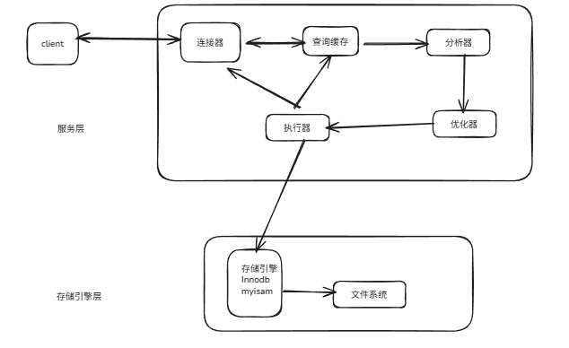

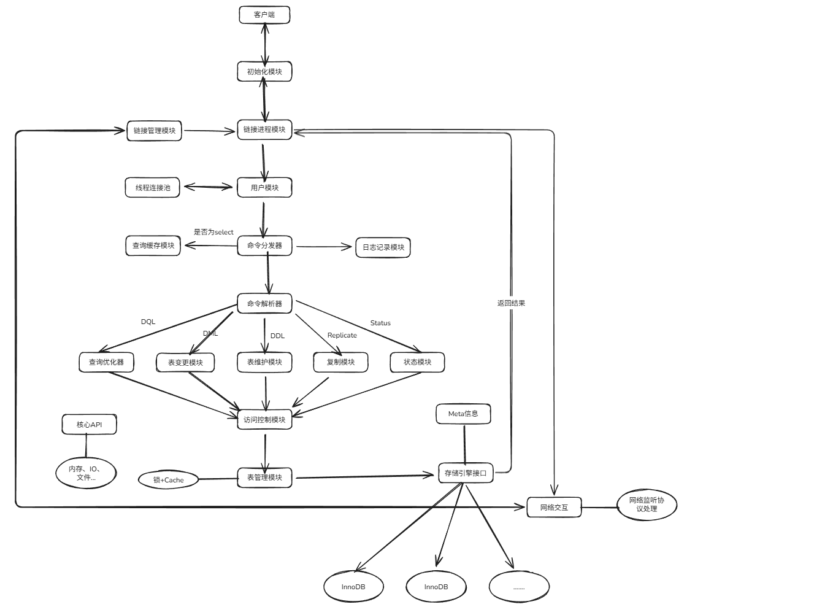

查询执行流程

1. 客户端链接 
   a. 客户端发起一条Query请求，监听客户端的‘连接管理模块’接收请求
   b. 请求转发到‘连接进/线程模块’
   c. 调用‘用户模块’来进行授权检查
   d. 过检查后，‘连接进/线程模块’从‘线程连接池’中取出空闲的被缓存的连接线程和客户端请求对接，如果失败则创建一个新的连接请求
2. 处理  
   a. 先查询缓存，检查Query语句是否完全匹配，接着再检查是否具有权限，都成功则直接取数据返回  
   b. 上一步有失败则转交给‘命令解析器’，经过词法分析，语法分析后生成解析树  
   c. 接下来是预处理阶段，处理解析器无法解决的语义，检查权限等，生成新的解析树  
   d. 再转交给对应的模块处理  
   e. 如果是SELECT查询还会经由‘查询优化器’做大量的优化，生成执行计划  
   f. 模块收到请求后，通过‘访问控制模块’检查所连接的用户是否有访问目标表和目标字段的权限  
   g. 有则调用‘表管理模块’，先是查看table cache中是否存在，有则直接对应的表和获取锁，否则重新打开表文件  
   h. 根据表的meta数据，获取表的存储引擎类型等信息，通过接口调用对应的存储引擎处理
   i. 上述过程中产生数据变化的时候，若打开日志功能，则会记录到相应二进制日志文件中
3. 结果  
　　a. Query请求完成后，将结果集返回给‘连接进/线程模块’  
　　b. 返回的也可以是相应的状态标识，如成功或失败等  
　　c. ‘连接进/线程模块’进行后续的清理工作，并继续等待请求或断开与客户端的连接  

直观展示下
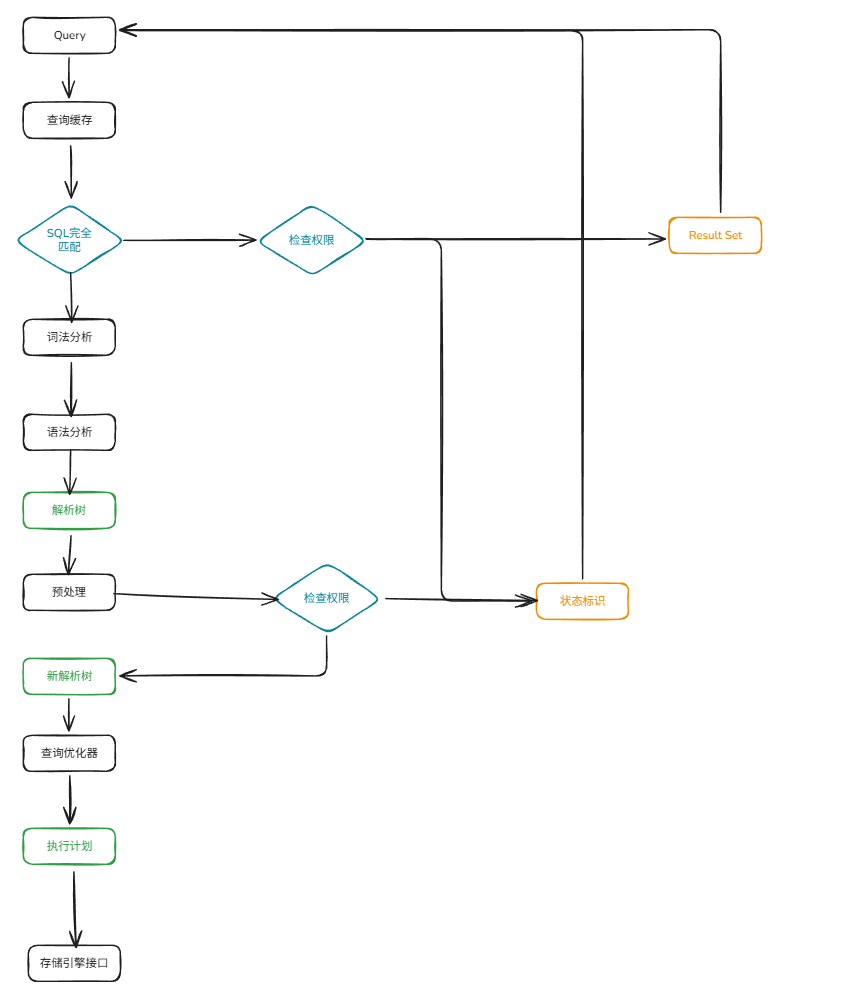


2）查询数据库的引擎  
查看支持的存储引擎
```
show engines;
```
查看默认的存储引擎
```
show variables like "%storage_engine%";
```

创建表的时候指定存储引擎
```
create table tb(
id int(4) auto_increment,
name varchar(5),
dept varchar(5),
primary key(id)
) engine=myISAM auto_increment=1 default charset=utf8mb4;
```

# SQL优化

## mysql的编写过程和解析过程

### 编写过程
```
select dinstinct  ..from  ..join ..on ..where ..group by ..having ..order by ..limit ..
```
### 解析过程
```
from .. on.. join ..where ..group by ..having ..select dinstinct ..order by ..limit ..
```

3）SQL优化—主要就是优化索引

索引的优势
1. 提高查询效率(降低了IO使用率)。当创建了索引后，查询次数减少了。
2. 降低CPU使用率。比如说【…order by age desc】这样一个操作，当不加索引，会把源表加载到内存中做一个排序操作，极大的消耗了资源。但是使用了索引以后，第一索引本身就小一些，第二索引本身就是排好序的，左边数据最小，右边数据最大。

索引的弊端
1. 当数据量很大的时候，索引也会很大(当然相比于源表来说，还是相当小的)，也需要存放在内存/硬盘中(通常存放在硬盘中)，占据一定的内存空间/物理空间。
2. 索引并不适用于所有情况：a.少量数据；b.频繁进行改动的字段，不适合做索引；c.很少使用的字段，不需要加索引；
3. 索引会提高数据查询效率，但是会降低“增、删、改”的效率。当不使用索引的时候，我们进行数据的增删改，只需要操作源表即可，但是当我们添加索引后，不仅需要修改源表，也需要再次修改索引，很麻烦。尽管是这样，添加索引还是很划算的，因为我们大多数使用的就是查询，“查询”对于程序的性能影响是很大的。

索引结构 B+树
特点：
数据全部存放在叶子节点中。叶子节点包含前项指针和后项指针。用于快速范围查询。
对于InnoDB的数据，全部存储在主键索引中，对于非主键索引的叶子节点存储的是主键id

## 执行计划
查看执行计划
```
explain + SQL语句
```
返回字段
id ：编号
select_type ：查询类型
table ：表
type ：类型
possible_keys ：预测用到的索引
key ：实际使用的索引
key_len ：实际使用索引的长度
ref ：表之间的引用
rows ：通过索引查询到的数据量
Extra ：额外的信息

结合例子进行说明
``` SQL
-- 建表语句
create table course
(    
    cid int(3),   
    cname varchar(20),   
    tid int(3)
);

create table teacher
(  
    tid int(3),  
    tname varchar(20),  
    tcid int(3)
);

create table teacherCard
(   
    tcid int(3),  
    tcdesc varchar(200)
);
CREATE TABLE test01  (
    tid INT(3) PRIMARY KEY, 
    tname VARCHAR(20),
    tcid INT(3)
);

create table test_kl
(  
  name char(20) not null default '',
  name1 char(20)
);

--  插入数据
insert into course values(1,'java',1);
insert into course values(2,'html',1);
insert into course values(3,'sql',2);
insert into course values(4,'web',3);

insert into teacher values(1,'tz',1);
insert into teacher values(2,'tw',2);
insert into teacher values(3,'tl',3);

insert into teacherCard values(1,'tzdesc') ;
insert into teacherCard values(2,'twdesc') ;
insert into teacherCard values(3,'tldesc') ;

insert into test01 values(1,'tz',1);
insert into test01 values(2,'tw',2);
insert into test01 values(3,'tl',3);


alter table test_kl add index index_name(name) ;
alter table test_kl add index index_name1(name1) ;
```

### id字段说明
```
explain select t.*
from teacher t,course c,teacherCard tc
where t.tid = c.tid and t.tcid = tc.tcid
and (c.cid = 2 or tc.tcid = 3);
```
结果

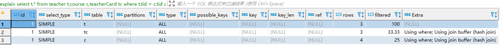

接着，在往teacher表中增加几条数据。

```
insert into teacher values(4,'ta',4);
insert into teacher values(5,'tb',5);
insert into teacher values(6,'tc',6);
```

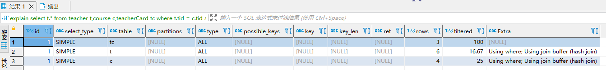

表的执行顺序 ，因表数量改变而改变的原因：笛卡尔积。

**id值相同，从上往下顺序执行。表的执行顺序因表数量的改变而改变**。


查询教授SQL课程的老师的描述(desc)
``` SQL
explain select tc.tcdesc from teacherCard tc 
where tc.tcid = 
(    
    select t.tcid from teacher t  
    where  t.tid =   
    (select c.tid from course c where c.cname = 'sql')
);
```

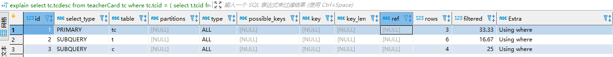

**id值不同，id值越大越优先查询。这是由于在进行嵌套子查询时，先查内层，再查外层。**

``` SQL
explain select t.tname ,tc.tcdesc from teacher t,teacherCard tc 
where t.tcid= tc.tcid
and t.tid = (select c.tid from course c where cname = 'sql') ;
```
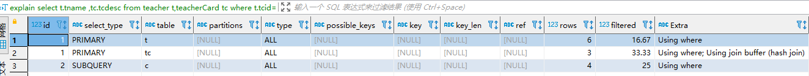

**id值有相同，又有不同。id值越大越优先；id值相同，从上往下顺序执行。**

### select_type关键字的使用说明：查询类型
| select_type | 描述 |
| :--- | :--- |
|SIMPLE	| 简单 SELECT，没有子查询或 UNION |
|PRIMARY	|最外层的主查询（整个 SQL 的顶层 SELECT） |
|SUBQUERY	| 子查询中的 SELECT（非派生表）|
|DEPENDENT SUBQUERY |	子查询依赖外层查询结果（相关子查询） |
|DERIVED	| 派生表（FROM 子句中的子查询） |
|MATERIALIZED	| 物化子查询（8.0+ 优化后的子查询缓存） |
|UNION	 | UNION 中的第二个及后续 SELECT|
|DEPENDENT UNION |	UNION 中依赖外层结果的子查询 |
|UNION RESULT	| UNION 合并后的结果集输出阶段|
|UNCACHEABLE SUBQUERY	| 子查询结果不可缓存（包含非确定性函数等） |
|UNCACHEABLE UNION	UNION | 结果不可缓存（同上）|

常用的select_type 说明

SIMPLE：简单查询 （不包含子查询，不包含union查询）
PRIMARY：包含子查询的主查询(最外层)
SUBQUERY：包含子查询的主查询(非最外层)
DERIVED：衍生查询(用到了临时表)
    a.在from子查询中，只有一张表；
    b.在from子查询中，如果table1 union table2，则table1就是derived表；
```
explain select  cr.cname    
from ( select * from course where tid = 1  union select * from course where tid = 2 ) cr ;
```

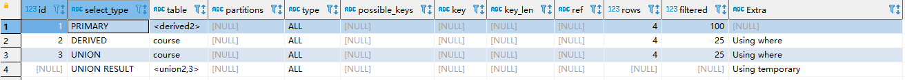

UNION：union之后的表称之为union表
UNION RESULT：告诉我们，哪些表之间使用了union查询

### type关键字的使用说明：索引类型
出现的值性能从高到低：
system -> const -> eq_ref -> ref -> range -> index -> all

system: 源表只有一条数据； 衍生表只有一条数据的主查询。
const：仅仅能查到一条数据的SQL ,仅针对Primary key或unique索引类型有效。

例如：
```
explain select tid from test01 where tid =1 ;
```

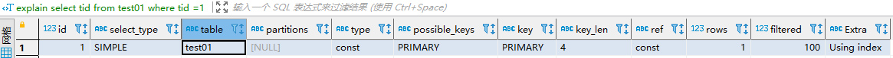

删除以前的主键索引后，此时我们添加一个其他的普通索引：
```
ALTER TABLE test01 DROP INDEX `PRIMARY`;

create index test01_index on test01(tid) ;
```
```
explain select tid from test01 where tid =1 ;
```
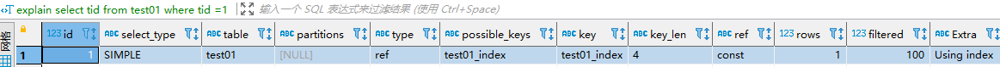

- eq_ref
唯一性索引，对于每个索引键的查询，返回匹配唯一行数据（有且只有1个，不能多 、不能0），并且查询结果和数据条数必须一致。 此种情况常见于唯一索引和主键索引。
```
delete from teacher where tcid >= 4;
alter table teacherCard add constraint pk_tcid primary key(tcid);
alter table teacher add constraint uk_tcid unique index(tcid) ;
```
```
explain select t.tcid from teacher t,teacherCard tc where t.tcid = tc.tcid ;
```

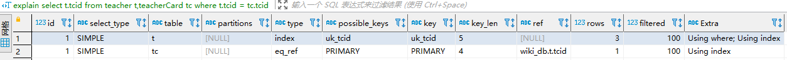

以上SQL，用到的索引是t.tcid，即teacher表中的tcid字段；如果teacher表的数据个数和连接查询的数据个数一致（都是3条数据），则有可能满足eq_ref级别；否则无法满足。条件很苛刻，很难达到。

- ref
非唯一性索引，对于每个索引键的查询，返回匹配的所有行（可以0，可以1，可以多）
```
alter table teacher add index index_name (tname) ;
```
```
explain select * from teacher     where tname = 'tz';
```

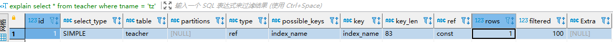

- range

检索指定范围的行 ,where后面是一个范围查询(between, >, <, >=, in)
in有时候会失效，从而转为无索引时候的ALL。
有时候mysql的优化器认为全表查询的效率比范围查询要高，所以会优先使用in查询。
```
alter table teacher add index tid_index (tid) ;
```

```
explain select t.* from teacher t where t.tid in (1,2) ;
explain select t.* from teacher t where t.tid <3 ;
```
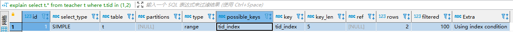
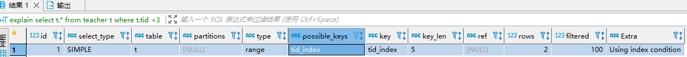

- index

查询全部索引中的数据(扫描整个索引)
```
alter table course add index cid_index (cid) ;
```
```
explain select cid from course;
```
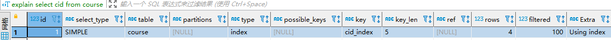

- ALL
查询全部源表中的数据(暴力扫描全表)
```
explain select tid from course;
```
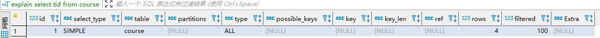

cid是索引字段，因此查询索引字段，只需要扫描索引表即可。但是tid不是索引字段，查询非索引字段，需要暴力扫描整个源表，会消耗更多的资源。

###  possible_keys和key
possible_keys可能用到的索引。
key指的是实际使用的索引。

```
-- 先给course表的cname字段，添加一个索引
create index cname_index on course(cname);
-- 查看执行计划
explain select t.tname ,tc.tcdesc from teacher t,teacherCard tc
where t.tcid= tc.tcid
and t.tid = (select c.tid from course c where cname = 'sql') ;
```

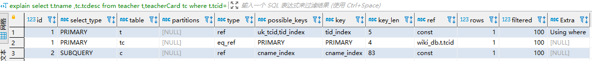

如果possible_key/key是NULL，则说明没用索引。

### key_len
索引的长度，用于判断复合索引是否被完全使用(a,b,c)。

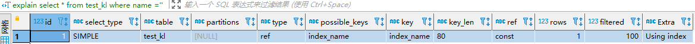

这个长度和字符集有很大的关系，因为我没有设置服务端的字符集，因此默认的字符集使用的是utf8mb4，一个字符代表占用4字节，因此这列的key_len的长度是20*4，表示使用了name这个索引。

```
explain select * from test_kl where name1 ='' ; 
```

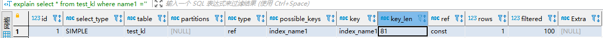

name1字段是允许为空的，所以有一位标识，占用20*4 +1 的空间。

删除原来的索引name和name1，新增一个复合索引
```
drop index index_name on test_kl ;
drop index index_name1 on test_kl ;
create index name_name1_index on test_kl(name,name1);
```
```
explain select * from test_kl where name1 = '' ; --161
explain select * from test_kl where name = '' ; --80
```

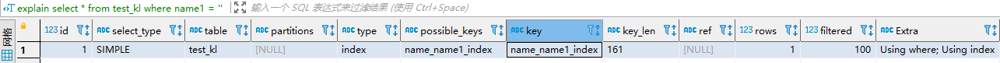
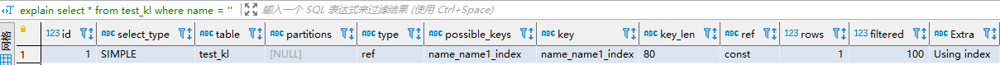

对于下面这个执行计划，可以看到我们只使用了复合索引的第一个索引字段name，因此key_len是80，这个很清楚。再看上面这个执行计划，我们虽然仅仅在where后面使用了复合索引字段中的name1字段，但是你要使用复合索引的第2个索引字段，会默认使用了复合索引的第1个索引字段name，由于name1可以是null，因此key_len = 80 + 80 + 1 = 161

再次怎加一个name2字段，并为该字段创建一个索引。
 ```
alter table test_kl add column name2 varchar(20) ;
create index name2_index on test_kl(name2);
```

```
explain select * from test_kl where name2 = '' ;  
```

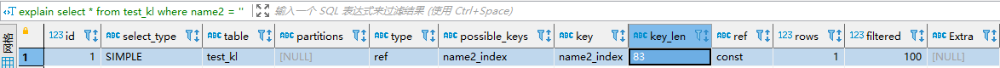

key_len = 80 + 1 + 2，这个80 + 1 长度+ Null标记，在varchar属于可变长度，在mysql底层中，用2个字节标识可变长度。

### ref
这里的ref的作用，指明当前表所参照的字段。

注意与type中的ref值区分。在type中，ref只是type类型的一种选项值。
```
create index tid_index on course(tid);
```

```
explain select * from course c,teacher t
where c.tid = t.tid  
and t.tname = 'tw';
```
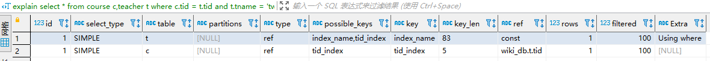

有两个索引，c表的c.tid引用的是t表的tid字段，因此可以看到显示结果为【数据库名.t.tid】，t表的t.name引用的是一个常量"tw"，因此可以看到结果显示为const，表示一个常量。

### rows
被索引优化查询的数据个数 (实际通过索引而查询到的数据个数)，估算值，在执行explain的时候不会真正去查询数据的
```
explain select * from course c,teacher t
where c.tid = t.tid  
and t.tname = 'tz';
```

### extra
其他的一些说明，很有用。
- using filesort：
针对单索引的情况
  当出现了这个词，表示你当前的SQL性能消耗较大。表示进行了一次“额外”的排序。常见于order by语句中。
针对复合索引的情况
  当出现这个说明不满足我们复合索引的最佳左前缀匹配

- using temporary 临时表
  由于当前SQL用到了临时表。一般出现在group by中。
```
explain select a1 from test02 where a1 in ('1','2','3') group by a1 ;
explain select a2 from test02 where a1 in ('1','2','3') group by a2 ;
```


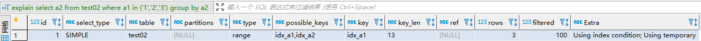

当你查询哪个字段，就按照那个字段分组，如果group by的字段不在索引中，就会出现using temporary。

- using index 说明用到了索引覆盖
就是我们的查询结果列在索引中，那么我们就不需要再从源表中查询数据了，不需要回表，因此我们查询的效率会提高。
```
drop index idx_a1 on test02;
drop index idx_a2 on test02;
drop index idx_a3 on test02;

create index idx_a1_a2 on test02(a1,a2);
```

```
explain select a1,a3 from test02 where a1='' or a3= '' ;
explain select a1,a2 from test02 where a1='' and a2= '' ;
```
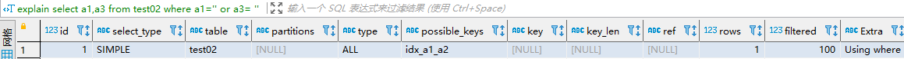
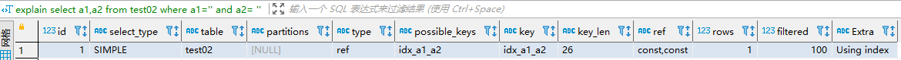

我们创建的是a1和a2的复合索引，对于第一个执行计划，我们却出现了a3，该字段并没有创建索引，因此没有出现using index，而是using where，表示我们需要回表查询。对于第二个执行计划，属于完全的索引覆盖，因此出现了using index。

```
explain select a1,a2 from test02 where a1='' or a2= '' ;
explain select a1,a2 from test02;
```

如果用到了索引覆盖(using index时)，会对possible_keys和key造成影响：
    a. 如果没有where，则索引只出现在key中；
    b. 如果有where，则索引 出现在key和possible_keys中。

- using where
表示需要【回表查询】，表示既在索引中进行了查询，又回到了源表进行了查询。
```
drop index idx_a1_a2 on test02;
create index a1_index on test02(a1);
```
```
explain select a1,a3 from test02 where a1='' and a3='' ;
```
我们既使用了索引a1，表示我们使用了索引进行查询。但是又对于a3字段，我们并没有使用索引，因此对于a3字段，需要回源表查询，这个时候出现了using where。

- impossible where
当where子句永远为False的时候，会出现impossible where
```
explain select a1 from test02 where a1='a' and a1='b' ;
```
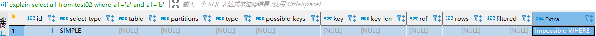

