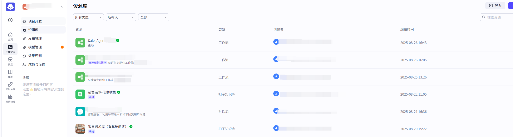

# 背景说明

并不是说应该怎么办，而是基本配置有这些可以进行使用，具体不同企业使用的时候肯定要个性化配置。

使用了火山方舟和扣子

# 火山方舟

简单使用了提示词的功能，后端服务ARK_API_KEY + 应用ID 来对应请求发送http请求即可

提示词配置

eg：

现在基本国内的都是这个直接http请求，很方便调用

模型精调根据自己提供的数据来调整模型

解释不多说，懂的都懂,下面文章中有部分关于微调的说明，更多的是操作，让我卖下瓜，哈哈哈
[微调大模型并部署服务提供外部调用](https://blog.csdn.net/zhazhagu/article/details/150978713)

# 扣子
怎么说类似于 dify 平台

包含智能体、应用、工作流

空间管理

具体里面的配置还在继续学习中