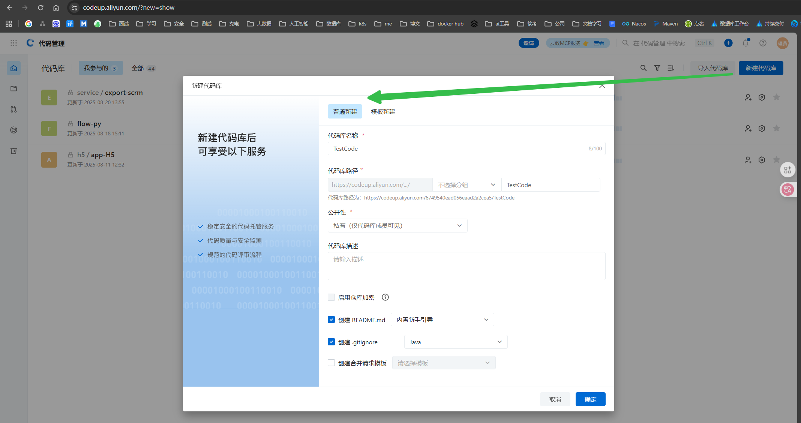
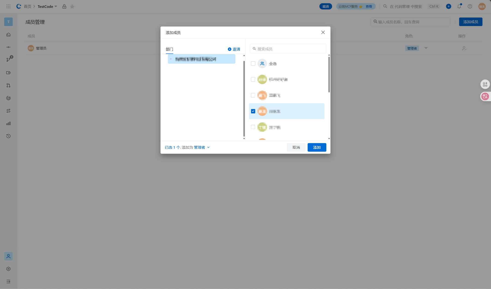
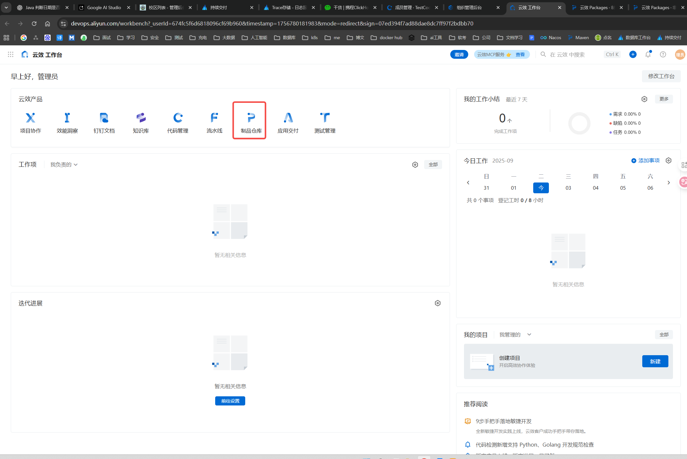
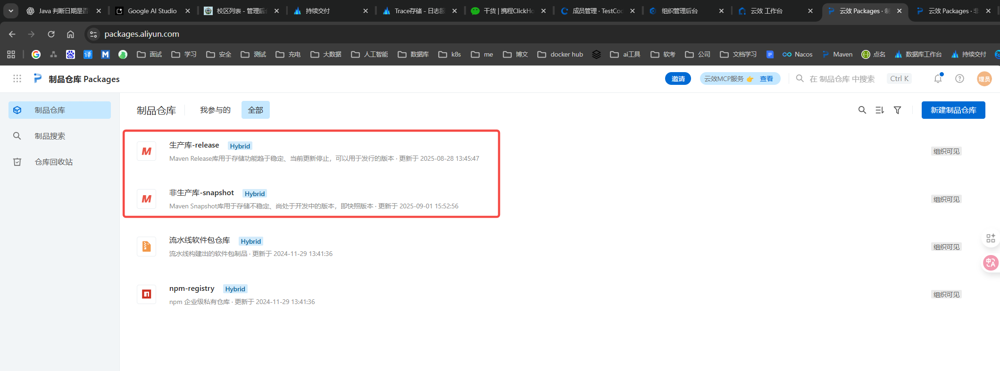
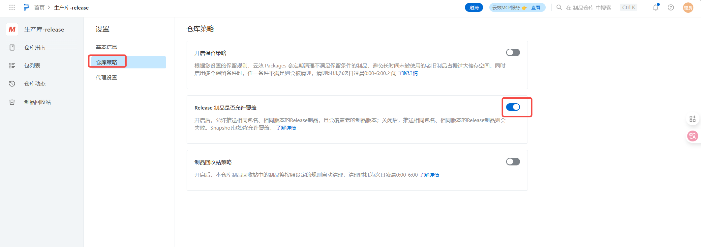
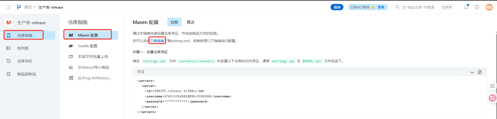
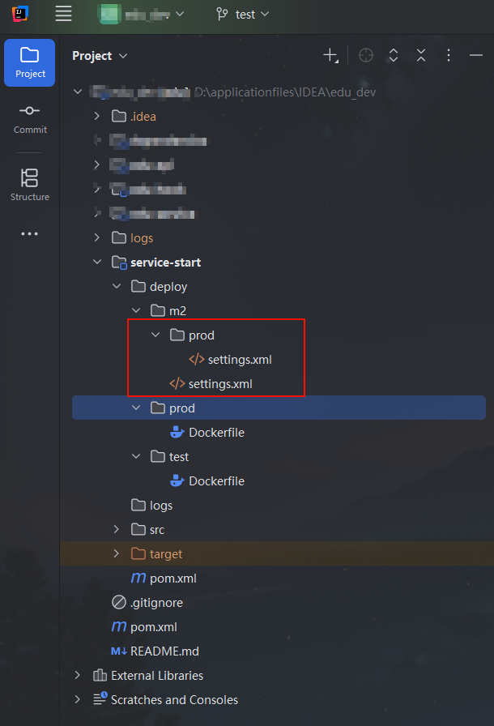
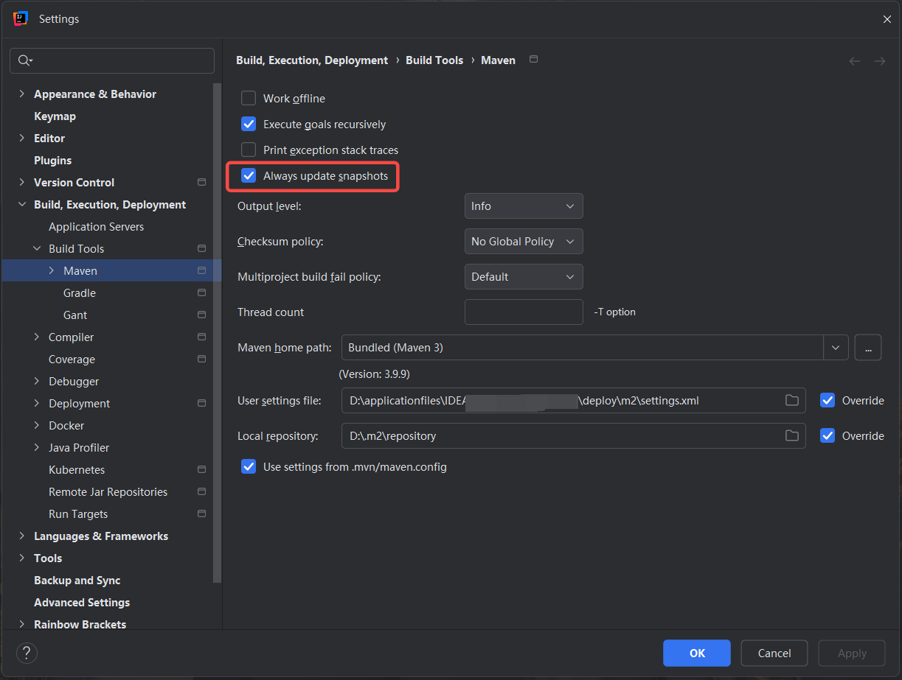

# 代码仓库搭建相关步骤
1. 创建代码库

2. 添加成员

3. 进入制品仓库（maven私有仓库）

里面会有release和snapshot

说明：一般开发和测试环境使用的是snapshot版本，测试环境验证没有问题在发布之前打release包进行正式jar发布。一般规范情况下release包是不允许变更的【官方建议，因为一旦一个正式的包发布完成之后，修改里面的内容以及变更接口服务，删除接口都是极其危险的】。但是这个里面是允许了覆盖。

 
当然既然是私有仓库肯定是不允许随便访问的

配置文件分为两个
snapshot包的配置文件
release包的配置文件

后续允许不同环境代码拉maven的jar依赖的时候就需要指定对应的配置文件，才能拉取到正确的包

下面展示一下正常代码的结构，文件路径是自己定义

本地启动代码的时候或者发布包的时候就需要指定这个文件了

其实文件内容就配置了私有仓库的地址，访问的账号pwd等内容，但是需要注意的是这个setting.xml文件需要有上传制品的权限，默认下面的子账号应该是没有这个权限的，需要用管理员的配置文件才能写私有仓库里面，如果发现写入没有权限的时候可以往这个方向排查下。

其他的是成员管理，等等基本都大差不差。
