并不是说应该怎么办，而是基本配置有这些可以进行使用，具体不同企业使用的时候肯定要个性化配置。

# 说明
火山云流水线部署java代码

代码相关结构
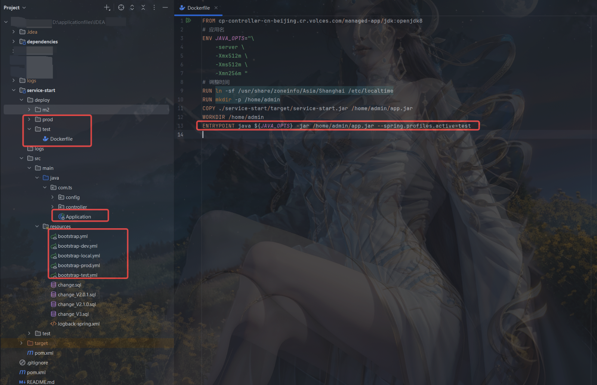
说明
其实就是把Spring Boot项目打包成了可执行文件，然后使用 java -jar运行，顺便加上spring.profiles.active进行配置文件的选择
如果不接入nacos这类配置中心的时候，就需要自己修改 “bootstrap-local.yml”这类文件了，多说一句，本地运行使用的是local(默认值)，测试和生产环境是 docker 执行 使用上面参数进行环境管理

# 流水线创建

工作区可以进行划分
比如
后端-测试
后端-生产
前端-测试
前端-生产
划分完之后，给不同的用户开通不同的权限，看到不同的工作区就可以，只有部分人员拥有生产环境发布的权限[逻辑隔离]
工作区样例
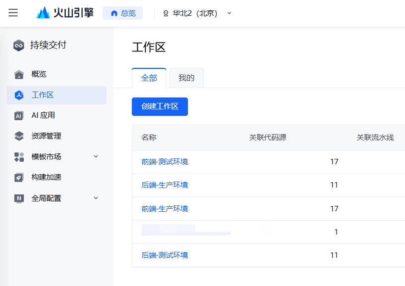

创建工作区选定账号或用户组
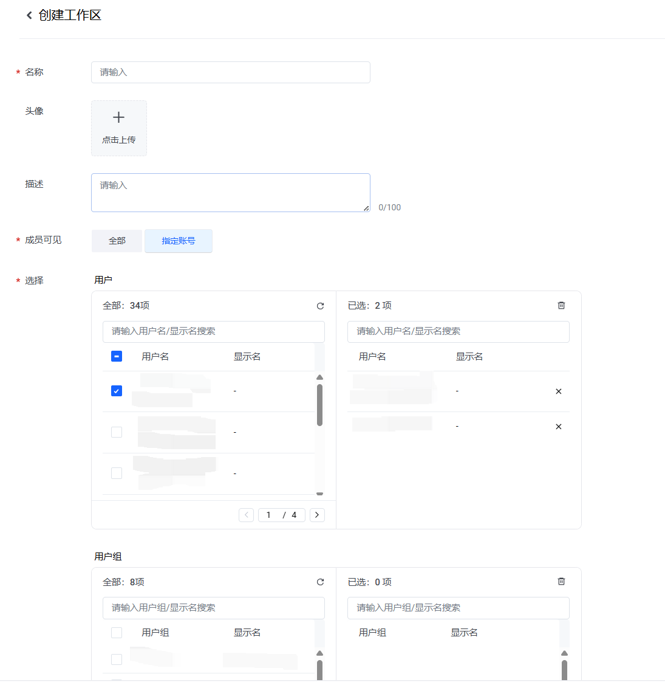

用户或者用户组权限管理
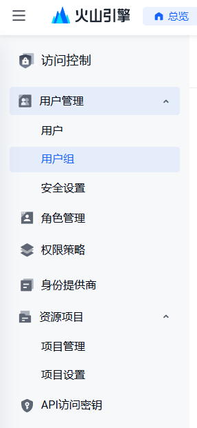

流水线 是在工作区下面的

开始创建流水线【后端服务】
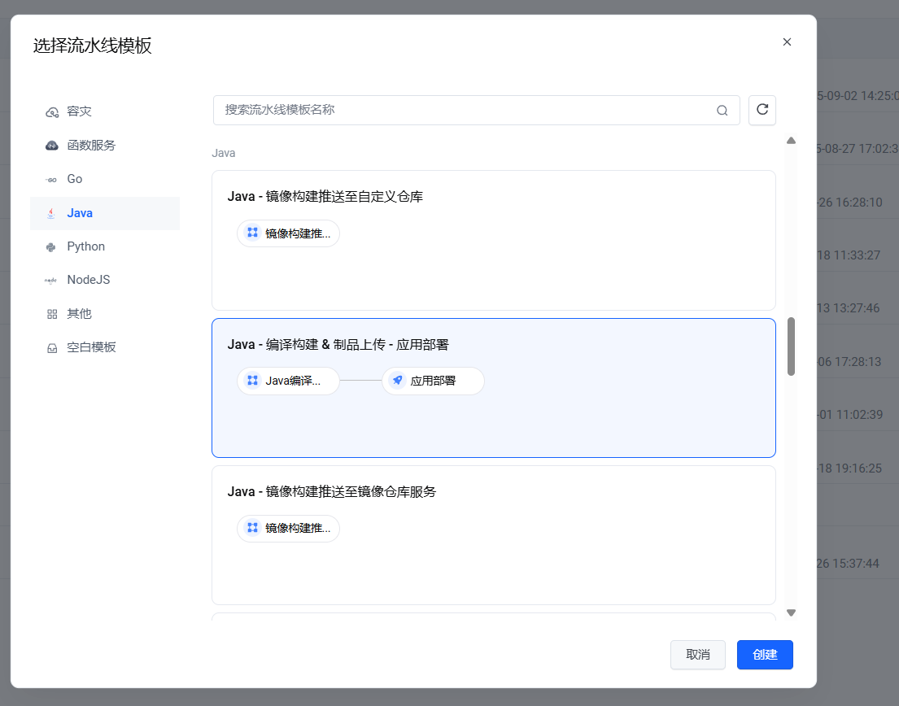

选择代码
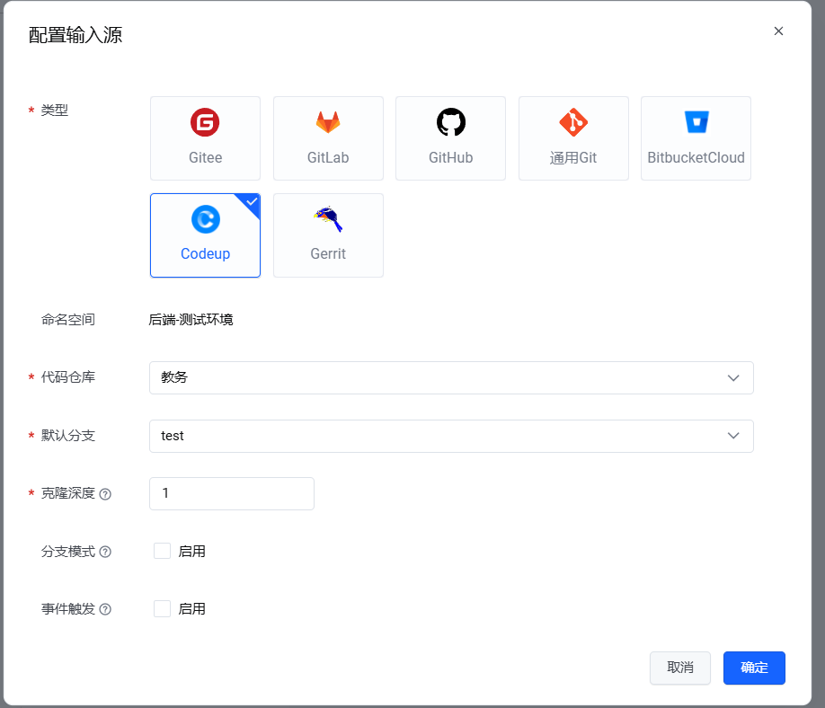

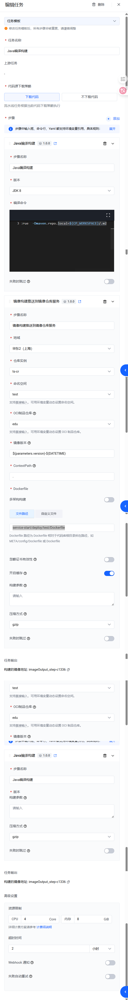
编译命令
```shell
mvn -s ./service-start/deploy/m2/settings.xml clean install -DskipTests=true  -Dmaven.repo.local=$(CP_WORKSPACE)/.m2
```

指定了maven的setting.xml 跟代码里面的路径要一致
说明：
命名空间：自己定义的隔离，比如 开发环境 dev 测试环境 test 生产环境 prod
OCI制品仓库： 这个是构建好的镜像会自动推送到火山云 镜像仓库里面 【之前申请的是小微企业，限制每个镜像仓库里面只能有200个镜像文件，如果超过就会在部署的时候报错】
Dockerfile： 指定了构建Dockerfile文件的地址

应用部署操作
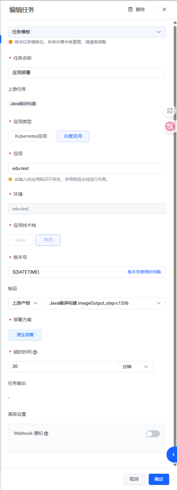
说明：我们这里没有使用Kubernetes应用进行部署
应用需要单独构建，


# 创建应用
创建应用-基本信息
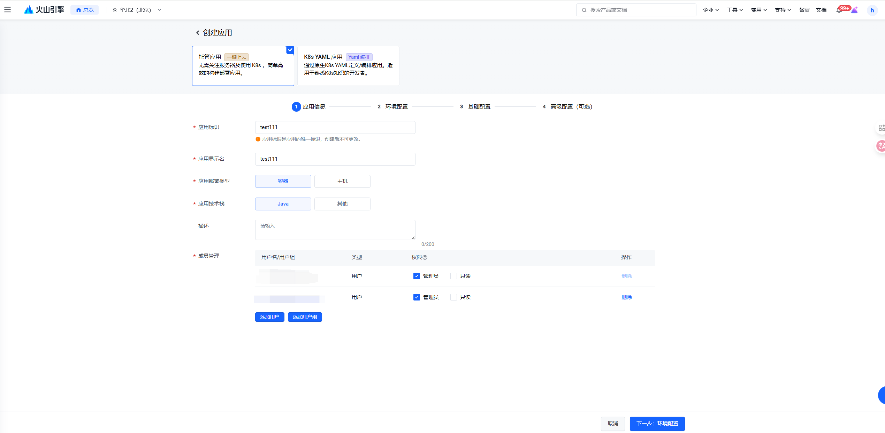

创建应用-环境配置
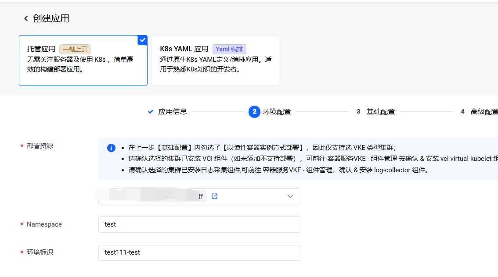

创建应用-基础配置
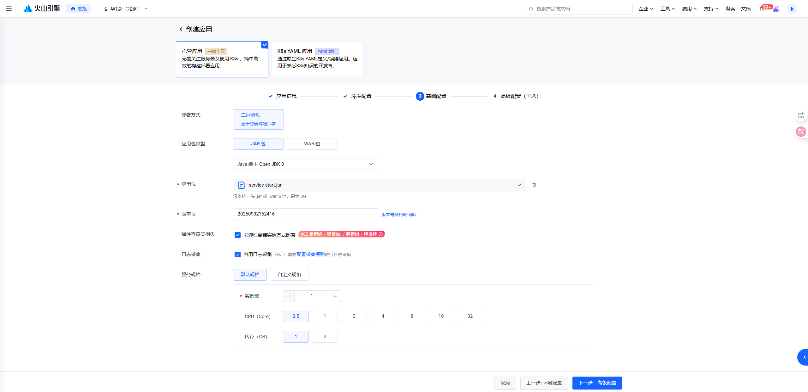

创建应用-高级配置
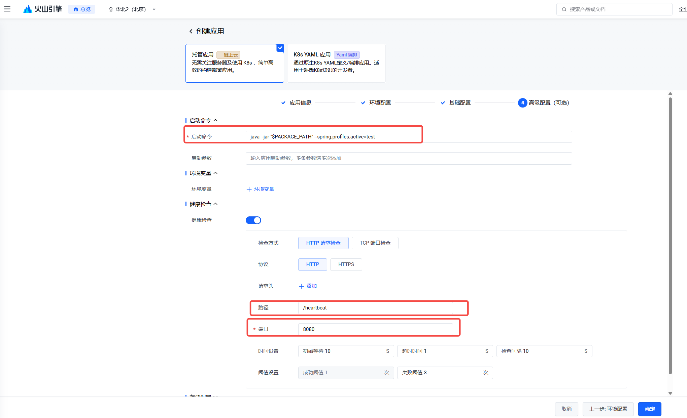
需要注意的是之前没有健康检查，只要触发到流水线部署就会把之前的容器给kill掉，后面配置健康检测，只有健康检测通过之后才会kill掉之前的容器，每次部署中断时间由原来的 十几分钟到现在的 几秒。

创建完应用和流水线可以部署下尝试，注意查看日志等信息。应用启动的信息不回在流水线上展示，只能去应用里面查看。并且如果应用启动没有成功的话，日志信息在日志服务里面也是很难排查到，只能到这个日志里面查看

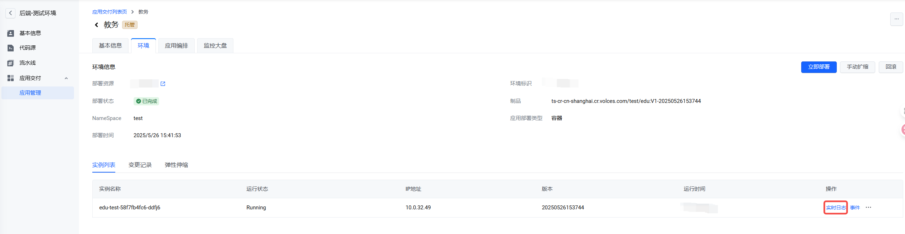

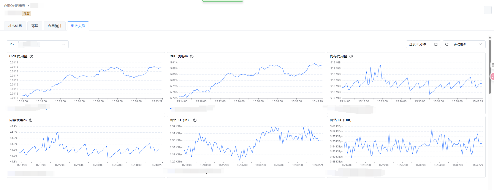

## 前端流水线
前端代码库
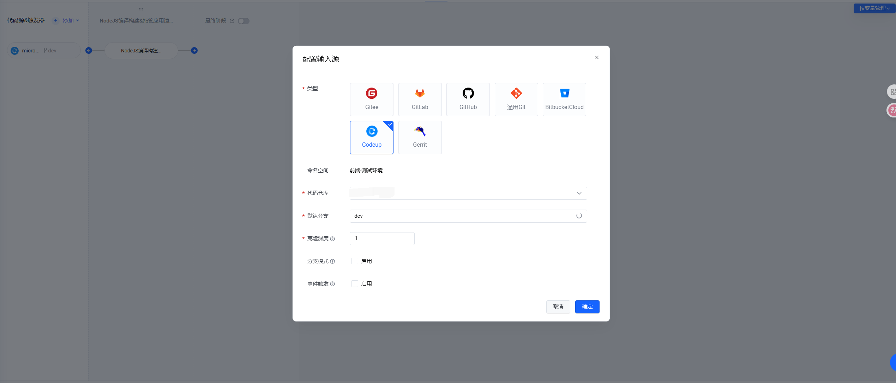

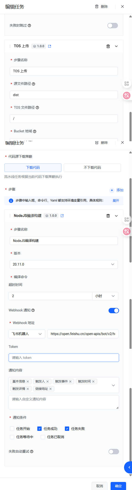
编译命令内容

```shell
yarn install --ignore-platform --registry=https://registry.npmmirror.com
yarn run build:test
```

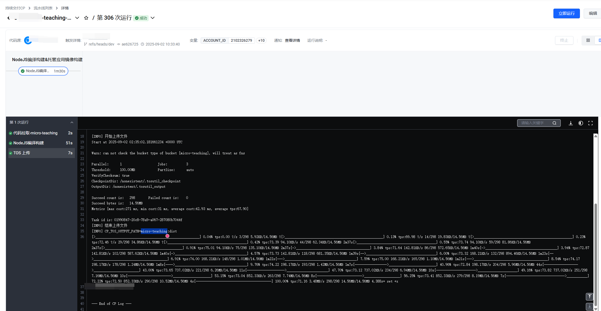

按我理解就是把编译打包的文件传到某个固定的地方