并不是说应该怎么办，而是基本配置有这些可以进行使用，具体不同企业使用的时候肯定要个性化配置。

# 项目管理
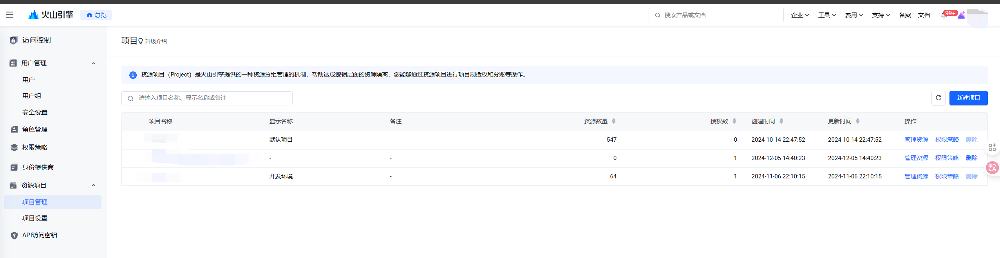 
所有的资源都是在项目下面，建议分开发环境生产环境，容易隔离区分

# 集群
首先，构建集群
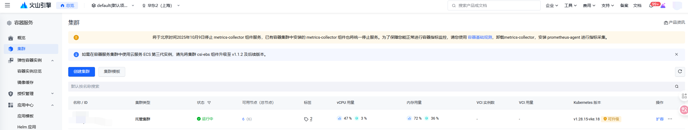

[选择私有网络](#私有网络)
其他的是选择可用网络地址

创建集群
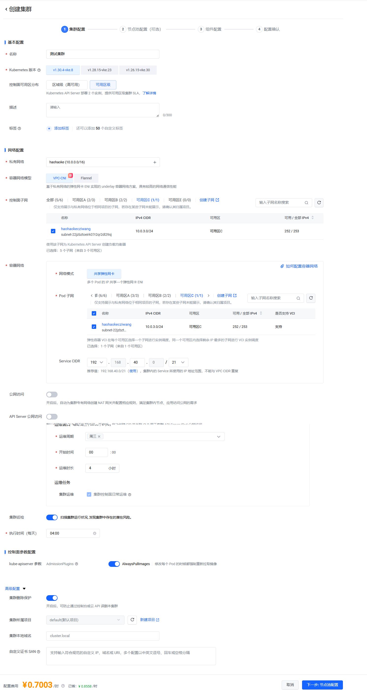

节点池配置
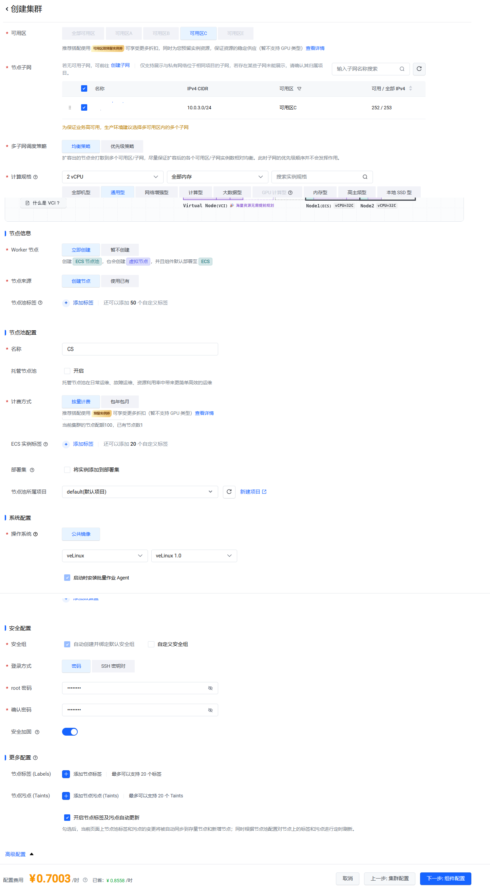

后续是选择组件，可根据自己选择进行

# 公网IP
所有要在外网访问的都需要创建公网IP绑定对应资源

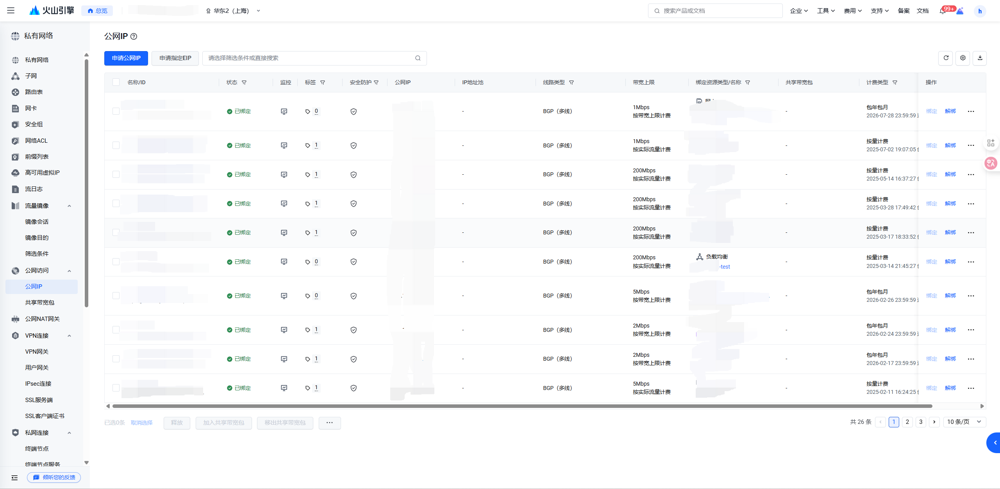

公网IP申请之后绑定对应的资源就可以对外提供服务了，可以绑定网卡，负载均衡[网关Gateway]，云服务器[或者类似堡垒机]

# 私有网络
其实就是创建局域网，如果是公司比较大，可以每个部门或者bu构建自己的局域网段
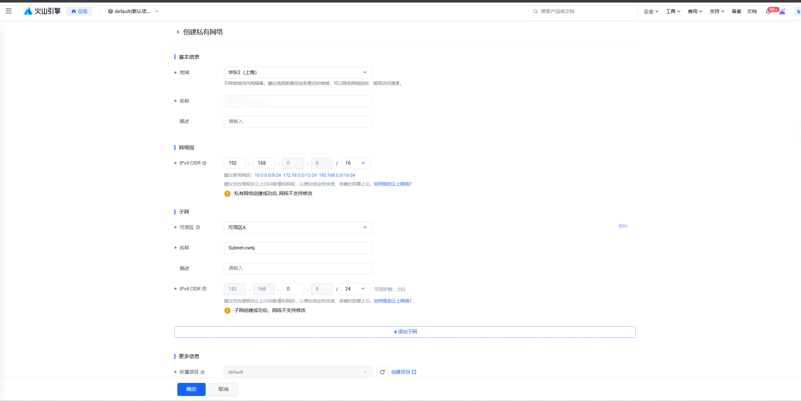

# 域名管理
对外的服务都是通过域名来访问的

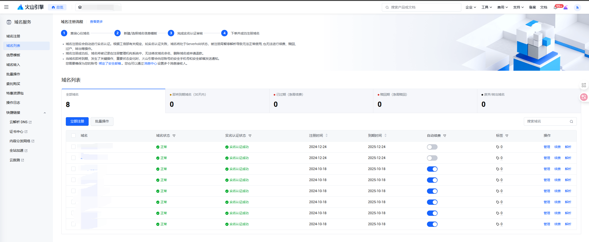

域名这里都是二级域名，二级域名下的所有域名都是可以直接使用，不需要特殊操作的

申请域名就是直接购买，没有什么特殊的
但是域名是有有效期的，所以如果要一直使用某个二级域名还是建议注意下预警或自动续费

# 负载均衡

负载均衡列表
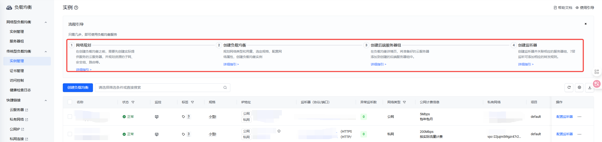

创建负载均衡，这个里面还是有很多配置需要配置的

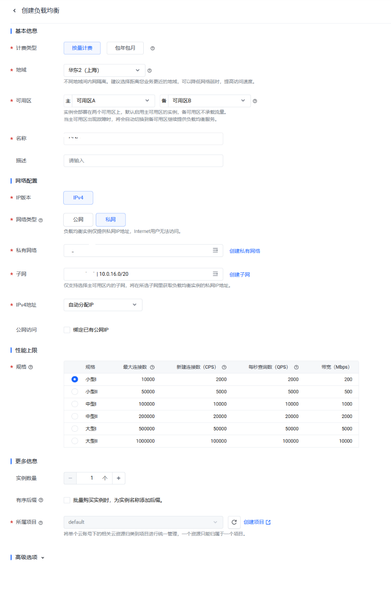

创建完成之后还需要绑定端口 比如http的80端口和https的443端口
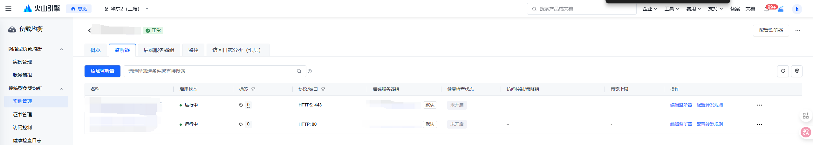

负载均衡-后端服务器组
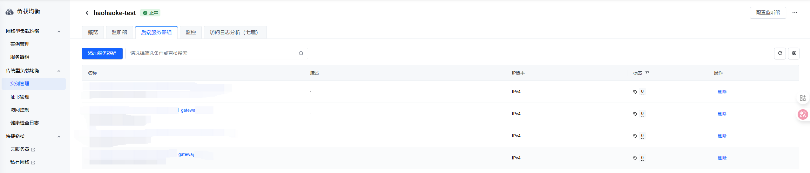

后端服务器组里面配置的是网关，网关上统一根据路基进行转发，类似Nginx

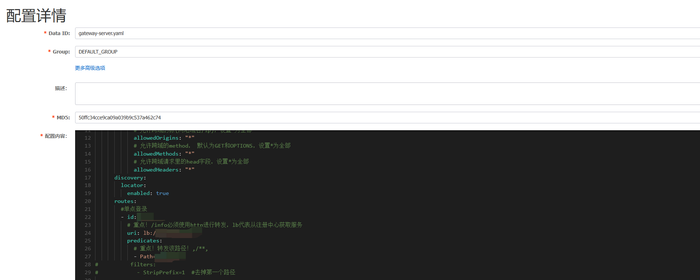

配置到网关之后，后面开发的其他服务的时候，只需要创建服务，在网关上修改配置即可，不需要到火山上做额外的操作

# 申请证书

火山云目前免费证书是只有三个月的有效期[其他平台的免费证书也是有有效期的]

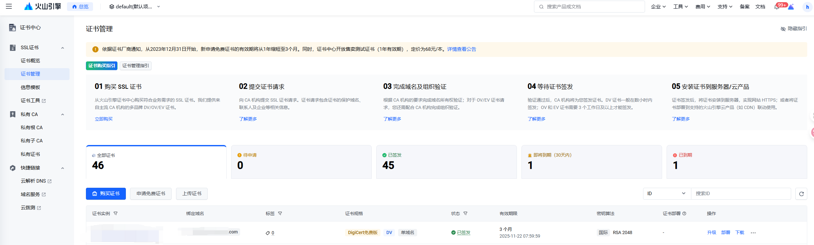
可以进行购买或者申请免费证书，续费等操作，如果给外部使用的话，可以进行下载然后配置到对应平台即可。之前有腾讯直播的推拉流证书过期，在火山云申请之后导入那边使用的。

# 总结
这样相对一条访问链路就基本打通了

整体公网IP > 绑定 负载均衡 > 后端服务器组 绑定网关 > 网关分发各种路由服务

第一次接触还是要有几天的时间去琢磨这个东西，但是只要上面的思路清晰了，到对应节点去配置对应的内容即可

如果是测试环境数据库需要反问，绑定数据库网卡即可，特殊的应用服务绑定主机

代码部署可以看流水线相关的说明