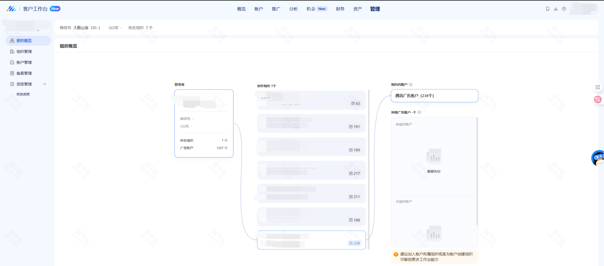
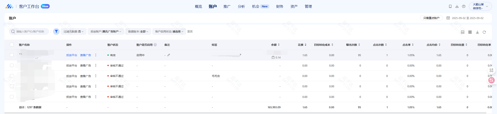
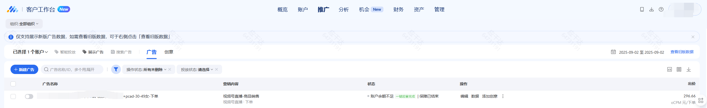
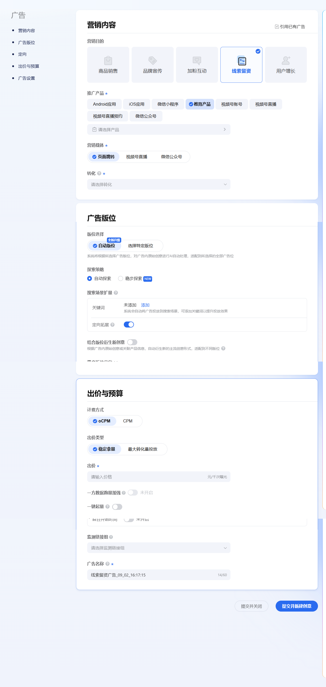
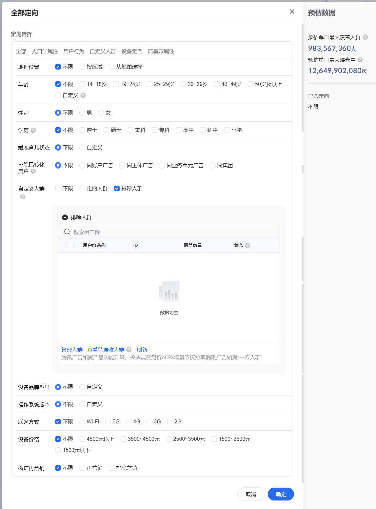
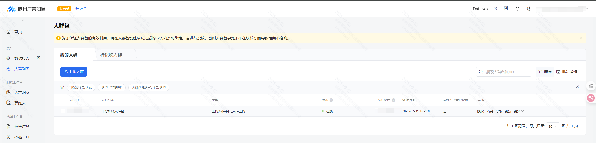

并不是说应该怎么办，而是基本配置有这些可以进行使用，具体不同企业使用的时候肯定要个性化配置。

# 腾讯广告平台
地址
https://ad.qq.com/

目的:进行广告投放引流圈人
背景说明
首先使用公司注册组织，每个组织下面有很多广告户，广告户下面进行不同的广告活动投放，拖放的过程中不想被已经加微的再次投放到，所以在里面创建了人群[文件上传]。投放的时候排除到已经跟进的用户即可。

组织结构

账户列表

广告列表

新建广告排除人群操作

在定向里面排除人群包

这个不就是圈人平台里面的标签圈选么，这套其实很多大厂都在搞，基本所有的搜广推都会有这么一套东西点击管理人群会跳转到

[如意平台](https://ruyi.qq.com/) 

进行人群的管理，之前在其他公司做这个底层的服务平台，各位老板有需求的话欢迎联系
[这个东西的本质就是，沉淀数据，用户画像，规则筛选，匹配回流]，既要支撑得起大量数据流转，又要支持人群匹配的服务能力，个性化推荐或者投放活动底层都是类似这个平台，有的是叫 什么什么营销，DMP，什么什么人群

扯远了，就是触发系统里面的某个操作之后，把人群里面的数据进行更新。但是现在这个系统不太好用的地方是，基于txt文件的，文件上传之后跟本地文件就隔离开了，后续只能新加或者删除，目前接手的之前开发为了实现实时的效果，在系统里面触发之后就开始进行修改人群数据了，但是这个是文件人群[只能追加]，导致很多小文件。文件人群建议还是定时更新吧，一堆小文件计算的时候，数据计算平台估计能气死，(之前小文件人群计算的时候把计算平台的zookeeper打挂了，所以这种人群还是定时做文件，多个文件中间的内容进行合并)。

既然远了就不回来了。
一般情况下人群分为离线人群和实时人群。
离线人群可以基于文件或者数仓里面的表[比如带有时间分区的分区表]数据计算的时候只拿最新的分区数据，后续即使数据没产出，或者数据跌0，可以进行拦截使用之前的数据使用。防止人群不可用，导致活动失败【一般活动失败都意味着资损】。实时人群一般可以基于Flink，消息，cdc等方式把数据写入到人群，人群回流的时候，只是把人群规则发布出去，人群匹配的时候使用人群规则，最终判定是否在人群里面。进而达到实时匹配的能力。其实还有地理位置圈人[数据基于点位geo进行点位多少m圈人]，或者是人群放大[look a like]可以基于双塔模型进行匹配。

