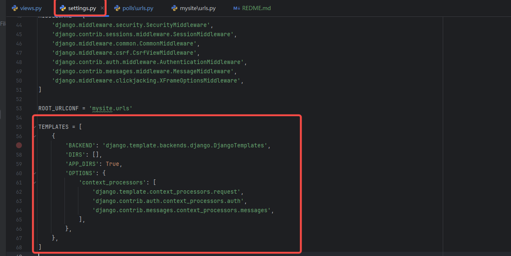
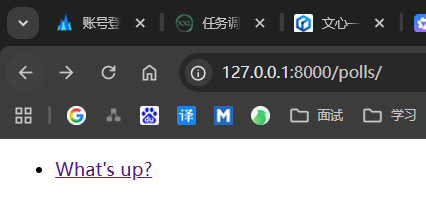
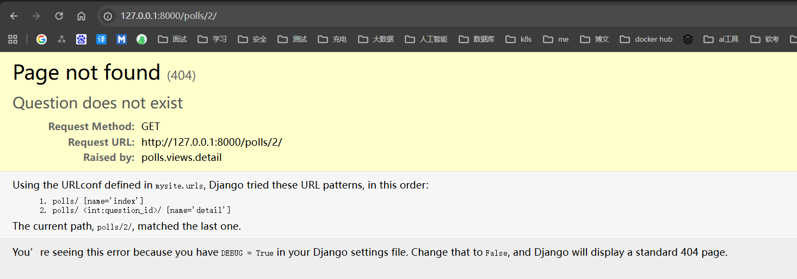
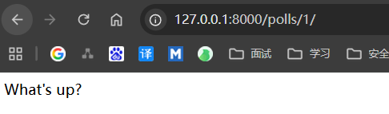

# 公共视图

视图 是具有 一类具有相同功能和模板的网页的集合，网页和其他内容都是从视图派生而来。每个视图是一个python函数。

一般情况下URL形式： `/newsarchive/<year>/<month>/`

为了将 URL 和视图关联起来，Django 使用了 'URLconfs' 来配置。URLconf 将 URL 模式映射到视图。

其实就是类似于web项目里面的Controller里面的一个方法【一个GetMapping或者RequestMapping类似】

## 添加视图

在 pulls/views.py 中添加方法
```shell
from django.shortcuts import render
from django.http import HttpResponse

def index(request):
    return HttpResponse("Hello, world. You're at the polls index.")

def detail(request, question_id):
    return HttpResponse("You're looking at question %s." % question_id)

def results(request, question_id):
    response = "You're looking at the results of question %s."
    return HttpResponse(response % question_id)

def vote(request, question_id):
    return HttpResponse("You're voting on question %s." % question_id)
```

在 pulls/urls.py 中添加路径映射, 类似于 java web 中的
```shell
urlpatterns = [
    path("", views.index, name="index"),
    path("<int:question_id>/", views.detail, name="detail"),
    path("<int:question_id>/results/", views.results, name="results"),
    path("<int:question_id>/vote/", views.vote, name="vote"),

]
```
全局的 mysite/urls.py 已经 引入了 pulls/urls.py 就不需要变更了

在浏览器输入
/polls/34  会根据path进行匹配到detail方法中

每个视图都必须要做的是返回一个HttpResponse对象或者抛出异常比如 Http404 

举例从 index() 方法改下

```python
from polls.models import Question

def index(request):
    latest_question_list = Question.objects.order_by('-pub_date')[:5]    # 查询数据库 根据 pub_date 逆序 取5条数据
    output = ", ".join([q.question_text for q in latest_question_list])
    return HttpResponse(output)
```

编辑页面
在polls 目录里创建一个 templates 目录。

项目的 TEMPLATES 配置项描述了 Django 如何载入和渲染模板。默认的设置文件设置了 DjangoTemplates 后端，并将 APP_DIRS 设置成了 True。这一选项将会让 DjangoTemplates 在每个 INSTALLED_APPS 文件夹中寻找 "templates" 子目录。这就是为什么尽管我们没有像在第二部分中那样修改 DIRS 设置，Django 也能正确找到 polls 的模板位置的原因。



在刚刚创建的 templates 目录里，再创建一个目录 polls，然后在其中新建一个文件 index.html 。换句话说，你的模板文件的路径应该是 polls/templates/polls/index.html 。因为``app_directories`` 模板加载器是通过上述描述的方法运行的，所以 Django 可以引用到 polls/index.html 这一模板了

`polls/templates/polls/index.html`文件内容
```html
<!doctype html>
<html lang="en-US">
  <head>
    <meta charset="utf-8" />
    <title>question list</title>
  </head>
  <body>
    
    <ul>
    
        <li><a href="/polls/{{ question.id }}/">{{ question.question_text }}</a></li>
    
    </ul>

    <p>No polls are available.</p>

  </body>
</html>
```

然后 修改 polls/views.py 里的 index 视图来使用我们创建的模板

```python
from django.template import loader

from polls.models import Question

def index(request):
    latest_question_list = Question.objects.order_by('-pub_date')[:5]  # 查询数据库 根据 pub_date 逆序 取5条数据
    template = loader.get_template("polls/index.html")        # 获取对应的模版
    context = {"latest_question_list": latest_question_list}  # 参数绑定,传递上下文，字典
    return HttpResponse(template.render(context, request))    # 返回对象
```

地址栏访问 `http://127.0.0.1:8000/polls/`



## 快捷函数： render()
上面的流程配置还是有很多重复的代码,如果编写多个方法的时候

```python
from django.shortcuts import render

from .models import Question


def index(request):
    latest_question_list = Question.objects.order_by("-pub_date")[:5]
    context = {"latest_question_list": latest_question_list}
    return render(request, "polls/index.html", context)
```

## 抛出 错误
可以用来处理一些异常数据

```python
def detail(request, question_id):
    try:
        question = Question.objects.get(pk=question_id)
    except Question.DoesNotExist:
        raise Http404("Question does not exist")
    return render(request, "polls/detail.html", {"question": question})
```

如果指定问题 ID 所对应的问题不存在，这个视图就会抛出一个 Http404 异常。

同时我们对应的 页面

`polls/templates/polls/detail.html`文件内容
```html
<!doctype html>
<html lang="en-US">
  <head>
    <meta charset="utf-8" />
    <title>question list</title>
  </head>
  <body>
    {{ question }}
  </body>
</html>
```




## 快捷函数： get_object_or_404()
尝试用 get() 函数获取一个对象，如果不存在就抛出 Http404 错误也是一个普遍的流程。Django 也提供了一个快捷函数，下面是修改后的详情 detail() 视图代码：

```python
from django.shortcuts import get_object_or_404, render

from .models import Question

def detail(request, question_id):
    question = get_object_or_404(Question, pk=question_id)
    return render(request, "polls/detail.html", {"question": question})
```
也有 get_list_or_404() 函数，工作原理和 get_object_or_404() 一样，除了 get() 函数被换成了 filter() 函数。如果列表为空的话会抛出 Http404 异常。

## 使用模版系统

polls/detail.html 模板里正式的代码

```html
<!doctype html>
<html lang="en-US">
<head>
    <meta charset="utf-8" />
    <title>question list</title>
</head>
<body>
<h1>{{ question.question_text }}</h1>
<ul>
    
    <li>{{ choice.choice_text }}</li>
    
</ul>
</body>
</html>
```

模板系统统一使用点符号来访问变量的属性。在示例 `{{ question.question_text }}` 中，首先 Django 尝试对 `question` 对象使用字典查找（也就是使用 `obj.get(str)` 操作），如果失败了就尝试属性查找（也就是 `obj.str` 操作），结果是成功了。如果这一操作也失败的话，将会尝试列表查找（也就是 `obj[int]` 操作）。

在 `` 循环中发生的函数调用：`question.choice_set.all` 被解释为 Python 代码 `question.choice_set.all()` ，将会返回一个可迭代的 `Choice` 对象，这一对象可以在 `` 标签内部使用。

## 去除模板中的硬编码 URL

我们在 polls/index.html 里编写投票链接时，链接是硬编码的：

```html
<li><a href="/polls/{{ question.id }}/">{{ question.question_text }}</a></li>
```
这种硬编码、强耦合的方法的问题在于，在具有大量模板的项目中更改 URL 变得具有挑战性。然而，由于你在 polls.urls 模块中的 path() 函数中定义了 name 参数，你可以通过使用  模板标签来消除对 url 配置中定义的特定 URL 路径的依赖：

```html
<li><a href="">{{ question.question_text }}</a></li>
```

这个标签的工作方式是在 `polls.urls` 模块的 URL 定义中寻具有指定名字的条目。你可以回忆一下，具有名字 'detail' 的 URL 是在如下语句中定义的：

```python
path("<int:question_id>/", views.detail, name="detail"),
```

如果你想改变投票详情视图的 URL，比如想改成 polls/specifics/12/ ，你不用在模板里修改任何东西（包括其它模板），只要在 polls/urls.py 里稍微修改一下就行：

```python
path("specifics/<int:question_id>/", views.detail, name="detail"),
```

## 为 URL 名称添加命名空间
教程项目只有一个应用，`polls` 。在一个真实的 Django 项目中，可能会有五个，十个，二十个，甚至更多应用。Django 如何分辨重名的 URL 呢？举个例子，`polls` 应用有 `detail` 视图，可能另一个博客应用也有同名的视图。Django 如何知道 `` 标签到底对应哪一个应用的 URL 呢？

答案是：在根 `URLconf` 中添加命名空间。在 `polls/urls.py` 文件中稍作修改，加上 `app_name` 设置命名空间：

```python
from django.urls import path

from . import views

app_name = "polls" # 新加命名空间
urlpatterns = [
    path("", views.index, name="index"),
    path("<int:question_id>/", views.detail, name="detail"),
    path("<int:question_id>/results/", views.results, name="results"),
    path("<int:question_id>/vote/", views.vote, name="vote"),
]
```        

现在，编辑 polls/index.html 文件，从：

```html
<li><a href="">{{ question.question_text }}</a></li>
```
修改为指向具有命名空间的详细视图：
```html
<li><a href="">{{ question.question_text }}</a></li>
```
