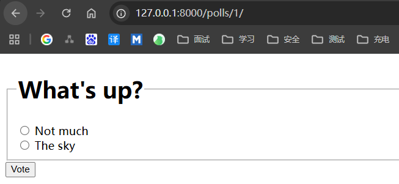
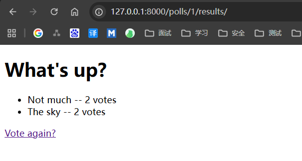

# 编写一个简单的表单

编辑 `polls/detail.html` 内容如下

```html
<!doctype html>
<html lang="en-US">
<head>
    <meta charset="utf-8"/>
    <title>question detail</title>
</head>
<body>
<form action="" method="post">
    
    <fieldset>
        <legend><h1>{{ question.question_text }}</h1></legend>
        <p><strong>{{ error_message }}</strong></p>
        
        <input type="radio" name="choice" id="choice{{ forloop.counter }}" value="{{ choice.id }}">
        <label for="choice{{ forloop.counter }}">{{ choice.choice_text }}</label><br>
        
    </fieldset>
    <input type="submit" value="Vote">
</form>
</body>
</html>
```

说明：
- 上面的模板在 Question 的每个 Choice 前添加一个单选按钮。 每个单选按钮的 `value` 属性是对应的各个 Choice 的 ID。每个单选按钮的 name 是 `choice` 。这意味着，当有人选择一个单选按钮并提交表单提交时，它将发送一个 `POST` 数据 `choice=#` ，其中# 为选择的 `Choice` 的 ID。这是 HTML 表单的基本概念。
- 我们将表单的 `action` 设置为 ``，并设置 `method="post"`。使用 `method="post"` （而不是 `method="get"` ）是非常重要的，因为提交这个表单的行为将改变服务器端的数据。当你创建一个改变服务器端数据的表单时，使用 `method="post"`。`forloop.counter` 指示 `for` 标签已经循环多少次。
- 由于我们创建一个 `POST` 表单（它具有修改数据的作用），所以我们需要小心跨站点请求伪造。因为 Django 自带了一个非常有用的防御系统。 简而言之，所有针对内部 `URL` 的 `POST` 表单都应该使用 `` 模板标签。

我们为投票应用创建了一个 URLconf ，`polls/urls.py`文件包含这一行：
```html
path("<int:question_id>/vote/", views.vote, name="vote"),
```

编辑`polls/views.py`的vote，内容如下
```py
from django.db.models import F
from django.http import HttpResponse, HttpResponseRedirect
from django.shortcuts import get_object_or_404, render
from django.urls import reverse

from .models import Choice, Question


def vote(request, question_id):
    question = get_object_or_404(Question, pk=question_id)
    try:
        selected_choice = question.choice_set.get(pk=request.POST["choice"])
    except (KeyError, Choice.DoesNotExist):
        # Redisplay the question voting form.
        return render(
            request,
            "polls/detail.html",
            {
                "question": question,
                "error_message": "You didn't select a choice.",
            },
        )
    else:
        selected_choice.votes = F("votes") + 1
        selected_choice.save()
        # Always return an HttpResponseRedirect after successfully dealing
        # with POST data. This prevents data from being posted twice if a
        # user hits the Back button.
        return HttpResponseRedirect(reverse("polls:results", args=(question.id,)))
```
说明：
- request.POST 是一个类字典对象，让你可以通过关键字的名字获取提交的数据。 这个例子中， `request.POST['choice']` 以字符串形式返回选择的 `Choice` 的 `ID`。 `request.POST` 的值永远是字符串。
- 注意，Django 还以同样的方式提供 `request.GET` 用于访问 GET 数据 —— 但我们在代码中显式地使用 `request.POST` ，以保证数据只能通过 `POST` 调用改动。
- `如果在 request.POST['choice']` 数据中没有提供 `choice` ， `POST` 将引发一个 `KeyError` 。上面的代码检查 `KeyError` ，如果没有给出 `choice` 将重新显示 `Question` 表单和一个错误信息。
- `F("votes") + 1` 指示数据库 将投票数增加 1。
- 在增加 `Choice` 的得票数之后，代码返回一个 `HttpResponseRedirect` 而不是常用的 `HttpResponse` 、 `HttpResponseRedirect` 只接收一个参数：用户将要被重定向的 `URL`。
- 正如上面的 `Python` 注释指出的，在成功处理 `POST` 数据后，你应该总是返回一个 `HttpResponseRedirect`。这不是 `Django` 的特殊要求，这是那些优秀网站在开发实践中形成的共识。

在这个例子中，我们在 `HttpResponseRedirect` 的构造函数中使用 `reverse()` 函数。这个函数避免了我们在视图函数中硬编码 `URL`。它需要我们给出我们想要跳转的视图的名字和该视图所对应的 `URL` 模式中需要给该视图提供的参数。中设定的 URLconf， reverse() 调用将返回一个这样的字符串：
```python
"/polls/3/results/"
```

重定向的 URL 将调用 'results' 视图来显示最终的页面。修改 `polls/view.py` 的 `results` 方法
```python
from django.shortcuts import get_object_or_404, render


def results(request, question_id):
    question = get_object_or_404(Question, pk=question_id)
    return render(request, "polls/results.html", {"question": question})
```

编写 `polls/results.html` 模版
```html
<h1>{{ question.question_text }}</h1>

<ul>

    <li>{{ choice.choice_text }} -- {{ choice.votes }} vote{{ choice.votes|pluralize }}</li>

</ul>

<a href="">Vote again?</a>
```

现在，在你的浏览器中访问 /polls/1/ 然后为 Question 投票。你应该看到一个投票结果页面，并且在你每次投票之后都会更新。 如果你提交时没有选择任何 Choice，你应该看到错误信息。





# 使用通用视图：代码还是少点好
