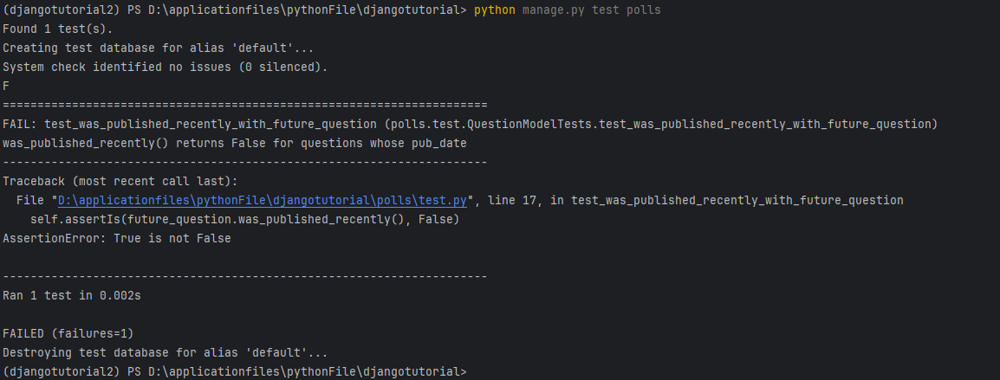

# 背景
测试的目的，暴露问题

# 前提要有bug
例如我们的需求是：我们的要求是如果 Question 是在一天之内发布的，`Question.was_published_recently()` 方法将会返回 True ，然而现在这个方法在 Question 的 pub_date 字段比当前时间还晚时也会返回 True（这是个 Bug）。

测试
```shell
conda activate djangotutorial2

python manage.py shell

import datetime
from django.utils import timezone
future_question = Question(pub_date=timezone.now() + datetime.timedelta(days=30))
future_question.was_published_recently()

```


## 创建一个测试来暴露这个 bug¶
把上面的修改成自动化

创建文件 `/polls/test.py` 内容如下：
```python
import datetime

from django.test import TestCase
from django.utils import timezone

from .models import Question


class QuestionModelTests(TestCase):
    def test_was_published_recently_with_future_question(self):
        """
        was_published_recently() returns False for questions whose pub_date
        is in the future.
        """
        time = timezone.now() + datetime.timedelta(days=30)
        future_question = Question(pub_date=time)
        self.assertIs(future_question.was_published_recently(), False)
```

我们创建了一个 `django.test.TestCase` 的子类，并添加了一个方法，此方法创建一个 `pub_date` 时未来某天的 `Question` 实例。然后检查它的 `was_published_recently()` 方法的返回值——它 应该 是 `False`。

运行测试
`python manage.py test polls`



过程说明：
- `python manage.py test polls` 将会寻找 `polls` 应用里的测试代码
- 它找到了 `django.test.TestCase` 的一个子类
- 它创建一个特殊的数据库供测试使用
- 在类中寻找测试方法——以 `test` 开头的方法
- 在 `test_was_published_recently_with_future_question` 方法中，它创建了一个 `pub_date` 值为 `30` 天后的 `Question` 实例。
- 接着使用 `assertls()` 方法，发现 `was_published_recently()` 返回了 `True`，而我们期望它返回 `False`

## 修复这个 bug
当 `pub_date` 为未来某天时， `Question.was_published_recently()` 应该返回 `False`。我们修改 `models.py` 里的方法，让它只在日期是过去式的时候才返回 `True`：

