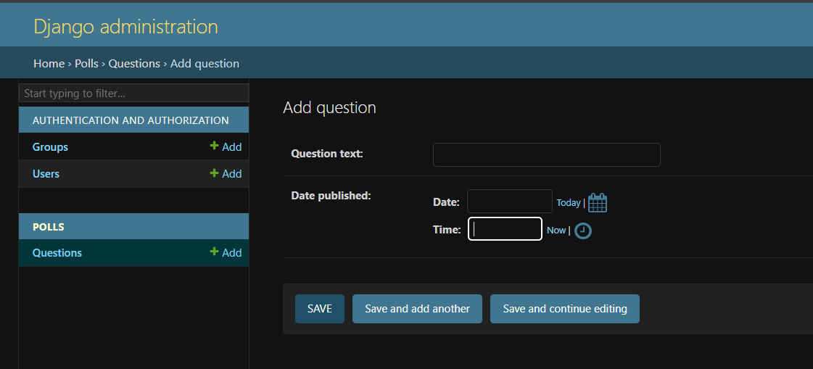

# 昨天使用的是基本启动

设置数据库建立模型


settings.py

时区配置
TIME_ZONE = 'Asia/Shanghai'

INSTALLED_APPS配置中包含了默认应用
INSTALLED_APPS配置中包含了默认应用
- django.contrib.admin  管理员站点
- django.contrib.auth      权限框架
- django.contrib.contenttypes   内容类型框架
- django.contrib.sessions     会话框架
- django.contrib.message      消息框架   
- django.contrib.staticfiles    静态文件管理


## 创建数据库

基础表迁移命令

python manage.py migrate

这些基础表是来源于INSTALLED_APPS配置，如果不需要可以删除和注释

默认数据库连接是SQLite


## 创建模型

模型配置文件polls/models.py
添加内容

```python
from django.db import models


class Question(models.Model):
    question_text = models.CharField(max_length=200)
    pub_date = models.DateTimeField("date published")


class Choice(models.Model):
    question = models.ForeignKey(Question, on_delete=models.CASCADE)
    choice_text = models.CharField(max_length=200)
    votes = models.IntegerField(default=0)
```

内容说明：
定义了两个模型：问题 Question 和选项 Choice
每个模型都是继承models.Model
这个有点类似JPA
Question包含 字段 question_text 类型 由 models.CharField(max_length=200) 定义

默认值
default=0

使用ForeignKey 定义了一个关系，每个Choice都关联到一个Question对象，常用的：一对一，一对多，多对一，看起来很像之前的hibernate


激活模型

首先需要添加到模型
`INSTALLED_APPS` 中添加
`'polls.apps.PollsConfig',`

执行下面命令激活

` python manage.py makemigrations`

在使用 `makemigrations` 命令， Django 会检测你对模型文件的修改，并且把修改的部分储存为一次 迁移。

文件变更会被存储在 `polls/migrations/0001_initial.py` 文件中。

把模型变更同步到数据库
```python
python manage.py migrate
```

日志信息


说明
- 数据库的表名是由应用名(polls)和模型名的小写形式( question 和 choice)连接而来
- 主键(IDs)会被自动创建
- 默认的，Django 会在外键字段名后追加字符串 "_id"
- 外键关系由 FOREIGN KEY 生成。请在事务全都执行完之后再创建外键关系
- 它是为你正在使用的数据库定制的，因此特定于数据库的字段类型，例如“auto_increment”（MySQL）、“bigint PRIMARY KEY GENERATED BY DEFAULT AS IDENTITY”（PostgreSQL）或“integer primary key autoincrement” `` (SQLite) 会自动为您处理。 字段名称的引用也是如此——例如，使用双引号或单引号。
- 这个 `sqlmigrate` 命令并没有真正在你的数据库中的执行迁移 - 相反，它只是把命令输出到屏幕上，让你看看 Django 认为需要执行哪些 SQL 语句。这在你想看看 Django 到底准备做什么，或者当你是数据库管理员，需要写脚本来批量处理数据库时会很有用。


 
可以执行下面命令检查是否有项目问题  
```python
python manage.py check ;
```

这个 `migrate` 命令选中所有还没有执行过的迁移（Django 通过在数据库中创建一个特殊的表 `django_migrations` 来跟踪执行过哪些迁移）并应用在数据库上 - 也就是将你对模型的更改同步到数据库结构上。

迁移是非常强大的功能，它能让你在开发过程中持续的改变数据库结构而不需要重新删除和创建表 - 它专注于使数据库平滑升级而不会丢失数据。我们会在后面的教程中更加深入的学习这部分内容，现在，你只需要记住，改变模型需要这三步：

1. 编辑 `models.py` 文件，改变模型。
2. 运行 `python manage.py makemigrations` 为模型的改变生成迁移文件。
3. 运行 `python manage.py migrate` 来应用数据库迁移。

更多信息可以查看 [django-admin 和 manage.py](https://docs.djangoproject.com/zh-hans/5.2/ref/django-admin/)

## API

使用下面命令可以进入api中进行查询
```python
python manage.py shell
```
常见的命令
查询表中所有数据

```python
Question.objects.all()
```

插入数据
```
>>> from django.utils import timezone
>>> q = Question(question_text="What's new?", pub_date=timezone.now())
>>> q.save()
>>> q.id
```


修改
```
q.question_text = "What's up?"
q.save()
```


上面查看表中的数据是 <Question: Question object (1)> 对象，可以使用 __str__() 来修复

例如
```python
from django.db import models


class Question(models.Model):
    # ...
    def __str__(self):
        return self.question_text


class Choice(models.Model):
    # ...
    def __str__(self):
        return self.choice_text
```


### 自定义方法


添加方法
```python
import datetime

from django.utils import timezone
from django.db import models

class Question(models.Model):
    question_text = models.CharField(max_length=200)
    pub_date = models.DateTimeField("date published")
    def __str__(self):
        return self.question_text
    def was_published_recently(self):
        return self.pub_date >= timezone.now() - datetime.timedelta(days=1)
```


保存之后重新进入shell
```python
python manage.py shell
```

查询展示题目信息
```shell
Question.objects.all()
```

根据字段过滤
```shell
Question.objects.filter(id=1)
```
以什么开头
```shell
Question.objects.filter(question_text__startswith="What")
```
时间转年进行过滤
```
from django.utils import timezone
current_year = timezone.now().year
Question.objects.get(pub_date__year=current_year)
```
获取不存在的，会异常
```
Question.objects.get(id=2)
```
异常信息如下
```
Traceback (most recent call last):
...
DoesNotExist: Question matching query does not exist.
```


调用自定义方法
```
q = Question.objects.get(pk=1)
q.was_published_recently()
```
查询习题关联的选项
```
q.choice_set.all()
```
添加选项
```
q.choice_set.create(choice_text="Not much", votes=0)
q.choice_set.create(choice_text="The sky", votes=0)
c = q.choice_set.create(choice_text="Just hacking again", votes=0)
```

查询选项关联的习题

```
c.question
```

查询习题所有选项
```
q.choice_set.all()
```
查询选项数量
```
q.choice_set.count()
```

关联查询过滤
```
Choice.objects.filter(question__pub_date__year=current_year)
```

删除选项
```
c = q.choice_set.filter(choice_text__startswith="Just hacking")
c.delete()
```

更多方法

多个模型之间的关系
[关联对象参考](https://docs.djangoproject.com/zh-hans/5.2/ref/models/relations/)

[双下划线方法](https://docs.djangoproject.com/zh-hans/5.2/topics/db/queries/#field-lookups-intro)

[数据库相关文档](https://docs.djangoproject.com/zh-hans/5.2/topics/db/queries/)

## Django 管理页面

创建账号
```
python manage.py createsuperuser
```

根据提示输入账号邮箱密码即可

管理员登录地址
```
http://127.0.0.1:8000/admin/
```


里面的用户和组是 django.contrib.auth 框架提供的

但是我们的应用这个页面是看不见的
需要在
polls/admin.py中注册
内容如下
```
from django.contrib import admin

from .models import Question

admin.site.register(Question)
```


同时提供了一些简单的操作




[代码库](https://github.com/gugxl/djangotutorial)