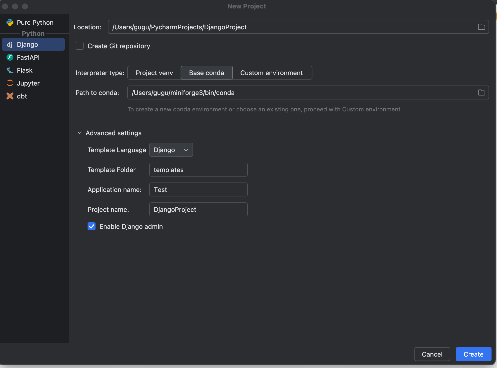
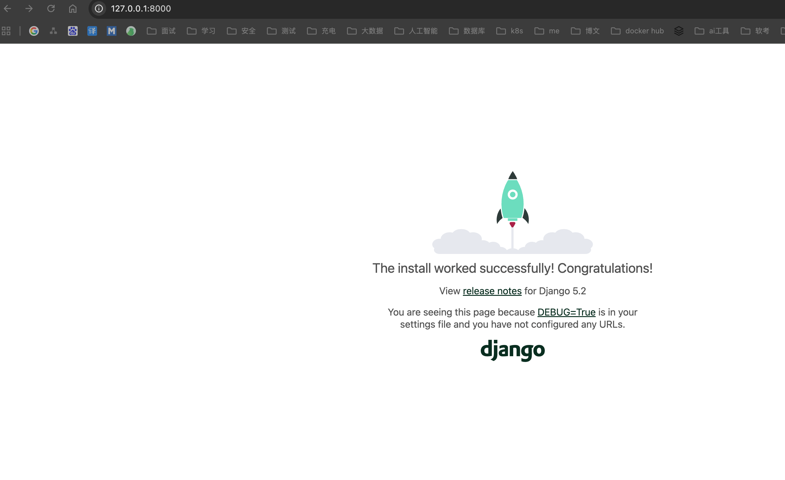
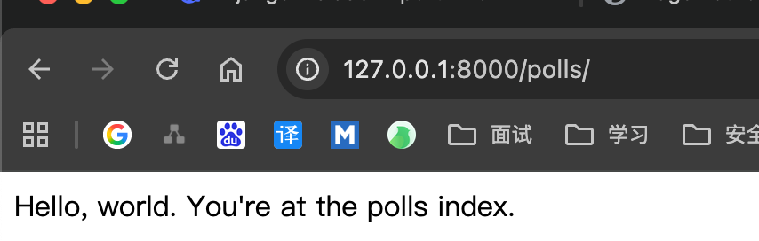

熟悉过程
1. 搭建环境，运行起来
2. 基础请求到服务接口
3. 跟java web对比

说明先不纠结细节先跑起来再说
# 1. 环境搭建


python已经安装，使用conda管理
django安装
[django官方文档](https://docs.djangoproject.com/zh-hans/5.2/intro/tutorial01/)
```bash
pip install django
```




也可以命令创建
```bash
mkdir djangotutorial
django-admin startproject mysite djangotutorial
```

```bash
djangotutorial/
    manage.py
    mysite/
        __init__.py
        settings.py
        urls.py
        asgi.py
        wsgi.py
```

结构说明
- manage.py: 一个让你用各种方式管理 Django 项目的命令行工具。你可以阅读 django-admin 和 manage.py 
- mysite/: 一个目录，它是你项目的实际 Python 包。它的名称是你需要用来导入其中任何内容的 Python 包名称（例如 mysite.urls）。
- mysite/__init__.py：一个空文件，告诉 Python 这个目录应该被认为是一个 Python 包。
- mysite/settings.py：Django 项目的配置文件。
- mysite/urls.py：Django 项目的 URL 声明，就像你网站的“目录”。其实就是请求到地址
- mysite/asgi.py：作为你的项目的运行在 ASGI 兼容的 Web 服务器上的入口。
- mysite/asgi.py：作为你的项目的运行在 ASGI 兼容的 Web 服务器上的入口。

命令启动
```bash
python manage.py runserver
```

访问地址
```
http://127.0.0.1:8000/
```



## 创建应用
进入项目目录
```bash
python manage.py startapp polls
```
创建polls 目录结构 其实是类似子应用的东西
```bash
polls/
    __init__.py
    admin.py
    apps.py
    migrations/
        __init__.py
    models.py
    tests.py
    views.py
```


polls/views.py 视图,应该是类似java的Controller
```python
from django.shortcuts import render
from django.http import HttpResponse

def index(request):
    return HttpResponse("Hello, world. You're at the polls index.")
```

polls/urls.py。 这个是url的映射，主要是请求路径映射到views的那个方法
```python
from django.urls import path
from . import views

urlpatterns = [
    path('', views.index, name='index'),
]
```

mysite/urls.py 需要把子应用的请求路径声明映射到主应用上

```python
from django.contrib import admin
from django.urls import include, path

urlpatterns = [
    path("polls/", include("polls.urls")),
    path("admin/", admin.site.urls),
]
```

启动
python manage.py runserver


访问


对比的话感觉这个项目更想是整个微服务系统，总系统进行管理，比如url定义，子系统用来实现对应功能。还有待继续学习


## windows 使用 conda 管理环境
创建环境
``` bash
conda create -n djangotutorial2 python=3.11 -y
```
初始化 
```bash
conda init
```
**关闭窗口重新打开**

激活
``` bash
conda activate djangotutorial2
```
安装其他依赖
```bash
pip install django
```