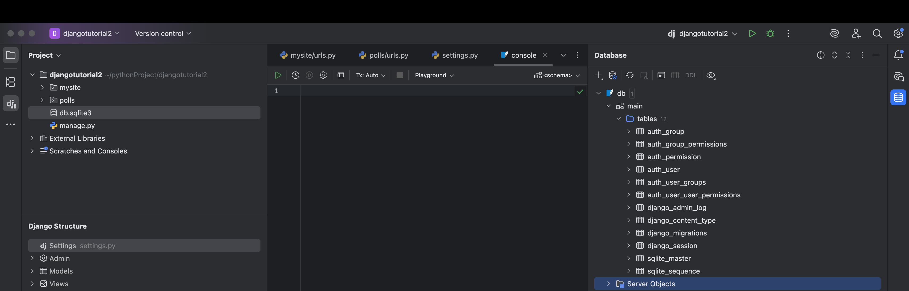

# 昨天使用的是基本启动

设置数据库建立模型


settings.py

时区配置
TIME_ZONE = 'Asia/Shanghai'

INSTALLED_APPS配置中包含了默认应用
- django.contrib.admin  管理员站点
- django.contrib.auth      权限框架
- django.contrib.contenttypes   内容类型框架
- django.contrib.sessions     会话框架
- django.contrib.message      消息框架   
- django.contrib.staticfiles    静态文件管理


## 创建数据库

基础表迁移命令

python manage.py migrate

这些基础表是来源于INSTALLED_APPS配置，如果不需要可以删除和注释

默认数据库连接是SQLite



## 创建模型

模型配置文件polls/models.py
添加内容

```python
from django.db import models


class Question(models.Model):
    question_text = models.CharField(max_length=200)
    pub_date = models.DateTimeField("date published")


class Choice(models.Model):
    question = models.ForeignKey(Question, on_delete=models.CASCADE)
    choice_text = models.CharField(max_length=200)
    votes = models.IntegerField(default=0)
```

内容说明：
定义了两个模型：问题 Question 和选项 Choice
每个模型都是继承models.Model
这个有点类似JPA
Question包含 字段 question_text 类型 由 models.CharField(max_length=200) 定义

默认值
default=0

使用ForeignKey 定义了一个关系，每个Choice都关联到一个Question对象，常用的：一对一，一对多，多对一，看起来很像之前的hibernate


激活模型

首先需要添加到模型
INSTALLED_APPS中添加
    'polls.apps.PollsConfig',

执行下面命令激活

python manage.py makemigrations polls

在使用make

