@[TOC](Deepseek + RAGFlow 搭建本地知识库问答系统)

技术 `ollama + docker + RAGFlow`

# 原因
1.为什么要本地部署，不直接使用现有的DeepSeek?

2.为什么要使用`RAG`技术?`RAG`和模型微调的区别?

3.本地部署全流程

## 为什么要本地部署
本地部署优点
1. 保证数据隐私，联网大模型会把数据传输到官方服务器。
2. 可以解除文件大小限制，使用知识库，网页版上传一般对文件大小是有限制的
3. 网页上传如果针对很多文件的话，每次都要上传，下载，修改，删除，操作很麻烦

所以采用 本地部署`Deepseek `+ 知识库(个性化知识库，操作处理)

个性化知识库 一般采用 `RAG` （`Retrieval-Augmented Generation`，检索增强生成），使用开源框架 `RAGFlow`。

## RAG模型和微调模型区别

一般情况下当大模型不了解你的知识的时候就开始出现“幻觉”问题。微调是在原有模型的基础上，结合特定任务的数据集进一步对其进行训练，使模型在这领域表现更好。（类似与考前复习，模型通过对应的训练消化好知识，然后对这一领域相关内容进行回复）。   
`RAG`主要分检索（`Retrieval`）、增强（`Augmented`）、生成（`Generation`）三步。  
- 检索：用户提出问题后，从外部知识库中检索出与用户问题相关的
- 增强：系统将检索到的信息和用户输入相结合，扩展模型的上下文。让生成模型可以利用外部知识，使生成的答案更准确和丰富。
- 生成：生成模型基于增强后的输入生成最终答案。结合用户输入和检索到的信息，生成符合逻辑、准确和可读的文本内容。

## 本地部署流程
### 1. 下载 `ollama` ，通过`ollama`把`Deepseek`模型下载到本地运行。
ollama是一个本地运行和管理大语言模型（LLM）的工具。

[官网下载地址](https://ollama.com/download)

安装后查看是否安装成功
在`cmd`或者终端中执行：
```shell
ollama -v
```
输出版本即为正常安装：
如果虚拟机要访问本地的`ollama`需要配置环境变量
```shell
OLLAMA_HOST=0.0.0.0:11434
```

查看配置结果
```shell
set ollama
```
正常输入如下
```shell
OLLAMA_HOST=0.0.0.0:11434
```
浏览器访问验证：
```
http://127.0.0.1:11434/
```
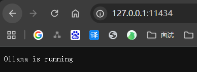

下载并运行`deepseek-r1:7b`（当然可以根据自己的电脑的配置使用不同的模型）
```shell
ollama run deepseek-r1:7b
```
可能要几分钟时间， 出现下面界面即为启动成功
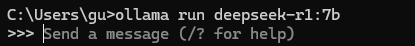

可以输入问题提问下
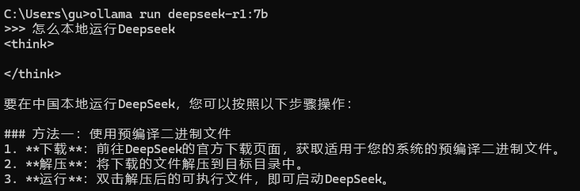

### 2. 下载`RAGFlow` 源代码和 `Docker` ，通过`Docker`部署`RAGFlow`。
前提需要有`Docker`进行安装和部署（这里不做介绍了），也需要`docker compose`，直接安装最新版本即可

[github上官网中文地址](https://github.com/infiniflow/ragflow/blob/main/README_zh.md)
下载`ragflow`源码
```shell
git clone https://github.com/infiniflow/ragflow.git
```
下载完成之后找到这个文件，因为我们使用的是完整的模型,有的配置需要改一下
文件位置`ragflow\docker\.env`

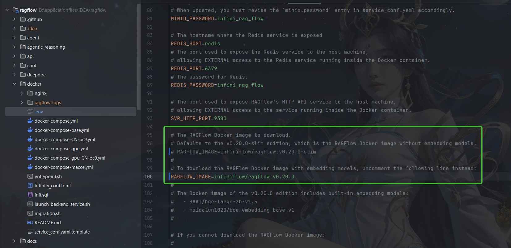
说明： `v0.20.0` 是版本号，可能会随着`RAGFlow`迭代发生变化，
带slim的是精简的模型需要配置外部向量化，这里直接使用完整的模型，方便简化配置

进入到docker路径下启动
```shell
cd ragflow\docker
docker compose up -d
```
这个过程会下载镜像和模型可能需要一段时间，启动完成之后
浏览器访问
```
http://localhost
```

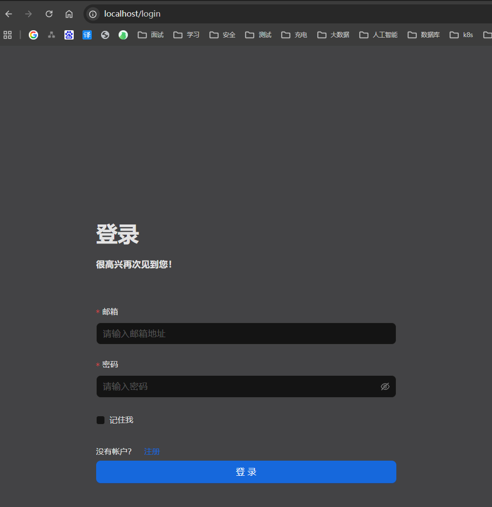

先注册后登录

### 3. 在`RAGFlow`中构建个人知识库并基于个人知识库的对话问答。

进行绑定知识库和模型
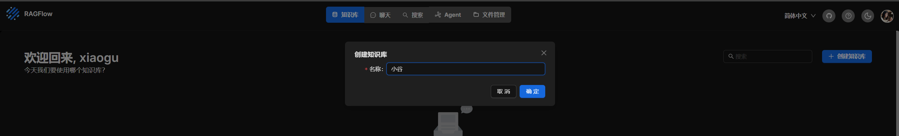

进行本地模型创建
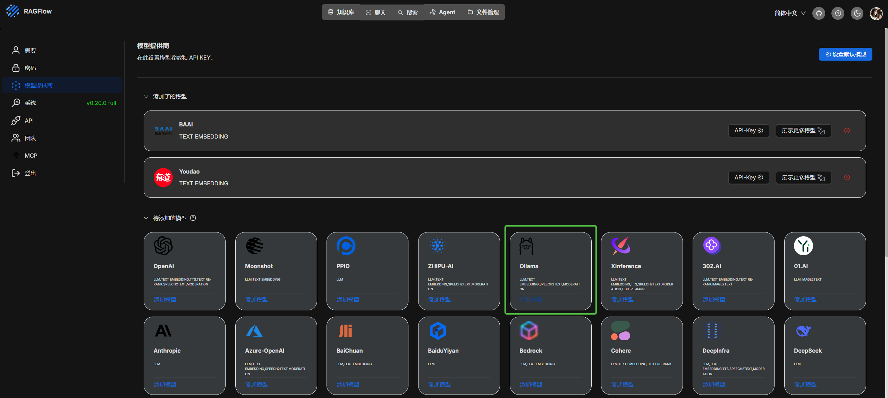
类型: `chat`  
模型名称:  `deepseek-r1:7b`    就是 `ollama` 本地运行的,可以通过 `ollama list` 查看  
基础Url     `http://127.0.0.1:11434` 但是我是`docker`容器访问本地，配置的是 `http://host.docker.internal:11434`  
最大`token`数 这个可以自己配置  

如果是服务器上的模型配置他们对应的 `api key` 和地址即可  

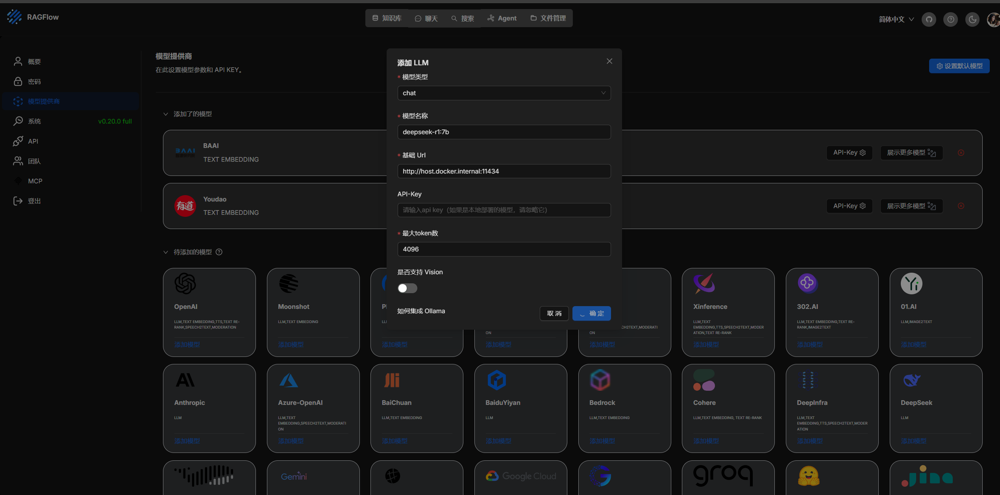

上传并解析文件
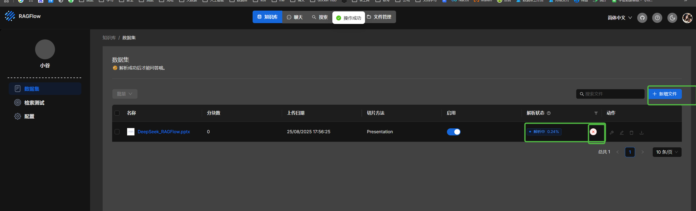

创建助理
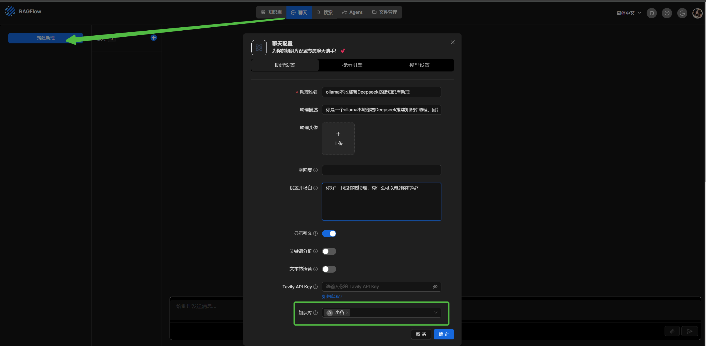

尝试使用

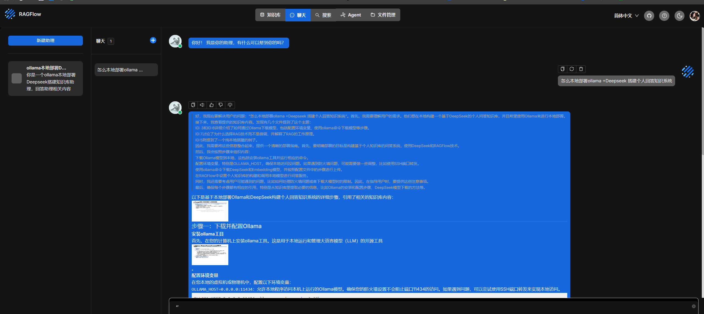