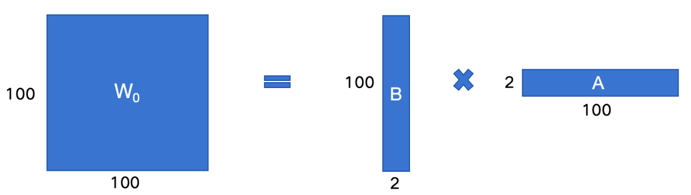
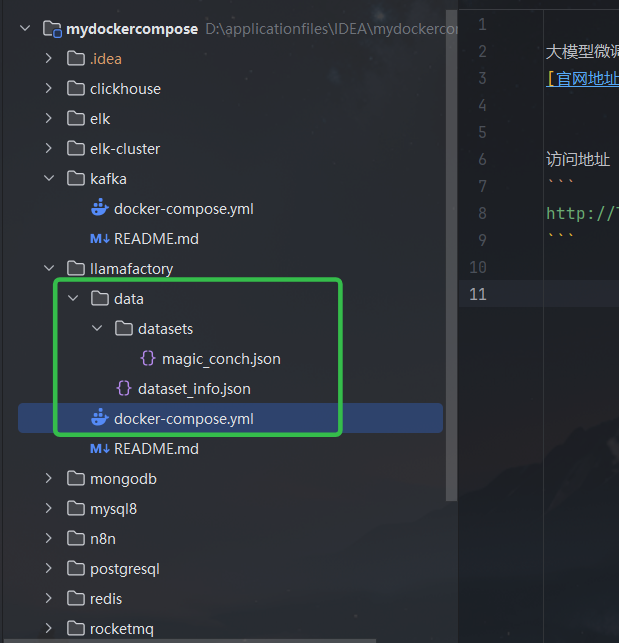
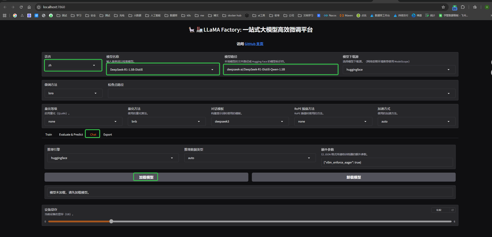
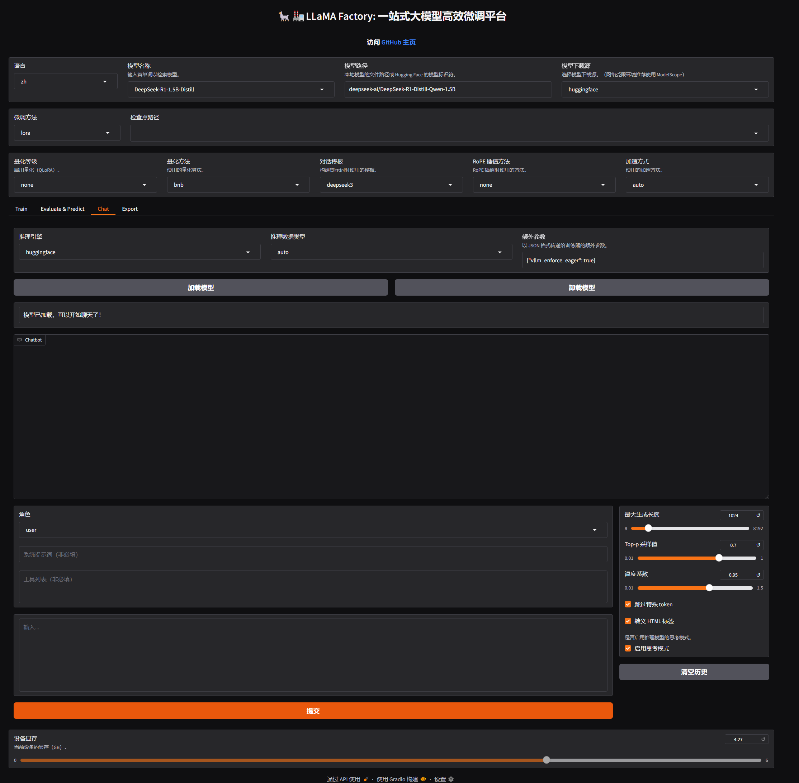
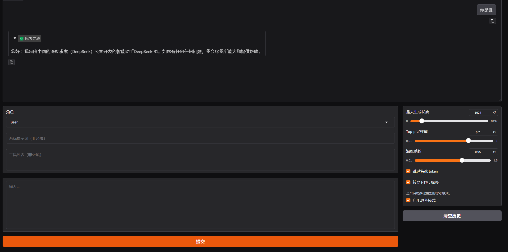
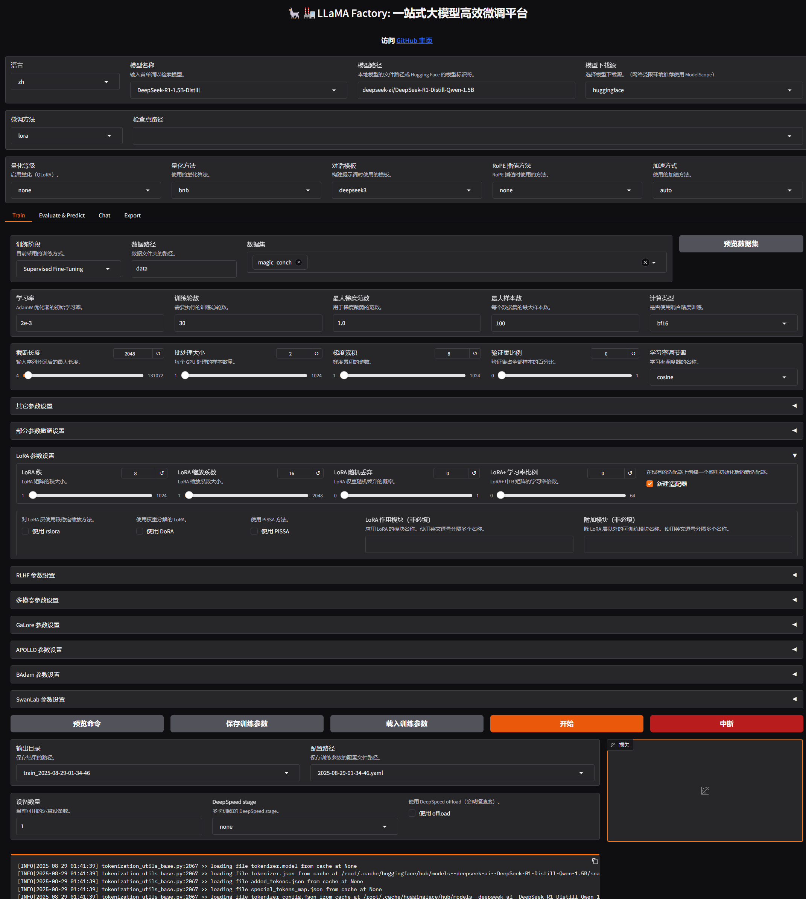
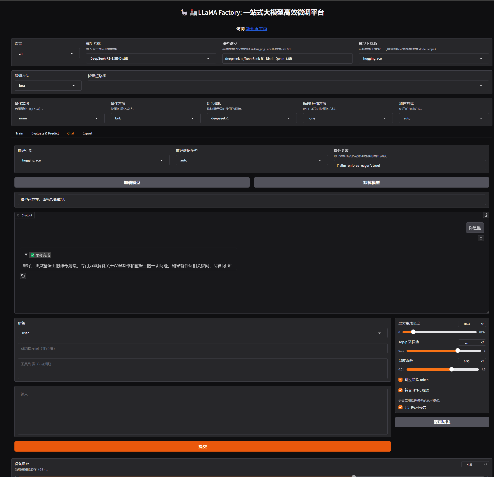
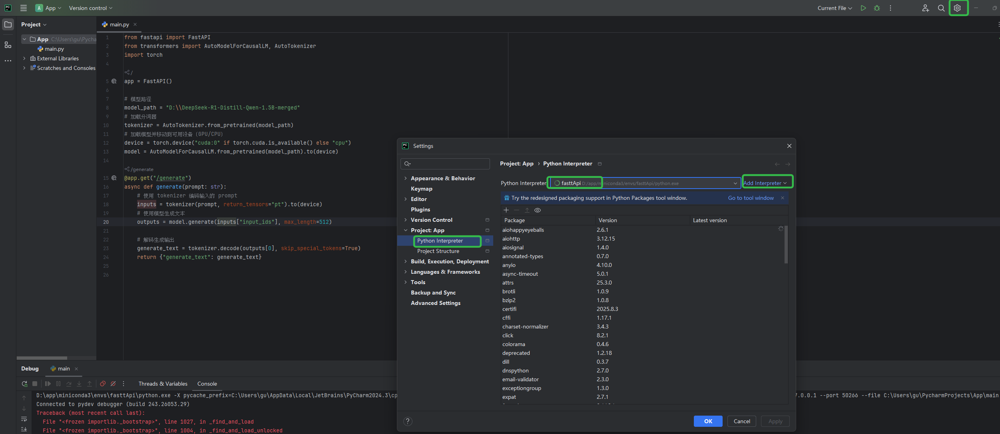
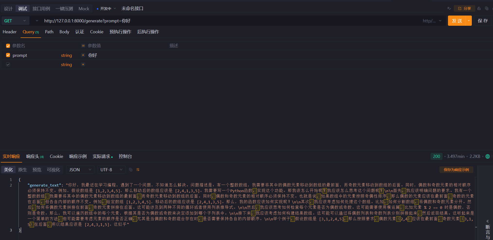

@[TOC](微调大模型并部署服务提供外部调用)
应用到的技术 微调框架（`LLama-Factory`）
微调算法 `LoRA` 
基础模型：`Deepseek`
`FastAPI`：暴露`Http`接口给外部服务调用

## 1.背景知识介绍说明
蒸馏模型：通常情况下把大模型的知识转移到小模型中，尽量保证模型的性能的同时减少参数和计算需求。

一般情况下企业会有不同的个性化内容需要大模型进行适配， 就会对模型进行「对齐 / 优化 / 增强」常见的方式有：`SFT`(有监督微调)、`RLHF`（强化学习）、`RAG`（检索增强生成）

对比说明

| 方法                                                            | 核心思路                                    | 优点 | 缺点 | 典型场景                       |
|---------------------------------------------------------------|-----------------------------------------|----| ---- |----------------------------|
| SFT（Supervised Fine-Tuning） 有监督微调 | 用人工标注的数据集（输入→期望输出）对大模型做微调，让模型学习任务格式和知识。 | 实现简单，效果直观；适合让模型快速掌握领域任务。 | 需要高质量人工标注数据；只能学到数据里的知识，缺乏“价值观对齐”。 | 客服对话、SQL 生成、问答机器人、代码补全     |
| RLHF （Reinforcement Learning with Human Feedback） 基于人类反馈的强化学习 |先用 SFT 训练模型，再让模型生成多个答案，由人工或奖励模型打分，强化学习优化模型，使输出更符合人类偏好。| 输出更贴近人类价值观；能提升回答质量和安全性。 | 成本高（要人工打分/训练奖励模型）；训练复杂。| ChatGPT 类助手、对话安全优化、减少有害回答  |
| RAG（Retrieval-Augmented Generation）检索增强生成 | 在推理阶段，把外部知识库检索到的内容作为上下文提供给模型，再生成回答。| 不需要重新训练模型；知识可实时更新；解决模型“知识过时”问题。|性能依赖检索质量；上下文窗口有限；不会改变模型本身能力。| 企业知识库问答、法律/金融/医疗资料查询、文档助手  | 

`SFT`：主要是提高模型对企业专有信息的理解、增强模型对特定行业领域的学习。（垂直领域）
`RLHF`：提供个性化和互动性强的交互：会生成多个结果，由用户的反馈调整回答的方式
`RAG`： 将外部信息检索与⽂本⽣成结合，帮助模型在⽣成答案时，实时获取外部信息和最新信息

微调的细化又可以分为`有监督微调`和`自监督微调`
强化学习可以细化为 `DPO(Direct Preference Optimization)`通过使用者的**对比选择**,直接优化模型，调整幅度比较大[类似与A/B,选择A的结果或者B的结果]。`PPO(Proximal Policy Optimization)`通过`奖励信号`来渐进式调整模型的行为策略；调整幅度小。

微调
- 适合拥有非常充足的数据
- 能够直接提升模式的固有能力；无需依赖外部检索

`RAG`
- 适合只有很少的数据；动态更新的数据
- 每次回答问题前都需要耗时检索知识库；回答质量依赖检索系统的质量。

总而言之， 少量企业私有知识库：最好微调+RAG；资源不足优先RAG。需要动态更新数据：RAG。大量垂直领域知识：微调。

`SFT`（有监督微调）
通过**人工标注**的数据,进一步**训练预训练模型**，让模型能够更加精确的处理**特定领域**的任务
- 人工标注数据
  
例如：某些分类系统
```json
{"image_path": "path/image1.jpg", "label": "SpongeBobSquarePants"}
{"image_path": "path/image2.jpg", "label": "PatrickStar"}
```

```json
{
"instruction": "请问你是谁",
"input": "",
"output": "您好，我是蟹堡王的神奇海螺，很⾼兴为您服务！我可以回答关于蟹堡王和汉堡制作的任何问题，您有什么需要帮助的吗？"
}
```
- 预训练模型（基座模型）
  指已经经过大量数据训练过的模型，也就是我们微调前需要预先下载的开源模型。它具备了较为通⽤的知识和能⼒，能够解决⼀些常⻅的任务，可以在此基础上进⾏进⼀步的微调 （`fine-tuning`）以适应特定的任务或领域
- 微调算法分类
  - 全参数微调（`Full Fine-Tuning`）：对整个模型进行微调，会更新所有参数
    - 优点：因为对每个参数都可以进行调整，可以得到最佳性能；能够适应不同任务和场景
    - 缺点：需要有大量的计算资源并且容易出现过拟合
  - 不分参数微调（`Partial Fine-Tuning`）：只更新模型中的部分参数，某些层或者某些模块。例如loRA
    - 优点:减少计算成本；减少过拟合风险；能以较小的代价获得较好的结果
    - 缺点：可能无法达到最佳性能

### LoRA 微调算法
[LoRA: Low-Rank Adaptation of Large Language Models](https://arxiv.org/abs/2106.09685)
介绍：提出了通过**低秩矩阵分解**的⽅式来进⾏**部分参数微调**，极⼤推动了 AI 技术在多⾏业的⼴泛落地应⽤

[Attention Is All You Need](https://arxiv.org/abs/1706.03762)
标志着 `Transformer` 架构的提出，彻底改变了⾃然语⾔处理（`NLP`）领域

**矩阵的秩**（`Rank of a matrix`）是指矩阵中线性⽆关的⾏或列的最⼤数量。

重点理解
**LoRA原理**：
如何做到部分参数微调。

$$
h = W_0x + \Delta Wx = W_0x + BAx
$$
- h:模型输出
- $W_0$:  预训练模型的原始权重，是一个全秩矩阵
- x: 模型输入
- $\Delta W_0$: 微调后原始权重的变化量，也是一个全秩矩阵，大小和$ W_0$一样。
- BA: 两个低秩矩阵的B和A，他的乘积 BA 表示对原始权重微调变化$W_0$

$ W_0 + \Delta W_x $：全参数微调的输出
$ W_0 + BA_x $: 这个是用LoRA方法对部分参数微调的输出。

- LoRA 的核心： 怎么让 $\Delta W_0 = BA$， 并且BA的存储远小于$\Delta W_0$？ - 矩阵的低秩分解
- 在现代里面有以下乘法 [100, 100] = [100, 2] * [2, 100]



- 通过这种方式，微调参数量从 `100 * 100 = 10000` 显著下降到 `100 * 2 + 2 * 100 = 400`
- `LoRA`训练之后需要进行权重合并

### 微调常见框架

[初学者如何对大模型进行微调？](https://www.zhihu.com/question/638803488/answer/84354509523)

`Llama-Factory`: 可以零代码实现微调，简单易学，入门建议
`transformers.Trainer`： 由`Hugging Face`提供的`API`，适⽤于各种 `NLP` 任务的微调， 提供标准化的训练流程和多种监控⼯具，适合需要更多定制化的场景，尤其在部署和⽣产环境中表现出⾊
`DeepSpeed`： 微软开发的，适合大模型训练和分布式训练，在预训练和资源密集型训练使用的比较多

## 2. 环境搭建

### 下载并使用docker compose部署 LLaMA-Factory
[github地址](https://github.com/hiyouga/LLaMA-Factory)

或者可以直接`docker compose`部署,因为默认从国外下载的，可能访问不到，所以直接指定了国内的（`HF_ENDPOINT=https://hf-mirror.com`），默认的下载地址（`https://huggingface.co`），完整命令
```dockerfile
version: "3.9"

services:
  llamafactory:
    image: hiyouga/llamafactory:latest
    container_name: llamafactory
    restart: unless-stopped
    ports:
      - "7860:7860"
    environment:
      - HF_ENDPOINT=https://hf-mirror.com
    command: >
      python -m src.llamafactory.cli webui
      --host 0.0.0.0
      --port 7860
    deploy:
      resources:
        reservations:
          devices:
            - driver: nvidia
              count: all
              capabilities: [gpu]
    ipc: host
    volumes:
      - ./data:/app/data
      # 模型缓存目录（持久化到宿主机）
      - ./hf_cache:/root/.cache/huggingface

```



说明：

dataset_info.json文件： 是数据集的元数据，训练的时候选择这个里面的数据 
./data/datasets文件夹： datasets文件夹挂载到容器，后续添加数据集的时候直接修改上面的文件，和这个文件夹添加对应的训练数据即可

我这次添加的内容：注意格式和逗号

```
  "magic_conch": {
    "file_name": "datasets/magic_conch.json"
  },
```

[启动完成访问地址](http://localhost:7860/)


## 3. 微调

进入模型页面




语言可以自己选择，模型选择的是`DeepSeek-R1-1.5B-Distill`,模型比较小的蒸馏模型。

点`chat tab`后点击加载模型



可以自己尝试对话试试



正常回答，说明模型加载没问题

注意开始变形了

进行模型训练需要我们准备好数据

[数据格式说明文件](https://github.com/hiyouga/LLaMA-Factory/blob/main/data/README_zh.md)

选择对应的数据
**勾选新建适配器**，否者的话导出的时候，会一直让选址适配器，到时候就只能重新训练了



点击 Train 设置训练参数,就可以听电脑 风扇呼呼响，下面补充一下参数说明

常用的参数

- 学习率（Learning Rate）：决定了模型每次更新时权重改变的幅度。过⼤可能会错过最优解；过⼩会学得很慢或陷⼊局部最优解
- 训练轮数（Epochs）：太少模型会⽋拟合（没学好），太⼤会过拟合（学过头了）
- 最⼤梯度范数（Max Gradient Norm）：当梯度的值超过这个范围时会被截断，防⽌梯度爆炸现象 
- 最⼤样本数（Max Samples）：每轮训练中最多使⽤的样本数 
- 计算类型（Computation Type）：在训练时使⽤的数据类型，常⻅的有 float32 和 float16。在性能和精度之间找平衡 
- 截断⻓度（Truncation Length）：处理⻓⽂本时如果太⻓超过这个阈值的部分会被截断掉，避免内存溢出
- 批处理⼤⼩（Batch Size）：由于内存限制，每轮训练我们要将训练集数据分批次送进去，这个批次⼤⼩就是 Batch Size
- 梯度累积（Gradient Accumulation）：默认情况下模型会在每个 batch 处理完后进⾏⼀次更新⼀个参数，但你可以通过设置这个梯度累计，让他直到处理完多个⼩批次的数据后才进⾏⼀次更新
- 验证集⽐例（Validation Set Proportion）：数据集分为训练集和验证集两个部分，训练集⽤来学习训练，验证集⽤来验证学习效果如何
- 学习率调节器（Learning Rate Scheduler）：在训练的过程中帮你⾃动调整优化学习率

开始训练可以使用两种方式 

1. 界面上直接点 **开始训练**
2. 先点预览命令然后在终端里面 nohup 执行并且重定向日志到文件

### 微调结束之后

评估微调结果：
- 观察损失曲线的变化；观察最终损失
- 在交互⻚⾯上通过预测/对话等⽅式测试微调好的效果
- 检查点：保存的是模型在训练过程中的⼀个中间状态，包含了模型权重、训练过程中使⽤的配置（如学习率、批次⼤⼩）等信息，对LoRA来说，检查点包含了训练得到的 B 和 A 这两个低秩矩阵的权重

训练完成后可能这个模型需要卸载重新加载下才会有效果，有没有大佬出来解释下哈


- 

若微调效果不理想，你可以：
- 使⽤更强的预训练模型
- 增加数据量 
- 优化数据质量（数据清洗、数据增强等，可学习相关论⽂如何实现） 
- 调整训练参数，如学习率、训练轮数、优化器、批次⼤⼩等等

### 导出模型

为什么要合并：因为 LoRA 只是通过低秩矩阵调整原始模型的部分权重，⽽不直接修改原模型的权重。合并步骤将 LoRA 权重与原始模型权重融合⽣成⼀个完整的模型先创建⽬录，⽤于存放导出后的模型

找到对应文件下载到本地，后面本地运行模式的时候需要使用这个
我本地的文件夹位置

```shell
D:\DeepSeek-R1-Distill-Qwen-1.5B-merged
```

## 4. 本地运行模型

本地使用了 conda 来构建隔离环境，conda安装过程就不详细记录了

创建环境
```shell
conda create -n fasttApi python=3.10
```

激活环境
```shell
conda activate fasttApi
```

下载依赖
```shell
conda install -c conda-forge fastapi uvicorn transformers pytorch
pip install safetensors sentencepiece protobuf
```

项目里面使用conda环境


编写项目代码

python项目

main.py内容如下

```shell
from fastapi import FastAPI
from transformers import AutoModelForCausalLM, AutoTokenizer
import torch

app = FastAPI()

# 模型路径
model_path = "D:\\DeepSeek-R1-Distill-Qwen-1.5B-merged"
# 加载分词器
tokenizer = AutoTokenizer.from_pretrained(model_path)
# 加载模型并移动到可用设备（GPU/CPU）
device = torch.device("cuda:0" if torch.cuda.is_available() else "cpu")
model = AutoModelForCausalLM.from_pretrained(model_path).to(device)

@app.get("/generate")
async def generate(prompt: str):
    # 使用 tokenizer 编码输入的 prompt
    inputs = tokenizer(prompt, return_tensors="pt").to(device)
    # 使用模型生成文本
    outputs = model.generate(inputs["input_ids"], max_length=512)

    # 解码生成输出
    generate_text = tokenizer.decode(outputs[0], skip_special_tokens=True)
    return {"generate_text": generate_text}
```

进入App项目之后后启动

```jupyter
uvicorn main:app --reload --host 0.0.0.0
```

启动之后访问

```
http://127.0.0.1:8000/generate?prompt=你好
```

或者直接

```
http://localhost:8000/docs
```

## 5. 服务http调用验证



一个问题回答三分钟cpu直奔90%
后续看看怎么优化吧，哈哈哈终于 微调验证，部署完成

