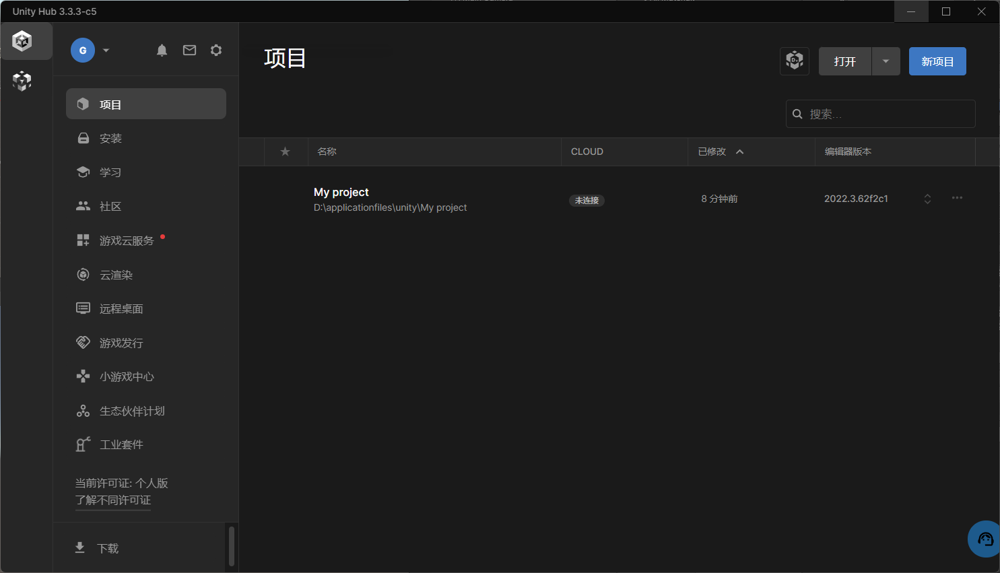
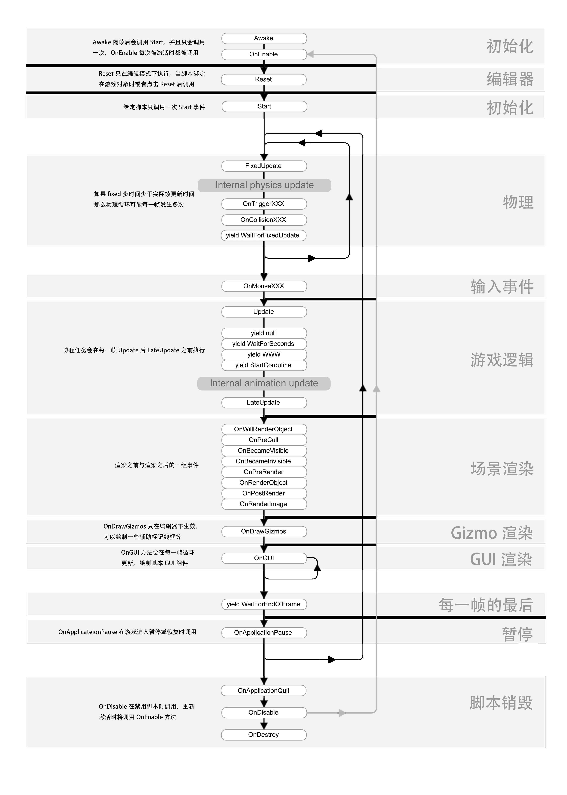

# Unity 学习

基础语言 C# 不进行记录了

[中文官方文档](https://docs.unity.cn/cn/2022.3/Manual/ProjectView.html)

视频 B站 unity教程零基础全套2025最新合集（unity游戏开发教程+unity3D游戏教程+unity2D游戏教程）unity游戏制作教程，unity下载安装教程

安装使用UnityHub安装Unity 2023

## 生命周期

常用生命周期函数

会在运行时自动调用，都继承 自 MonoBehaviour

说明：
-  Reset()
    -  调用情况：只在程序不运行的时候调用
    - 调用时间： 当脚本第一次挂载到对象上的时候，或使用Reset命令调用的时候
    - 调用次数：只会调用一次；
    - 作用：初始化脚本的各个属性
- Awake()
  - 调用情况：1. 