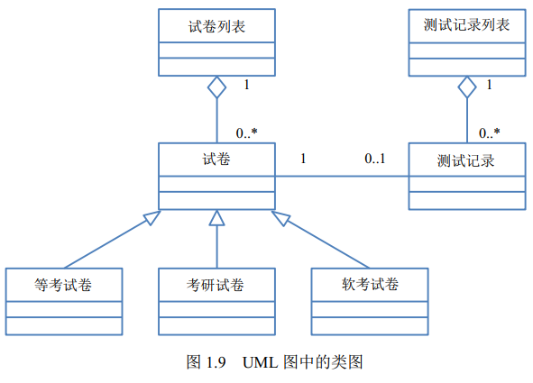

# 第一篇 机构设计基础
## 计算机系统基础知识
### 知识架构

- 计算机系统基础知识
    - 计算机系统概述
        - 计算机系统的定义与组成
        - 计算机系统分类
    - 计算机系统硬件基础知识
        - 冯诺依曼计算机结构
        - 典型的处理器系统
        - 专用处理器
        - 指令集系统
        - 存储器
        - 总线
        - 接口
        - 外部设备
    - 计算机软件基础知识
        - 计算机软件
        - 操作系统
        - 数据库
        - 分布式数据库系统
        - 文件系统
        - 网络协议
        - 中间件
        - 软件构件
    - 计算机语言
    - 多媒体技术
        - 媒体与多媒体
        - 多媒体系统的关键技术

### 计算机系统概述

### 基础知识点
1. **冯·诺依曼计算机结构**

冯·诺依曼计算机结构将计算机硬件划分为运算器、控制器、存储器、输入设备、输出设备 5 个部分。

2. **典型的处理器系统**  

4. **专用处理器**

图形处理器（Graphics Processing Unit，GPU）、信号处理器（Digital Signal Processor，DSP）以及现场可编程逻辑门阵列
（Field Programmable Gate Array，FPGA）等。**DSP 专用于实时的数字信号处理，常采用哈佛体系结构**。

4. **指令集系统**

复杂指令集（Complex Instruction Set Computers， CISC）与精简指令集（Reduced Instruction Set Computers，RISC）

5. **存储器**
根据存储器的硬件结构可分 为 SRAM、DRAM、NVRAM、Flash、EPROM、Disk 等。按照与处理器的物理距离可分为 4 个层次：
片上缓存、片外缓存、主存（内存）、外存。其访问速度依次降低，而容量依次提高。

6. **总线**

 **并行总线和串行总线**

| 名称   | 数据线             | 特点            | 应用                    |
|------|-----------------|---------------|-----------------------|
| 并行总线 | 多条双向数据线         | 有传输延迟，适合近距离连接 | 系统总线（计算机各部件）          |
| 串行总线 | 一条双向数据线或两条单向数据线 | 速率不高，但适合长距离连接 | 通信总线（计算机之间或计算机与其他系统间） |

7. **接口**
8. **外部设备**

### 计算机软件基础知识

1. 计算机软件可以分为系统软件和应用软件

2. **操作系统** 
作用：
1. 管理计算机中 运行的程序和分配各种软、硬件资源
2. 为用户提供友善的人机界面
3. 为应用程序的开发和运行提供一个高效的平台

特征：
并发性、共享性、虚拟性和不确定性

分类：
1. 批处理操作系统
2. 分时操作系统  特点：多路性、独立性、交互性、及时性
3. 实时操作系统
4. 网络操作系统
5. 分布式操作系统
6. 嵌入式操作系统：特点是微型化、可定制、可靠性和易移植性。常采用硬件抽象层（Hardware Abstraction Layer，HAL）和板级支撑包（Board Support Package， BSP）来提高易移植性

3. **数据库**

4. **分布式数据库系统**
分布式数据库系统（Distributed DataBase System，DDBS） 满足分布性、逻辑相关性、场地透明性和 场地自治性的数据库系统被称为完全分布式数据库系统。分布式数据库系统的特点是数据的集中控制性、数据独立性、数据冗余可控性、场地自治性和存取的有效性。

5. **文件系统**

文件组织方法：有连续结构、链接结构和索引结构，还有多重索引方式。  
空间管理的数据结构通常称为磁盘分配表 （Disk Allocation Table），有空闲区表、位示图和空闲块链 3 种。位示图用每一位的 0 和 1 表示一个区块空闲或被占用

**网络协议**

**中间件**

中间件（Middleware）分类：  
（1）通信处理（消息）中间件  
（2）事务处理（交易）中间件  
（3）数据存取管理中间件  
（4）Web 服务器中间件  
（5）安全中间件  
（6）跨平台和架构的中间件  
（7）专用平台中间件  
（8）网络中间件  

**软件构件**

优点：易扩展、可重用、并行开发。

缺点： 需要经验丰富的设计师、快速开发与质量属性之间需要妥协、构件质量影响软件整体的质量。

商用构件的标准规范有：
（1）OMG 的公共对象请求代理架构（Common Object Request Broker Architecture，CORBA）
（2）SUN 的 J2EE
（3）Microsoft 的 DNA 2000

### 1.4 计算机语言

计算机语言（Computer Language）主要由一套指令组成，而这套指令一般包括表达式、流程控制和集合三大部分内容。 
分类：  
机器语言  
汇编语言  
高级语言   
建模语言（UML）  

UML的3要素构成：UML 的基本构造块（事物、关系）、图（支配基本构造块如何放置在一起的规则） 和运用于整个语言的公用机制。  
 - 1）事物。UML 中有 4 种事物：结构事物、行为事物、分组事物和注释事物。
  - a. 结构事物：名词、静态部分，用于描述概念或物理元素。结构事物包括类（Class）、接口 （Interface）、协作（Collaboration）、用例（UseCase）、主动类（Active Class）、构件（Component）、 制品（Artifact）和节点（Node）。
       
  - b. 行为事物：动词，描述了跨越时间和空间的行为。行为事物包括交互（Interaction）、状态机（State Machine）和活动（Activity）
            
  - c. 分组事物：包是最常用的分组事物，结构事物、行为事物甚至其他分组事物都可以放进包内  
  - d. 注释事物：用于描述事物或关系的注释。注释即注解，用来描述、说明和标注模型的任何元素
 - 2）关系。UML 中有 4 种关系：依赖、关联、泛化和实现。

   - a. 依赖关系。其中一个事物（独立事物）发生变化会影响另一个事物。依赖关系是一种使用的关系
   - b. 关联关系。是一种拥有的关系，关联提供了不同类的对象之间的结构关系，它在一段时间内将多个类的实例连接在一起。一般认为关联关系有 2 个特例：一个是聚合关系，另一个是组合关系。聚合关系表示类之间的整体与部分的关系，其含义是“部分”可能同时属于多个“整体”，“部分”与“整体”的生命周期可以不相同。组合关系也是表示类之间的整体与部分的关系。与聚合关 系的区别在于，组合关系中的“部分”只能属于一个“整体”，“部分”与“整体”的生命周期相同， “部分”随着“整体”的创建而创建，也随着“整体”的消亡而消亡。
   - c. 泛化关系。泛化是一种特殊/一般关系，特殊元素（子元素）的对象可替代一般元素（父元素）的对象。
   - d. 实现关系。在两种情况下会使用实现关系：一种是在接口和实现它们的类或构件之间；另 一种是在用例和实现它们的协作之间。
 - 3）图。图是一组元素的图形表示，大多数情况下把图画成顶点（代表事物）和弧（代表关系）的连通图。  
   类图、对象图、用例图、序列图、通信图、状态图、活动图、 构件图、部署图、制品图、组合结构图、包图、交互概览图和计时图（定时图）。序列图、通信图、 交互概览图和计时图均被称为交互图。

类图展现了一组对象、接口、协作和它们之间的关系。  

用例图（Use Case Diagram）展现了一组用例、参与者（Actor）以及它 们之间的关系。用例之间有扩展关系（<<extend >>）和包含关系（<<include >>），参与者和用例 之间有关联关系，用例与用例、参与者与参与者之间有泛化关系。包含关系的特点是当两个或多个 用例中共用一组相同的动作时，可以将这组相同的动作抽出来作为一个独立的子用例，供多个基用 例所共享；扩展关系则是对基用例的扩展，基用例是一个完整的用例，即使没有子用例的参与，也可以完成一个完整的功能。

UML 中有 5 种视图（View）：**用例视图、逻辑视图、进程视图、实现视图、部署视图**，其中 的用例视图居于中心地位。

### 1.5 多媒体技术
多媒体有 4 个重要的特征：多维化、集成性、交互性、实时性

## 2 嵌入式基础知识

### 2.1 嵌入式系统的组成和特点
基础知识点  
嵌入式系统（Embedded System）是以特定应用为中心、以计算机技术为基础，并将可配置与可裁剪的软、硬件集成于一体的专用计算机系统。  
嵌入式系统的组成结构是：  
（1）嵌入式处理器，除满足低功耗、体积小等需求外，工艺可分为民用、工业和军用等三个 档次，民用级器件的工作温度范围是 0～70℃、工业级的是−40～85℃、军用级的是−55～150℃。 其应用环境常常非常恶劣，比如有高温、寒冷、电磁、震动、烟尘等环境因素。  
（2）相关支撑硬件，指除处理器以外的其他硬件，如存储器、定时器、总线等。  
（3）嵌入式操作系统，与通用操作系统不同，嵌入式操作系统应具备实时性、可裁剪性和安全性等特征。  
（4）支撑软件，其中的公共服务通常运行在操作系统之上，以库的方式被应用软件所引用。  
（5）应用软件，是指为完成嵌入式系统的某一专用目标所开发的软件。  
嵌入式系统的特点：  
（1）专用性强，常常面向特定应用需求，配备多种传感器。  
（2）技术融合，将先进的计算机技术、通信技术、半导体技术和电子技术与各个行业的具体 应用紧密结合难以拆分。
（3）软硬一体软件为主，在通用的嵌入式系统版本基础上裁剪冗余，高效设计。  
（4）资源受限，由于低功耗、体积小和集成度高等要求，系统的资源非常少。  
（5）程序代码固化在 ROM 中，以提高执行速度和系统可靠性。  
（6）需专门开发工具和环境，见 2.3 节。  
（7）体积小、价格低、工艺先进、性能价格比高、系统配置要求低、实时性强。  
（8）对安全性和可靠性的要求高。  

### 2.2 嵌入式系统的分类
根据不同用途可将嵌入式系统划分为嵌入式实时系统和嵌入式非实时系统两种。而实时系统又 可分为强实时（Hard Real-Time）系统和弱实时（Weak Real-Time）系统。从安全性要求看，嵌入 式系统还可分为安全攸关（Safety-Critical 或 Life-Critical）系统和非安全攸关系统
实时系统（Real-Time System，RTS）是指能够在规定的时间内完成系统功能和做出响应的系统。  
安全攸关系统（Safety-Critical System）是指其不正确的功能或者失效会导致人员伤亡、财产 损失等严重后果的计算机系统。   

### 2.3 嵌入式软件的组成和特点
1. 基本概念
   大多数嵌入式系统都具备实时特征，这种嵌入式系统的典型架构可概括为两种模式，即层次化模式架构和递归模式架构。嵌入式系统的最大特点就是系统的运行和开发是在不同环境中进行的， 通常将运行环境称为“目标机”环境，称开发环境为“宿主机”环境，宿主机与目标机之间通过串口、网络或 JTAG 接口连接。由于宿主机和目标机的指令往往是不同的，嵌入式系统的开发通常需 要交叉平台开发环境支持，基本开发工具是交叉编译器、交叉链接器和源代码调试器。还需要注意 实时性、安全性和可靠性、代码规模、软/硬件协同工作的效率和稳定性、特定领域的需求等。
2. 嵌入式系统的组成与特点
组成 
   （1）硬件层，包括处理器、存储器、总线、I/O 接口及电源、时钟等。   
   （2）抽象层，包括硬件抽象层（HAL），为上层应用（操作系统）提供虚拟的硬件资源；板 级支持包（BSP），是一种硬件驱动软件，为上层操作系统提供对硬件进行管理的支持。  
   （3）操作系统层，由嵌入式操作系统、文件系统、图形用户接口、网络系统和通用组件等可 配置模块组成。  
   （4）中间件层，是连接两个独立应用的桥梁，常用的有嵌入式数据库、OpenGL、消息中间件、 Java 中间件、虚拟机（VM）、DDS/CORBA 和 Hadoop 等。  
   （5）应用层，包括不同的应用软件。  
   主要特点：  
   （1）可剪裁性：设计方法包括静态编译、动态库和控制函数流程实现功能控制等。  
   （2）可配置性：设计方法包括数据驱动、静态编译和配置表等。  
   （3）强实时性：设计方法包括表驱动、配置、静/动态结合、汇编语言等。  
   （4）安全性（Safety）：设计方法包括编码标准、安全保障机制、FMECA（故障模式、影响及 危害性分析）。  
   （5）可靠性：设计方法包括容错技术、余度技术和鲁棒性设计等。  
   （6）高确定性：设计方法包括静态分配资源、越界检查、状态机、静态任务调度等。

### 2.4 嵌入式系统硬件体系结构
1．组成结构  
传统的嵌入式系统主要由嵌入式微处理器、存储器、总线逻辑、定时/计数器、看门狗电路、 I/O 接口和外部设备等部件组成。
2．嵌入式微处理器分类  
（1）微处理器（Microprocessor Unit，MPU）：微处理器+专门设计的电路板，集成度低、可 靠性高，主要有：Am186/88、386EX、SC-400、PowerPC、68000、MIPS、ARM 系列等。  
（2）微控制器（Microcontroller Unit，MCU）：又称单片机，把核心存储器和部分外设封装在 片内。优点是单片化、体积小、功耗和成本下降，可靠性提高。包括 8501，P5IXA，MCS-251， MCS-96/196/296，C166/167，MC68HC05/11/12/16，68300 和数目众多的 ARM 系列。  
（3）数字信号处理器（Digital Signal Processing，DSP）：采用**哈佛结构**，对系统结构和指令进 行了特殊设计，适合执行大量数据处理。包括 TMS320 系列（含 C2000、C5000、C6000、C8000 系列）、DSP56000 系列、实时 DSP 处理器等。  
（4）图形处理器（Graphics Processing Unit，GPU）：与 CPU 相比大幅加强了浮点运算能力和 多核并行计算能力，因此常用于 AI 技术的深度学习的数据运算。  
（5）片上系统（System on Chip，SoC）：由多个具有特定功能的集成电路组合在一个芯片上 形成的系统或产品，其中包含完整的硬件系统，如处理器、IP（Intellectual Property）核、存储器 等及其承载的嵌入式软件，如操作系统和定制的用户软件。  
3．存储器分类  
（1）随机存取存储器（Random Access Memory，RAM）。工作需要持续电力提供，可随机读写。
1）动态随机存取存储器（Dynamic RAM，DRAM），采用电容存储信息，优点是集成度高、 容量大、成本低，缺点是访问速度较慢、需要定期刷新。常作主存。
2）静态随机存取存储器（Static RAM，SRAM），采用多个晶体管自锁的方式保存状态，优点 是访问速度快、不需要刷新，缺点是集成度低、容量小、成本高。常用作高速缓存。

2）只读存储器（Read Only Memory，ROM），存储的数据不会因掉电而丢失，读取的速度 比 RAM 快，常见的有以下几种：
1）掩膜型只读存储器（Mask Programmed ROM，MROM），优点是通过掩膜大批量制造、成 本低，缺点是同批数据全部一致且不可修改，只适合大批量生产。
2）可编程只读存储器（Programmable ROM，PROM），可以用专用编程设备一次性烧录数据， 适合少量制造。
3）可擦可编程只读存储器（Erasable Programmable ROM，EPROM），优点是写入的数据可以通过紫外线擦除重写。
4）电可擦可编程只读存储器（Electrically Erasable Programmable ROM，EEPROM），优点是 写入的数据可以通过电压来清除，但是清除的速度很慢。
5）快闪存储器（Flash Memory），优点是可以联机擦写数据且擦写的次数多、速度快，缺点是 读取的速度慢（相对其他 ROM 的速度而言）。

（3）内（外）总线逻辑。
1）根据传输的信息种类分类，可分为以下几种。
①**数据总线**，用于传送需要处理或者需要存储的数据。
②**地址总线**，用于指定在 RAM 之中存储的数据的地址。
③**控制总线**，将微处理器控制单元的信号传送到周边设备。
2）根据连接部件分类，可分为以下几种。
①片内总线，连接芯片内部各元件。
②系统总线或板级总线，连接计算机系统的核心组件。
③局部总线，连接局部少数组件。
④通信总线，主机连接外设的总线。

3）按照数据传输的方向，总线可以分为单工总线和双工总线。单工总线只能从一端向另一端 传输而不能反向；双工总线能在两个方向传输。双工总线又分为半双工总线和全双工总线。半双工 总线只能轮流向两个方向传输；全双工总线可以同时在两个方向传输。
4）按照总线使用的信号类型，总线可以分为并行总线和串行总线。并行总线包含多位传输线， 在同一时刻可以传输多位数据，但一致性要求高，传输距离较近；而串行总线只使用一位传输线， 同一时刻只传输一位数据，但距离可以较远。
（4）看门狗电路，是嵌入式系统必须具备的一种系统恢复能力，可防止程序出错或者死锁。 主要由输入端、寄存器、计数器和狗叫模块构成。通过寄存器对看门狗进行基本设置，计数器计算 狗叫时间，狗叫模块决定看门狗超时后发出的中断或复位方式。程序正常运行时 MCU 会在输入端 定期“喂狗”，超时不“喂狗”就会触发狗叫模块，一般是重启 MCU。

# 3. 计算机网络基础知识

### 3.1 网络基本概念
跟网络有关的指标分为：
（1）性能指标：从速率、带宽、吞吐量和时延等不同方面来度量计算机网络的性能。
（2）非性能指标：从费用、质量、标准化、可靠性、可扩展性、可升级性、易管理性和可维 护性等来度量。

### 3.2通信技术
（1）数据与信道：在通信中的数据包括模拟信号和数字信号，通过信道来传输，信息传输就 是信源和信宿通过信道收发信息的过程。信道可分为逻辑信道和物理信道。逻辑信道是指在数据发 送端和接收端之间存在的一条虚拟线路，可以是有连接的或无连接的，以物理信道为载体。信号在 信源端和信宿端都需要经过信号变换，中间经过编码、交织、调制和解码等过程。
（2）复用技术：是指在一条信道上同时传输多路数据的技术，如 TDM 时分复用、FDM 频分 复用和 CDM 码分复用等。即一条路上行驶多辆货车。
（3）多址技术：是指在一条线上同时传输多个用户数据的技术，在接收端把多个用户的数据分离，如 TDMA 时分多址、FDMA 频分多址和 CDMA 码分多址等。即一辆车上的货物属于不同用户。  
（4）5G 通信网络。作为新一代的移动通信技术，网络结构、网络能力和应用场景等都与过去 有很大不同，具有高速率、低时延、接入用户数高等优点。
### 3.3 网络技术
（1）局域网（LAN）。是指在有限地理范围内将若干计算机通过传输介质互联成的封闭型的计算机网络。局域网有总线型、星型、树型、环型、网状五种拓扑结构。
（2）以太网（Ethernet）。是一种计算机局域网组网技术，由 IEEE 802.3 定义。以太网数据帧 的最小长度必须不小于 64 字节，最大长度一般是 1518 字节。设置最小帧长是为了避免冲突，最小 帧长是根据网络中检测冲突的最长时间来定的。
（3）无线局域网（Wireless Local Area Networks，WLAN）。利用无线技术在空中传输数据、 话音和视频信号。
（4）广域网（WAN）广域网由通信子网与资源子网组成。广域网可以分为公共传输网络、专用传输网 络和无线传输网络 3 类。广域网相关技术有同步光网络（SONET）、同步数字体系（SDH）、数字 数据网（DDN）、帧中继（FR）和异步传输技术（ATM）。
（5）城域网（Metropolitan Area Network，MAN）。通常分为 3 个层次：核心层、汇聚层和接入层。
（6）移动通信网。其发展经历了 1G 模拟信号传输、2G 数字通信技术、3G 扩展频谱、4G 快 速发展繁荣、5G 多业务、多技术融合等 5 代。5G 网络的主要特征为服务化架构和网络切片。

- 1）服务化架构（Service-Based Architecture，SBA）可以实现网络功能的灵活定制和按需组合， 以及软件快速迭代和升级。
- 2）网络切片技术可以在单个物理网络中切分出多个分离的逻辑网络用于不同业务。5G 还引入 了基于灵活以太网（Flexible Ethernet，FlexE）的硬切片技术。

### 3.4 组网技术
1．网络设备及其工作层级
（1）集线器（Hub）和中继器（Repeater）工作在物理层。  
（2）网桥（Bridge）和交换机（Switcher）工作在数据链路层。  
（3）路由器（Router）和防火墙（Firewall）主要工作在网络层。防火墙是网络中一种重要的安全设备，作为网络对外的门户。
2．网络协议
OSI/RM 七层模型见表

| 名称 | 主要功能 | 详细说明 |
| --- | --- | --- |
| 应用层 | 处理网络应用 | 直接为终端用户服务，提供各类应用过程的接口和用户接口。 |
| 表示层 | 管理数据表示方式 | 使应用层可以根据其服务解释数据的含义。通常包括数据编码的约定、 本地句法的转换，使不同类型的终端可以互相通信 |
| 会话层 | 建立和维护会话 连 | 负责管理远程用户或进程间的通信，通过安全验证和退出机制确保上 下文环境的安全，重建中断的会话场景，维持双方的同步 |
| 传输层 | 端到端传输 | 实现发送端和接收端的端到端的数据透明传送，TCP 协议保证数据包 无差错、按顺序、无丢失和无冗余地传输。其服务访问点为端口 |
| 网络层 | 在源节点和目的 节点之间传输 | 虚电路分组交换和数据报分组交换、路由选择算法、阻塞控制方法， 网络互连，以及对网络的诊断等 |
| 数据链路层 | 提供点到点的帧 传输 | 将网络层报文数据封装成帧，建立、维持和释放网络实体之间的数据链路，在链路上传输帧并进行差错控制、流量控制等 |
| 物理层 | 在物理链路上传 输比特流 | 通过一系列协议定义了物理链路所具备的机械特性、电气特性、功能 特性以及规程特性 |

Internet 协议的主要协议及其层次关系

（1）应用层协议。

1）文件传输协议（File Transport Protocol，FTP）FTP 在客户机和服务器之间需建立两条 TCP 连接，一条用于传送控制信息（使用 21 号端口），另一条用于传送 文件内容（使用 20 号端口）。  
2）简单文件传输协议（Trivial File Transfer Protocol，TFTP）FTP 建立在 UDP 之上，69 号端口；提供不可靠的数据流传输服务，不提供存取授权与认证机制，使用超时重传方式来保证数 据的到达。  
3）超文本传输协议（Hypertext Transfer Protocol，HTTP）：HTTP 建立在 TCP 之上，使用 80 号端口。  
4）安全超文本传输协议（Hypertext Transfer Protocol Secure，HTTPS）：HTTPS 在 HTTP 的基础下加入安全套接层（Secure Socket Layer，SSL）或 TLS，HTTPS 使用的 443 号端口。  
5）动态主机配置协议（Dynamic Host Configuration Protocol，DHCP）  
6）域名系统（Domain Name System，DNS）：  
    DNS 查询过程有两种方法

| 迭代查询 | 递归查询 | 
| ---- | --- |
| 查询得到的是其他服务器的引用，本地服务器就要访问被引用的服务器，做进一步的查询 | 查询方式要求服务器彻底地进行名字解析，并返回 最后的结果 |

（2）传输层协议。
1）传输控制协议（Transmission Control Protocol，TCP）。TCP 是可靠的、面向连接的网络协 议。具有差错校验和重传、流量控制、拥塞控制等功能。适用于数据量比较少，且对可靠性要求高 的场合。  
2）用户数据报协议（User Datagram Protocol，UDP）。UDP 是不可靠的、无连接的网络协议。 UDP 适合数据量大，对可靠性要求不是很高，但要求速度快的场合。  

（3）网络层协议
IPv6 被称为“下一代互联网协议”，IP 数据报的目的地址有单播、多播/组播、任播。

3．交换机
交换机功能包括集线功能、中继功能、桥接功能、隔离冲突域功能。交换机协议有：  
（1）生成树协议（STP），可以很好地解决链路环路问题。  
（2）链路聚合协议，可以提升与邻接交换设备之间的端口带宽和提高链路可靠性  

4．路由器
路由功能由路由器（Router）来提供，包括异种网络互连、子网协议转换、数据路由、速率适配、隔离网络、报文分片和重组、备份和流量控制。路由器协议主要有：
（1）内部网关协议（Interior Gateway Protocol，IGP）：指在一个自治系统（Autonomous System，AS）内运行的路由协议。  
（2）外部网关协议（Exterior Gateway Protocol，EGP）：指在 AS 之间的路由协议。EGP 是为 简单的树型拓扑结构设计的。  
（3）边界网关协议（Border Gateway Protocol，BGP）：Internet 的网络规模庞大，网络情况复杂， EGP 已不适用，在 EGP 的经验之上制定了新的网关协议即 BGP，也是 Internet 上唯一的网关协议。  

### 3.5 网络工程
1. 网络建设工程
   可分为网络规划、网络设计和网络实施 3 个环节。  
   （1）网络规划以需求为导向，兼顾技术和工程可行性。  
   （2）网络设计包括逻辑设计和物理设计，逻辑设计指网络结构设计、网络技术选型、IP 地址 和路由设计、
网络冗余设计以及网络安全设计等；物理设计指布线设计、机房设计、设备选型等。 网络冗余设计的目的就是
避免网络组件单点失效造成应用失效；备用路径是在主路径失效时启用，
其和主路径承担不同的网络负载；负载分担是网络冗余设计中的一种设计方式，其通过并行链路提
供流量分担来提高性能；网络中存在备用链路时，可以考虑加入负载分担设计来减轻主路径负担。  
   （3）网络实施包括工程实施计划、网络设备验收、设备安装和调试、系统试运行和切换、用户培训等
   
2. 分层设计
   网络设计一般采用分层的方式，分为**接入层、汇聚层、核心层**。  
   （1）接入层：直接面向用户连接或访问网络的部分，**主要解决相邻用户之间的互访需求**，并且为这些访问提供足够的带宽，接入层还应当适当负责一些用户管理功能
（如地址认证、用户认证、 计费管理等），以及用户信息收集工作（如用户的 IP 地址、MAC 地址、访问日志等）。
   （2）汇聚层：是核心层和接入层的分界面，完成网络访问策略控制、数据包处理、过滤、寻址，以及其他数据处理的任务。汇聚层的存在与否要视网络规模大小而定。
   （3）核心层：网络主干部分称为核心层，核心层的主要目的在于通过高速转发通信，提供优化、可靠的骨干传输结构，因此，核心层交换机应拥有更高的可靠性、
性能和吞吐量。核心层的设备采用双机冗余热备份是非常必要的，也可以使用负载均衡功能来改善网络性能。

以太网规定最小帧长为 64 字节，最大帧长为 1518 字节。设置最小帧长是为了避免冲突， 最小帧长是根据网络中检测冲突的最长时间来定的。
