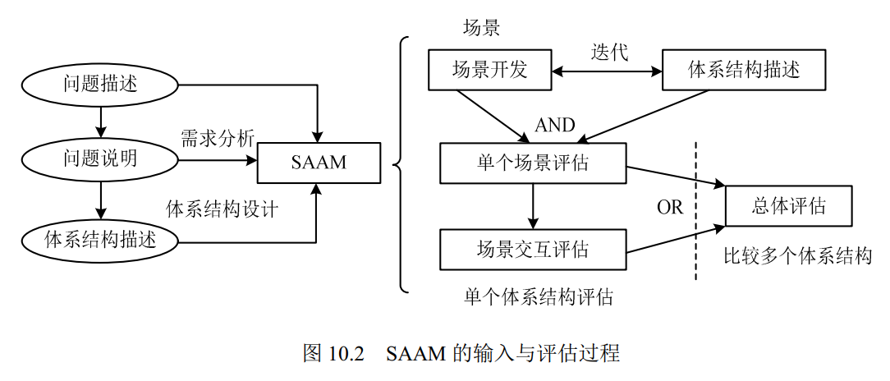
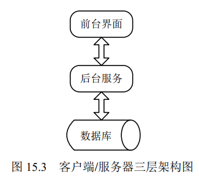

``
~~# 第一篇 机构设计基础

## 计算机系统基础知识

### 知识架构

- 计算机系统基础知识
    - 计算机系统概述
        - 计算机系统的定义与组成
        - 计算机系统分类
    - 计算机系统硬件基础知识
        - 冯诺依曼计算机结构
        - 典型的处理器系统
        - 专用处理器
        - 指令集系统
        - 存储器
        - 总线
        - 接口
        - 外部设备
    - 计算机软件基础知识
        - 计算机软件
        - 操作系统
        - 数据库
        - 分布式数据库系统
        - 文件系统
        - 网络协议
        - 中间件
        - 软件构件
    - 计算机语言
    - 多媒体技术
        - 媒体与多媒体
        - 多媒体系统的关键技术

### 计算机系统概述

### 基础知识点

1. **冯·诺依曼计算机结构**

冯·诺依曼计算机结构将计算机硬件划分为**运算器、控制器、存储器、输入设备、输出设备** 5 个部分。

2. **典型的处理器系统**  
   

4. **专用处理器**

图形处理器（Graphics Processing Unit，GPU）、信号处理器（Digital Signal Processor，DSP）以及现场可编程逻辑门阵列
（Field Programmable Gate Array，FPGA）等。**DSP 专用于实时的数字信号处理，常采用哈佛体系结构**。

4. **指令集系统**

复杂指令集（Complex Instruction Set Computers， **CISC**）与精简指令集（Reduced Instruction Set Computers，**RISC**）

5. **存储器**  
根据存储器的硬件结构可分 为 SRAM、DRAM、NVRAM、Flash、EPROM、Disk 等。按照与处理器的物理距离可分为 4 个层次： 片上缓存、片外缓存、
主存（内存）、外存。其访问速度依次降低，而容量依次提高。

6. **总线**

**并行总线和串行总线**

| 名称   | 数据线             | 特点            | 应用                    |
|------|-----------------|---------------|-----------------------|
| 并行总线 | 多条双向数据线         | 有传输延迟，适合近距离连接 | 系统总线（计算机各部件）          |
| 串行总线 | 一条双向数据线或两条单向数据线 | 速率不高，但适合长距离连接 | 通信总线（计算机之间或计算机与其他系统间） |

7. **接口**
8. **外部设备**

### 计算机软件基础知识

1. 计算机软件可以分为系统软件和应用软件

2. **操作系统**
   作用：
    1. 管理计算机中运行的程序和分配各种软、硬件资源
    2. 为用户提供友善的人机界面
    3. 为应用程序的开发和运行提供一个高效的平台

特征：
并发性、共享性、虚拟性和不确定性

分类：  
（1）. 批处理操作系统  
（2）. 分时操作系统 特点：多路性、独立性、交互性、及时性  
（3）. 实时操作系统  
（4）. 网络操作系统  
（5）. 分布式操作系统  
（6）. 嵌入式操作系统：特点是**微型化、可定制、可靠性和易移植性**。常采用硬件抽象层（Hardware Abstraction Layer，HAL）和板级支撑包
（Board Support Package， BSP）来提高易移植性

3. **数据库**

4. **分布式数据库系统**  
分布式数据库系统（Distributed DataBase System，DDBS）满足分布性、逻辑相关性、场地透明性和场地自治性的数据库系统被称为完全分布式数据库系统。
分布式数据库系统的特点是数据的**集中控制性、数据独立性、数据冗余可控性、场地自治性和存取的有效性**。

5. **文件系统**

文件组织方法：有连续结构、链接结构和索引结构，还有多重索引方式。  
空间管理的数据结构通常称为磁盘分配表 （Disk Allocation Table），有空闲区表、位示图和空闲块链3种。位示图用每一位的0和1表示一个区块空闲或被占用

**网络协议**

**中间件**

中间件（Middleware）分类：  
（1）通信处理（消息）中间件  
（2）事务处理（交易）中间件  
（3）数据存取管理中间件  
（4）Web 服务器中间件  
（5）安全中间件  
（6）跨平台和架构的中间件  
（7）专用平台中间件  
（8）网络中间件

**软件构件**

优点：易扩展、可重用、并行开发。

缺点： 需要经验丰富的设计师、快速开发与质量属性之间需要妥协、构件质量影响软件整体的质量。

商用构件的标准规范有：  
（1）OMG 的公共对象请求代理架构（Common Object Request Broker Architecture，CORBA）  
（2）SUN 的 J2EE  
（3）Microsoft 的 DNA 2000

### 1.4 计算机语言

计算机语言（Computer Language）主要由一套指令组成，而这套指令一般包括**表达式、流程控制和集合**三大部分内容。
分类：  
机器语言  
汇编语言  
高级语言   
建模语言（UML）

UML的3要素构成：UML 的基本构造块（事物、关系）、图（支配基本构造块如何放置在一起的规则） 和运用于整个语言的公用机制。

- 1）事物。UML 中有 4 种事物：结构事物、行为事物、分组事物和注释事物。
- a. 结构事物：名词、静态部分，用于描述概念或物理元素。结构事物包括类（Class）、接口 （Interface）、协作（Collaboration）、用例（UseCase）
  、主动类（Active Class）、构件（Component）、 制品（Artifact）和节点（Node）。
  
- b. 行为事物：动词，描述了跨越时间和空间的行为。行为事物包括交互（Interaction）、状态机（State Machine）和活动（Activity）  
  
- c. 分组事物：包是最常用的分组事物，结构事物、行为事物甚至其他分组事物都可以放进包内
- d. 注释事物：用于描述事物或关系的注释。注释即注解，用来描述、说明和标注模型的任何元素
- 2）关系。UML 中有 4 种关系：依赖、关联、泛化和实现。  
  
    - a. 依赖关系。其中一个事物（独立事物）发生变化会影响另一个事物。依赖关系是一种使用的关系
    - b. 关联关系。是一种拥有的关系，关联提供了不同类的对象之间的结构关系，它在一段时间内将多个类的实例连接在一起。一般认为关联关系有 2 个特例：
      一个是**聚合关系**，另一个是**组合关系**。聚合关系表示类之间的整体与部分的关系，其含义是“部分”可能同时属于多个“整体”，“部分”与“整体”的 
生命周期可以不相同。 组合关系也是表示类之间的整体与部分的关系。与聚合关 系的区别在于，组合关系中的“部分”只能属于一个“整体”，“部分”与“整体”
的生命周期相同， “部分”随着“整体”的创建而创建，也随着“整体”的消亡而消亡。
    - c. 泛化关系。泛化是一种特殊/一般关系，特殊元素（子元素）的对象可替代一般元素（父元素）的对象。
    - d. 实现关系。在两种情况下会使用实现关系：一种是在接口和实现它们的类或构件之间；另 一种是在用例和实现它们的协作之间。
- 3）图。图是一组元素的图形表示，大多数情况下把图画成顶点（代表事物）和弧（代表关系）的连通图。  
  类图、对象图、用例图、序列图、通信图、状态图、活动图、 构件图、部署图、制品图、组合结构图、包图、交互概览图和计时图（定时图）。序列图、通信图、
  交互概览图和计时图均被称为交互图。

类图展现了一组对象、接口、协作和它们之间的关系。  
  
用例图（Use Case Diagram）展现了一组用例、参与者（Actor）以及它们之间的关系。用例之间有扩展关系（`<<extend>>`）和包含关系（`<<include>>`），
参与者和用例之间有关联关系，用例与用例、参与者与参与者之间有泛化关系。包含关系的特点是当两个或多个用例中共用一组相同的动作时，可以将这组相同的动作
抽出来作为一个独立的子用例，供多个基用例所共享；扩展关系则是对基用例的扩展，基用例是一个完整的用例，即使没有子用例的参与，也可以完成一个完整的功能。  
  
UML 中有 5 种视图（View）：**用例视图、逻辑视图、进程视图、实现视图、部署视图**，其中 的用例视图居于中心地位。

### 1.5 多媒体技术

多媒体有 4 个重要的特征：多维化、集成性、交互性、实时性

## 2 嵌入式基础知识

### 2.1 嵌入式系统的组成和特点

基础知识点  
嵌入式系统（Embedded
System）是以特定应用为中心、以计算机技术为基础，并将可配置与可裁剪的软、硬件集成于一体的专用计算机系统。  
嵌入式系统的组成结构是：  
（1）嵌入式处理器，除满足低功耗、体积小等需求外，工艺可分为民用、工业和军用等三个档次，民用级器件的工作温度范围是
0～70℃、工业级的是−40～85℃、
军用级的是−55～150℃。 其应用环境常常非常恶劣，比如有高温、寒冷、电磁、震动、烟尘等环境因素。  
（2）相关支撑硬件，指除处理器以外的其他硬件，如存储器、定时器、总线等。  
（3）嵌入式操作系统，与通用操作系统不同，嵌入式操作系统应具备实时性、可裁剪性和安全性等特征。  
（4）支撑软件，其中的公共服务通常运行在操作系统之上，以库的方式被应用软件所引用。  
（5）应用软件，是指为完成嵌入式系统的某一专用目标所开发的软件。  
嵌入式系统的特点：  
（1）专用性强，常常面向特定应用需求，配备多种传感器。  
（2）技术融合，将先进的计算机技术、通信技术、半导体技术和电子技术与各个行业的具体 应用紧密结合难以拆分。  
（3）软硬一体软件为主，在通用的嵌入式系统版本基础上裁剪冗余，高效设计。  
（4）资源受限，由于低功耗、体积小和集成度高等要求，系统的资源非常少。  
（5）程序代码固化在ROM中，以提高执行速度和系统可靠性。  
（6）需专门开发工具和环境，见 2.3 节。  
（7）体积小、价格低、工艺先进、性能价格比高、系统配置要求低、实时性强。  
（8）对安全性和可靠性的要求高。

### 2.2 嵌入式系统的分类

根据不同用途可将嵌入式系统划分为嵌入式实时系统和嵌入式非实时系统两种。而实时系统又可分为强实时（Hard Real-Time）系统和弱实时（Weak
Real-Time）
系统。从安全性要求看，嵌入 式系统还可分为安全攸关（Safety-Critical 或 Life-Critical）系统和非安全攸关系统
实时系统（Real-Time System，RTS）是指能够在规定的时间内完成系统功能和做出响应的系统。  
安全攸关系统（Safety-Critical System）是指其不正确的功能或者失效会导致人员伤亡、财产 损失等严重后果的计算机系统。

### 2.3 嵌入式软件的组成和特点

1. 基本概念
   大多数嵌入式系统都具备实时特征，这种嵌入式系统的典型架构可概括为两种模式，即层次化模式架构和递归模式架构。嵌入式系统的最大特点就是系统的运行和开发是在不同环境中进行的，
   通常将运行环境称为“目标机”环境，称开发环境为“宿主机”环境，宿主机与目标机之间通过串口、网络或 JTAG
   接口连接。由于宿主机和目标机的指令往往是不同的，嵌入式系统的开发通常需 要交叉平台开发环境支持，基本开发工具是交叉编译器、交叉链接器和源代码调试器。还需要注意
   实时性、安全性和可靠性、代码规模、软/硬件协同工作的效率和稳定性、特定领域的需求等。
2. 嵌入式系统的组成与特点
   组成
   （1）硬件层，包括处理器、存储器、总线、I/O 接口及电源、时钟等。   
   （2）抽象层，包括硬件抽象层（HAL），为上层应用（操作系统）提供虚拟的硬件资源；板
   级支持包（BSP），是一种硬件驱动软件，为上层操作系统提供对硬件进行管理的支持。  
   （3）操作系统层，由嵌入式操作系统、文件系统、图形用户接口、网络系统和通用组件等可 配置模块组成。  
   （4）中间件层，是连接两个独立应用的桥梁，常用的有嵌入式数据库、OpenGL、消息中间件、 Java 中间件、虚拟机（VM）、DDS/CORBA 和
   Hadoop 等。  
   （5）应用层，包括不同的应用软件。  
   主要特点：  
   （1）可剪裁性：设计方法包括静态编译、动态库和控制函数流程实现功能控制等。  
   （2）可配置性：设计方法包括数据驱动、静态编译和配置表等。  
   （3）强实时性：设计方法包括表驱动、配置、静/动态结合、汇编语言等。  
   （4）安全性（Safety）：设计方法包括编码标准、安全保障机制、FMECA（故障模式、影响及 危害性分析）。  
   （5）可靠性：设计方法包括容错技术、余度技术和鲁棒性设计等。  
   （6）高确定性：设计方法包括静态分配资源、越界检查、状态机、静态任务调度等。

### 2.4 嵌入式系统硬件体系结构

1．组成结构  
传统的嵌入式系统主要由嵌入式微处理器、存储器、总线逻辑、定时/计数器、看门狗电路、 I/O 接口和外部设备等部件组成。
2．嵌入式微处理器分类  
（1）微处理器（Microprocessor Unit，MPU）：微处理器+专门设计的电路板，集成度低、可
靠性高，主要有：Am186/88、386EX、SC-400、PowerPC、68000、MIPS、ARM 系列等。  
（2）微控制器（Microcontroller Unit，MCU）：又称单片机，把核心存储器和部分外设封装在 片内。优点是单片化、体积小、功耗和成本下降，可靠性提高。包括
8501，P5IXA，MCS-251， MCS-96/196/296，C166/167，MC68HC05/11/12/16，68300 和数目众多的 ARM 系列。  
（3）数字信号处理器（Digital Signal Processing，DSP）：采用**哈佛结构**，对系统结构和指令进 行了特殊设计，适合执行大量数据处理。包括
TMS320 系列（含 C2000、C5000、C6000、C8000 系列）、DSP56000 系列、实时 DSP 处理器等。  
（4）图形处理器（Graphics Processing Unit，GPU）：与 CPU 相比大幅加强了浮点运算能力和 多核并行计算能力，因此常用于 AI
技术的深度学习的数据运算。  
（5）片上系统（System on Chip，SoC）：由多个具有特定功能的集成电路组合在一个芯片上 形成的系统或产品，其中包含完整的硬件系统，如处理器、IP（Intellectual
Property）核、存储器 等及其承载的嵌入式软件，如操作系统和定制的用户软件。  
3．存储器分类  
（1）随机存取存储器（Random Access Memory，RAM）。工作需要持续电力提供，可随机读写。
1）动态随机存取存储器（Dynamic RAM，DRAM），采用电容存储信息，优点是集成度高、 容量大、成本低，缺点是访问速度较慢、需要定期刷新。常作主存。
2）静态随机存取存储器（Static RAM，SRAM），采用多个晶体管自锁的方式保存状态，优点 是访问速度快、不需要刷新，缺点是集成度低、容量小、成本高。常用作高速缓存。

2）只读存储器（Read Only Memory，ROM），存储的数据不会因掉电而丢失，读取的速度 比 RAM 快，常见的有以下几种：
1）掩膜型只读存储器（Mask Programmed ROM，MROM），优点是通过掩膜大批量制造、成 本低，缺点是同批数据全部一致且不可修改，只适合大批量生产。
2）可编程只读存储器（Programmable ROM，PROM），可以用专用编程设备一次性烧录数据， 适合少量制造。
3）可擦可编程只读存储器（Erasable Programmable ROM，EPROM），优点是写入的数据可以通过紫外线擦除重写。
4）电可擦可编程只读存储器（Electrically Erasable Programmable ROM，EEPROM），优点是 写入的数据可以通过电压来清除，但是清除的速度很慢。
5）快闪存储器（Flash Memory），优点是可以联机擦写数据且擦写的次数多、速度快，缺点是 读取的速度慢（相对其他 ROM 的速度而言）。

（3）内（外）总线逻辑。
1）根据传输的信息种类分类，可分为以下几种。
①**数据总线**，用于传送需要处理或者需要存储的数据。
②**地址总线**，用于指定在 RAM 之中存储的数据的地址。
③**控制总线**，将微处理器控制单元的信号传送到周边设备。
2）根据连接部件分类，可分为以下几种。
①片内总线，连接芯片内部各元件。
②系统总线或板级总线，连接计算机系统的核心组件。
③局部总线，连接局部少数组件。
④通信总线，主机连接外设的总线。

3）按照数据传输的方向，总线可以分为单工总线和双工总线。单工总线只能从一端向另一端
传输而不能反向；双工总线能在两个方向传输。双工总线又分为半双工总线和全双工总线。半双工 总线只能轮流向两个方向传输；全双工总线可以同时在两个方向传输。
4）按照总线使用的信号类型，总线可以分为并行总线和串行总线。并行总线包含多位传输线，
在同一时刻可以传输多位数据，但一致性要求高，传输距离较近；而串行总线只使用一位传输线， 同一时刻只传输一位数据，但距离可以较远。
（4）看门狗电路，是嵌入式系统必须具备的一种系统恢复能力，可防止程序出错或者死锁。 主要由输入端、寄存器、计数器和狗叫模块构成。通过寄存器对看门狗进行基本设置，计数器计算
狗叫时间，狗叫模块决定看门狗超时后发出的中断或复位方式。程序正常运行时 MCU 会在输入端 定期“喂狗”，超时不“喂狗”就会触发狗叫模块，一般是重启
MCU。

# 3. 计算机网络基础知识

### 3.1 网络基本概念

跟网络有关的指标分为：
（1）性能指标：从速率、带宽、吞吐量和时延等不同方面来度量计算机网络的性能。
（2）非性能指标：从费用、质量、标准化、可靠性、可扩展性、可升级性、易管理性和可维 护性等来度量。

### 3.2通信技术

（1）数据与信道：在通信中的数据包括模拟信号和数字信号，通过信道来传输，信息传输就 是信源和信宿通过信道收发信息的过程。信道可分为逻辑信道和物理信道。逻辑信道是指在数据发
送端和接收端之间存在的一条虚拟线路，可以是有连接的或无连接的，以物理信道为载体。信号在 信源端和信宿端都需要经过信号变换，中间经过编码、交织、调制和解码等过程。
（2）复用技术：是指在一条信道上同时传输多路数据的技术，如 TDM 时分复用、FDM 频分 复用和 CDM 码分复用等。即一条路上行驶多辆货车。
（3）多址技术：是指在一条线上同时传输多个用户数据的技术，在接收端把多个用户的数据分离，如 TDMA 时分多址、FDMA 频分多址和 CDMA
码分多址等。即一辆车上的货物属于不同用户。  
（4）5G 通信网络。作为新一代的移动通信技术，网络结构、网络能力和应用场景等都与过去 有很大不同，具有高速率、低时延、接入用户数高等优点。

### 3.3 网络技术

（1）局域网（LAN）。是指在有限地理范围内将若干计算机通过传输介质互联成的封闭型的计算机网络。局域网有总线型、星型、树型、环型、网状五种拓扑结构。
（2）以太网（Ethernet）。是一种计算机局域网组网技术，由 IEEE 802.3 定义。以太网数据帧 的最小长度必须不小于 64 字节，最大长度一般是
1518 字节。设置最小帧长是为了避免冲突，最小 帧长是根据网络中检测冲突的最长时间来定的。
（3）无线局域网（Wireless Local Area Networks，WLAN）。利用无线技术在空中传输数据、 话音和视频信号。
（4）广域网（WAN）广域网由通信子网与资源子网组成。广域网可以分为公共传输网络、专用传输网 络和无线传输网络 3
类。广域网相关技术有同步光网络（SONET）、同步数字体系（SDH）、数字 数据网（DDN）、帧中继（FR）和异步传输技术（ATM）。
（5）城域网（Metropolitan Area Network，MAN）。通常分为 3 个层次：核心层、汇聚层和接入层。
（6）移动通信网。其发展经历了 1G 模拟信号传输、2G 数字通信技术、3G 扩展频谱、4G 快 速发展繁荣、5G 多业务、多技术融合等 5 代。5G
网络的主要特征为服务化架构和网络切片。

- 1）服务化架构（Service-Based Architecture，SBA）可以实现网络功能的灵活定制和按需组合， 以及软件快速迭代和升级。
- 2）网络切片技术可以在单个物理网络中切分出多个分离的逻辑网络用于不同业务。5G 还引入 了基于灵活以太网（Flexible
  Ethernet，FlexE）的硬切片技术。

### 3.4 组网技术

1．网络设备及其工作层级
（1）集线器（Hub）和中继器（Repeater）工作在物理层。  
（2）网桥（Bridge）和交换机（Switcher）工作在数据链路层。  
（3）路由器（Router）和防火墙（Firewall）主要工作在网络层。防火墙是网络中一种重要的安全设备，作为网络对外的门户。
2．网络协议
OSI/RM 七层模型见表

| 名称    | 主要功能           | 详细说明                                                          |
|-------|----------------|---------------------------------------------------------------|
| 应用层   | 处理网络应用         | 直接为终端用户服务，提供各类应用过程的接口和用户接口。                                   |
| 表示层   | 管理数据表示方式       | 使应用层可以根据其服务解释数据的含义。通常包括数据编码的约定、 本地句法的转换，使不同类型的终端可以互相通信        |
| 会话层   | 建立和维护会话 连      | 负责管理远程用户或进程间的通信，通过安全验证和退出机制确保上 下文环境的安全，重建中断的会话场景，维持双方的同步      |
| 传输层   | 端到端传输          | 实现发送端和接收端的端到端的数据透明传送，TCP 协议保证数据包 无差错、按顺序、无丢失和无冗余地传输。其服务访问点为端口 |
| 网络层   | 在源节点和目的 节点之间传输 | 虚电路分组交换和数据报分组交换、路由选择算法、阻塞控制方法， 网络互连，以及对网络的诊断等                 |
| 数据链路层 | 提供点到点的帧 传输     | 将网络层报文数据封装成帧，建立、维持和释放网络实体之间的数据链路，在链路上传输帧并进行差错控制、流量控制等         |
| 物理层   | 在物理链路上传 输比特流   | 通过一系列协议定义了物理链路所具备的机械特性、电气特性、功能 特性以及规程特性                       |

Internet 协议的主要协议及其层次关系

（1）应用层协议。

1）文件传输协议（File Transport Protocol，FTP）FTP 在客户机和服务器之间需建立两条 TCP 连接，一条用于传送控制信息（使用 21
号端口），另一条用于传送 文件内容（使用 20 号端口）。  
2）简单文件传输协议（Trivial File Transfer Protocol，TFTP）FTP 建立在 UDP 之上，69
号端口；提供不可靠的数据流传输服务，不提供存取授权与认证机制，使用超时重传方式来保证数 据的到达。  
3）超文本传输协议（Hypertext Transfer Protocol，HTTP）：HTTP 建立在 TCP 之上，使用 80 号端口。  
4）安全超文本传输协议（Hypertext Transfer Protocol Secure，HTTPS）：HTTPS 在 HTTP 的基础下加入安全套接层（Secure Socket
Layer，SSL）或 TLS，HTTPS 使用的 443 号端口。  
5）动态主机配置协议（Dynamic Host Configuration Protocol，DHCP）  
6）域名系统（Domain Name System，DNS）：  
DNS 查询过程有两种方法

| 迭代查询                                    | 递归查询                         | 
|-----------------------------------------|------------------------------|
| 查询得到的是其他服务器的引用，本地服务器就要访问被引用的服务器，做进一步的查询 | 查询方式要求服务器彻底地进行名字解析，并返回 最后的结果 |

（2）传输层协议。
1）传输控制协议（Transmission Control Protocol，TCP）。TCP 是可靠的、面向连接的网络协
议。具有差错校验和重传、流量控制、拥塞控制等功能。适用于数据量比较少，且对可靠性要求高 的场合。  
2）用户数据报协议（User Datagram Protocol，UDP）。UDP 是不可靠的、无连接的网络协议。 UDP 适合数据量大，对可靠性要求不是很高，但要求速度快的场合。

（3）网络层协议
IPv6 被称为“下一代互联网协议”，IP 数据报的目的地址有单播、多播/组播、任播。

3．交换机
交换机功能包括集线功能、中继功能、桥接功能、隔离冲突域功能。交换机协议有：  
（1）生成树协议（STP），可以很好地解决链路环路问题。  
（2）链路聚合协议，可以提升与邻接交换设备之间的端口带宽和提高链路可靠性

4．路由器
路由功能由路由器（Router）来提供，包括异种网络互连、子网协议转换、数据路由、速率适配、隔离网络、报文分片和重组、备份和流量控制。路由器协议主要有：
（1）内部网关协议（Interior Gateway Protocol，IGP）：指在一个自治系统（Autonomous System，AS）内运行的路由协议。  
（2）外部网关协议（Exterior Gateway Protocol，EGP）：指在 AS 之间的路由协议。EGP 是为 简单的树型拓扑结构设计的。  
（3）边界网关协议（Border Gateway Protocol，BGP）：Internet 的网络规模庞大，网络情况复杂， EGP 已不适用，在 EGP 的经验之上制定了新的网关协议即
BGP，也是 Internet 上唯一的网关协议。

### 3.5 网络工程

1. 网络建设工程
   可分为网络规划、网络设计和网络实施 3 个环节。  
   （1）网络规划以需求为导向，兼顾技术和工程可行性。  
   （2）网络设计包括逻辑设计和物理设计，逻辑设计指网络结构设计、网络技术选型、IP 地址 和路由设计、
   网络冗余设计以及网络安全设计等；物理设计指布线设计、机房设计、设备选型等。 网络冗余设计的目的就是
   避免网络组件单点失效造成应用失效；备用路径是在主路径失效时启用，
   其和主路径承担不同的网络负载；负载分担是网络冗余设计中的一种设计方式，其通过并行链路提
   供流量分担来提高性能；网络中存在备用链路时，可以考虑加入负载分担设计来减轻主路径负担。  
   （3）网络实施包括工程实施计划、网络设备验收、设备安装和调试、系统试运行和切换、用户培训等

2. 分层设计
   网络设计一般采用分层的方式，分为**接入层、汇聚层、核心层**。  
   （1）接入层：直接面向用户连接或访问网络的部分，**主要解决相邻用户之间的互访需求**，并且为这些访问提供足够的带宽，接入层还应当适当负责一些用户管理功能
   （如地址认证、用户认证、 计费管理等），以及用户信息收集工作（如用户的 IP 地址、MAC 地址、访问日志等）。
   （2）汇聚层：是核心层和接入层的分界面，完成网络访问策略控制、数据包处理、过滤、寻址，以及其他数据处理的任务。汇聚层的存在与否要视网络规模大小而定。
   （3）核心层：网络主干部分称为核心层，核心层的主要目的在于通过高速转发通信，提供优化、可靠的骨干传输结构，因此，核心层交换机应拥有更高的可靠性、
   性能和吞吐量。核心层的设备采用双机冗余热备份是非常必要的，也可以使用负载均衡功能来改善网络性能。

以太网规定最小帧长为 64 字节，最大帧长为 1518 字节。设置最小帧长是为了避免冲突， 最小帧长是根据网络中检测冲突的最长时间来定的。

# 架构专业知识

## 4.信息系统基础知识

### 4.1信息系统概述

1. 信息系统定义   
   信息系统的功能有：输入、存储、处理、输出和控制。  
   信息系统的发展道路划分为初始、传播、控制、集成、数据管理和成熟 6 个阶段。
2. 信息系统的分类   
   信息系统分为业务（数据）处理系统、管理信息系统、决策支持系统、专家系统、办公自动化系统、综合性信息系统等 6 类。
3. 信息系统的生命周期  
   信息系统的生命周期分为产生、开发、运行和消亡 4 个阶段。
4. 信息系统建设原则  
   信息系统建设原则可以分为高层管理人员介入原则、用户参与开发原则、自顶向下规划原则、 工程化原则等。
5. 信息系统的开发方法  
   信息系统的开发方法主要有：结构化方法、原型法、面向对象方法、面向服务的方法、敏捷方法、构件化开发方法等。
   结构化方法、面向对象方法详见第 7 小时，这里介绍其他几种开发方法。

- （1）原型法。原型法也称快速原型法，可以根据用户的初步需求利用系统工具快速建立一个 系统模型，与用户交流。  
  原型法按照实现功能划分可以分为：
    - 1）水平原型：行为原型，用于界面。细化需求但并未实现功能。
    - 2）垂直原型：结构化原型，用于复杂算法的实现，实现了部分功能  
      原型法按照最终结果划分可以分为：
    - 1）抛弃式：探索式原型，解决需求不确定性、二义性、不完整性、含糊性等。
    - 2）演化式：逐步演化为最终系统，用于易于升级和优化的场合，适用于 Web 项目。
- （2）构件化开发方法。基于构件/组件（Component）的软件开发是解决复杂环境下软件规模
  与复杂性的一种手段。构件并非一定包含类，一个类元素只能属于一个构件。构件的获取方式有：
    - 1）从现有构件中获得符合要求的构件，直接使用或作适应性修改，得到可复用的构件。
    - 2）通过遗留工程（Legacy Engineering），将具有潜在复用价值的构件提取出来，得到可复用的构件。
    - 3）从市场上购买现成的商业构件。
    - 4）开发新的符合要求的构件。  
      获取到的构件可以存放到构件库中，根据需求裁剪使用。构件的分类方式

| 分类     | 描述                                                                                                                               |
|--------|----------------------------------------------------------------------------------------------------------------------------------|
| 关键字分类法 | 关键字分类法将应用领域的概念按照从抽象到具体的顺序逐次分解为**树型或有向无回路图结构**，每个概念用一个描述性的关键字表示                                                                   |
| 刻面分类法  | 刻面分类法定义若干用于**刻画构件特征**的“刻面”，每个面包含若干概念，这些概念描述构件在刻面上的特征。刻面可以描述构件执行的功能、被操作的数据、构件应用的语境或其他特征                                           |
| 超文本方法  | 所有构件必须辅以详尽的功能或行为说明文档；说明中出现的重要概念或构件以网状链接方式相互连接；检索者在阅读文档的过程中可按照人类的联想思维方式任意跳转到包含相关概念或构件的文档；全文检索系统将用户给出的关键字与说明文档中的文 字进行匹配，实现构件的浏览式检索 |

构件检索的方式也可以分为：基于关键字的检索、刻面检索法、超文本检索法。

- （3）面向服务的方法。面向服务的方法是在面向对象方法的基础上发展起来的，对于跨构件
  的功能调用，则采用接口的形式暴露出来。进一步将接口的定义与实现进行解耦，则催生了服务和
  面向服务（Service-Oriented，SO）的开发方法。对于系统架构设计师考试我们重点关注的是面向
  服务的架构（SOA），这部分内容将在第 18 小时中介绍。
- （4）敏捷方法。敏捷方法是一种以人为核心、迭代、循序渐进的开发方法。敏捷方法主要有
  两个特点，这也是其区别于其他方法，尤其是重型方法的最主要的特征。
    - 1）敏捷方法是“适应型”而非“预设型”。重型方法试图对一个软件开发项目在很长的时间跨
      度内做出详细的计划，然后依计划进行开发。这类方法在计划制定完成后拒绝变化。而敏捷方法则
      欢迎变化。
    - 敏捷方法是“面向人的”而非“面向过程的”。它们试图使软件开发工作能够利用人的特点，
      充分发挥人的创造能力，强调软件开发应当是一项愉快的活动。  
      敏捷方法的核心思想主要有以下 3 点：  
      1）敏捷方法是适应型，而非可预测型。  
      2）敏捷方法以人为本，而非以过程为本。  
      3）属于迭代增量式的开发过程。

### 信息化典型应用

1. TPS 和 EDPS
   业务处理系统（Transaction Processing System，TPS）或电子数据处理系统（Electronic Data
   Processing System，EDPS）是信息化的典型应用。业务处理系统可以实现计算机自动化、减轻处理数据的负担、提高处理效率。它既是信息系统发展的最初级形式，也是基础和桥梁。因其简单和成
   熟常用**结构化生命周期法**开发。对事务所发生的数据进行**输入、处理和输出**（即 IPO）。业务系统
   数据处理周期分为**数据输入、数据处理、数据库的维护、文件报表的生成和查询处理** 5 个阶段（对
   功能的进一步阐述）。数据处理方式包括**批处理**（Batch Processing）方式和**联机事务处理**（OnLine
   Transaction Processing，OLTP）方式。
2. 管理信息系统
   管理信息系统（Manage Information System，MIS）MIS 系统的上层是子系统和功能，
   底层是各个过程，功能由过程组合实现。一个 MIS 系统可以用一个**功能/层次矩阵**表示。共有**销售
   市场子系统、生产子系统、后勤子系统、人事子系统、财务和会计子系统、信息处理子系统和高层
   管理子系统** 7 个子系统。
3. 决策支持系统
   决策支持系统（Decision Support System，DSS）有两种定义：

- （1）定义一：DSS 是一个由语言系统、知识系统和问题处理系统 3 个互相关联的部分组成的， 基于计算机的系统。特征如下：
    - 1）数据和模型是 DSS 的主要资源。
    - 2）用来支援用户作决策。
    - 3）主要用于解决半结构化及非结构化问题。
    - 4）作用在于提高决策的有效性而不是提高决策的效率。
- （2）定义二：DSS 是一个交互式的、灵活的、适应性强的基于计算机的信息系统。特征如下：
    - 1）针对上层管理人员。
    - 2）界面友好。
    - 3）将模型、分析技术与传统的数据存取与检索技术结合起来。
    - 4）对环境及决策方法改变的灵活性与适应性。
    - 5）支持但不是代替决策。
    - 6）利用先进信息技术快速传递和处理信息。

DSS 系统的管理者处于核心地位，结合 DSS 的支持进行决策。DSS 有两种级别结构形式：**两库结构和基于知识的结构**。

DSS 支撑九项基本功能：  
①多层决策，为决策整理和提供数据；  
②收集、存储和提供外部信 息；  
③收集和提供活动的反馈信息；  
④具有模型的存储和管理能力；  
⑤对常用的各种方法的存储和 管理；  
⑥对各种数据、模型、方法进行管理；  
⑦数据加工；   
⑧具有人—机接口和图形加工；  
⑨支持 分布使用方式。  
特点是**面向决策者、支持半结构化问题、辅助支持、过程动态、交互**。  
组建过程是： 数据重组、建立数据仓库、建立数据字典、数据挖掘、建立模型。

4．专家系统  
基于知识的专家系统（Expert System，ES）  
ES 属于人工智能，用于求解 半结构化或非结构化问题。专家系统包括：机器人技术、视觉系统、自然语言处理、学习系统和神
经网络等分支。

|  比较项   |              专家系统              |    一般计算机系统    |
|:------:|:------------------------------:|:-------------:|
|   功能   |       解决问题、解释结果、进行判断与决策        |     解决问题      |
|  处理能力  |            处理数字与符号             |     处理数字      |
| 处理问题种类 | 多属准结构性或非结构性，可处理不确定的知识，使用于特定的领域 | 多属结构性，处理确定的知识 | 

具体来说 ES 具有**超越时间限制、操作成本低廉、易于传递与复制、处理手段一致、善于克服
难题、适用特定领域**等特点。ES 由知识库、综合数据库、推理机、知识获取、解释程序、人—机
接口组成。其中，**推理机和知识库**一起构成专家系统的核心。一般的专家系统通过推理机与知识库
和综合数据库的交互作用来求解领域问题。

5. 办公自动化系统
   办公自动化系统（Office Automatic System，OAS）可以解决包括数据、文字、声音、图像等
   信息的一体化处理问题，是一个集文字、数据、语言、图像为一体的综合性、跨学科的人机信息处
   理系统，可以进行**事务处理、信息管理和辅助决策**。OAS 由**计算机设备、办公设备、数据通信及
   网络设备、软件系统构成**。
6. 企业资源规划  
   企业资源规划（Enterprise Resource Planning，ERP）中的企业的所有资源包括三大流：**物流、
   资金流和信息流**。ERP 是在信息技术基础上集成了企业的所有资源信息，为企业提供决策、计划、
   控制与经营业绩评估的全方位和系统化的管理平台。ERP 的管理范围涉及企业的所有供需过程，
   是对供应链的全面管理，还与人事系统和 CRM 等关联。ERP 包括生产预测、销售管理、经营计划、
   主生产计划、物料需求计划、能力需求计划、车间作业计划、采购与库存管理、质量与设备管理和
   财务管理共 11 个基本模块。ERP 的功能有：支持决策、不同行业的针对性 IT 解决方案、提供全行
   业和跨行业的供应链。

### 典型信息系统架构模型

（1）电子政务（Electronic Government，EG）行为主体是：政府
（Government）、企（事）业单位（Business）及居民（Citizen）。  
  
（2）企业信息化（Enterprise Informatization，EI）。企业信息化是企业利用现代信息技术，实
现经营活动的自动化、便捷化、网络化和智能化，以加强企业核心竞争力的过程。企业信息化是技
术和业务的融合，从**企业战略、业务运作和管理**运作 3 个层面去实现。企业信息化的方法有：业务
流程重构方法、核心业务应用方法、信息系统建设方法、主题数据库方法、资源管理方法、人力资
本投资方法。  
（3）电子商务（Electronic Commerce，EC）。电子商务指利用 Web 提供的通信手段在网上买
卖产品或提供服务，及其衍生行为。主要模式有：B2B、B2C、C2C、O2O（线上购买线下的服务）

## 5. 信息安全基础知识

### 5.1 信息安全基础知识

（1）信息安全（Information Security）
信 息安全的基本要素有**机密性、完整性、可用性、可控性与可审查性**。信息安全的范围包括**设备安全、
数据安全、内容安全和行为安全**。其中数据安全即采取措施确保数据免受未授权的泄露、篡改和毁
坏，包括**秘密性、完整性和可用性** 3 个方面。
（2）网络安全。安全措施的目标包括**访问控制、认证、完整性、审计和保密**等 5 个方面。

### 5.2信息安全系统的组成框架

信息安全系统框架通常由**技术体系、组织机构体系和管理体系**共同构建。

### 5.3 信息加解密技术

1．数据加密  
数据加密是防止未经授权的用户访问敏感信息的手段，保障系统的**机密性**要素  
2．对称密钥加密算法  
对称密钥算法的加密密钥和解密密钥相同，又称为共享密钥算法。对称加密算法主要有：  
（1）使用密钥加密的块算法（Data Encryption Standard，DES），明文切分为 64 位的块（即分
组），由 56 位的密钥控制变换成 64 位的密文。  
（2）三重 DES（Triple-DES）是 DES 的改进算法，使用两把 56 位的密钥对明文做三次 DES
加解密，密钥长度为 112 位  
（3）国际数据加密算法（International Data Encryption Algorithm，IDEA），分组长度 64 位，
密钥长度 128 位，已经成为全球通用的加密标准  
（4）高级加密标准（Advanced Encryption Standard，AES），分组长度 128 位，支持 128 位、
192 位和 256 位 3 种密钥长度，用于替换脆弱的 DES 算法，且可以通过软件或硬件实现高速加 解密。  
（5）SM4 国密算法，分组长度和密钥长度都是 128 位。  
3．非对称密钥加密算法  
（1）RSA（Rivest，Shamir and Adleman）  
（2）SM2 国密算法

### 5.4 秘钥管理技术

（1）密钥的使用控制。  
（2）公钥加密体制的密钥管理。有直接公开发布（如 PGP）、公用目录表、公钥管理机构和
公钥证书 4 种方式。公钥证书可以由个人下载后保存和传递，证书管理机构为 CA（Certificate Authority）。

### 5.5 访问控制及数字签名技术

1. 基本模型    
   访问控制技术包括 3 个要素，即**主体、客体和控制策略**。访问控制包括认证、控制策略实现和
   审计 3 方面的内容。审计的目的是防止滥用权力。

2. 访问控制的实现技术
   （1）访问控制矩阵（Access Control Matrix，ACM）  
   （2）访问控制表（Access Control Lists，ACL）
   （3）能力表（Capabilities）
   （4）授权关系表（Authorization Relations）

3. 数字签名
   数字签名是公钥加密技术与数字摘要技术的应用。数字签名的条件是：**可信、不可伪造、不可
   重用、不可改变和不可抵赖**。

### 5.6 信息安全的抗攻击技术

1. 密钥的选择
   密钥在概念上被分成数据加密密钥（DK）和密钥加密密钥（KK）两大类。为对抗攻击，密钥生成需要考虑增大密钥空间、
   选择强钥和密钥的随机性 3 个方面的因素。
2. 拒绝服务（Denial of Service, DoS）攻击.目前常见的 DoS 攻击模式为分布式拒绝服务攻击（Distributed Denial of Service，DDoS）。
   现有的 DDoS 工具一般采用 Client（客户端）、Handler（主控端）、Agent（代理端）三级结构。
   DoS 的防御包括**特征识别、防火墙、通信数据量的统计、修正问题**和漏洞 4 种方法。
3. 欺骗攻击与防御  
   欺骗攻击与防御具体分为：
   1）ARP 欺骗：ARP 协议解析 IP 地址为 MAC 网卡物理地址，欺骗该机制即可阻断正常的
   网络访问。常用防范办法为**固化 ARP 表、使用 ARP 服务器、双向绑定和安装防护软件**。
   （2）DNS 欺骗：DNS 协议解析域名为 IP 地址，欺骗该机制可以使用户访问错误的服务器地
   址。其检测有**被动监听检测、虚假报文探测和交叉检查查询** 3 种方法。
   （3）IP 欺骗：攻击者修改 IP 数据报的报头，把自身的 IP 地址修改为另一个 IP，以获取信任。
   常用防火墙等防范 IP 欺骗。
4. 端口扫描（Port Scanning）
   端口扫描是入侵者搜集信息的几种常用手法之一。端口扫描尝试与目标主机的某些端口建立
   连接，如果目标主机该端口有回复，则说明该端口开放，甚至可以获取一些信息。端口扫描有全
   TCP 连接、半打开式扫描（SYN 扫描）、FIN 扫描、第三方扫描等分类。
5. 针对 TCP/IP 堆栈的攻击方式
   （1）同步包风暴（SYN Flooding）：是应用最广泛的一种 DoS 攻击方式，攻击 TCP 协议建立
   连接的三次握手，让目标主机等待连接完成而耗尽资源。可以减少等待超时时间来防范。  
   （2）ICMP 攻击：例如“Ping of Death”攻击操作系统的网络层缓冲区，旧版操作系统会崩溃
   死机。防范方法是打补丁、升级到新版操作系统。  
   （3）SNMP 攻击：SNMP 协议常用于管理网络设备，早期的 SNMP V1 协议缺少认证，可能
   被攻击者入侵。防范方法是升级 SNMP 协议到 V2 以上并设置访问密码。
6. 系统漏洞扫描
   系统漏洞扫描分为：  
   （1）基于网络的漏洞扫描，通过网络来扫描目标主机的漏洞，常常被主机边界的防护所封堵，
   因而获取到的信息比较有限。
   （2）基于主机的漏洞扫描，通常在目标系统上安装了一个代理（Agent）或者是服务（Services），
   因而能扫描到更多的漏洞。**有扫描的漏洞数量多、集中化管理、网络流量负载小**等优点。

### 5.7信息安全的保障体系与评估方法

1. 等级保护

- 第 1 级：用户自主保护级
- 第 2 级；系统审计保护级
- 第 3 级；安全标记保护级
- 第 4 级：结构化保护级
- 第 5 级：访问验证保护级

2. 安全保密技术  
   （1）数据泄密（泄露）防护（Data Leakage Prevention，DLP）。DLP 是通过一定的技术手段，
   防止企业的指定数据或信息资产以违反安全策略规定的形式流出企业的一种策略。  
   （2）数字水印（Digital Watermark）。数字水印是指通过数字信号处理方法，在数字化的媒体
   文件中嵌入特定的标记。水印分为可感知的和不易感知的两种。
3. 安全协议
   常用的安全协议有：  
   （1）SSL 协议。SSL 协议是介于应用层和 TCP 层之间的安全通信协议，提供**保密性通信、点
   对点身份认证、可靠性通信** 3 种安全通信服务。  
   （2）PGP（Pretty Good Privacy）。PGP 是一种加密软件，应用了多种密码技术，包括 RSA、
   IDEA、完整性检测和数字签名算法，实现了一个比较完善的密码系统。广泛地用于电子邮件安全。  
   （3）互联网安全协议（Internet Protocol Security，IPSec）。IPSec 是工作在网络层的安全协议，
   主要优点是它的透明性，提供安全服务不需要更改应用程序。  
   （4）SET 协议。主要用于解决用户、商家和银行之间通过信用卡支付的交易问题，保证支付
   信息的机密、支付过程的完整、商户和持卡人身份合法性及可操作性。  
   （5）HTTPS 协议。
4. 信息系统的安全风险与评估
   风险评估的基 本要素为脆弱性、资产、威胁、风险和安全措施。

DES 加密算法的密钥长度为 56 位，三重 DES 的密钥长度为112位。

# 6. 系统工程基础知识

### 系统工程

1. 定义特点
   系统工程方法的特点是**整体性、综合性、协调性、科学性和实践性**。
   系统工程方法可以分为：
   （1）霍尔的三维结构。由**时间维、逻辑维和知识维**组成的三维空间结构。
   时间维分为规划、拟订方案、研制、生产、安装、运行、更新 7 个时间阶段；
   逻辑维包括明确问题、确定目标、系统综合、系统分析、优化、决策、实施 7 个逻辑步骤；
   知识维包括工程、医学、建筑、商业、法律、管理、社会科学、艺术等知识和技能。
   （2）切克兰德方法。  
   切克兰德方法的核心不是“最优化”而是“比较”与“探寻”。将工作
   过程分为认识问题、根底定义、建立概念模型、比较及探寻、选择、设计与实施、评估与反馈 7 个步骤。  
   （3）并行工程。并行工程（Concurrent Engineering）方法是对产品及其相关过程（包括制造
   过程和支持过程）进行并行、集成化处理的系统方法和综合技术，目标是提高质量、降低成本、缩短产品开发周期和产品上市时间。

（4） 综合集成法。钱学森提出从系统本质可以报系统分为简单系统和巨系统两大类。开放的复杂巨系统的一般基本原则：整体论、相互联系、有序性、动态，主要性质
是开放性、复杂性、进化与涌现性、层次性和巨量性。
（5）WSR系统方法。是物理-事理-人理方法论的简称。一般工作过程可以理解为理解意图、制定目标、调查分析、构造策略、选择方案、协调关系和实现构想7步。

2. 系统工程的生命周期  
   系统工程的生命周期阶段包括**探索研究、概念阶段、开发阶段、生产阶段、使用阶段、保障阶段和退役阶段。** 生命周期方法有*
   *计划驱动方法、渐进迭代式开发、精益开发和敏捷开发。**
3. 基于模型的系统工程（Model-Based System Engineering,MBSE）
   MBSE是建模方法的形式化应用，以使建模方法支持系统需求、分析、设计、验证和确认等活动，持续贯穿到所有的生命周期阶段。产物包含：在需求分析阶段，产生
   **需求图、用例图及包图；**在功能分析与分配阶段，产生**顺序图、活动图及状态机（State Machine）图；**在设计综合阶段，产生**
   模块定义图、内部块图及参数图
   等。** 系统工程的三大支柱：**建模语言、建模工具和建模思路**。

### 6.2系统性能

1. 系统性能评价
   系统性能评价指标是指软件、硬件的性能指标的集成。其中：
   （1）评价计算机的主要性能指标有时钟频率（主频）、运算速度、运算精度、数据处理速率（Processing Data Rate，PDR）、吞吐率等。  
   （2）评价路由器的主要性能指标有设备吞吐量、端口吞吐量、全双工线速转发能力、路由表能力、背板能力、**丢包率、时延、时延抖动、协议支持
   **等。评价交换机所依据
   的性能指标有**端口速率、背板吞吐量、缓冲区大小、MAC地址表大小**等。  
   （3）评价网络的性能指标有设备级性能指标、网络级性能指标、应用级性能指标、用户级性能指标和吞吐量。  
   （4）评价操作系统的性能指标有系统上下文切换、系统响应时间、系统吞吐率（量）、系统资源利用率、可靠性和可移植性。
   （5）衡量数据库管理系统的主要性能指标有最大并发事务处理的能力、负载均衡能力、最大连接数等。
   （6）评价Web服务器的主要性能指标有最大并发连接数、响应延迟和吞吐量。
2. 性能指标计算  
   （1）每秒百万次指令数（Millions of Instructions Per Second，MIPS）  
   MIPS=指令条数/(执行时间×10^6)  
   （2）峰值计算，是指计算机每秒钟能完成的浮点计算最大次数。包括理论浮点峰值和实测浮点峰值。
   理论浮点峰值= CPU 主频×CPU 每个时钟周期执行浮点运算的次数×系统中 CPU 数  
   （3）等效指令速度法或吉普森（Gibson）法，早期用加法指令的运算速度来衡量计算机的速
   度，后来发展为各个指令的运算时间乘以占比。通常加、减法指令占 50%，乘法指令占 15%，除
   法指令占 5%，程序控制指令占 15%，其他指令占 15%。

3. 性能调整  
   性能调整由查找和消除瓶颈组成。对于数据库系统，性能调整主要包括CPU/内存使用状况、优化数据库设计、优化数据库管理以及进程/线程状态、硬盘IO及剩余空间、
   日志文件大小等。对于应用系统，性能条状主要包含应用系统的可用性、响应时间、并发用户数以及特定应用的资源占用等。
4. 阿姆达尔（Andahl）解决方案  
   加速比定义：加速比=使用增强部件时完成整个任务的时间/不使用增强部件时完成整个任务的时间
   新的执行时间=原来的执行时间×[(1−增强比例)+增强比例/增强加速比]
   总加速比=原来的执行时间/新的执行时间=1/[(1−增强比例)+增强比例/增强加速比]
5. 性能评估  
   主要包括：  
   （1）基准测试程序（Benchmark）定义：应用程序中用的最多、最频繁的那部分核心程序。基准测试程序中，评测的准确程度依次递减：真实的程序、核心程序、
   小型基准程序和合成基准程序。基准测试程序有整数测试程序Dhrystone、浮点测试程序Linpack、Whetstone基准测试程序、SPEC基准测试程序和TPC基准程序。  
   （2）Web服务器的性能评估方法有**基准性能测试、压力测试和可靠性测试**。  
   （3）系统监视的方法通常有**系统内置命令、查询系统日志、可视化技术**3种方式。

## 7.软件工程基础知识

### 软件工程

（1）软件危机（Software Crisis）。具体表现为：软件开发进度难以预测、软件开发成本难以
控制、软件功能难以满足用户期望、软件质量无法保证、软件难以维护和软件缺少适当的文档资料。  
（2）软件过程模型。软件要经历从需求分析、软件设计、软件开发、运行维护，直至被淘汰这样的全过程，这个全过程就是软件的生命周期。
常见的软件过程模型主要包括：

-
    1. 瀑布模型（Waterfall Model）是结构化开发方法使用的软件过程模型。瀑布模型的特点还是因果关系相连，前一个阶段的工作的输出结果，是后一个阶段的输入。
       每一个阶段工作完成后都是伴随着一个里程碑。缺点是**需求难以一次确定、变更的代价高、结果难以预见、各阶段不能并行。**
       
-
    2. 原型模型（Prototype Model）又称快速原型，是原型方法使用的生命周期模型。原型模型解决了瀑布模型需求难以
       一次确定、结果难以预见的缺点。原型模型
       **有原型开发和目标软件开发两个阶段**。抛弃型原型将原型作为需求的确认的手段，在需求确认结束后就被抛弃不用，继续用瀑布模型，演化型原型在需求确认结束后，
       不断补充和完善原型，直至形成一个完整的产品。
       
-
    3. 螺旋模型（Spiral Model）是在快速原型的基础上结合瀑布模型扩展而成。把整个软件的开发流程分成多个阶段，每一个阶段那都由*
       *目标设定、风险分析、
       开发和有效性验证、评审**4部分组成。支持大型软件开发，适用于面向规格说明、面向过程和面向对象的软件开发方法，强调其他模型忽略的
       **风险分析**。
       
-
    4. 敏捷模型（Agile Model）敏捷模型主要有极限编程（Extreme Programming，XP）、水晶系列方法、并列争球法（Scrum）、特征驱动开发方法（Feature
       Driven Development，FDD）等具体符敏捷方法，这些方法的显著特征如下：

    - 极限编程（XP）：高效、低风险、测试先行（先写测试代码，再写程序代码）
    - 水晶系列方法： 不同的项目，采用不同的策略
    - 并列争球法（Scrum）：该方法侧重于项目管理。Scrum包含一系列实践和预定义角色的过程骨架（是一种流程、计划、模式，用于有效率低开发软件），产品的Backlog
      是一个按照商业价值排序的需求列表，根据Backlog的内容，将整个开发过程分为若干个短的迭代周期（Sprint），在Sprint中，Scrum团队从Backlog中挑选
      最高优先级的需求组成Sprint Backlog。在每个迭代结束时，Scrum团队将递交课交付的产品增量。当所有Sprint结束时，团队提交最终的软件产品。
    - 特征驱动开发方法：该方法把开发人员分类，分为指挥者（首席程序员）、类程序员等。
-
    5. 软件统一过程（Rational Unified Process，RUP）模型。RUP是一种重量级过程模型，属于构建化开发使用的软件过程模型。其生命周期是一个二维软件开发模型
       ，划分为多个循环（Cycle），每个循环生成产品的一个新版本，每个循环依次由初始、细化、构造和移交4个连续的阶段（Phase）组成，每个阶段完成确定的任务。
       RUP中有9个核心工作流，分别是：业务建模、需求、分析和设计、实现、测试、部署、配置与变更管理、项目管理、环境。RUP的特点是*
       *用例驱动的、以架构为中心的、
       迭代和增量**的软件开发过程。  
       RUP用4+1视图模型来描述架构
       

    - 逻辑视图：对应最终用户，主要支持功能性需求，即在为用户提供服务方面系统所应该提供的功能。逻辑视图常用类图、对象图、状态图、协作图表示。
    - 实现视图：又称为开发视图，对应程序员,关注软件开发环境下实际模块的组织，描述系统的各个部分如何组织为模块和组件即开发环境中的静态组织
      结构。该视图通常包含包图和组件图。
    - 进程视图（过程视图） ，对应系统集成人员，考虑一些非功能性的需求，如性能和可用性，他可以解决并发性，分布性，系统完整性、容错性的问题。进程视图常用
      活动图表示。
    - 部署视图。又叫物理视图，对应系统工程师。描述如何将起那三个视图所描述的系统实现为一组现实世界的实体。展示了如何把如那件映射到硬件上，它通常要考虑
      到系统性能、规模、可靠性等。解决系统拓扑结构、系统安装、通信等问题。部署视图常用部署图表示。
    - 用例视图：所有其他视图都依靠用例视图（场景）来知道他们。

RUP在每次迭代中，只考虑系统的一部分需求，进行分析、设计、实践、测试和部署等过程。

（3）软件能力成熟度模型（Capability Maturity Model for Software， CMM）。CMM是一个概念模型，模型框架和表示是刚性的，不能随意改变，但模型的解释和实现有一定的弹性。
（4）软件能力成熟度模型集成（Capability Maturity Model Integration for Software，CMMI）提供了一个软件能力成熟度的框架，它将软件过程改进的步骤组织成5个成熟度等级：
初始级、已管理级、已定以级、量化管理级、优化级。

### 7.2需求工程

1. 软件需求的层次

- （1）业务需求（Business Requirement），反映了组织机构或客户对系统、产品高层次的目标要求。
- （2）用户需求（User Requirement），描述了用户使用产品必须要完成的任务，是用户对该软件产品的期望。业务需求和用户需求构成了用户原始需求文档的内容。
- （3）功能需求（functional requirement），从系统操作的角度定义了开发人员必须实现的软件功能，来满足业务需求和用户需求。

2. 需求工程（Requirement Engineering， RE）   
   需求工程由**需求获取、需求分析、形成需求规格（需求文档化）、需求确认与验证、需求管理**5个阶段组成。
3. 软件需求规格说明书（Software Requirement Specification， SRS）
   SRS具体包含功能需求、非功能需求和约束。约束包括设计约束和过程约束。批准的SRS是需求开发和需求管理之间的桥梁。
4. 需求管理  
   需求管理是一个系统需求变更、了解和控制的过程，包括变更控制、版本控制、需求跟踪等活动。
5. 需求获取  
   需求获取是获取系统必要的特征，或者是获得用户能接受的、系统必须满足的约束。需求获取的基本步骤：

- （1）开发高层的业务模型
- （2）定义项目范围和高层需求
- （3）识别用户角色和用户代表
- （4）获取具体的需求
- （5）确定目标系统的业务工作流
- （6）需求整理与总结
  需求获取的方法包括用户面谈、需求专题讨论会、问卷调查、现场观察、原型化方法和头脑风暴法等。

6. 需求变更
   
7. 变更控制委员会（Change Control Board， CCB）
   过程及操作步骤为制定决策、交流情况、重新协商约定。
8. 需求跟踪
   需求跟踪提供了由需求到产品实现整个过程范围的明确查阅的能力。需求跟踪的目的是建立与维护“需求-设计-编程-测试”之间的一致性。确保所有的工作成果符合用
   户需求。需求跟踪有正向跟踪和逆向跟踪两种方式，合称双向跟踪。不论采用何种跟踪方式，都要建立与维护需求跟踪矩阵。

### 7.3系统分析与设计

1. 结构化方法（Structured Analysis and Sturctured Design，SASD）    
   结构化方法又称为面向功能的软件开发方法或面向数据流的软件开发方法。针对软件生命周期各个不同阶段，有结构化分析、结构化设计和结构化编程等方法。

-
    1. 结构化分析（Structured Analysis， SA）。SA利用图形表达用户需求中的功能需求，使用的主要手段主要有**数据流图（Data Flow
       Diagram，DFD）
       数据字典、结构化语言、判定表以及判定树等。**  
       数据流图（DFD）由4种基本元素组成：**数据流、处理/加工、数据存储和外部项。**
       结构化分析具体的建模过程及步骤为明确目标、确定系统范围、建立顶层DFD图、构建第一层DFD分解图、开发DFD层次结构图、检查确认DFD图。DFD图需要满足规则：
       父图数据流必须在子图中出现：一个处理至少有一个输入流和一个输出流；一个存储必定有流入和流出；一个数据流至少有一端是处理端；模型表达的信息是全面的、
       完整的、正确的和一致的。  
       数据字典（Data Dictionary）是一种标记用户可以访问的数据项和元数据的目录，是对系统中使用的所有数据元素定义的集合，包括数据项、数据结构、数据流、
       数据存储和处理过程。
-
    2. 结构化设计（Structured Design， SD）。SD是一种面向数据流的设计方法，以SRS和SA阶段所产出的数据流图和数据字典等文档为基础，是一种
       **自顶
       向下、逐步求精和模块化**的过程。SD分为**概要设计和详细设计**两个阶段，其中概要设计的主要任务是确定软件系统的结构，对系统进行模块划分，确定每个
       每个模块的功能、接口和模块之间的调用关系；详细设计的主要任务是为每个模块设计实现细节。  
       在SD中，模块是实现功能的基本单位，一般具有**功能、逻辑和状态**3个基本属性。  
       耦合表示模块之间联系的程度

| 耦合类型  | 描述                                                                  |
|-------|---------------------------------------------------------------------|
| 非直接耦合 | 两个模块之间没有直接关系，互向不依赖对方                                                |
| 数据耦合  | 一组模块借助参数传递简单数据                                                      |
| 标记耦合  | 一组模块通过参数表传递记录等复杂信息（数据结构）                                            |
| 控制耦合  | 模块之间传递的信息包含用于直接控制模块内部逻辑的信息                                          |
| 通信耦合  | 一组模块共享了输入或输出                                                        |
| 公共耦合  | 多个模块都访问同一个公共数据环境，公共的数据环境可以是全局数据结构、共享的通信区、内存的公共覆盖区等                  |
| 内容耦合  | 一个模块直接访问另外一个模块的内部数据、一个模块不通过正常入口乔传到另外一个模块的内部、两个模块有一部分代码重叠、一个模块有多个入口等 |

内聚表示模块内部各代码成分之间联系的紧密程度，内聚度从高到底

| 内聚类型 | 描述                                |
|------|-----------------------------------|
| 功能内聚 | 各个部分系统完成一个单一功能，缺一不可               |
| 顺序内聚 | 处理元素相关，而且必须顺序执行，通常迁移任务的输出是后一任务的输入 | 
| 通信内聚 | 所有处理元素集中在一个数据结构的区域上               |
| 过程内聚 | 处理元素相关，而且必须按特度部分的次序执行             |
| 时间内聚 | 所包含的任务必须在同一时间间隔内执行                |
| 逻辑内聚 | 完成逻辑上相关的一组任务，互向存在调用关系             | 
| 偶然内聚 | 完成一组没有关系或松散关系的任务，或者仅仅代码相似         |

模块分解中英遵循**高内聚、低耦合**的设计原则。

概要设计使用系统结构图（Structure Chart，SC），又称为模块结构图，反映了系统的总体结构。  
详细设计的主要任务是设计每个模块的实现算法、所需的局部数据结构。详细设计的表示工具有图形工具表格工具和语言工具。图形有业务流图、程序流程图、问题分
析图（Problem Analysis Diagram，PAD）、NS流程图等。

-
    3. 结构化编程（Structured Programming，SP）。SP通过顺序、分支和循环三种基本的控制结构可以构造出任何单入口单出口的程序。SP强调：自顶向下，
       逐步细化；清晰第一，效率第二；书写规范，缩进规范；基本结构，组合而成。P原则；程序=（算法）+ （数据结构）
       。两者分开设计，以算法（函数或过程）为主。
-
    4. 数据库设计（概念结构设计部分）。概念结构设计建立抽象的概念数据模型，通常采用实体-联系图（Entity Relationship，E-R图）来表示。

2. 面向对象（Object-Oriented，OO）方法  
   面相对象的方法可以分为：

-
    1. 面向对象的分析方法（Object-Oriented Analysis，OOA）。OOA模型由5个层次（**主题层、对象类层、结构层、属性层和服务层**
       ）和5个活动（
       **标识对象类、 标识结构、定义主题、定义属性和定义服务**）组成

OOA的基本原则有**抽象、封装、继承、分类、聚合、关联、消息通信、粒度控制和行为分析。**OOA的5个基本步骤：**确定对象和类、确定结构、确定主题、确定
属性、确定方法**。

-
    2. 面向对象设计方法（Object-Oriented Design，OOD）。在OOD中，数据结构和在数据结构上定义的操作算法封装在一个对象之中。类封装了信息和行为，
       是具有相同属性、方法和关系的对象集合的总称。类可以分为3种类型：

    -
        1. 实体类：一般来说就是一个名词，通常都是永久性需要存储的。
    -
        2. 控制类： 是用于控制用例工作的类，控制对象（控制类的实例）通常控制其他对象或者协调其他对象的行为，例如登录验证。
    -
        3. 边界类： 用于封装在用例内、外流动的信息或数据流，例如窗口、通信协议、接口等。
-
    3. 面向对象设计（Object-Oriented Programming， OOP）.OOP以对象为核心，该方法认为程序由一系列对象组成。OOP的基本特点有封装、继承和多态。
       封装是指将一个计算机系统中的数据以及与这个数据相关的一切操作组装到一起。继承是指一个对象针对另一个对象的某些独有特点、能力进行复制或者延续。继承
       分为4类，分别是取代继承、包含继承、受限继承和特化继承。多态是指同一操作作用于不同对象，可以产生不同的结果。
-
    4. 数据持久化与数据库。永久保存对象状态，需要进行对象的持久化（Persistence）

3. 其他设计方法  
   其他设计方法如构件与软件重用。软件重用是使用已有的软件产品来开发新的软件系统的过程，分为水平式重用和垂直式重用两种类型。

| 名称    | 对象           | 举例    | 
|-------|--------------|-------|
| 水平式重用 | 不同应用领域中的软件元素 | 标准函数库 | 
| 垂直式重用 | 共性应用领域间的软部件  | 区块链   |

4. 逆向工程（Reverse Engineering）
   逆向工程是通过分析已有的程序，寻求比源代码更高级的抽象表现形式（比如文档）的活动，是在不同抽象层级中进行的溯源行为。  
   逆向工程得出的设计称为设计恢复（Design Recovery），但不一定能够抽象还原到原设计。  
   重构（Restructuring）是在同一抽向层中转换系统描述的活动。对逆向工程所形成的系统进行修改或重构，生成新版本称为重构工程。
   逆向工程信息恢复级别如下表：

| 级别  | 内容            | 抽象级别 | 逆向工程恢复难度 | 工具支持可能性 | 人工参与程度 | 
|-----|---------------|------|----------|---------|--------|
| 实现级 | 语法树、符号表       | 递增   | 递增       | 递减      | 递增     |
| 结构级 | 程序分量间的关系，如调用图 | 递增   | 递增       | 递减      | 递增     |
| 功能级 | 功能和程序段之间的关系   | 递增   | 递增       | 递减      | 递增     |
| 领域级 | 实体与应用域之间的关系   | 递增   | 递增       | 递减      | 递增     |

### 7.4 软件测试

1. 测试分类

-
    1. 根据程序执行状态可以分为静态测试（Static Testing，ST）和动态测试（Dynamic Testing，DT)。
-
    2. 根据是否关注具体实现和内部结构可以分为**黑盒测试、白盒测试和灰盒测试**
-
    3. 根据程序执行的方式来分类可以分为人工测试（Manual Testing，MT）和自动测试（Automatic Testing，AT）。
-
    4. 从阶段上划分，软件测试可以分为单元测试、集成测试、系统测试、验收测试。

### 7.5 净室软件工程

净室软件工程（CLeanroom Software Engineering，CSE）是一种在软件开发过程汇总强调在软件中建立正确性的需要的方法。CSE的理论基础主要是函数理论
和抽样理论。CSE使用**盒子结构规约**进行分析和设计建模，并且强调将正确性验证（而不是测试）作为发现和消除错误的主要机制，可以生成质量非常高的软件。
CSE的缺点是太理论化、忽视测试、带有传统软件工程的弊端。

### 7.6 基于构件的软件工程

1. 定义
   基于构件的软件工程（Component-Based Software Engineering，CBS）是一种基于分布对象技术、强调通过可复用构件设计与构造软件系统的软件复用途径。
   用于CBSE的构件应该具备以下特征：

-
    1. 可组装性： 所有的外部交互必须通过公开定义的接口进行。
-
    2. 可部署性：必须能作为一个独立实体在提供其构建模型实现构件平台上运行。
-
    3. 文档化： 构件必须是完全文档化的 。
-
    4. 独立性： 构件应该是独立的，如确实需要其他构件提供服务，则应显示声明。
-
    5. 标准化： 必须符合某种标准化的构件模型。

2. 构件模型
   构件模型定义了构件实现、文档化以及开发的标准。目前主流的构件模型是Web Services模型、Sun公司的EJB模型和微软公司的.NET模型。构件模型包含了一些模型
   要素如接口、使用信息和部署信息。构件模型提供给了一组被构件使用的通用服务，包括**平台服务和支持服务**
   。容器是构件模型基础设施，是支持服务的一个实现
   加上一个接口定义，构件必须提供该接口定义以便和容器整合在一起。
3. CBSE过程
   支持基于构件组装的软件开发过程主要包括：

-
    1. 系统需求概览
-
    2. 识别候选构件
-
    3. 根据发现的构件修改需求
-
    4. 体系结构设计
-
    5. 构件定制与适配
-
    6. 组装构件，创建系统。

CBSE过程与传统软件开发过程的不同点：

-
    1. 早期需要完整的需求，以便尽可能多的识别出来可以复用的构件。
-
    2. 早期阶段根据课利用到构件来细化和修改需求以匹配CBSE
-
    3. 架构设计完成后，可能需要修改构件以适合功能和架构的需求
-
    4. 开发过程技术组装构件的过程，有时需要开发适配器
-
    5. CBSE中的机构设计阶段特别重要，决定和限制了可选构件的范围。

4. 构件组装  
   常见的的构件组装有**顺序组装、层次组装和叠加组装**3种组装方式。构件组装可能面临接口不兼容的问题，常见的有*
   *参数不兼容、操作不兼容和操作不完备**
   3种。这个时候需要编写适配器来解决不兼容的问题。

### 7.7 软件项目管理

1. 软件进度管理一般包括活动定义、活动排序、活动资源估计、活动历时估计、制定进度计划和进度控制6个过程。
2. 工作分解结构（Work Breakdown Structure，WBS）是把一个项目，按一定的原则分解成任务，任务在分解成一项项工作，再把一项项工作分配到每个人的
   活动中，直到分解不下去为止。以可交付成果为导向，对项目要素机械能分组，总是处于计划过程的中心。
3. 活动定义是指确定完成项目的各个交付成功所必须进行的各项具体活动，还需要明确每个活动的前驱、持续时间、必须完成日期、里程碑或可交付成果。
4. 任务活动图是项目的进展管理、项目的成本管理等一些列项目管理活动地基础，通常采用甘特图等方式来展示和管理项目活动
5. 软件配置管理（Software Configuration Management，SCM）是一种标识、组织和控制修改的技术。SCM的目的是使错误率降为最小并最有效率的提高
   生产效率。SCM和核心内容包括版本控制和变更控制。版本控制（Version Control）是指对软件开发过程中各种文件变更的管理最主要的功能就是追踪和记录文件变更、
   并行开发。变更控制（Change Control）是指对变更进项管理，确保变更有序进行。
6. 软件质量管理。软件质量就是软件与明确地和隐含地定义的需求相一致的程度。软件质量保证（Software Quality Assurance,SQA
   ）的目的是使软件过程
   对于管理人员是可见的。

SQA的主要任务是：

-
    1. SQA审计与评审
-
    2. SQA报告
-
    3. 处理不符合问题

软件质量认证，国内主要采用的是 ISO 9001 和CMM

7. 软件风险管理。软件项目风险是指在软件开发过程中遇到的预算和进度等方面的问题以及这些问题对项目的影响。风险管理的主要目标是预防风险，以及应对发生的
   风险。风险管理活动可以 分为：

-
    1. Bochm把风险管理活动分为风险评估（风险辨识、风险分析、风险排序）和风险控制（风险管理计划、风险处理、风险监督）两大阶段。
-
    2. Charette把风险分为分析（辨识、估计、评价）和管理（计划 、控制、监督）两大阶段

## 8 数据库设计基础知识

### 8.1 数据库基础概念

1. 数据模型  
   数据模型三要素：数据结构、数据操作、数据的约束条件。其中数据的约束条件包括：实体完整性、参照完整性、用户自定义完整性。
2. 数据库三级模式两级映像
   数据库一般采用三级模式，体系结构如下图，系统开发人员需要通过视图层、逻辑层和物理层上个层次上的抽象来降低用户屏蔽系统的复杂性，简化用户与
   系统的交互。从数据库管理系统的角度，数据库也分为外模式、概念模式和内模式。
   
   数据库系统子三级模式之间提供了两级映像：概念模式/内模式映像、外模式/概念模式映像。这两级映像保证了数据库中的数据具有较高的
   **逻辑独立性**
   和**物理独立性**。

数据库的三级模式：

| 概念模式                              | 外模式                                      | 内模式                                      |
|-----------------------------------|------------------------------------------|------------------------------------------|
| 是数据库中全体数据的逻辑结构和特征的描述，是所有用户的公共数据视图 | 又叫子模式或用户模式，用户根据外模式用数据操作语句或应用程序去操作数据库中的数据 | 是数据物理结构和存储方式的描述，                         |
|                                   | 用以描述用户看到或正在使用的那部分数据的逻辑结构，                | 是数据在数据库内部的表示方式，定义所有的内部记录类型、索引和文件的组织方式等 。 |

数据库的两级映像

| 逻辑独立性                                                | 物理独立性                                                     | 
|------------------------------------------------------|-----------------------------------------------------------|
| 对应外模式和概念模式之间的映像。指应用程序与数据库中的逻辑结构独立，当数据的逻辑结构改变时，应用程序不变 | 对应概念模式和内模式之间的映像，  指应用程序与磁盘中的数据互向独立，当数据的物理结构改变时，应用程序不变 |

### 8.2关系数据库

1. 属性（Attribute）
2. 域（Domain）
3. 目或度（Degree）
4. 候选码（Candidate Key）
5. 主码（Primary Key）
6. 主属性（Primary Attribute）
7. 外码（Foreign Key）
8. 全码（All-key）

关系代数
π 投影 选择对应的列表
σ 选择 获取符合条件的行

3. 关系数据库设计的基本理论

-
    1. 函数依赖：
-
    2. 非平凡的函数依赖
-
    3. 平凡的函数依赖
-
    4. 完全函数依赖
-
    5. 部分函数依赖
-
    6. 传递依赖

4. 关系数据库的规范化

-
    1. 第一范式：列不可再分
-
    2. 第二范式：不存在非主属性的完全依赖
-
    3. 第三范式：不存在非主属性的传递依赖
-
    4. BCNF：不存在主属性的传递依赖和完全依赖

5. 事务管理
   原子性（Atomicity）、一致性（Consistency）、隔离性（Isolation）、持久性（Durability）

### 8.3 数据库设计

1. 数据库设计的基本步骤。可以分为用户需求分析、概念结构设计、逻辑结构设计、物理结构设计、应用程序设计、运行维护。
2. 数据需求分析
3. 概念结构设计。概念数据模型又称为实体-联系模型，它按照用户的观点来对数据和信息建模，主要用于数据库设计，概念结构设计的工作步骤包括：选择局部应用、逐一设计分ER图和ER图合并。
   在进行ER图合并时，需要解决属性冲突、命名冲突和结构冲突。ER图三要素：实体、属性、实体之间的联系。
4. 逻辑结构设计。主要步骤包括确定数据模型、将ER图转化为指定的数据模型、确定完整性约束和确定用户视图。
5. 物理设计。主要步骤确定数据分布、存储结构和访问方式
6. 数据库实施。根据逻辑和物理设计的结果，在计算机上建立实际的数据库结构，数据加载（装入），进行试运行和评价。
7. 数据库运行维护。主要包括对数据库性能的监测和改善、故障恢复、数据库的重组和重构。在数据库运行阶段，对数据库的维护主要由DBA完成。
8. 商业智能（Business Intelligence
   ，BI）是企业对商业数据的搜集、管理和分析的系统过程，目的是使企业的各级决策者获得知识或洞察力，帮助他们作出对企业更有利的决策。一般认为数据仓库、联机分析处理（OLAP）和数据挖掘是商业智能的三大组成部分。
9. 数据仓库（Data Warehouse）是一个面向主题的、集成的、相对稳定且随时间变化的数据集合，用于支持管理决策。数据仓库的关键特征是：面向主题、集成的、非易失的、时变的、

传统数据库和数据仓库的比较

| 比较项目    | 传统数据库           | 数据仓库                    |
|---------|-----------------|-------------------------|
| 数据内容    | 当前值             | 历史的、归档的、归纳的、计算的数据（处理过的） |
| 数据目标    | 面向业务操作程序 、重复操作  | 面向主题域，分析应用              | 
| 数据特性    | 动态变化 、 更新       | 静态、不能直接更新，只能定时添加，更新     |
| 数据结构    | 高度结构化、复杂、适合操作计算 | 简单、适合分析                 |
| 使用频率    | 高               | 低                       |
| 数据访问量   | 每个事务只访问少量记录     | 每个事务访问大量记录              |
| 对相应时间要求 | 计时单位小 如秒        | 计时单位大 ，秒、分钟 、小时         |

OLTP和OLAP的区别

| 项目   | OLTP                | OLAP                 |
|------|---------------------|----------------------|
| 用户   | 操作人员、低层管理人员         | 决策人员、高级管理人员          | 
| 功能   | 日常操作处理              | 分析决策                 | 
| DB设计 | 面向应用                | 面向主题                 |
| 数据   | 当前的、最新的、细节的、二维的、分立的 | 历史的、聚集的、多维的、集成的、 统一的 |
| 存取   | 读/写数十条记录            | 读上百万条记录              | 
| 工作单位 | 简单的事务               | 复杂的查询                |
| 用户数  | 上千个                 | 上百个                  |
| DB大小 | 100MB甚至GB级别         | 100GB甚至TB级别          |

10. 数据挖掘。数据挖掘是在没有明确的假设的前提下去挖掘信息、发现知识。数据挖掘所得到的信息应具有先知、有效和实用三个特征。

### 8.4 应用程序与数据库交互

### NoSQL数据库

1. 分类和特点
   NoSQL数据库按照所使用的数据结构的类型，可以分为列式存储数据库、键值对存储数据库、文档型数据库、图数据库。  
   NoSQL特征：易扩展、大数据量、高性能、灵活的数据模型、高可用。
2. 体系结构  
   NoSQL整体框架由下至上分为数据持久层（Data Persistence）、数据分布层（Data Distribution Model）、数据逻辑层（Data Logic
   Model）
   和接口层（Interface）。  
   NoSQL数据库适用情况：数据模型比较简单、需要灵活性更强的IT系统、对数据库性能要求较高、不需要高度的数据一致性。

### 8.6 分布式数据库

1. 体系结构

-
    1. 全局视图：（全局外模式）是全局应用的用户视图，是全局概念模式的子集，该层直接与用户（或应用程序）交互。
-
    2. 全局概念模式：全局概念模式定义分布式数据库中数据的整体逻辑结构，数据就如同没有分布意义，可用传统的集中式数据库中所采用的方法进行定义。
-
    3. 分片模式：将一个关系模式分解为几个数据片
-
    4. 分配模式：分布式数据库的本质特性就是数据分布在不同的物理位置。分配模式的主要职责是定义数据片段（即分片模式的处理结果）的存放节点。
-
    5. 局部概念模式：局部概念模式是局部数据库的概念模式。
-
    6. 局部内模式：就是局部数据库的内模式

2. 特点

-
    1. 共享性：不同节点的数据共享
-
    2. 自治性：每个节点对本地数据都能独立管理
-
    3. 可用性：某一场地故障时，可以使用其他场地上的副本而不至于使整个系统瘫痪
-
    4. 分布性： 数据分布在不同场地上存储

### 8.7 数据库优化技术

1. 集中式数据库优化技术

-
    1. 集中式数据库优化技术  
       集中式数据库性能优化最常见的事反规范化设计，主要包括**增加冗余列、增加派生列、重新组表、水平分割、垂直分割表**。
       反规范化设计的主要优点是避免了进行行表之间的连接操作, 从而提高数据操作的性能；缺点还是会造成数据的重复存储，郎芬了磁盘空间，会产生数据不一致的问题。
       若要避免数据不一致的问题，可以通过设置触发器、采用事务机制（适用于单体数据库中）、应用保证（适用于异构数据库之间）以及批处理脚本方式。

2. 分布式数据库优化技术  
   分布式数据库的性能优化可以采用主从复制、读写分离、分表、分库等技术。

-
    1. 主从复制： 好处做数据的热备。架构的扩展。读写分离。在Mysql数据库中，主从数据库同步的模式有全同步、半同步、异步三种。主从数据库通过binlog
       进行数据的同步。具体如下图
       ！[MySQL主从复制过程](考试32小时通关-第2版图片/chapter08/MySQL主从复制过程.png)
       基于binlog日志有三种模式：

1. 基于SQL语句的复制：每一条更新语句（insert、update、delete）都会在binlog中，进而同步到从库的relaylog中，被从库的SQL线程取出来，回放执行。
   该模式的优点是binlog的日志量可能会比较少，比如涉及行数一千条数据，同步这一句sql就同步了1000条数据。缺点是同步的SQL里面如果含有绑定本地变量的函数、
   关键，可能造成主从不一致的情况。
2. 基于行的复制：不记录SQL语句，只记录哪个记录更新前和更新后的数据，可以保证主从数据的绝对相同。缺点是：1条SQL更新100条数据，就需要同步100条数据行。
3. 混合复制：以上两种模式的混合，选取两者的优点。对于绑定本地特性、评估可能造成主从不一致的SQL语句，则自动选用基于行的复制，其他的选择基于SQL语句复制。

-
    2. 读写分离：设置不同的主从数据库分别负责不同的操作。让主数据库负责数据的写操作，从数据库负责数据的读操作。通过角色分担的策略，分别提升读写性能，
       有效减少数据并发操作的延迟。
-
    3. 分表：可以提升数据库并发以及I/O的性能。分表重在单个实例内部，将一个大表分为若干小表，业务内访问多个表。分表有两种方式。垂直切分、水平切分。

-
    4. 分库：分库是将原本存放在一个实例上的众多分类的数据表，分开存放到不同的实例上。有利于差异化管理。

### 8.8 分布式缓存技术Redis

过期策略：
定期删除、惰性删除
淘汰策略：
数据持久化 AOF| RDB
| 项目 | RDB内存快照（Redis Data Base） | AOF日志（Append Only File） |
|-------|--------------------------------|----------------------------|
| 说明 | 把当前内存中的数据集快照写入到磁盘（数据库中的所有的数据）。恢复时是将快照文件直接读到内存中。 |
通过持续不断的保存Redis服务器所执行的更新命令来记录数据库的状态。恢复的时候需要从头开始回放更新命令 |
| 磁盘刷新频率 | 低 | 高|
| 文件大小 | 小 | 大 |
| 数据恢复效率 | 高 | 低 |
| 数据安全 | 低 | 高|

1. 缓存穿透： 大量请求访问了没有缓存的key，即大量key不在redis，从而导致请求直接访问数据库，数据库压力增大。可能原因：

-
    1. 恶意攻击， 造成大量访问不存在的key。解决方案，1.针对比较少的请求来源IP，主动限制其访问次数，或者拉入黑名单。2.应用程序来检查key的合法性，提前
       拒绝不合法请求。3.使用布隆过滤器
-
    2. 大量请求访问数据库里有但是Redis里面没有的key。解决方案：1. 预热Redis，运行一个批处理脚本，将可能会大量访问的数据预先加载到Redis。2.在最前端
       进行流量控制，逐步把请求释放进来。给出一段时间，让Redis逐步加载数据。3.如果是Redis里面也没有的key，也要在Redis设置key,使其值为null或空。

2. 缓存雪崩。大量请求访问到缓存中的key，这些key是存在的，但同时到了过期时间，从而导致请求直接访问数据库，数据库压力增大。缓存雪崩可能进而影响一系列的雪崩，影响上下游所有的应用服务。可能的原因如下：

-
    1. Redis故障。比如Redis宕机，网络出现抖动等。  
       解决方案：1.使用主从复制提高可用性，使用cluster集群方案降低故障的影响范围；2.如果出现故障，则可以采用服务降级、熔断、限流等措施。
-
    2. 大量的key采用了相同的过期时间，例如在同一时刻设置了大量的key，但过期时间都是5分钟。
       解决方案：过期时间加上一个随机值，使众多key均匀过期。

3. 缓存击穿。少量热点的key缓存失效了，使得请求直接访问数据库。  
   可能原因：热点key设置了太短的过期时间。例如秒杀业务的库存数量。解决方案：1.将key设置较长的过去时间。对于非常重要的key则设置永久有效。但需要解决好与数据中key的一致性问题，2.使用分布式锁。如果热点key失效了控制好后段数据库的流量。只允许一个请求去访问数据库，取出最新的key存放到Redis，其他请求则必须等待。

7. Redis 集群
   主从复制集群、哨兵集群、Cluster集群。

# 第三篇 架构设计高级知识

## 9 系统架构设计基础知识

### 9.1 软件架构概念

1. 定义：软件架构（Software Architecture）也叫软件体系结构，是指系统的一个或多个结构，这些结构包含软件的构件（可能是程序模块、类或者是中间件）、
   构件的外部可见属性及其之间的相互关系。体系结构的设计包含数据库设计和软件结构设计，后者主要关注软件的结构、属性和交互作用，并通过多种视图全面描述。
2. 软件架构设计与生命周期
   | 阶段 | 作用和意义 |
   | ---- | ---------- |
   | 需求分析阶段 | 有利于各阶段参与者的交流，也易于维护各阶段的可追踪性|
   | 设计阶段 | 关注最早和最多的阶段 |
   | 实现阶段 | 有效实现从软件架构设计向实现转换 |
   | 构件组装阶段 | 可复用构件组装的设计能够提高系统实现的效率 |
   | 部署阶段 |组织和展示部署阶段的软硬件架构、评估分析部署方案 |
   | 后开发阶段 | 主要围绕维护、演化、复用进行 |

-
    1. 需求分析阶段： 需求分析阶段软件架构设计还处于起步阶段。需求关注的是问题空间，架构关注的是解空间，需要保持二者的可追踪性和转换。从软件
       需求模型向软件架构模型转换需要关注两个问题：
       （1） 如何根据需求模型构建软件架构模型；
       （2） 如何保证模型转换的可追踪性。
-
    2. 设计阶段：这一阶段的研究主要包括：**软件架构模型的描述，软件架构模型的设计与分析方法，以及对软件架构设计经验的总结与复用等
       **。其中架构
       模型的描述研究包括：（1）组成SA模型（软件架构模型）的基本概念，即构件和连接子的建模。（2）体系架构描述语言（Architecture
       Description Language，ADL）
       是用于描述软件体系结构的语言，与其他语言最大的区别在于其更关注构件间互联机制（连接子）。（3）多视图，反应的是一组系统不同方面，体现了关注点分散的
       思想，通常与ADL结合起来描述系统的体系结构。典型的模型包括：4+1 模型、Hofmesiter的4视图模型、CMU-Sei 的 Views and
       Beyond 模型。
-
    3. 实现阶段。这一阶段体系结构主要研究的内容有：（1）基于SA的开发过程支持。（2）寻求从SA向实现过渡的途径。（3）研究基于SA的测试技术。
       缩小软件架构设计与底层实现概念差距的手段：模型转换技术、疯转底层实现的细节、在SA模型中引入实现阶段的概念（如用程序设计语言描述）。
-
    4. 构件组装阶段：研究的内容主要包括：（1）如何支持可复用构件互联，即对SA设计模型中的规约的连接子的实现提供支持。（2）组装过程中，如何检测并消除
       体系结构失配的问题。这些问题主要包括：构件本身失配；连接子（互联机制）失配；部分和整体的失配。
-
    5. 部署阶段：作用：一是提供高层的体系结构视图的描述部署阶段的软硬件模型；二是基于软件架构模型可以分析部署方案的质量属性，从而选择合理的部署方案。
-
    6. 后开发阶段：该阶段系统架构研究方向包括:动态软件体系结构、体系结构恢复与重建。体系结构重建的方法有：手工体系结构重建、工具支持的手工重建、通过
       查询语言来自动建立聚集、使用其他技术（如数据挖掘）

3. 软件架构的重要性  
   软件架构设计是降低成本、改进质量、按时和按需交付产品的关键因素。软件架构的重要性包括：

-
    1. 架构设计能够满足系统的品质
-
    2. 架构设计使受益人达成一致的目标
-
    3. 架构设计能够支持计划的编制过程
-
    4. 架构设计对系统开发的指导性
-
    5. 架构设计能够有效的管理复杂性
-
    6. 架构设计为复用奠定了基础
-
    7. 架构设计能够降低维护费用
-
    8. 架构设计能够支持冲突分析

### 9.2 基于架构的软件开发方法

1. 体系结构的设计方法概述  
   基于体系结构（架构）的软件设计（Architecture-Based Software Design， ABSD）方法是体系结构驱动的，即指构成体系结构的商业、质量和功能需求
   组合驱动的。**采用视角和视图来描述软件架构，采用用例来描述功能需求，采用质量场景来描述质量需求**
   。ABSD有三个基础，功能的分解、通过选择体系结构
   风格来实现质量和商业需求、软件模版的使用。ABSD是自顶向下、递归细化的，迭代的每一步都有清晰的定义，有助于降低体系结构设计的随意性。
2. 基于体系结构的开发模型
   传统的软件开发模型效率低、ABSDM模型把整个基于体系结构的软件开发过程分为体系结构的需求、设计、文档化、复审、实现和演化六个子过程。  
   
3. 体系结构需求  
   体系结构的需求工作包括获取用户需求和标识系统中拟用构件。

-
    1. 需求获取。体系结构的需求一般来源于三个方面： 质量目标、系统的商业目标和系统开发人员的商业目标。
-
    2. 标识构件。标识构件分为三步完成。生成类图、对类进行分组、把类打包成构件。
-
    3. 架构需求评审的审查重点包括需求是否真实反应了用户的需求、类的分组是否合理、构件是否合理。
-
    4. 体系结构设计。软件的体系设计过程：提出软件体系结构模型-> 映射构件 -> 分析构件的相互作用 -> 产生体系结构评审。设计评审必须邀请独立于系统
       开发之外的人员。
-
    5. 体系结构文档化：体系结构文档化过程主要输出的结果是体系结构规格说明书和测试体系结构需求的质量设计说明书。
-
    6. 体系结构复审：复审的目的是**标识潜在的风险**，及早发现体系结构中的错误和缺陷，必要时可以搭建一个可运行最小系统用于评估和测试体系结构是否
       满足需要。
-
    7. 体系结构实现：体系结构实现是以复审之后的文档化体系结构说明书为基础的，具体为：分析与设计 -> 构件实现 ->
       体系结构演化计划 -> 构件组装 ->
       系统测试。体系结构说明书中定义了系统中构件和构件之间的关系。测试包括单个构件的功能性测试及被组装应用的整体功能和性能测试。
-
    8. 体系结构演化：体系结构演化史使用系统演化步骤去修改应用，以满足新需求。系统演化步骤：需求变化归类->
       体系结构演化计划 -> 构件变动 ->
       更新构件之间的相互作用 -> 构建组装与测试 -> 技术评审 -> 演化后的体系结构。

### 9.3 软件架构风格

1. 软件架构风格概述!
   软件体系结构设计的目的核心目标是重复的体系结构模式（软件复用/重用）。软件体系结构（架构）风格是描述某一特定应用领域中系统组织方式的惯用模式。
   体系结构风格定义一个系统家族，即一个体系结构定义一个词汇表和一组约束。

-
    1. 词汇表：包含构件和连接件
-
    2. 约束：约束定义构件和连接件的组合方式

体系结构风格反应了领域中众多系统所共有的结构和语义特性，并指导如何将各个模块和子系统有效的组织成一个完整的系统。

2. 数据流体系结构架构

-
    1. 批处理体系结构风格：每个处理的步骤都是一个独立的程序，每一步必须在前一步结束之后才能开始，且数据必须完整，以整体的方式进行传递。
-
    2. 管道过滤器风格：把系统分为几个序贯的处理步骤，每个步骤之间通过数据流连接，一个步骤的输出是另外一个步骤的输入，每个处理步骤都有输入输出。
       

3. 调用和返回体系结构风格
   调用-返回体系风格采用调用与返回的机制。利用调用返回实际上就是一种分而治之的策略，主要事项是将一个复杂的大系统分解为若干个小系统，降低复杂度，增加
   可修改性。

-
    1. 主程序/子程序风格：采用单线程控制，把问题分解为若干个处理步骤，构件即为主程序和子程序。
-
    2. 面向对象体系机构风格： 构件是对象，即抽象数据类型的实例
       
-
    3. 层次型体系机构风格：每一层为上层服务，并且做为下层的接口。仅相邻层间具有接口。
       
-
    4. 客户端/服务器体系结构风格

    -
        1. 二层C/S模式。主要组成部分：数据库服务器（后台：负责数据处理）、客户端应用程序（前台：完成用户交互任务）和网格
           优点：客户应用和服务器构件分别运行在不同的计算机上。
           缺点：开发成本高，客户端设计复杂，信息内容和形式单一，不利于推广，软件移植困难，软件维护和升级困难。
    -
        2. 三层C/S模式。瘦客户端模式。应用将功能分为表示层、功能层和数据层。
           表示层: 用户接口与应用逻辑层的交互，不影响业务逻辑，通常使用图形用户界面。
           功能层： 实现具体的业务处理逻辑
           数据层：数据库管理系统
-
    5. 浏览器服务器风格（B/S）

    -
        1. B/S风格：是三层应用结构的实现方式，其三层分别为：浏览器，Web服务器，数据服务器。
    -
        2. 相比于C/S的不足之处： 动态页面的支持能力弱、系统扩展能力差、安全性难以控制、响应速度不足、数据交互性不强。

4. 以数据为中心的体系结构风格
   （1）仓库体系结构风格：存储和维护数据的中心场所。由中央数据结构（说明当前数据状态）和一组独立构件（对中央数据进行操作）组成。如下图

（2）黑板体系结构风格：是一种问题求解模型，是组织推理步骤、控制状态数据和问题求解之领域知识的概念框架。可以通过选取各种黑板、知识源和控制模块的构件
来设计应用于信号处理领域，如语音识别和模式识别

5. 虚拟机体系结构风格
   虚拟机体系结构风格的基本思想是人为构件一个运行环境，可以理解为运行自定义的一些语言，增加架构灵活性。
   （1）解释器体系结构风格：通常用来建立一种虚拟机以弥合程序语义和硬件语义之间的差异，缺点是执行效率较低，典型例子是专家系统。
   

(2)规则系统体系结构风格：包括知识库、规则解释器、规则/数据选择器及工作内存（程序运行存储区）  

6. 独立构件体系结构风格
   独立构件体系结构风格强调系统中的每个构件都是相对独立的个体，他们之间不直接通信，以降低耦合，提高灵活度。  
   （1）进程通信体系结构风格：构件是独立的过程，连接件是消息传递。
   （2）事件体系结构风格：构件不直接调用另外一个过程，而是触发或者广播一个或多个事件。
7. C2风格
   C2风格通过连接件连接构件或某个构件组，构件与构件之间无连接。
   

### 9.4 软件架构复用

1. 软件架构复用定义及分类：软件复用是系统化软件开发过程：开发一组基本的软件构件模块，以覆盖不同的需求/体系结构之间的相似性，提高系统开发的效率、
   质量、和性能。  
   软件架构复用的类型分为两种：机会复用和系统复用。机会复用在软件开发过程中，只要发现有可复用的资产就进行复用。系统复用是在开发前进行规划，决定哪些复用。
2. 软件架构复用的原因：减少开发工作、减少开发时间、降低开发成本、提高生产力、提高产品质量，更好的互操作性。
3. 软件架构复用的对象和形式。可复用的资产包括：需求、架构设计、元素、建模分析、测试、项目规划、过程+方法+工具、人员、样本系统、缺陷消除。一般形式的
   复用包括：函数的复用、库的复用、面向对象中的类、接口和包的复用。
4. 软件架构复用的基本过程。首先构件/获取可复用的软件资产（复用前提）-> 管理可复用的资产 -> 使用可复用的资产

### 9.5 特定领域软件体系结构

1. 特定领域软件架构的定义  
   特定领域软件架构（Domain Specific Software Architecture，DSSA）是在一个特定的应用领域中为一组应用提供组织结构参考的标准软件体系结构，
   即用于某一类特定应用领域的标准软件构件集合。DSSA的特征：领域性、普遍性、抽象性、可复用性。
2. DSSA的基本活动  
   （1）. 领域分析：通过分析领域中系统的共性需求建立领域模型。
   （2）. 领域设计：设计DSSA，且DSSA要具备软件需求领域需求变化的适应性
   （3）. 领域实现：获取可重用信息
3. 参与DSSA人员：领域专家、领域分析师、领域设计人员和领域实现人员
4. DSSA建立过程  
   DSSA建立过程是并发的、递归的、反复的螺旋模型，分为5个阶段：
   （1）定义领域范围
   （2）定义领域的特定元素
   （3）定义领域特定的设计和实现约束
   （4）产生领域模型和体系结构
   （5）产生、收集可重用的单元。

## 10. 系统质量属性和架构评估

### 10.1 软件系统质量属性

1. 基本概念
   软件系统质量属性是一个系统的可测量或可测试的属性，基于软件系统的生命周期，可以将软件的质量属性分为开发期的质量属性和运行期的质量属性。

| 属性      | 子属性  | 作用及要点                                                |
|---------|------|------------------------------------------------------|
| 开发期质量属性 | 易理解性 | 指设计被开发人员理解的难以程度                                      | 
| 开发期质量属性 | 可扩展性 | 软件因新需求或需求变化而增加新功能的能力，也称灵活性                           | 
| 开发期质量属性 | 可重用性 | 指重用软件系统或某一部分的难易程度                                    | 
| 开发期质量属性 | 可测试性 | 对软件的测试以证明其满足需求规范的难易程度                                | 
| 开发期质量属性 | 可维护性 | 当需要修改缺陷、增加功能、提高质量属性时，识别修改点并实施修改的难易程度                 | 
| 开发期质量属性 | 可移植性 | 将软件从一个运行环境转移到另外一个不同的运行环境的难易程度                        | 
| 运行期质量属性 | 性能   | 软件系统及时提供响应服务的能力，如速度、吞吐量和容量等                          | 
| 运行期质量属性 | 安全性  | 软件系统同时兼顾向合法用户提供服务，以及阻止非授权访问的能力                       | 
| 运行期质量属性 | 可伸缩性 | 当用户数和数据量增加时，软件系统维持高服务质量的能力                           | 
| 运行期质量属性 | 互操作性 | 软件系统和其他系统交换数据和相互调用服务的难易程度                            | 
| 运行期质量属性 | 可靠性  | 软件系统在一定时间内持续无故障运行的能力                                 | 
| 运行期质量属性 | 可用性  | 系统在一定时间范围内正常工作的时间占比                                  | 
| 运行期质量属性 | 鲁棒性  | 软件系统在非正常情况下（用户进行非法操作、相关软硬件系统发生故障）仍能正常运行的能力，也叫健壮性或容错性 | 

2. 面向架构评估的质量属性  
   在架构评估过程中，评估人员普遍关注的质量属性

| 属性   | 子属性  | 作用及要点                     |
|------|------|---------------------------|
| 性能   | 性能   | 效率指标：处理任务所需要的事件或单位时间内的处理量 |
| 可靠性  | 容错   | 出现错误仍能保证系统正确运行， 且自动修正错误   |
| 可靠性  | 健壮性  | 错误不对系统产生影响， 按既定程序忽略错误     |
| 可用性  | 可用性  | 正常运行的时间比例                 |
| 安全性  | 安全性  | 系统向合法用户提供服务并阻止非法用户的能力     |
| 可修改性 | 可维护性 | 局部修复使故障对架构的影响最小化          |
| 可修改性 | 可扩展性 | 因松散耦合更容易实现新特性/性能， 不影响架构   |
| 可修改性 | 结构重组 | 不影响重组进行灵活配置               |
| 可修改性 | 可移植性 | 适应于多种环境（硬件平台、语言、操作系统）     |
| 功能性  | 功能性  | 需求的满足程度                   |
| 可变性  | 可变性  | 整体架构可变                    |
| 互操作性 | 互操作性 | 通过可视化或接口方式提供更好的交互操作体验     |

常见的质量属性和应对措施
（1）. 可用性。

-
    1. 错误检测：心跳、ping/echo、异常
-
    2. 错误恢复：表决、主动冗余、被动冗余、重新同步、内测、检查点/回滚。
-
    3. 错误避免：服务下线、事务、进程监控器
       （2）. 性能
-
    1. 资源的需求：减少处理事件时对资源的占用、减少处理事件的数量、控制资源的使用
-
    2. 资源管理： 并发机制、增加资源
-
    3. 资源仲裁： 先来先服务、固定优先级、动态优先级、静态调度
       （3）. 可修改性
-
    1. 局部化修改：高内聚低耦合、预测变更、使用模块通用
-
    2. 防止连锁反应：信息隐藏、维持现有接口、限制通信路径、使用中介
-
    3. 推迟绑定时间：运行时注册、多态、配置文件

（4）.安全性

-
    1. 抵抗攻击： 用户身份验证、用户授权、维护数据的机密性和完整性、限制暴露、限制访问
-
    2. 检测攻击： 入侵检测系统
-
    3. 从攻击中恢复：恢复状态、识别攻击者

3. 质量属性场景描述  
   质量属性场景是一种面向特定质量属性的需求，由刺激源、刺激、环境、制品、响应、响应度量组成  
   （1）. 刺激源：生成该刺激的实体（人、计算机系统或者其他刺激器）
   （2）. 刺激（Stimulus）：指当刺激源到达系统时需要考虑的条件
   （3）. 环境（Environment）：指该刺激在某些条件内发生。当激励发生时，系统可能处于过载、运行或者其他情况
   （4）. 制品（Artifact）： 某个制品被激励，可能是整个系统也可能是系统的一部分
   （5）. 响应（Response）：当激励到达后所采取的行动
   （6）. 响应度量（Measurement）: 当响应发生时，应当能够以某种方式对其进行度量，以对需求进行测试。

### 10.2 系统架构评估

系统架构评估是在对架构分析、评估的基础上，对架构策略的选取进行决策，通常分为：
（1）基于调查问卷或者检查表的方法：缺点是很大程度上依赖评估人员的主观判断。
（2）基于场景的评估：应用在架构权衡分析法（ATAM）和软件架构分析方法（SAAM）中。
（3）基于度量的分析方法: 建立质量属性和度量之间的映射原则-> 软件文档中获取度量信息 -> 分析推导系统质量属性

1. 系统架构评估中的重要概念

-
    1. 敏感点：实现质量目标应该注意的点，是一个或者多个构件的特性
-
    2. 权衡点：影响多个质量属性的敏感点
-
    3. 风险承担者或利益相关人：影响体系结构或被体系结构影响的群体
-
    4. 场景：确定架构质量评估目标的交互机制，一般采用触发机制、环境和影响三方面来描述。

2. 系统架构评估方法

（1）软件架构分析方法（Software Architecture Analysis Method， SAAM），是最早形成文档并得到广泛应用的软件架构分析方法。SAAM主要输入是
**问题描述、需求说明和架构描述** ，其分析过程主要包括：**场景开发、架构描述、单个场景评估、场景交互和总体评估**。

（2）架构权衡分析法（Architecture Tradeoff Analysis Method， ATAM）。ATAM是一种架构评估方法，主要在系统开发前，针对**性能、可用性、
安全性和可修改性**等质量属性进行**评价和折中**。传统的ATAM可以分为4个主要活动阶段，包括需求收集、架构视图描述、属性模型构造和分析、架构决策与
折中，整个评估过程强调以**属性作为架构评估的核心概念。**

现代的ATAM方法采用效用树对质量属性进行分类和优先级排序。用ATAM方法评估软件体系结构分为演示、调查和分析、测试和报告，如下图

-
    1. 阶段1 演示（Presentation）  
       使用ATAM评估软件体系结构的初始阶段，包括以下三个步骤：
       a. 介绍ATAM：描述ATAM的评估过程
       b. 介绍业务驱动因素：着重业务视角，提供有关系统功能、主要利益相关方、业务目标和其他限制等信息。
       c. 介绍要评估的体系结构：侧重可用性和体系结构的质量要求

-
    2. 阶段2 调查和分析
       使用ATAM技术评估架构的第二个阶段，对一些关键问题彻底调查，包括以下三个步骤：
       a. 确定架构方法： 涉及能够理解系统关键需求的关键架构方法
       b. 生成质量属性效用树： 确定最重要的质量属性，并确定优先次序。
       c. 分析体系结构方法： 彻底调查和分析，找出处理相关质量属性的方法。包括4个主要阶段：调查架构方法 -> 创建分析问题 ->
       分析问题答案-> 找出风险、
       非风险、敏感点和权衡点。
-
    3. 阶段3 测试  
       a. 头脑风暴和优先场景：将头脑风暴的优先列表与生成质量属性效用树中所获取的优先方案进行比较
       b. 分析架构方法

-
    4. 阶段4 报告ATAM  
       提供评估期间所有的报告，呈现给利益相关者

评估方法的对比见下表

| 项目         | SAAM                                    | ATAM              |
|------------|-----------------------------------------|-------------------|
| 特定目标       | 通过程序文档验证体系结构，注重发现潜在问题，可用于评价单系统或进行多系统的比较 | 确定在多个质量属性之间折中的必要性 |
| 评估技术       | 场景技术                                    | 场景技术、启发式分析方法      |
| 质量属性       | 可修改性是主要分析内容                             | 性能、可用性、安全性和可修改性   |
| 风险承担者      | 所有参与者                                   | 场景和需求收集过程中的相关人    |
| 架构描述       | 围绕功能、结构和分配描述                            | 五个基本结构及其映射关系      |
| 方法活动       | 场景开发、体系结构描述、单个场景评估、场景交互和总体评估            | 演示、调查和分析、测试和报告    |
| 知识库可复用性    | 不涉及                                     | 有基于属性的体系模型，可复用    |
| 方法验证（应用领域） | 空中交通管制系统、嵌入式音频系统、修正控制系统                 | 仍在研究中             |

（3）成本效益分析法（Cost Benefit Analysis Method， CBAM） 分为整理场景-> 对场景进行求精 -> 确定场景的优先级-> 分配效用->
架构策略涉及
哪些质量属性及响应级别 -> 使用内插法确定“期望的”质量属性响应级别的效用-> 计算各架构策略的总收益 -> 根本受成本限制影响ROI选择架构策略。

（4）其他评估方法

-
    1. SAEM方法：将软件架构看作一个最终产品以及涉及过程中的一个中间产品，从外部质量属性和内部质量属性阐述的评估模型。
-
    2. SAAB Net方法：辅助架构的定性评估，帮助诊断软件问题的可能原因，分析架构中的修改给质量属性带来的映像、预测架构的质量属性，帮助架构设计人员做决策。
       SAABNet度量的对象包括架构属性、质量准则和质量因素。
-
    3. SACMM方法：一种软件架构修改的度量方法，首先基于内核定义差异度量准则来计算两个软件架构之间的距离，然后分析对象之间的相似性。
-
    4. SASAM方法：：通过对预期的架构和实际架构进行映射和比较来静态的评估软件架构。
-
    5. AALRRA方法：是软件架构可靠性风险评估方法，使用动态复杂度准则和动态耦合度准则来定义组件和连接件的复杂性因素。
-
    6. AHP方法：把定性分析和定量计算相结合，对各种决策因素进行处理。
-
    7. COSMIC+UML方法：针对不同表达方式的软件架构，采用统一的软件度量COSMIC方法来进行度量和评估。

## 11 软件可靠性基础知识

### 11.1 软件可靠性基本概念

1. 软件可靠性定义：指在规定的时间内，软件不引起系统失效的概率。该概率是系统输入和使用的函数，也是软件中存在缺陷的函数；系统输入将确定是否会遇到已存在的缺陷。
2. 软件可靠性的定量描述：是软件在软件使用条件、在规定时间内、系统的输入/输出、系统使用等变量构成的数学表达式。  
   
3. 可靠性的目标  
   软件可靠性是指用户对所使用的软件的性能满足程度的期望。可以用可靠度、平均失效时间和故障强度等来描述。
4. 可靠性测试的意义与目的  
   可靠性测试的意义是：

-
    1. 软件失效可能造成灾难性的后果
-
    2. 软件的失效在整个计算机系统失效中比例较高。
-
    3. 相比硬件可靠性技术，软件可靠性技术不成熟
-
    4. 软件可靠性问题会造成软件费用增长。
-
    5. 系统对软件的依赖性强，对生产生活影响日益增大。

可靠性测试的目的如下图：
！[可靠性测试的目的.png](考试32小时通关-第2版图片/chapter11/可靠性测试的目的.png)

5. 广义的可靠性测试与狭义的可靠性测试

-
    1. 广义的可靠性测试是为了最终评价软件系统的可靠性而运用建模、统计、实验、分析和评价等一系列手段对软件系统实施的一种测试。
-
    2. 狭义的可靠性测试是指为了获取可靠性数据，按预先确定好的测试用例，在软件爱你预期使用环境中。对软件实施的一种测试。

### 11.2 软件可靠性建模

基础知识点

-
    1. 影响软件可靠性的因素包括：运行环境、软件规模、软件的内部结构、软件的开发方法和开发环境、润阿金的可靠性投入。
-
    2. 软件可靠性模型的组成和特性如下图
       
-
    3. 软件可靠性建模方法包括：种子法、失效率法、曲线拟合法、可靠性增长、程序结构分析、输入域分类、执行路径分析方法、非齐次泊松方程、贝叶斯分析。

### 11.3软件可靠性管理

可靠性性管理分以下几个阶段：

1. 需求分析阶段
2. 概要设计阶段
3. 详细设计阶段
4. 编码阶段
5. 测试阶段
6. 实施阶段

### 11.4 软件可靠性设计

软件可靠性设计技术有：容错设计技术、检错技术、降低复杂度设计、系统配置技术。

1. 容错设计技术：恢复块设计、N版本程序设计、冗余设计。

-
    1. 恢复块设计：选择一组操作作为容错设计单元，把普通的程序块变成恢复块。
-
    2. N版本程序设计：通过设计多个模块或不同版本，对相同初始条件和相同输入的操作结果，实现多数表决，防止其中某一软件模块/版本的故障提供错误的服务。
-
    3. 冗余设计： 在一套完整的软件系统之外，设计一种不同路径、不同算法或不同实现方式方法的模块或系统作为备份，在出现故障时可使用冗余部分进行替换。

2. 检错技术

-
    1. 检错技术代价低于容错技术和冗余技术，但是不能自动解决故障，需要人为干预。
-
    2. 检错技术着重考虑检测对象、检测延时、实现方式、处理方式四个要素。

3. 降低复杂度设计  
   降低复杂度的设计思想是在保障实现软件功能的基础上，简化软件结构、缩短程序代码长度、优化软件数据流向、降低软件复杂度、提高软件可靠性。

4. 系统配置技术： 可以分双击热备技术和服务器集群技术

-
    1. 双击热备技术：
       采用**心跳**方法保证主席团与备用系统的联系
       根据两台服务器的工作方式分为双机热备（一台工作，一台后备）、双机互备模式（两台运行相对独立应用，互为后备）、双机双工模式
       （两台同时运行相同应用，互为备选）。
-
    2. 服务器集群技术：  
       集群内各节点服务器通过内部局域网相互通信，若某节点服务器发生故障，这台服务器运行的应用被另外一节点服务器自动接管。

### 11.5 软件可靠性测试

1. 概述：软件可靠性测试包括：可靠性目标的确定、运行剖面的开发、测试用例的设计、测试实施、测试结果分析等。
2. 定义软件运行剖面： 为软件的使用行为建模，开发使用模型，明确需要测试的内容。
3. 软件可靠性测试用例设计  
   测试用例要能够反应实际的使用情况，优先测试最重要的和最频繁使用的功能，其组成包括：测试用例标识、被测对象、测试环境及条件、测试输入、操作步骤、预期输出、
   判断输出结果是否符合标、测试对象的特殊需求。设计测试用例，针对组合功能或特定功能，编写成相关文档。
4. 软件可靠性测试的实施  
   用时间定义的软件可靠性数据分为4类：失效时间数据、失效间隔时间数据、分组时间内的失效数、分组时间的累计失效数。

测试记录包含： 测试时间、含有测试用例的测试说明或标识、所有与测试有关的测试结果，包括失效数据、测试人员
测试报告包含：如那件产品标识、测试环境配置、测试依据、测试结果、测试问题、测试时间

### 11.6 软件可靠性评价

1. 软件可靠性评价概念：  
   评估和预测软件可靠性过程包括：
   选择可靠性模型  
   收集可靠性数据  
   可靠性评估和预测
2. 如何选择可靠性模型  
   可以从以下几个方面选择可靠性模型：
   模型假设的适用性  
   预测的能力与质量  
   模型输出值能否满足可靠性的评价需求
   模型使用的简便性
3. 可靠性数据的收集  
   数据收集可行的办法有：  
   尽可能早地确定可靠性模型  
   数据收集计划要有较强的可操作性  
   重视测试数据的分析和整理  
   充分利用技术手段（数据库技术）来完成分析和统计

4. 软件可靠性评估和预测

-
    1. 软件可靠性评估和预测的目的是评估软件系统的可靠性状况和预测将来一段时间的可靠性水平。
-
    2. 软件可靠性的评估和预测以软件可靠性模型分析为主，以失效数据的图形分析法和试探性数据分析技术等为辅。

## 12 软件架构的演化和维护

### 12.1 软件架构演化和定义的关系

1. 演化的重要性

-
    1. 保障软件系统具备诸多好的特性
-
    2. 有效管控软件系统的整体复杂性和变化性，降低软件检修和修改成本
-
    3. 保证软件系统演化的一致性和正确性，增加便捷性。

2. 演化和定义的关系

软件架构包括组件、连接件和约束三大要素，此软件架构演化蛀牙关注组件、连接件和约束的添加修改和删除。

### 12.2 面向对象软件架构演化过程

1. 对象演化  
   对机构设计的动态行为产生影响的演化包括Add Object（AO）和Delete Object(DO)

-
    1. AO是在系统需要添加新的对象来实现某种新的功能，或需将现有对象的某个功能独立以增加架构的灵活性时发行。
-
    2. DO是在系统需要转移某个现有的功能，或需合并某些对象及其某些功能来降低架构的复杂度的时候发生。

2. 消息演化

消息演化包括Add Message（AM）和Delete Message（DM）、Swap Massage Order(AMO)、Overturn Message(OM)、Change Message Module(
CMM)。  
AM:添加一条新的消息，产生在对象之间需要增加新的交互行为的时候。
DM：删除当前的一条消息，产生在需要移除某交互行为的时候。
SMO：交换两条消息的时间顺序，发生在需要改变两个交互行为之间的时候
OM：反转消息的发送对象和接收对象，发生在需要修改某个交互行为本身的时候。
CMM：改变消息的发送 或接收对象，发生在需要修改某个交互行为本身的时候。

3. 符合片段演化  
   符合片段的演化包括Add Fragment（AF）、Delete Fragment（DF）、Fragment Type Change（FTC）、Fragment Condition Change（FCC）

-
    1. AF：在某几条消息上新增复合片段，发生在需要曾天新的控制流时。
-
    2. DF：删除某个现有的符合片段，发生在需要移除当前某个控制流时。
-
    3. FTC： 改变某个符合片段的类型，发生在需要改变某段控制流时。
-
    4. FCC：改变符合片段内部执行的条件，发生在改变当前控制流的执行条件时。

4. 约束演化  
   约束演化包括Add Constraint(AC)、Delete Constraint（DC）
1. AC：直接添加新的约束信息，需判断当前设计是否满足新添加的约束要求。
2. DC： 直接移除某条约束信息，发生在去除某些不必要条件的时候。

### 12.3 软件架构演化方式的分类

1. 软件架构演化时期

-
    1. 设计时演化：发生在体系结构模型与之相关的代码编译之前。
-
    2. 运行前演化：发生在执行之前、编译之后。
-
    3. 有限制运行时演化：只发生在某些特定约束满足时
-
    4. 运行时演化：发生在运行时不能满足要求时

2. 软件架构静态演化

-
    1. 静态演化需求：设计时演化需求、运行前演化需求
-
    2. 静态演化的一般过程：软件理解-> 需求变更分析 -> 演化计划 -> 系统重构 -> 系统测试
-
    3. 静态演化的原子演化操作：  
       a. 与可维护相关的架构演化操作：AMD（Add Module Dependence）、RMD(Remove Module Dependence)、AMI(Add Module Interface)、
       RMI(Remove Module Interface)、AM（Add Module）、RM（Remove Module)、SM(Split Module)、AGM（Aggregate Modules）
       b. 与可靠性相关的架构演化操作： AMS（Add Message）、RMS（Remove Message）、AO（Add Object）、RO（Remove Message）、AF（Add
       Fragement）、
       RF(Remove Message)、CF(Change Fragment)、AU（Add Use Case）、RU(Remove Use Case)、AA(Add Actor)、RA（Remove Actor）

3. 软件架构动态演化

-
    1. 动态演化需求：软件内部执行导致的体系结构的改变、软件系统外部的请求对软件进行重配置
-
    2. 动态演化的类型

    - a.软件动态性的等级：交互动态性、结构动态性、架构动态性
    - b.动态演化的内容：属性改名、行为变化、拓扑结构改变、风格变化
-
    3. 动态软件架构（DSA）

    - a. 基于DSA实现动态演化的基本原理是运行时刻体系结构相关信息的改变可以用来触发、驱动系统自身的动态调整。
    - b. DSA描述语言：基于行为视角的π-ADL、基于反射视角的Pilar、基于协调视角的LIME
    - c. DSA演化工具：使用反射机制、基于组件操作、基于π演算、利用外部的体系结构演化管理器
-
    4. 动态软件架构应用实例-PKUAS：包括容器系统、公共服务、工具和微内核4种类型
-
    5. 动态重配置

    - a. 动态重配置模式：主从模式、中央控制模式、客户端/服务器模式、分布式控制模式。
    - b. 例子：可重用、可配置的产品线架构
    - c. 动态配置难点：约束定义困难、性能约束难以静态衡量、难以管理所有的方面、需要同时保证组件系统的完整性和重配置策略的正确和安全性。

### 12.4 软件架构演化原则

软件架构包括18种可持续演化原则

1. 演化成本控制原则
2. 进度可控原则
3. 风险可控原则
4. 主体维持原则
5. 系统总体结构优化原则
6. 平滑演化原则
7. 目标一致原则
8. 模块独立演化原则
9. 影响可控原则
10. 复杂性可控原则
11. 有利于重构原则
12. 有利于重用原则
13. 设计原则遵循性原则
14. 适应新技术原则
15. 环境适应性原则
16. 标准依从性原则
17. 质量向好原则
18. 适应新需求原则

### 12.5 软件架构演化评估方法

1. 演化过程已知的评估  
   评估流程：将架构度量应用到演化过程中，通过对演化前后的不同版本的架构分别进行度量，得到度量结果的差值及其变化趋势，并计算框架间质量属性距离，进而对
   相关质量属性进行评估。
2. 演化过程未知的评估，其架构演化评估过程如下图：
   

### 12.6 大型网站系统架构演化实例

第一阶段：单体架构  
应用程序、数据库、文件等所有资源都在一台服务器上。  
第二阶段：垂直架构。  
将应用和数据分离，整个网站使用 3 台服务器：应用服务器、文件服务器、数据服务器。  
第三阶段：使用缓存改善网站性能。  
包括在应用服务器上的本地缓存和在专门的分布式缓存服务器上的远程缓存。  
第四阶段：使用服务集群改善网站并发处理能力。  
通过负载均衡调度服务器，将来自用户浏览器的访问请求分发到应用服务器集群中的任何一台服务器上，解决高并发、海量数据问题。  
第五阶段：数据库读写分离。  
应用服务器在写数据时，访问主数据库，主服务器通过主从复制机制将数据更新同步到从服务器。在应用服务器读数据时，访问从数据库。  
第六阶段：使用反向代理和 CDN 加速网站响应。CDN 和反向代理的基本原理都是缓存。  
（1）CDN 部署在网络提供商的机房，用户在请求网站服务时，可在距离最近的网络提供商机房获取数据。  
（2）反向代理部署在网站的中心机房，用户请求到达中心机房后，先访问反向代理服务器。  
第七阶段：使用分布式文件系统和分布式数据库系统。  
进行业务分库，将不同业务的数据部署在不同的物理服务器上。  
第八阶段：使用 NoSQL 和搜索引擎。  
第九阶段：业务拆分。  
将一个网站拆分成许多不同的应用，每个应用独立部署。  
第十阶段：分布式服务。

## 12.7 软件架构维护

软件架构维护过程包括**软件架构知识管理、软件架构修改管理、软件架构版本管理**等。

1. 软件架构知识管理

-
    1. 架构知识的定义：架构知识=架构设计+架构设计决策
-
    2. 架构知识管理的含义： 侧重于软件开发和实现过程所涉及的架构静态演化，在架构文档等信息来源中捕捉知识架构，提供加工后的质量属性及其设计依据进行记录和评价。
-
    3. 架构知识管理的需求：防止关键的设计知识“沉没”在软件架构中。

2. 软件架构修改管理  
   主要是建立一个隔离区域，保障该区域中任何修改对其他部分影响最小。
3. 软件架构版本管理  
   为软件架构演化的版本演化控制、使用和评价提供可靠依据
4. 软件架构可维护性度量实践  
   架构可维护性的6个度量指标：圈复杂度（CNN）、扇入扇出度（FFC）、模块间耦合度（CBO）、模型的响应（RFC）、紧内聚度（TCC）、松内聚度（LCC）

# 架构设计实践知识

## 15 信息系统架构设计理论与实践

### 15.2 信息系统架构风格和分类

1. 信息系统架构风格

- 数据流体系结构风格：批处理、管道-过滤器
- 调用/返回体系结构风格：主程序/子程序、面相对象、层次结构
- 独立构件体系结构风格：进程通信、事件系统
- 虚拟机体系结构风格：解释器、规则系统
- 仓库体系结构风格：数据库、超文本、黑板

2. 信息系统架构分类

-
    1. 信息系统物理结构包括：单体应用、分布式应用
-
    2. 信息系统逻辑结构如下

    - a. 横向综合：将同一管理层次的各个业务职能综合到一起。
    - b. 纵向综合：将同一业务的各个管理层次职能综合到一起
    - c. 纵横综合：将各个业务的各个管理层次综合到一起，主要从信息模型和处理模型两个方面着手，建立公用的数据库和统一的信息处理系统。

### 15.3 信息系统常用的架构模型

1. 单体架构  
   单体应用指运行在单台物理机上的独立应用程序。应用领域就是信息系统领域，也就是以数据处理为核心的系统。

2. 客户机/服务器  
客户机/服务器是信息系统中最常见的模式，这种模式下客户端和服务器间通过TCP/UDP进行请求和应答。常见的客户机/服务器形式有以下几种：  
（1）二层 C/S（Client/Server）。这是一种胖客户端，主要是指前台客户端 + 后台数据库的形式。  
   
（2）三层 C/S 和 B/S（Browser/Server）如下所述。  
   1）三层 C/S：前台客户端+后台服务端+后台数据库。    
   
   2）瘦客户端：前台界面和业务逻辑处理分离，前台客户端仅含前台界面。  
   3）三层 B/S：Web 浏览器+Web 服务器+后台数据库。  
B/S 本质是浏览器与服务器间采用基于 TCP/IP 或 UDP 的 HTTP 协议。前台客户端与后台服务端通信协议有：TCP/IP 协议，基于TCP/IP 协议通过 Socket
自定义实现的协议，RPC 协议，CORBA/IIOP 协议，Java RMI 协议，J2EE JMS 协议，HTTP 协议。   
（3）多层 C/S 和 B/S 结构。  
   1）多层 C/S：是指三层以上的结构，如图 15.4 所示。形式是前台客户端+后台服务端+中间件/应用层+数据库，其中，中间件/应用层的作用有以下3点：
    ①提高并发性能和可伸缩性；
    ②请求 转发，业务逻辑处理；
    ③增加数据安全性。
   
   2）多层 B/S：是指三层以上的结构，形式是 Web 浏览器+Web 服务器+中间件/应用层+数据库。  
（4）模型-视图-控制器（Model-View-Controller，MVC）。在J2EE架构中，形式是：Web 浏览器（View）+ Web 服务器（Controller 
也可以是加上中间件/应用层的形式）+数据库，关于模型层可根据实际情况与 MV 一起置于 Web 服务器，或单独置于应用层。  

3．面向服务架构（SOA）  
在 SOA 中服务的概念是指能提供一组整体功能的独立应用系统。这个应用系统被去掉任何一层服务，都将不能正常工作。在实践中，要实现 SOA 可以借助诸如消息
中间件、交易中间件等中间件来实现。SOA 的应用模式最典型、最流行的就是 Web Service，即两个互联网应用之间可以互相向对方开放一些功能模块、函数、
过程等“服务”，然后通过消息机制或远程过程调用（Remote Procedure Call，RPC）这样的中间件去调用对方的服务。面向服务架构主要实践有异构系统集成、
同构系统聚合、联邦架构等。

4．企业服务总线（ESB）/企业数据总线（EDB）
企业总线是企业应用间信息交换的公共通道，具有如下特征：

- 连接软件系统，主要提供服务代理功能和服务注册表。
- 按照协议消息头进行数据、请求、回复的接收和分发。
- 可以基于消息中间件、事务中间件、CORBA/IIOP 协议开发构建。

### 15.4 企业信息系统总体框架

1. 信息系统的架构（Information System Architecture，ISA）是多维度、分层次、高度集成化的模型。
2. 信息系统的架构内容  
要在企业中建立一个有效集成的 ISA，必须考虑企业中的 4 个方面：战略系统、业务系统、应用系统和企业信息基础设施。

### 15.5 信息系统架构设计方法
1. TOGAF 架构框架
TOGAF 目标有 4 个：

（1）节省时间和成本，更有效、合理地利用资源。  
（2）实现可观的投资回报率。  
（3）确保从关键利益相关方到团队成员的所有用户都使用相同的语言。  
（4）避免被“锁定”到企业架构的专有解决方案  

TOGAF 的核心思想是**模块化架构**，为架构产品提供内容框架，为大型组织开发提供扩展指南， 适用于不同架构风格。   
TOGAF 的组件有架构开发方法、架构开发方法指南和技术、架构内容框架、企业连续序列和工具、架构框架参考模型、架构能力框架。  

2．架构开发方法
架构开发方法（Architecture Development Method，ADM）由一组按照架构领域的架构开发顺序而排列成一个环的多个阶段所构成。这些阶段是：**预备、
需求管理、架构愿景、业务架构、信息系统架构、技术架构、机会和解决方案、迁移规划、实施治理、架构变更管理**。

3．信息化内容与模式  

信息化包括 4 个方面的内容：信息网络体系、信息产业基础、社会运行环境、效用积累过程。  
信息化具有 6 个要素：开发利用信息资源、建设国家信息网络、推进信息技术应用、发展信息技术和产业、培育信息化人才、制订和完善信息化政策。  
通常信息化包括了 7 个平台：知识管理平台、日常办公平台、信息集成平台、信息发布平台、 协同工作平台、公文流转平台、企业通信平台。  
信息化也具有 9 个特征：**易用性、健壮性、平台化、灵活性、扩展性、安全性、门户化、整合性、移动性**。

信息化架构具有两种模式：  
（1）数据导向架构。关注数据模型和数据质量。  
（2）流程导向架构。关注端到端流程整合及对流程变化的适应度。  

4．信息化建设生命周期
信息化建设生命周期具体分为：系统规划、系统分析、系统设计、系统实施、系统运行和维护几个阶段。

5．信息化工程总体规划方法

（1）关键成功因素法（Critical Success Factors，CSF）。关键成功因素指的是对企业的成功起关键作用的因素。CSF 就是通过分析找出使得企业成功的
关键因素，然后再围绕这些关键因素来确定系统的需求，并进行规划。  
（2）战略目标集转化法（Strategy Set Transformation，SST）。SST 反映了各种人的要求，而且给出了按这种要求的分层，然后转化为信息系统目标的结构化方法。  
（3）企业系统规划法（Business System Planning，BSP）。BSP 通过自上而下地识别系统目标、 企业过程和数据，然后对数据进行分析，自下而上地设计信息系统。  

## 16 层次式架构设计理论与实践

1. 软件体系结构为软件系统提供了结构、行为和属性的高级抽象，由构成系统的元素描述这些元素的相互作用、指导元素集成的模式以及这些模式的约束组成。层次式
体系结构设计是一种常见的架构设计方法，它将系统组成为一个层次结构，每一层为上层服务，并作为下层客户。在一些层次系统中，除了一些精心挑选的输出函数外，
内部的层接口只对相邻的层可见。层次式体系结构的每一层最多只影响两层，同时只要给相邻层提供相同的接口，也允许每层用不同的方法实现，这种方式也为
软件重用提供了强大的支持。

2．层次式应用的组成  
大部分的应用会分成**表现层（或称为展示层）、中间层（或称为业务层）、访问层（或称为持久层）和数据层**  
  
3．特点与注意事项  
采用分层架构设计的一个特点就是关注点分离。每层中的组件只负责本层的逻辑，组件的划分也很容易明确组件的角色和职责，比较容易开发、测试、管理和维护。
层次式体系结构是一个可靠的通用的架构，但是设计时要注意以下两点
1）容易成为污水池反模式（Architecture Sinkhole Anti-patter）：请求流简单地穿过几个层，每层里面基本没有做任何业务逻辑，或者做了很少的业务逻辑。
比如一些 Java EE 例子，业务逻辑层只是简单地调用了持久层的接口，本身没有什么业务逻辑。  
2）分层架构可能会让应用变得庞大。  

### 16.2 表现层框架设计

1. MVC（Model-View-Controller）模式  
MVC 是一种软件设计模式。MVC 把一个应用的输入、处理、输出流程按照视图、控制、模型的方式进行分离，形成了控制器、模型、视图 3 个核心模块。其中：  
（1）控制器（Controller）：接受用户的输入，并调用模型和视图去完成用户的需求。
（2）模型（Model）：应用程序的主体部分，表示业务数据和业务逻辑。
（3）视图（View）：用户看到并与之交流的界面。

三者协作关系如下图
  
使用 MVC 模式来设计表现层，可以有以下的优点：
（1）允许多种用户界面的扩展。  
（2）易于维护。  
（3）易于构建功能强大的用户界面。  
（4）增加应用的可拓展性、强壮性、灵活性。  

2．MVP（Model-View-Presenter）模式  

在 MVP 模式中 Model 提供数据，View 负责显示，Controller/Presenter 负责逻辑的处理。MVP不仅仅避免了 View 和 Model 之间的耦合，还进一步
降低了 Presenter 对 View 的依赖。MVP 设计模式如图  

使用 MVP 模式来设计表现层，可以有以下的优点：
（1）模型与视图完全分离，可以修改视图而不影响模型。
（2）所有的交互都发生在一个地方 Presenter 内部，因此可以更高效地使用模型。
（3）可以将一个 Presenter 用于多个视图，而不需要改变 Presenter 的逻辑。因为视图的变化总是比模型的变化频繁。
（4）如果把逻辑放在 Presenter 中，就可以脱离用户接口来测试这些逻辑（单元测试）。

3．MVVM（Model-View-View Model）模式  
MVVM 和 MVC、MVP 类似，主要目的都是为了实现视图和模型的分离。不同的是 MVVM 中，View 与 Model 的交互通过 ViewModel 来实现，也就是 View 
和 Model 不能直接通信，两者的通信只能通过 ViewModel 来实现。ViewModel 是 MVVM 的核心，通过 DataBinding 实现 View 与 Model 之间的
双向绑定，其内容包括数据状态处理、数据绑定及数据转换。MVVM 流程设计模式如图  
  

### 16.3 中间层框架设计
1．业务逻辑层组件设计
业务逻辑层组件分为接口和实现类两个部分。接口用于定义业务逻辑组件，定义业务逻辑组件必须实现的方法是整个系统运行的核心。通常按模块来设计业务逻辑组件，
每个模块设计一个业务逻辑组件，并且每个业务逻辑组件以多个数据访问对象（Data Access Object，DAO）组件作为基础，从而实现对外提供系统的业务逻辑服务。

2．业务逻辑层工作流设计  
工作流管理联盟（Workflow Management Coalition，WFMC）将工作流定义为：业务流程的全部或部分自动化，在此过程中，文档、信息或任务按照一定的过程
规则流转，实现组织成员间的协调工作以达到业务的整体目标。工作流参考模型如图

3．业务逻辑层实体设计

逻辑层实体提供对业务数据及相关功能（在某些设计中）的状态编程访问。业务逻辑层实体可以使用具有复杂架构的数据来构建，这种数据通常来自数据库中的多个
相关表。业务逻辑层实体数据可以作为业务过程的部分 I/O 参数传递。业务逻辑层实体是可序列化的，以保持它们的当前状态。

4．业务逻辑层框架
业务逻辑框架位于系统架构的中间层，是实现系统功能的核心组件。采用容器的形式，便于系统功能的开发、代码重用和管理。在业务容器中，业务逻辑是按照 
Domain Model-Service-Control 思想来实现的。其中：

1）Domain Model 是仅仅包含业务相关的属性的领域层业务对象。  
2）Service 是业务过程实现的组成部分，是应用程序的不同功能单元，通过在这些服务之间定义良好的接口和契约联系起来。  
3）Control 服务控制器，是服务之间的纽带，不同服务之间的切换就是通过它来实现的  

###  16.4 数据访问层设计
1．数据访问模式  
数据访问模式有 5 种，分别是：在线访问、Data Access Object、Data Transfer Object、离线数据模式、对象/关系映射（Object/Relation Mapping）。
（1）在线访问：最常用的方式。访问占用一个数据库连接，读取数据，每个数据库操作都会通过这个连接不断地与后台的数据源进行交互。

## 17 云原生架构设计理论与实践

## 18 面向服务架构设计理论与实践

## 19 嵌入式系统架构设计理论与实践

## 20 通信系统架构设计理论与实践

## 21 安全架构设计理论 与实践

## 22 大数据架构设计理论与实践
